# [STM32]Day10-Part1

## I2C通信

设计一种通信协议：

- 通过通信线，实现单片机读写外挂模块寄存器的功能
- 节省资源，半双工通信
- 降低对硬件的要求，同步通信
- 带数据应答
- 多设备通信

**I2C总线（Inter IC Bus）**是Philips公司开发的一种通用数据总线。有两根通信线：**SCL（Serial Clock）**和**SDA（Serial Data）**。

I2C是**同步、半双工**通信，带数据应答，支持总线挂载多设备（一主多从、多主多从）。

**通信协议 = 硬件电路 + 软件规定**

## 硬件电路

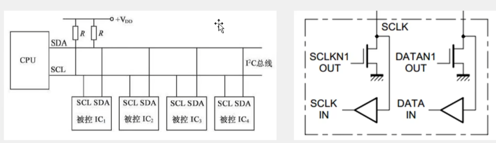

所有I2C设备的SCL连在一起，SDA连在一起。

设备的SCL和SDA均要配置成**开漏输出**模式。

SCL和SDA各添加一个上拉电阻，阻值一般为4.7k欧左右。

主机永远掌握SCL的控制权，大部分时间掌握SDA的控制权，只有当主机需要从从机读取数据时，从机才控制SDA。从机不能主动发起对SDA的控制，只能被动响应。

关于各引脚输入/输出模式配置的分析：

对于SCL，主机时刻控制，可设置为推挽输出；从机永远只能被动接收，可设置为浮空/上拉输入

对于SDA，由于主机需要完成对从机的读写操作，因此主机和从机SDA在不同时刻输入输出状态不同。如果出现时序出错，导致主机和从机同时处于输出状态，且输出一个高电平和一个低电平，此时会导致短路，严重损坏硬件。为了避免这一问题，I2C规定：**禁止所有设备输出强上拉的高电平，采用外置弱上拉电阻加开漏输出的电路结构，SDA和SCL均采用这种“开漏+弱上拉模式”**。所有设备引脚电流如右图所示，对于输入信号，都可以通过一个数据缓冲器或施密特触发器进行输入；输出时设置为开漏输出，只有内部电路输出低电平时引脚输出低电平，内部电路输出高电平时引脚应当浮空，此时由于外部弱上拉电阻的作用使得SDA恢复高电平。也就是说，SDA默认由上拉电阻上拉到高电平，所有设备只允许输出低电平，避免了短路。这样设计的好处：

- 杜绝短路现象
- 避免引脚模式频繁切换。开漏加弱上拉模式兼具了输入和输出的功能
- 可以利用“线与”现象进行主机模式下的时钟同步和总线仲裁（线与：只有所有设备都输出高电平，SDA/SCL才为高电平，否则SDA/SCL为低电平）

## I2C时序基本单元

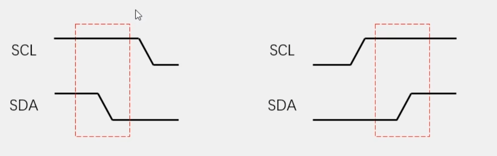

起始条件：SCL高电平期间，SDA下降沿

终止条件：SCL高电平期间，SDA上升沿

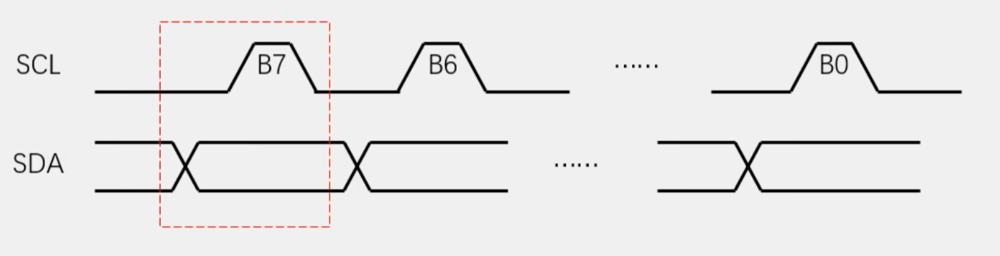

主机发送一个字节：SCL低电平期间，主机将数据位依次放到SDA线上（**高位先行**），然后释放SCL，从机将在SCL高电平时期读取数据位，所以SCL高电平期间SDA不允许有数据变化，依次循环上述过程8次，即可发送一个字节。

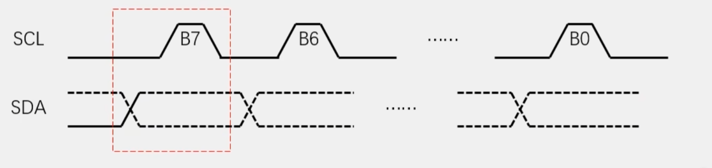

主机接收一个字节：SCL低电平时期，从机将数据位依次放到SDA线上（**高位先行**），然后释放SCL，主机将在SCL高电平期间读取数据位，所以SCL高电平时期SDA不允许有数据变化，依次循环上述过程8次，即可接收一个字节（主机在接收之前，需要释放SDA）。

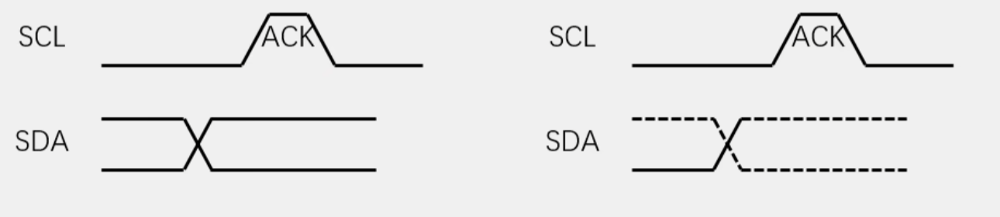

发送应答：主机在接收完一个字节后，在下一个时钟发送一位数据，数据0表示应答，数据1表示非应答

接收应答：主机在发送完一个字节后，在下一个时钟接收一位数据，判断从机是否应答，数据0表示应答，数据1表示非应答（主机在接收之前，需要释放SDA）。

I2C中每个从机都要有一个地址，供主机选择，地址可以为**7位**或10位，7位使用广泛。每个外设出厂时都设置了地址，如果有多个同种外设共同连在I2C总线，可以根据外设上某些引脚的值指定该外设的地址地位，从而进行区分。

## I2C时序

**指定地址写**

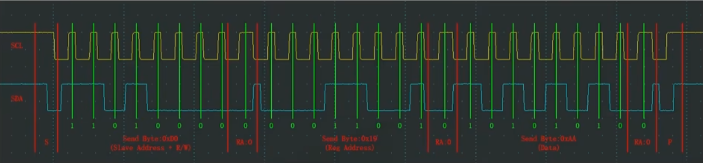

对于指定设备（Slave Address），在指定地址（Reg Address）下，写入指定数据（Data）

**当前地址读**

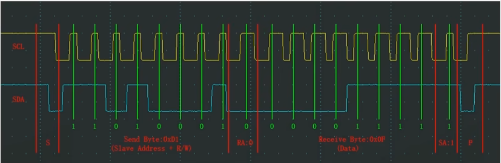

对于指定设备（Slave Address），在当前地址指针指示的地址下，读取从机数据（Data）

从机中，所有的寄存器都被分配到一个线性区间，并且存在一个单独的指针变量指示着其中一个寄存器，即**当前地址指针**，每对从机进行一次写入/读出操作后，当前地址指针减1/加1。

**指定地址读**

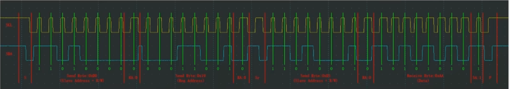

对于指定设备（Slave Address），在指定地址（Reg Address）下，读取从机数据（Data）

**指定地址读 = 指定地址写 + 当前地址读** 

## MPU6050

MPU6050是一个6轴姿态传感器，可以测量芯片自身X、Y、Z轴的加速度，角加速度参数，通过数据融合，可进一步得到姿态角，常应用于平衡车、飞行器等需要检测自身姿态的场景。

3轴加速度计（Accelerometer）：测量X、Y、Z轴的加速度

3轴陀螺仪传感器（Gyroscope）：测量X、Y、Z轴的角速度

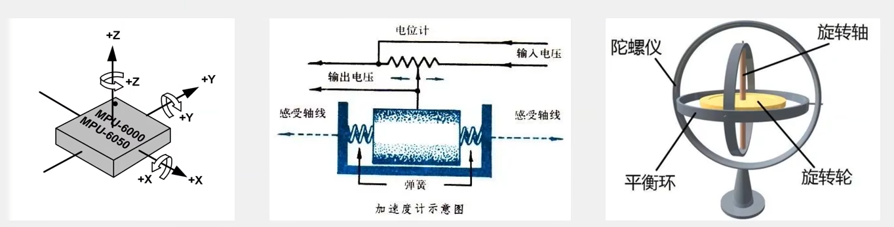

MPU6050参数：

16位ADC采集传感器的模拟信号，量化范围：-32768 - 32767

加速度计满量程选择：+/-2、+/-4、+/-8、+/-16（g）

陀螺仪满量程选择：+/-250、+/-500、+/-1000、+/-2000（°/s）

可配置的数字低通滤波器

可配置的时钟源

可配置的采样分频

**I2C从机地址**：1101 000（AD0 = 0），1101 001（AD0 = 1）

表示为16进制：0x68（I2C通信时要先左移）或者0xD0（无需左移）

**MPU6050硬件电路**

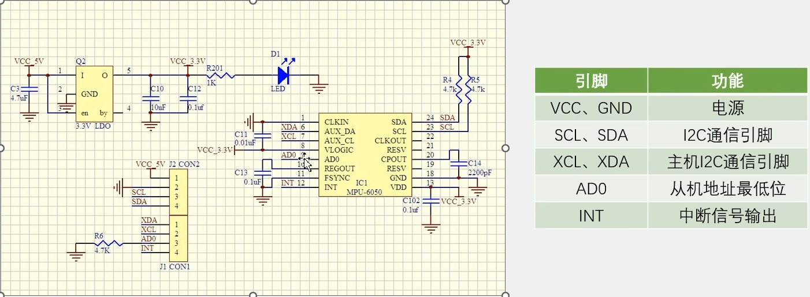

XCL和XDA通常用于外接磁力计或者气压计，实现传感器扩展

**MPU6050框图**

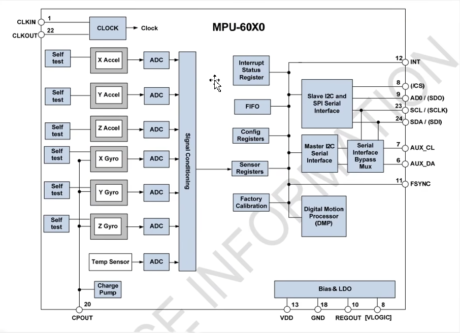

CLKIN和CLKOUT为时钟系统，可以选择内部时钟或者外部时钟，一般选择内部时钟。

Self test为芯片自测单元，用来测试传感器是否正常。

Interrupt Status Register中断状态寄存器，可以控制内部的哪些事件都中断引脚输出。

FIFO，先入先出寄存器，可以对数据流进行缓存。

Config Registers配置寄存器，可以对内部的各个电路进行配置。

Sensor Registers，传感器寄存器，即数据寄存器，存储了各个传感器的数据。

Digital Motion Processor（DMP），可以进行姿态解算。

## 软件I2C读写MPU6050

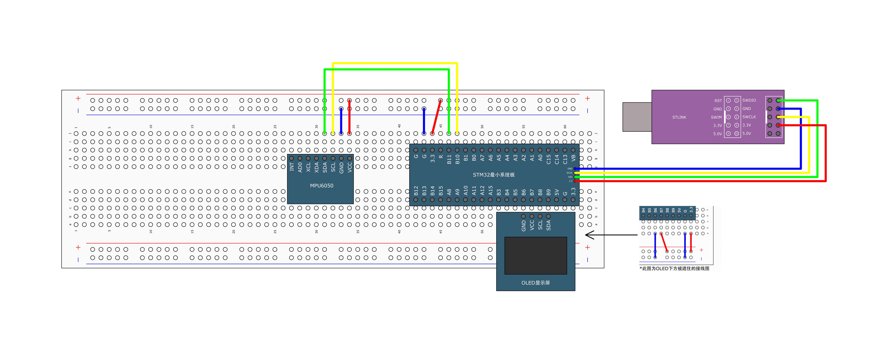

整体流程：建立I2C通信层的.c和.h模块（通信层里写好I2C底层的GPIO初始化和6个基本的时序单元，包括起始、中止，发送一个字节、接收一个字节、发送应答和接收应答） -> 建立MPU6050的.c和.h模块（基于I2C通信模块，实现指定地址读、指定地址写，再实现写寄存器对芯片进行配置、读寄存器得到传感器数据） -> 在`main.c`中调用MPU6050模块，初始化、读数据、显示数据

**I2C通信层驱动代码**

```c
#include "stm32f10x.h"                  // Device header
#include "Delay.h"

//#define SCL_Port 	GPIOB
//#define SCL_Pin		GPIO_Pin_10
//#define SDA_Port 	GPIOB
//#define SDA_Pin		GPIO_Pin_11

// 封装对SCL和SDA设置高低电平的操作
void MyI2C_W_SCL(uint8_t BitVal)
{
	GPIO_WriteBit(GPIOB, GPIO_Pin_10, (BitAction)BitVal);
	Delay_us(10);
}

void MyI2C_W_SDA(uint8_t BitVal)
{
	GPIO_WriteBit(GPIOB, GPIO_Pin_11, (BitAction)BitVal);
	Delay_us(10);
}

// 从SDA读数据的函数
uint8_t MyI2C_R_SDA(void)
{
	uint8_t BitVal;
	BitVal = GPIO_ReadInputDataBit(GPIOB, GPIO_Pin_11);
	Delay_us(10);
	return BitVal;
}

// 软件实现I2C初始化：调用后SCL和SDA两个引脚被设置为开漏输出并且为高电平
void MyI2C_Init()
{
	// 开启时钟
	RCC_APB2PeriphClockCmd(RCC_APB2Periph_GPIOB, ENABLE);
	// 配置GPIO，SCL -> PB10，SDA ->PB11
	GPIO_InitTypeDef GPIO_InitStructure;
	GPIO_InitStructure.GPIO_Mode = GPIO_Mode_Out_OD;	// 开漏输出模式，为什么不是复用开漏？
	GPIO_InitStructure.GPIO_Pin = GPIO_Pin_10 | GPIO_Pin_11;
	GPIO_InitStructure.GPIO_Speed = GPIO_Speed_50MHz;
	GPIO_Init(GPIOB, &GPIO_InitStructure);
	// 设置SCL和SDA为高电平
	GPIO_SetBits(GPIOB, GPIO_Pin_10 | GPIO_Pin_11);
}

// 产生开始信号
void MyI2C_Start(void)
{
	// 释放SCL，SDA，注意先释放SDA，如果顺序调换可能产生停止信号
	MyI2C_W_SDA(1);
	MyI2C_W_SCL(1);
	// 产生开始信号
	MyI2C_W_SDA(0);		// SCL高电平时，SDA下降沿
	MyI2C_W_SCL(0);		// SCL下降沿		
}

// 产生停止信号
void MyI2C_Stop(void)
{
	// 先拉低SDA，由于不知道传输的最后一个bit位是0还是1
	// 如果是1并且不提前拉低SDA，那么拉高SCL之后将无法产生SDA上升沿，无法结束
	MyI2C_W_SDA(0);
	// 再产生停止信号
	MyI2C_W_SCL(1);
	MyI2C_W_SDA(1);
}

// 发送一个字节
void MyI2C_SendByte(uint8_t Byte)
{
	// 进入函数时SCL为低电平
	uint8_t i;
	for(i = 0; i < 8; i ++) {
		// 趁SCL此时为低电平，先把Byte最高位放在SDA上
		MyI2C_W_SDA(Byte & (0x80 >> i));
		// 度过一个时钟，在这个时钟高电平时接收方读取SDA，然后拉低SCL进入下一个时钟
		MyI2C_W_SCL(1);
		MyI2C_W_SCL(0);
	}
}

// 接收一个字节
uint8_t MyI2C_ReceiveByte(void)
{
	// 存放结果
	uint8_t Byte = 0x00;
	uint8_t i;
	// 主机要先释放SDA
	MyI2C_W_SDA(1);
	
	for(i = 0; i < 8; i ++) {
		// 发送方先把数据放到SDA，然后接受方拉高SCL，读取数据
		MyI2C_W_SCL(1);
		if(MyI2C_R_SDA() == 1) {
			Byte |= (0x80 >> i);
		}
		MyI2C_W_SCL(0);		// 拉低SCL，进入下一个时钟
	}
	return Byte;
}

// 发送应答
void MyI2C_SendAck(uint8_t AckBit)
{
	// 函数进来时SCL为低电平，把AckBit放到SDA上
	MyI2C_W_SDA(AckBit);
	MyI2C_W_SCL(1);		// SCL高电平共接收方读取
	MyI2C_W_SCL(0);		// SCL拉低进入下一个时钟
}

// 接收应答
uint8_t MyI2C_ReceiveAck(void)
{
	// 存放结果
	uint8_t AckBit;
	// 主机先释放SDA
	MyI2C_W_SDA(1);
	MyI2C_W_SCL(1);
	AckBit = MyI2C_R_SDA();
	MyI2C_W_SCL(0);
	
	return AckBit;
}

```

**MPU6050驱动代码**

```c
#include "stm32f10x.h"                  // Device header
#include "MPU6050_Reg.h"
#include "MyI2C.h"

#define MPU6050_ADDRESS			0xD0

// 指定地址写
void MPU6050_WriteReg(uint8_t RegAddress, uint8_t Data)
{
	MyI2C_Start();
	MyI2C_SendByte(MPU6050_ADDRESS);
	MyI2C_ReceiveAck();
	MyI2C_SendByte(RegAddress);
	MyI2C_ReceiveAck();
	MyI2C_SendByte(Data);
	MyI2C_Stop();
}

// 指定地址读
uint8_t MPU_6050_ReadReg(uint8_t RegAddress)
{
	uint8_t Data;
	
	// 先修改MPU6050中当前地址指针
	MyI2C_Start();
	MyI2C_SendByte(MPU6050_ADDRESS);
	MyI2C_ReceiveAck();
	MyI2C_SendByte(RegAddress);
	MyI2C_ReceiveAck();
	// 读寄存器
	MyI2C_Start();
	MyI2C_SendByte(MPU6050_ADDRESS | 0x01);		// 读操作
	MyI2C_ReceiveAck();
	Data = MyI2C_ReceiveByte();
	MyI2C_SendAck(0);
	MyI2C_Stop();
	return Data;
}

void MPU6050_Init(void)
{
	MyI2C_Init();
	
	// 配置电源管理寄存器1，解除睡眠模式
	MPU6050_WriteReg(MPU6050_PWR_MGMT_1, 0x01);
	
	// 配置电源管理寄存器2
	MPU6050_WriteReg(MPU6050_PWR_MGMT_2, 0x00);
	
	// 配置采样率分频
	MPU6050_WriteReg(MPU6050_SMPLRT_DIV, 0x09);
	
	// 配置寄存器
	MPU6050_WriteReg(MPU6050_CONFIG, 0x06);
	
	// 陀螺仪配置寄存器
	MPU6050_WriteReg(MPU6050_GYRO_CONFIG, 0x18);
	
	// 加速度计配置寄存器
	MPU6050_WriteReg(MPU6050_ACCEL_CONFIG, 0x18);
}

uint8_t MPU6050_GetID(void)
{
	return MPU_6050_ReadReg(MPU6050_WHO_AM_I);
}

void MPU6050_GetData(int16_t *AccX, int16_t *AccY, int16_t *AccZ,
						int16_t *GyroX, int16_t *GyroY, int16_t *GyroZ)
{
	uint8_t DataH, DataL;
	
	DataH = MPU_6050_ReadReg(MPU6050_ACCEL_XOUT_H);
	DataL = MPU_6050_ReadReg(MPU6050_ACCEL_XOUT_L);
	*AccX = (DataH << 8) | DataL;
	
	DataH = MPU_6050_ReadReg(MPU6050_ACCEL_YOUT_H);
	DataL = MPU_6050_ReadReg(MPU6050_ACCEL_YOUT_L);
	*AccY = (DataH << 8) | DataL;
	
	DataH = MPU_6050_ReadReg(MPU6050_ACCEL_ZOUT_H);
	DataL = MPU_6050_ReadReg(MPU6050_ACCEL_ZOUT_L);
	*AccZ = (DataH << 8) | DataL;
	
	DataH = MPU_6050_ReadReg(MPU6050_GYRO_XOUT_H);
	DataL = MPU_6050_ReadReg(MPU6050_GYRO_XOUT_L);
	*GyroX = (DataH << 8) | DataL;
	
	DataH = MPU_6050_ReadReg(MPU6050_GYRO_YOUT_H);
	DataL = MPU_6050_ReadReg(MPU6050_GYRO_YOUT_L);
	*GyroY = (DataH << 8) | DataL;
	
	DataH = MPU_6050_ReadReg(MPU6050_GYRO_ZOUT_H);
	DataL = MPU_6050_ReadReg(MPU6050_GYRO_ZOUT_L);
	*GyroZ = (DataH << 8) | DataL;
}

```

