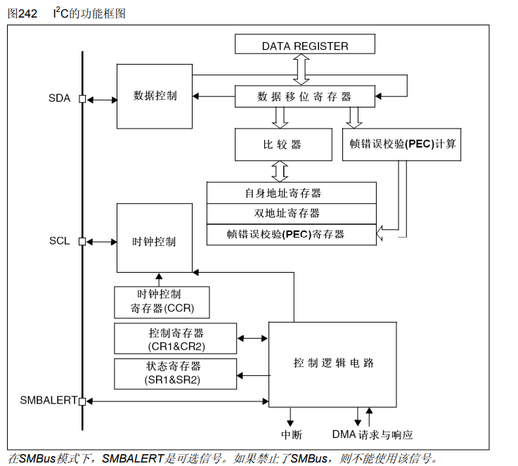
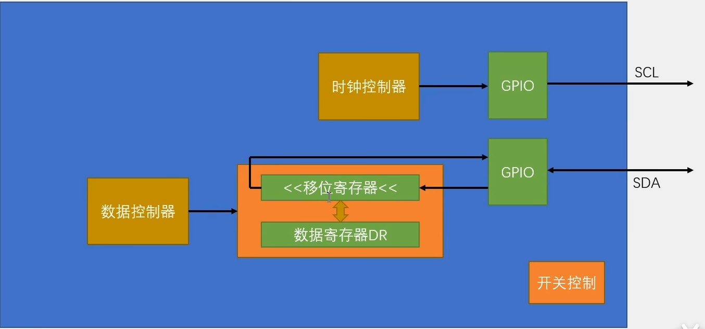
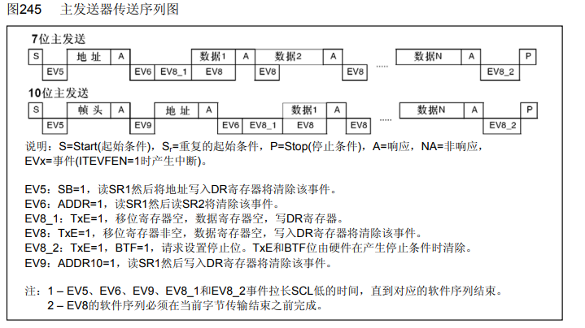
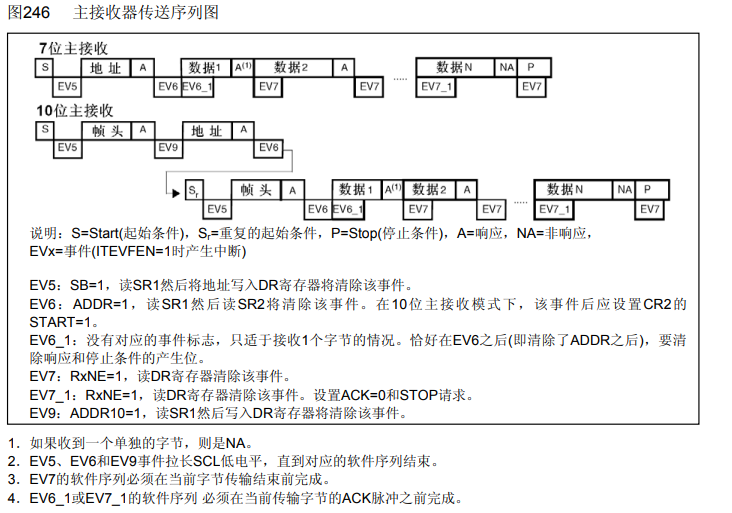
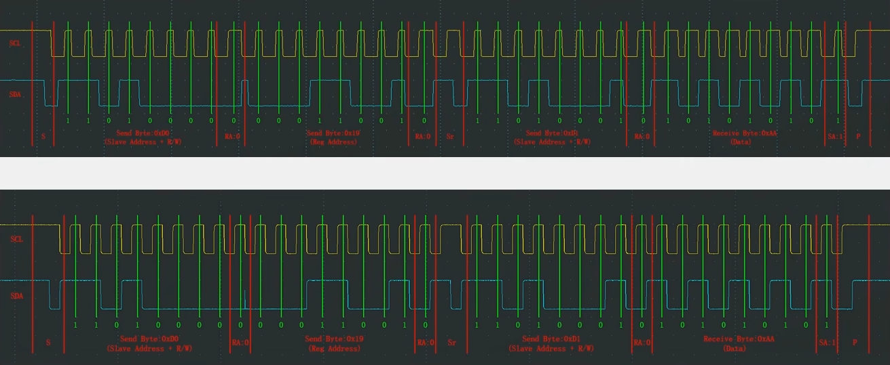

# [STM32]Day10-Part2

## I2C外设简介

STM32内部集成了硬件I2C收发电路，可以由硬件自动执行时钟生成、起始终止条件生成、应答位收发、数据收发等功能，减轻CPU的负担。

支持多主机模型。支持7位/10位地址模式。

支持不同的通讯速度，标准速度（高达100kHz），快速（高达400kHz）。

支持DMA

兼容SMBus协议

STM32F103C8T6硬件I2C资源：I2C1、I2C2

## I2C框图



DATA REGISTER和数据移位寄存器是数据收发的核心部分。往SDA写数据时，把一个字节数据到DR，当移位寄存器没有数据正在移位时，数据从DR转运到移位寄存器同时置状态寄存器TXE为1，DR可以写入新值等待发送。从SDA读取数据时，数据逐位存进移位寄存器，收到完整一个字节数据后转运到DR，同时置标志位RXNE为1，等待读取数据。

**I2C基本结构**



使用硬件I2C时，SDA和SCL对应的GPIO口设置为**复用开漏输出**模式。复用是指GPIO的状态是由片上外设控制的。

## 主机发送与接收时序

**主机发送时序**



**主机接收时序**



## 软件/硬件波形图对比



## 硬件I2C读写MPU6050


在软件I2C基础上实现硬件I2C整体思路：配置I2C外设，对I2C2外设进行初始化 -> 控制外设电路，实现指定地址写的时序 -> 控制外设电路，实现指定地址读的时序

I2C2初始化：开启I2C2和GPIO时钟 -> 配置GPIO为复用开漏输出模式 -> 配置I2C -> 开启I2C

使用到的函数

```c
// 产生开始信号和停止信号
void I2C_GenerateSTART(I2C_TypeDef* I2Cx, FunctionalState NewState);
void I2C_GenerateSTOP(I2C_TypeDef* I2Cx, FunctionalState NewState);
// 配置收到一个字节后主机是否应答
void I2C_AcknowledgeConfig(I2C_TypeDef* I2Cx, FunctionalState NewState);
// 发送一个字节和接收一个字节
void I2C_SendData(I2C_TypeDef* I2Cx, uint8_t Data);
uint8_t I2C_ReceiveData(I2C_TypeDef* I2Cx);
// 发送7位地址
void I2C_Send7bitAddress(I2C_TypeDef* I2Cx, uint8_t Address, uint8_t I2C_Direction);

// 检查EVx是否发生
ErrorStatus I2C_CheckEvent(I2C_TypeDef* I2Cx, uint32_t I2C_EVENT);
```

代码

```c
// MPU6050.c
#include "stm32f10x.h"                  // Device header
#include "MPU6050_Reg.h"

#define MPU6050_ADDRESS			0xD0

// 指定地址写
void MPU6050_WriteReg(uint8_t RegAddress, uint8_t Data)
{
	I2C_GenerateSTART(I2C2, ENABLE);
	while(I2C_CheckEvent(I2C2, I2C_EVENT_MASTER_MODE_SELECT) != SUCCESS);
	
	I2C_Send7bitAddress(I2C2, MPU6050_ADDRESS, I2C_Direction_Transmitter);
	while(I2C_CheckEvent(I2C2, I2C_EVENT_MASTER_TRANSMITTER_MODE_SELECTED) != SUCCESS);
	
	I2C_SendData(I2C2, RegAddress);
	while(I2C_CheckEvent(I2C2, I2C_EVENT_MASTER_BYTE_TRANSMITTING) != SUCCESS);

	I2C_SendData(I2C2, Data);
	while(I2C_CheckEvent(I2C2, I2C_EVENT_MASTER_BYTE_TRANSMITTED) != SUCCESS);

	I2C_GenerateSTOP(I2C2, ENABLE);
}

// 指定地址读
uint8_t MPU_6050_ReadReg(uint8_t RegAddress)
{	
	uint8_t Data;
	uint32_t TimeOut;
	
	TimeOut = 10000;
	
	I2C_GenerateSTART(I2C2, ENABLE);
	while(I2C_CheckEvent(I2C2, I2C_EVENT_MASTER_MODE_SELECT) != SUCCESS) {
		TimeOut --;
		if(TimeOut == 0) {
			break;
		}
	}
	
	I2C_Send7bitAddress(I2C2, MPU6050_ADDRESS, I2C_Direction_Transmitter);
	while(I2C_CheckEvent(I2C2, I2C_EVENT_MASTER_TRANSMITTER_MODE_SELECTED) != SUCCESS);
	
	I2C_SendData(I2C2, RegAddress);
	while(I2C_CheckEvent(I2C2, I2C_EVENT_MASTER_BYTE_TRANSMITTED) != SUCCESS);
	
	I2C_GenerateSTART(I2C2, ENABLE);
	while(I2C_CheckEvent(I2C2, I2C_EVENT_MASTER_MODE_SELECT) != SUCCESS);
	
	I2C_Send7bitAddress(I2C2, MPU6050_ADDRESS, I2C_Direction_Receiver);
	while(I2C_CheckEvent(I2C2, I2C_EVENT_MASTER_RECEIVER_MODE_SELECTED) != SUCCESS);
	
	I2C_AcknowledgeConfig(I2C2, DISABLE);
	I2C_GenerateSTOP(I2C2, ENABLE);
	
	while(I2C_CheckEvent(I2C2, I2C_EVENT_MASTER_BYTE_RECEIVED) != SUCCESS);
	Data = I2C_ReceiveData(I2C2);
	
	I2C_AcknowledgeConfig(I2C2, ENABLE);
	
	return Data;
}

void MPU6050_Init(void)
{
	// 开启时钟
	RCC_APB2PeriphClockCmd(RCC_APB2Periph_GPIOB, ENABLE);
	RCC_APB1PeriphClockCmd(RCC_APB1Periph_I2C2, ENABLE);
	
	// 配置GPIO
	GPIO_InitTypeDef GPIO_InitStructure;
	GPIO_InitStructure.GPIO_Mode = GPIO_Mode_AF_OD;	// 复用开漏模式
	GPIO_InitStructure.GPIO_Pin = GPIO_Pin_10 | GPIO_Pin_11;
	GPIO_InitStructure.GPIO_Speed = GPIO_Speed_50MHz;
	GPIO_Init(GPIOB, &GPIO_InitStructure);
	
	// 配置I2C
	I2C_InitTypeDef I2C_InitStructure;
	I2C_InitStructure.I2C_Mode = I2C_Mode_I2C;
	I2C_InitStructure.I2C_ClockSpeed = 50000;		// 时钟频率
	I2C_InitStructure.I2C_DutyCycle = I2C_DutyCycle_2;			// 时钟频率大于100kHz下才有用
	I2C_InitStructure.I2C_Ack = I2C_Ack_Enable;			// 应答位配置
	I2C_InitStructure.I2C_AcknowledgedAddress = I2C_AcknowledgedAddress_7bit;		// STM32作为从机时地址位数
	I2C_InitStructure.I2C_OwnAddress1 = 0x00;		// 设置作为从机时的地址
	I2C_Init(I2C2, &I2C_InitStructure);
	
	// 开启I2C
	I2C_Cmd(I2C2, ENABLE);
	
	// 配置电源管理寄存器1，解除睡眠模式
	MPU6050_WriteReg(MPU6050_PWR_MGMT_1, 0x01);
	
	// 配置电源管理寄存器2
	MPU6050_WriteReg(MPU6050_PWR_MGMT_2, 0x00);
	
	// 配置采样率分频
	MPU6050_WriteReg(MPU6050_SMPLRT_DIV, 0x09);
	
	// 配置寄存器
	MPU6050_WriteReg(MPU6050_CONFIG, 0x06);
	
	// 陀螺仪配置寄存器
	MPU6050_WriteReg(MPU6050_GYRO_CONFIG, 0x18);
	
	// 加速度计配置寄存器
	MPU6050_WriteReg(MPU6050_ACCEL_CONFIG, 0x18);
}

uint8_t MPU6050_GetID(void)
{
	return MPU_6050_ReadReg(MPU6050_WHO_AM_I);
}

void MPU6050_GetData(int16_t *AccX, int16_t *AccY, int16_t *AccZ,
						int16_t *GyroX, int16_t *GyroY, int16_t *GyroZ)
{
	uint8_t DataH, DataL;
	
	DataH = MPU_6050_ReadReg(MPU6050_ACCEL_XOUT_H);
	DataL = MPU_6050_ReadReg(MPU6050_ACCEL_XOUT_L);
	*AccX = (DataH << 8) | DataL;
	
	DataH = MPU_6050_ReadReg(MPU6050_ACCEL_YOUT_H);
	DataL = MPU_6050_ReadReg(MPU6050_ACCEL_YOUT_L);
	*AccY = (DataH << 8) | DataL;
	
	DataH = MPU_6050_ReadReg(MPU6050_ACCEL_ZOUT_H);
	DataL = MPU_6050_ReadReg(MPU6050_ACCEL_ZOUT_L);
	*AccZ = (DataH << 8) | DataL;
	
	DataH = MPU_6050_ReadReg(MPU6050_GYRO_XOUT_H);
	DataL = MPU_6050_ReadReg(MPU6050_GYRO_XOUT_L);
	*GyroX = (DataH << 8) | DataL;
	
	DataH = MPU_6050_ReadReg(MPU6050_GYRO_YOUT_H);
	DataL = MPU_6050_ReadReg(MPU6050_GYRO_YOUT_L);
	*GyroY = (DataH << 8) | DataL;
	
	DataH = MPU_6050_ReadReg(MPU6050_GYRO_ZOUT_H);
	DataL = MPU_6050_ReadReg(MPU6050_GYRO_ZOUT_L);
	*GyroZ = (DataH << 8) | DataL;
}

// main.c
#include "stm32f10x.h"                  // Device header
#include "OLED_Hardware.h"
#include "MPU6050.h"

int16_t AX, AY, AZ, GX, GY, GZ;

int main(void)
{
	OLED_Init_H();
	MPU6050_Init();
	
	OLED_ShowString_H(1, 1, "ID:");
	OLED_ShowNum_H(1, 4, MPU6050_GetID(), 2);

	while(1)
	{
		MPU6050_GetData(&AX, &AY, &AZ, &GX, &GY, &GZ);
		OLED_ShowSignedNum_H(2, 1, AX, 5);
		OLED_ShowSignedNum_H(3, 1, AY, 5);
		OLED_ShowSignedNum_H(4, 1, AZ, 5);
		OLED_ShowSignedNum_H(2, 8, GX, 5);
		OLED_ShowSignedNum_H(3, 8, GX, 5);
		OLED_ShowSignedNum_H(4, 8, GX, 5);
	}
}

```

