# [STM32]Day11-Part1

I2C通信优点：节省硬件资源。

I2C通信缺点：弱上拉导致上升沿慢，限制通信最大频率。I2C通信最大频率一般认为400kHz。

## SPI通信

**SPI（Serial Peripheral Interface）**是由Motorola公司开发的一种通用数据总线。

四根通信线：**SCK（Serial Clock）、MOSI（Master Output Slave Input）、MISO（Master Input Slave Output）、SS（Slave Select）**

同步、全双工。

支持总线挂载多设备（一主多从）。

SPI通信优点：传输频率高，速度快。设计简单。

SPI通信缺点：硬件开销大。

## SPI硬件电路

所有SPI设备的SCK、MOSI、MISO分别连在一起。

主机另外引出多条SS控制线，分别接到各从机的SS引脚。同一时刻，主机只能与一个从机进行通信。

输出引脚配置为推挽输出，输入引脚配置为浮空或上拉输入。推挽输出高低电平都有很强的驱动能力，避免了I2C中上升沿缓慢的问题。当从机SS为高电平，即从机未被选中时，其MISO引脚必须切换为高阻态，从而防止一条线上由多个输出导致的电平冲突问题。

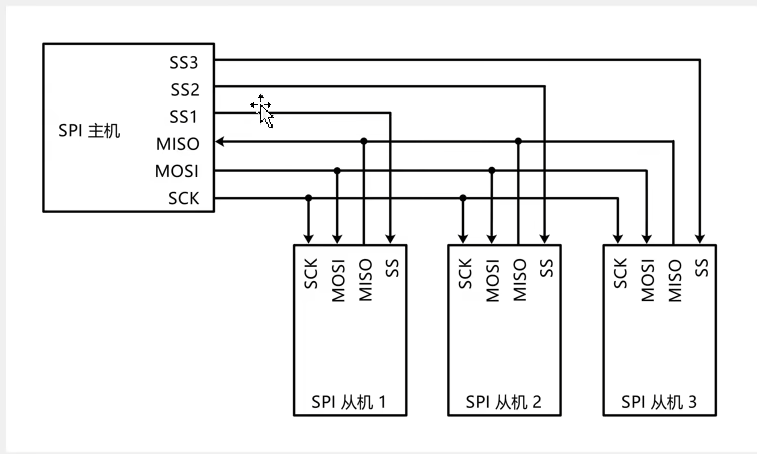

移位示意图

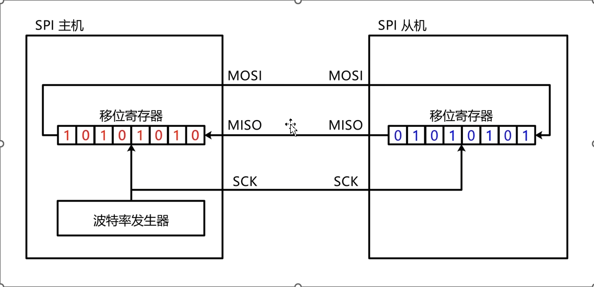

SPI高位先行，因此主机和从机的移位寄存器每个时钟都进行左移操作。移位寄存器的时钟源由主机中的波特率发生器提供，它提供的时钟控制主机移位寄存器移位，同时通过SCK线输入到从机控制从机移位寄存器的频率，实现同步通信。

时钟上升沿主机和从机移位寄存器分别左移，将最高位放置到MOSI和MISO引脚，时钟下降沿主机和从机分别从MISO和MOSI引脚读取数据并放置在移位寄存器最低位。如此循环8次，可以实现主机从机全双工通信交换一个字节数据。

SPI通信的基础是**交换一个字节**，实现交换一个字节后，可以方便地实现发送一个字节、接收一个字节。

## SPI时序基本单元

**起始条件**：SS从高电平切换到低电平（主机拉低对应从机的SS信号）。

**终止条件**：SS从低电平切换到高电平（主机拉高对应从机的SS信号）。

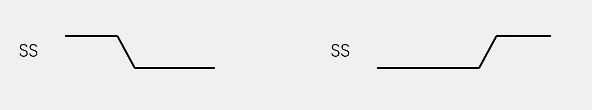

**交换一个字节（模式0）**：

CPOL（Clock Polarity， 时钟极性） = 0：空闲状态时，SCK为低电平。

CPHA（Clock Phase，时钟相位） = 0：SCK第一个边沿移入数据，第二个边沿移出数据。

SS下降沿时，立刻触发移位输出，将最高位输出到各自引脚，等待SCK第一个上升沿读取。

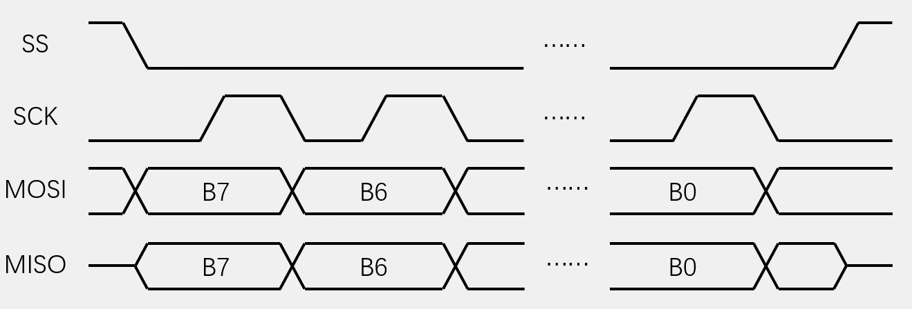

**交换一个字节（模式1）**：

CPOL（Clock Polarity， 时钟极性） = 0：空闲状态时，SCK为低电平。

CPHA（Clock Phase，时钟相位） = 1：SCK第一个边沿移出数据，第二个边沿移入数据。

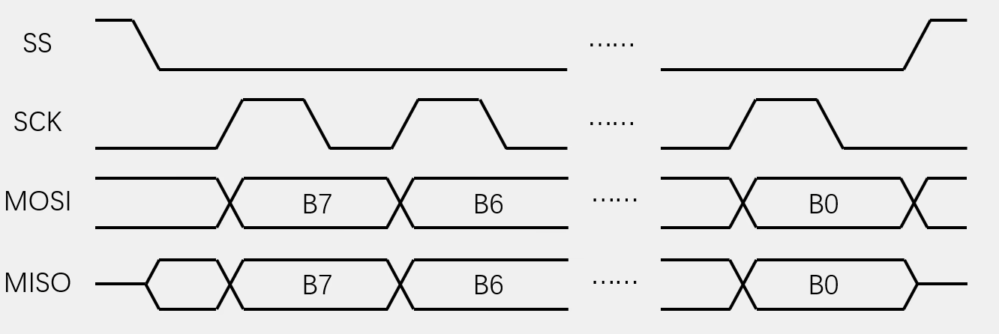

SS高电平时，从机的输出口MISO应该配置为**高阻态**，所以此时MISO电平在低电平与高电平之间。

CPHA设置为1，在时钟上升沿主机从机同时移出数据并将最高位通过MOSI和MISO输出，在下降沿采样各自的输入引脚放置到移位寄存器最低位。

**交换一个字节（模式2）**：与模式0相比，SCK反向，其余相同

CPOL（Clock Polarity， 时钟极性） = 1：空闲状态时，SCK为高电平。

CPHA（Clock Phase，时钟相位） = 0：SCK第一个边沿移入数据，第二个边沿移出数据。

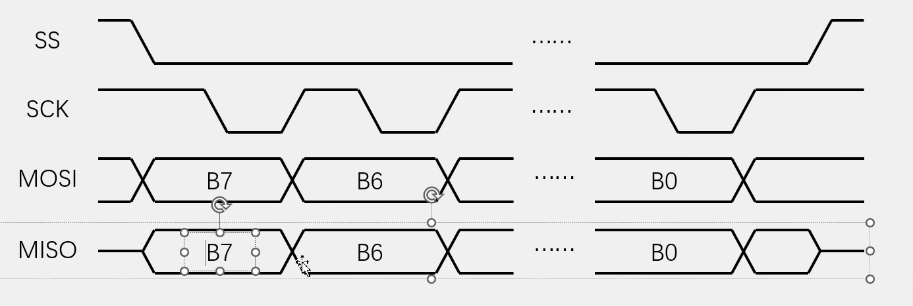

**交换一个字节（模式3）**：与模式1相比，SCK反向，其余相同

CPOL（Clock Polarity， 时钟极性） = 1：空闲状态时，SCK为高电平。

CPHA（Clock Phase，时钟相位） = 1：SCK第一个边沿移出数据，第二个边沿移入数据。

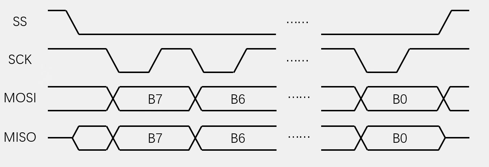

## SPI时序

SPI通常采用指令码+读写数据。SPI开始后，第一个交换发送给从机的数据为指令码，从机中有对应的指令集，发送不同的指令可以控制从机完成不同的功能。

**发送指令**：向SS指定的设备，发送指令0x06

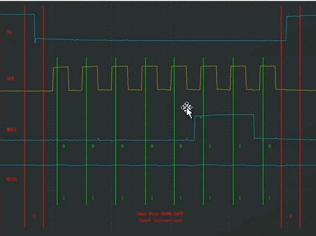

**指定地址写**：向SS指定的设备，发送写指令（0x02），随后在指定地址（Address[23:0]）下，写入指定数据（Data）

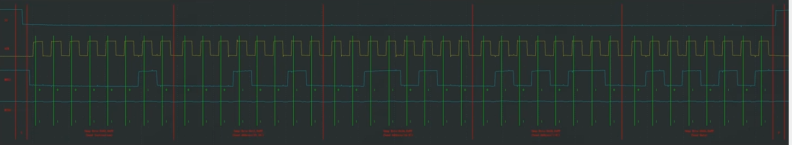

**指定地址读**：向SS指定的设备，发送读指令（0x03），随后在指定地址（Address[23:0]）下，读取指定数据（Data）

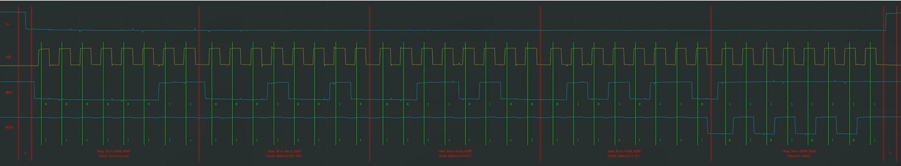

## W25Q64简介

W25Qxx系列是一种低成本、小型化、使用简单的非易失性存储器，常应用于数据存储、字库存储、固件程序存储等场景。

存储介质：Nor Flash（闪存）

时钟频率：80MHz/160MHz（Dual SPI）/320MHz（Quad SPI）

存储容量（24位地址）：W25Q64：64Mbit/8MByte

**硬件电路**

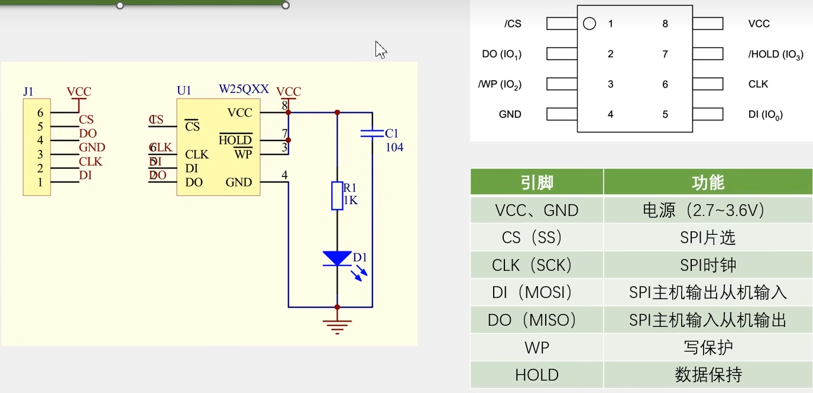

WP写保护低电平有效，低电平时不能向芯片写入。

W25Q64框图

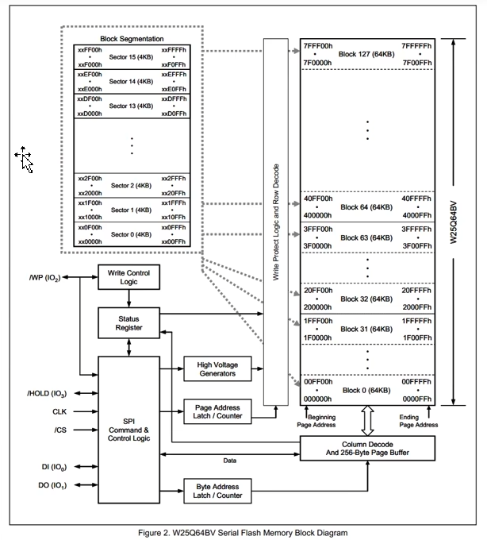

8MB空间划分：Block（每块64KB，共128块） -> Sector（每个扇区4KB，每块共16个扇区） -> Page（256Byte，每个扇区共16页）

状态寄存器Status Register，可以判断芯片是否处于忙状态、是否写保护等

256字节的页缓冲器负责在SPI通信时缓存数据，时序结束后复制到Flash，此时芯片处于忙状态Busy，发送该信号到状态寄存器，因此写入的一个时序连续写入量不能超过256字节。

**Flash操作注意事项**：

写入操作时：

- 写入操作前，必须先进行写使能
- 每个数据位只能由1改写为0，不能由0改写为1
- 写入数据前必须先擦除，擦除后，所有数据变为1
- 擦除必须按最小擦除单元进行
- 连续写入多字节时，最多写入一页的数据，超过页尾位置的数据，会回到页首覆盖写入
- 写入操作结束后，芯片会进入忙状态，不响应新的读写操作

读取操作时：

- 直接调用读取时序，无需使能，无需额外操作，没有页的限制，读取后不会进入忙状态，但不能在忙状态读取

**常用指令**

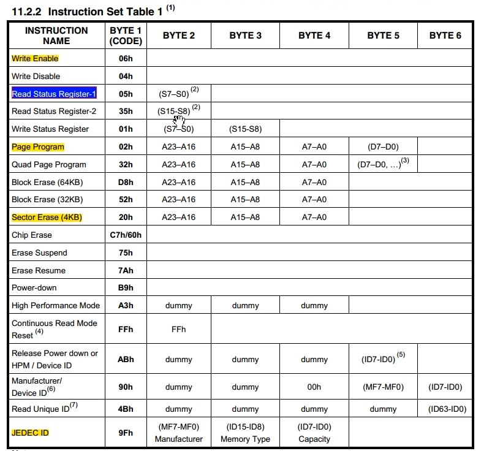

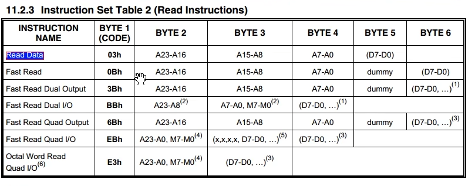

## 软件SPI读写W25Q64


整体框架：SPI通信层 -> W25Q64硬件驱动层 -> main.c调用

SPI通信层：新建MySPI模块，实现通信引脚封装，初始化，SPI通信（起始、中止、交换一个字节）

W25Q64硬件驱动层：调用MySPI，实现各种指令和功能的完整时序，比如写使能、擦除、页编程、读数据等

代码

```c
// MySPI.c
#include "stm32f10x.h"                  // Device header

// 封装对SS的操作
void MySPI_W_SS(uint8_t BitVal)
{
	GPIO_WriteBit(GPIOA, GPIO_Pin_4, (BitAction)BitVal);		// SPI通信非常快所以不用加延时
}

// 封装对SCK的操作
void MySPI_W_SCK(uint8_t BitVal)
{
	GPIO_WriteBit(GPIOA, GPIO_Pin_5, (BitAction)BitVal);
}

// 封装对MOSI的操作
void MySPI_W_MOSI(uint8_t BitVal)
{
	GPIO_WriteBit(GPIOA, GPIO_Pin_7, (BitAction)BitVal);
}

// 封装对MISO的操作
uint8_t MySPI_R_MISO(void)
{
	return GPIO_ReadInputDataBit(GPIOA, GPIO_Pin_6);
}

void MySPI_Init(void)
{
	// 开启时钟
	RCC_APB2PeriphClockCmd(RCC_APB2Periph_GPIOA, ENABLE);
	// 配置GPIO
	GPIO_InitTypeDef GPIO_InitStructure;
	GPIO_InitStructure.GPIO_Mode = GPIO_Mode_Out_PP;	// 输出引脚配置推挽输出模式
	GPIO_InitStructure.GPIO_Pin = GPIO_Pin_4 | GPIO_Pin_5 | GPIO_Pin_7;
	GPIO_InitStructure.GPIO_Speed = GPIO_Speed_50MHz;
	GPIO_Init(GPIOA, &GPIO_InitStructure);
	GPIO_InitStructure.GPIO_Mode = GPIO_Mode_IPU;	// 输入引脚配置上拉输入模式
	GPIO_InitStructure.GPIO_Pin = GPIO_Pin_6;
	GPIO_Init(GPIOA, &GPIO_InitStructure);
	// 设置默认电平
	MySPI_W_SS(1);		// SS默认高电平
	MySPI_W_SCK(0);			// 模式0下SCK默认低电平
	
}

// 产生起始条件
void MySPI_Start(void)
{
	MySPI_W_SS(0);
}

// 产生终止条件
void MySPI_Stop(void)
{
	MySPI_W_SS(1);
}

// 交换一个字节
uint8_t MySPI_SwapByte(uint8_t ByteSend)
{
	uint8_t i, ByteReceive = 0x00;
	
	for(i = 0; i < 8; i ++) {
		// 开始条件产生后，主机左移并把最高位写到MOSI
		MySPI_W_MOSI(ByteSend & (0x80 >> i));
		// SCK上升沿到来后主机读取MISO
		MySPI_W_SCK(1);
		if(MySPI_R_MISO() == 1) {
			ByteReceive |= (0x80 >> i);
		}
		// 产生下降沿
		MySPI_W_SCK(0);
	}
	
	return ByteReceive;
}

// W25Q64.c
#include "stm32f10x.h"                  // Device header
#include "MySPI.h"
#include "W25Q64_Instructions.h"

void W25Q64_Init(void)
{
	MySPI_Init();
}

// 获取ID指令
void W25Q64_ReadID(uint8_t *MID, uint16_t *DID)
{
	MySPI_Start();
	// 主机向W25Q64发送读指令		抛玉引砖
	MySPI_SwapByte(W25Q64_JEDEC_ID);
	// 主机接收W25Q64的返回			抛砖引玉
	*MID = MySPI_SwapByte(W25Q64_DUMMY_BYTE);
	*DID = MySPI_SwapByte(W25Q64_DUMMY_BYTE);		// DID低8位
	*DID <<= 8;
	*DID |= MySPI_SwapByte(W25Q64_DUMMY_BYTE);		// DID高8位
	MySPI_Stop();
}

// 写使能指令
void W25Q64_WriteEnable(void)
{
	MySPI_Start();
	MySPI_SwapByte(W25Q64_WRITE_ENABLE);
	MySPI_Stop();
}

// 等待忙：调用后检查当前是否Busy，系统不忙时结束
void W25Q64_WaitBusy(void)
{
	uint32_t Timeout = 100000;
	MySPI_Start();
	// 发送指令
	MySPI_SwapByte(W25Q64_READ_STATUS_REGISTER_1);
	// 接收状态寄存器的值，取出最低为检查是否Busy，如果忙就等待
	while((MySPI_SwapByte(W25Q64_DUMMY_BYTE) & 0x01) == 1) {
		Timeout --;
		if(Timeout == 0) {
			break;
		}
	}		
	MySPI_Stop();
}

// 页编程指令：往指定地址写入Count个字节数据，Count最大为256
void W25Q64_PageProgram(uint32_t Address, uint8_t *DataArray, uint16_t Count) 
{
	// 写入指令前必须先写使能
	W25Q64_WriteEnable();
	
	MySPI_Start();
	// 发送页编程指令
	MySPI_SwapByte(W25Q64_PAGE_PROGRAM);
	// 发送地址
	MySPI_SwapByte(Address >> 16);
	MySPI_SwapByte(Address >> 8);
	MySPI_SwapByte(Address);		// 转成uint8_t类型参数高位会被舍弃
	// 发送写入的数据
	uint16_t i;
	for(i = 0; i < Count; i ++) {
		MySPI_SwapByte(DataArray[i]);	
	}
	MySPI_Stop();
	
	// 事后等待
	W25Q64_WaitBusy();
}

// 实现扇区擦除指令
void W25Q64_SectorErase(uint32_t Address)
{
	// 写入指令前必须先写使能
	W25Q64_WriteEnable();
	
	MySPI_Start();
	// 发送扇区擦除指令
	MySPI_SwapByte(W25Q64_SECTOR_ERASE_4KB);
	// 发送地址
	MySPI_SwapByte(Address >> 16);
	MySPI_SwapByte(Address >> 8);
	MySPI_SwapByte(Address);		// 转成uint8_t类型参数高位会被舍弃
	MySPI_Stop();
	
	// 事后等待
	W25Q64_WaitBusy();
}

// 读取数据指令，Count值无限制
void W25Q64_ReadData(uint32_t Address, uint8_t *DataArray, uint32_t Count)
{
	MySPI_Start();
	// 发送读取指令
	MySPI_SwapByte(W25Q64_READ_DATA);
	// 发送地址
	MySPI_SwapByte(Address >> 16);
	MySPI_SwapByte(Address >> 8);
	MySPI_SwapByte(Address);		// 转成uint8_t类型参数高位会被舍弃
	// 接收读取数据
	uint32_t i;
	for(i = 0; i < Count; i ++) {
		DataArray[i] = MySPI_SwapByte(W25Q64_DUMMY_BYTE);
	}
	MySPI_Stop();
}

// main.c
#include "stm32f10x.h"                  // Device header
#include "OLED_Software.h"
#include "W25Q64.h"

uint8_t MID;
uint16_t DID;

uint8_t ArrayWrite[] = {0x01, 0x02, 0x03, 0x04};
uint8_t ArrayReceive[4];

int main(void)
{
	
	OLED_Init();
	W25Q64_Init();
	
	OLED_ShowString(1, 1, "MID:   DID:");
	OLED_ShowString(2, 1, "W:");
	OLED_ShowString(3, 1, "R:");
	
	W25Q64_ReadID(&MID, &DID);
	OLED_ShowHexNum(1, 5, MID, 2);
	OLED_ShowHexNum(1, 12, DID, 4);
	
	W25Q64_SectorErase(0x000000);
	W25Q64_PageProgram(0x000000, ArrayWrite, 4);
	
	W25Q64_ReadData(0x000000, ArrayReceive, 4);
	
	OLED_ShowHexNum(2, 3, ArrayWrite[0], 2);
	OLED_ShowHexNum(2, 6, ArrayWrite[1], 2);
	OLED_ShowHexNum(2, 9, ArrayWrite[2], 2);
	OLED_ShowHexNum(2, 12, ArrayWrite[3], 2);
	
	OLED_ShowHexNum(3, 3, ArrayReceive[0], 2);
	OLED_ShowHexNum(3, 6, ArrayReceive[1], 2);
	OLED_ShowHexNum(3, 9, ArrayReceive[2], 2);
	OLED_ShowHexNum(3, 12, ArrayReceive[3], 2);
	

	while(1)
	{
		
	}
}

```
