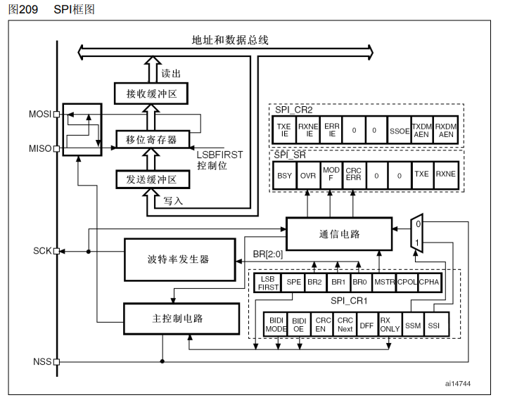
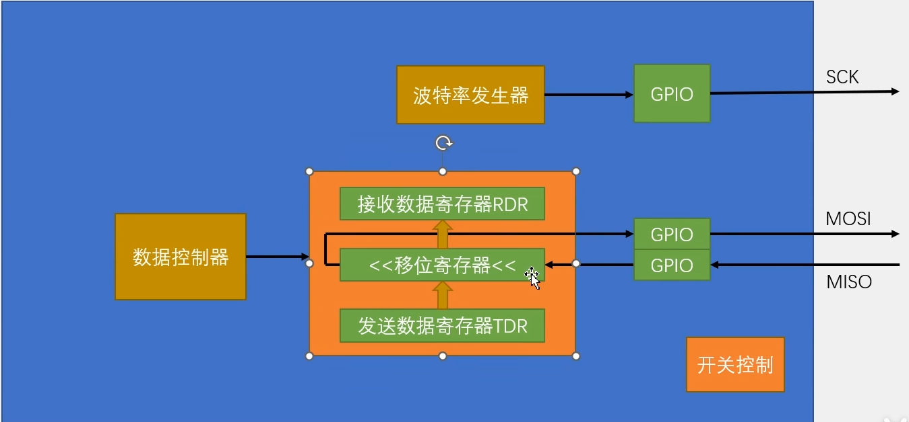
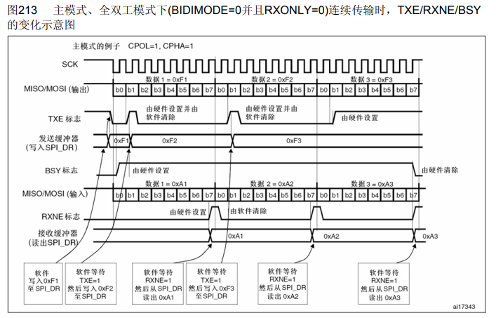
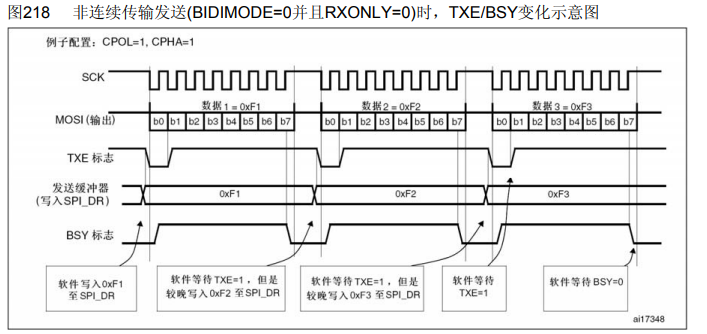
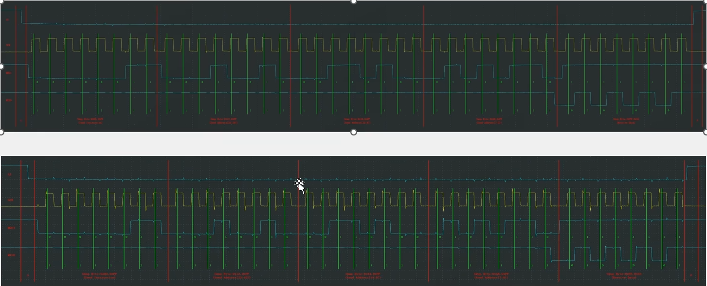
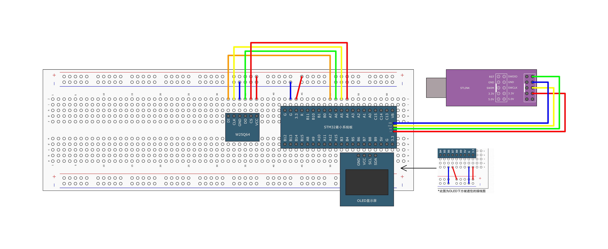

# [STM32]Day11-Part2

## SPI外设简介

STM32内部集成了硬件SPI收发电路，可以由硬件自动执行时钟生成、数据收发等功能，减轻CPU的负担

可配置8位/16位数据帧、高位先行/低位先行

时钟频率：f_{PCLK} / （2，4，8，16，32，64，128，256）

支持多主机模型、主或从操作

可精简为半双工/单工通信

支持DMA

兼容I2S协议

STM32F103C8T6硬件SPI资源：SPI1、SPI2

## SPI框图



上图为低位先行模式，设置接收缓冲区和发送缓冲区的目的是为了实现数据收发的连续性。MOSI和MISO的交叉是为了实现STM32作为SPI通信主从机的切换。接收缓冲区RDR和发送缓冲区TDR**占用同一个地址**，这与串口中缓冲区的设计相同，统一叫做DR。

波特率发生器用来产生SCK时钟，内部主要为一个分频器，对外设时钟APB1/APB2进行分频，分频系数由CR控制寄存器中的BR[2:0]控制。CR中LSBFIRST控制高位先行/地位先行，SPE（SPI ENABLE）是SPI使能，就是`SPI_Cmd`函数配置的控制位。MSTR被指主从模式。CPOL和CPHA用来选择SPI的4种模式。

**SPI基本结构**



## 数据发送与接收过程

### 主模式全双工连续传输



CPOL = 1，CPHA = 1说明是SPI模式3，SCK默认高电平，SCK第一个边沿移出数据，第二个边沿移入数据。发送缓冲器（写入SPI_DR）指的是发送数据寄存器即TDR，同理接收缓冲器指的是RDR。

### 非连续传输



以上是SPI模式3的非连续传输时序图。SS下降沿SPI通信开始（图中未画出），SCK的第一个边沿检测到TXE = 1，说明TDR此时为空，软件就将待发送数据0xF1写入TDR，同时TXE变为0。此时移位寄存器为空，0xF1会立刻转入移位寄存器开始发送，MOSI产生输出，同时TXE变回1，但是软件不会立刻把下一个待发送数据写入TDR，而是等待MOSI第一个字节发送完成，MISO第一个字节接收完成，RXNE为1并读取成功后，才向TDR写入下一个数据。

整体流程为：等待TXE为1 -> 将待发送数据写入TDR -> 等待RXNE为1 -> 从RDR读取接收到的数据

非连续传输的缺点：数据传输过程中，字节与字节之间有间隙，影响通信速度。

## 软硬件波形对比



## 硬件SPI读写W25Q64



初始化SPI外设的整体流程：开启时钟 -> 初始化GPIO口（SCK和MOSI由SPI外设控制输出，配置为复用推挽输出，SS软件模拟配置为推挽输出，MISO配置为上拉输入） -> 配置SPI外设 -> 开启SPI

代码

```c
// mySPI.c
#include "stm32f10x.h"                  // Device header

// 封装对SS的操作，保留软件模拟
void MySPI_W_SS(uint8_t BitVal)
{
	GPIO_WriteBit(GPIOA, GPIO_Pin_4, (BitAction)BitVal);		// SPI通信非常快所以不用加延时
}

void MySPI_Init(void)
{
	// 开启时钟
	RCC_APB2PeriphClockCmd(RCC_APB2Periph_GPIOA, ENABLE);
	RCC_APB2PeriphClockCmd(RCC_APB2Periph_SPI1, ENABLE);
	// 配置GPIO
	GPIO_InitTypeDef GPIO_InitStructure;
	GPIO_InitStructure.GPIO_Mode = GPIO_Mode_AF_PP;	// 输出引脚配置复用推挽输出模式
	GPIO_InitStructure.GPIO_Pin = GPIO_Pin_5 | GPIO_Pin_7;
	GPIO_InitStructure.GPIO_Speed = GPIO_Speed_50MHz;
	GPIO_Init(GPIOA, &GPIO_InitStructure);
	GPIO_InitStructure.GPIO_Mode = GPIO_Mode_IPU;	// 输入引脚配置上拉输入模式
	GPIO_InitStructure.GPIO_Pin = GPIO_Pin_6;
	GPIO_Init(GPIOA, &GPIO_InitStructure);
	GPIO_InitStructure.GPIO_Mode = GPIO_Mode_Out_PP;	// 输SS配置推挽输出模式
	GPIO_InitStructure.GPIO_Pin = GPIO_Pin_4;
	GPIO_Init(GPIOA, &GPIO_InitStructure);
	
	// 配置SPI外设
	SPI_InitTypeDef SPI_InitStructure;
	SPI_InitStructure.SPI_BaudRatePrescaler = SPI_BaudRatePrescaler_128;
	SPI_InitStructure.SPI_CPHA = SPI_CPHA_1Edge;		// 设置为0
	SPI_InitStructure.SPI_CPOL = SPI_CPOL_Low;		// 设置为0
	SPI_InitStructure.SPI_CRCPolynomial = 7;		// CRC校验位，设为默认
	SPI_InitStructure.SPI_DataSize = SPI_DataSize_8b;
	SPI_InitStructure.SPI_Direction = SPI_Direction_2Lines_FullDuplex;		// 双线全双工
	SPI_InitStructure.SPI_FirstBit = SPI_FirstBit_MSB;		// 高位先行
	SPI_InitStructure.SPI_Mode = SPI_Mode_Master;		// 主机模式
	SPI_InitStructure.SPI_NSS = SPI_NSS_Soft;		// 软件SS
	SPI_Init(SPI1, &SPI_InitStructure);
	
	// 开启SPI
	SPI_Cmd(SPI1, ENABLE);
	
	// 设置SS为高电平，不选中从机
	MySPI_W_SS(1);
}

// 产生起始条件
void MySPI_Start(void)
{
	MySPI_W_SS(0);
}

// 产生终止条件
void MySPI_Stop(void)
{
	MySPI_W_SS(1);
}

// 交换一个字节
uint8_t MySPI_SwapByte(uint8_t ByteSend)
{
	// 等待TXE变为1
	while(SPI_I2S_GetFlagStatus(SPI1, SPI_I2S_FLAG_TXE) != SET);
	// 待发送数据写入TDR
	SPI_I2S_SendData(SPI1, ByteSend);
	// 等待RXNE变为1
	while(SPI_I2S_GetFlagStatus(SPI1, SPI_I2S_FLAG_RXNE) != SET);
	// 读取RDR中结果
	uint8_t ByteReceive;
	ByteReceive = SPI_I2S_ReceiveData(SPI1);
	return ByteReceive;
}

```
