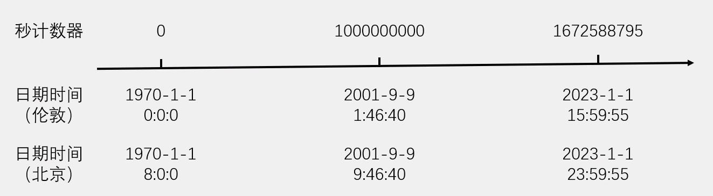
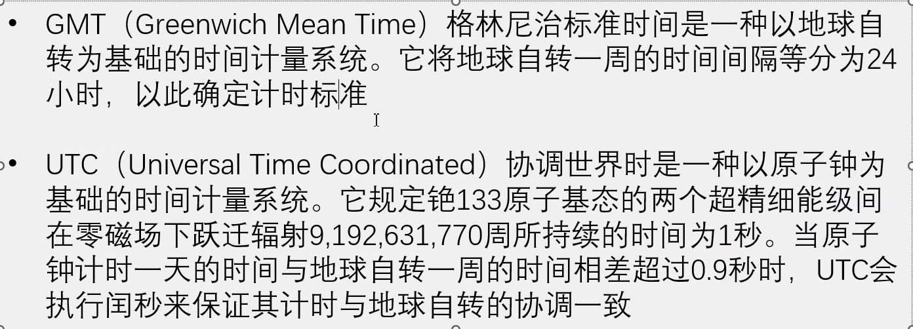
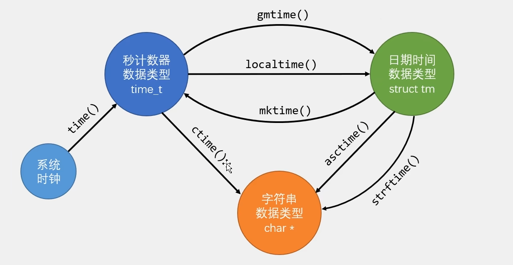
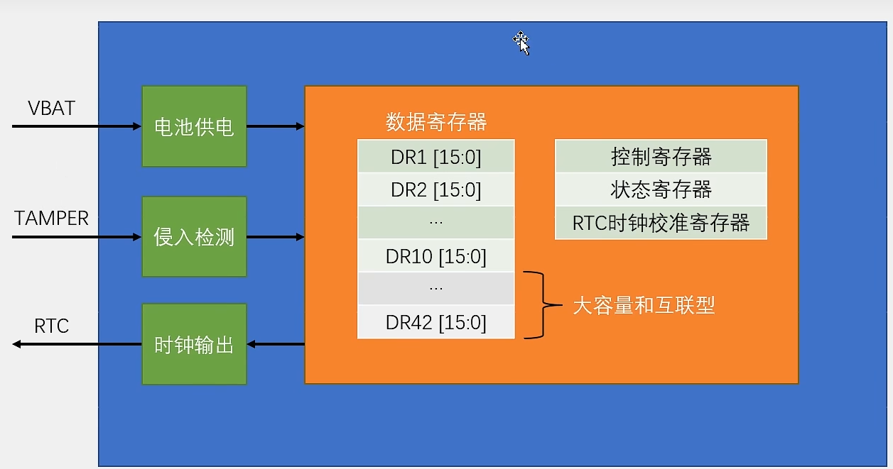
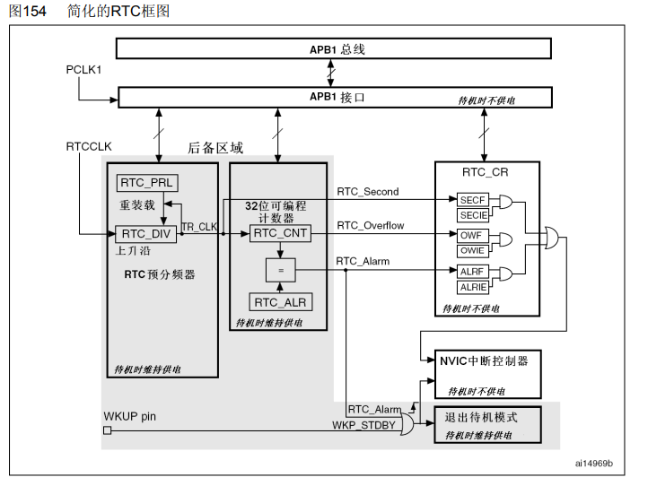
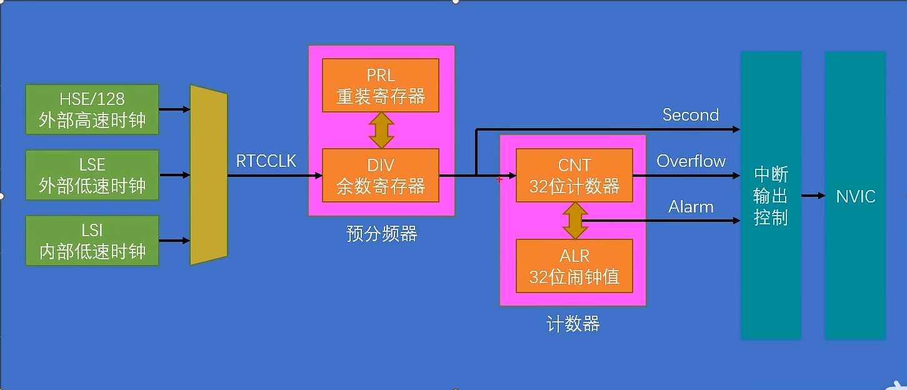
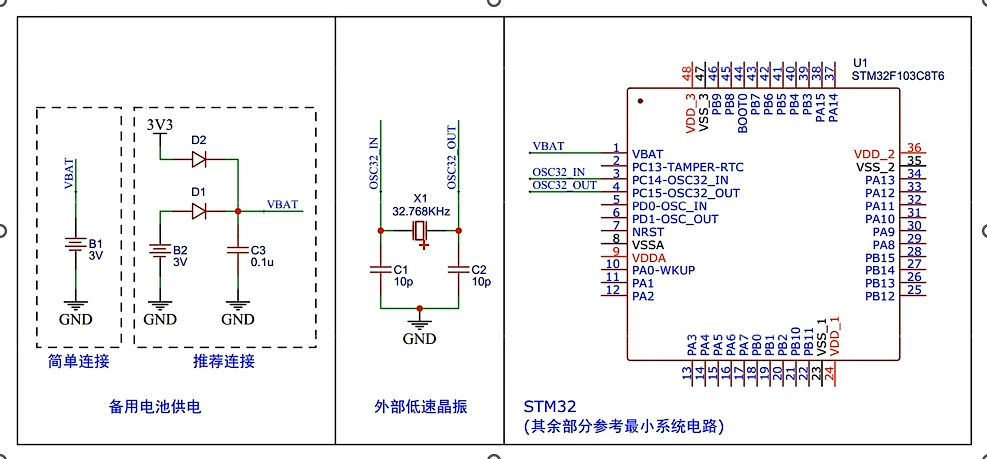
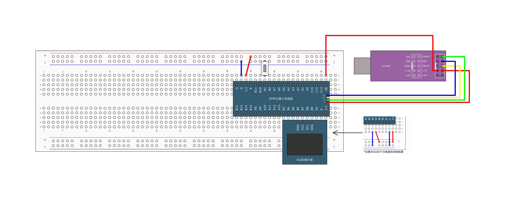
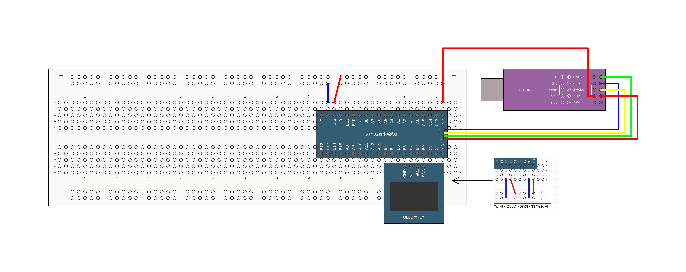

# [STM32]Day12

## Unix时间戳

Unix时间戳（Unix Timestamp）定义为从UTC/GMT的1970年1月1日0时0分0秒开始所经历的秒数，不考虑闰秒

时间戳存储在一个秒计数器中，秒计数器为32位/64位的整形变量

世界上所有时区的秒计数器相同，不同时区通过添加偏移来得到当地时间



UTC/GMT



## 时间戳转换

C语言的`time.h`模块提供了时间获取和时间戳转换的相关函数，可以方便地进行秒计数器、日期时间和字符串之间的转换

```c
time_t time(time_t*)		// 获取系统时钟
struct tm* gmtime(const time_t*);		// 秒计数器转换位日期时间(UTC)
struct tm* localtime(const time_t*);	// 秒计数器转换位日期时间(当地时间)
time_t mktime(struct tm*)		// 时期转换为秒计数器(根据当地时间)
char* ctime(const time_t*)		// 秒计数器转换为字符串(默认格式)
char* asctime(const struct tm*)		// 时期转换为字符串(默认格式)
size_t strftime(char*, size_t, const char*, const struct tm*)	// 日期转换为字符串(自定义格式)
```



## BKP简介

**BKP（Backup Registers）**备份寄存器，可用于存储用户应用程序数据。当VDD（2.0 - 3.6V）电源被切断，它们仍然由VBAT（1.8 - 3.6V）维持供电。当系统在待机模式下被唤醒、系统复位或电源复位时，它们也不会被复位。

TAMPER引脚产生的侵入事件将所有备份寄存器内容清除

RTC引脚输出RTC校准时钟、RTC闹钟脉冲或者秒脉冲

存储RTC时钟校准寄存器

用户数据存储容量：20字节（中容量和小容量） / 84字节（大容量和互联型）

**BKP基本结构**



## RTC简介

**RTC（Real Time Clock）**实时时钟，是一个独立的定时器，可为系统提供时钟和日历的功能

RTC和时钟配置系统处于后备区域，系统复位时数据不清零，VDD（2.0 - 3.6V）断电后可由VBAT（1.8 - 3.6V）供电继续工作

32位的可编程技术器，可对应Unix时间戳的秒计数器

20位的可编程预分频器，可适配不同频率的输入时钟，使得技术器工作时钟为1Hz，每秒加一

可选择三种RTC时钟源：通常使用低速外部时钟LSE

- HSE时钟除以128（通常为8MHz/128）
- LSE振荡器时钟（通常为32.768KHz）
- LSI振荡器时钟（40KHz）

## RTC框图



灰色阴影部分属于后备区域，主电源VDD断电后可以在VBAT支持下工作

输入时钟RTCCLK（通常由外部低速时钟提供32.768KHz）首先经过RTC预分频器进行分频。预分频器由两部分组成，重装载寄存器RTC_PRL和余数寄存器RTC_DIV，二者作用与计数器中ARR和CNT相同，作用是降低输入频率。RTC_DIV是一个自减计数器，减到0时产生一个脉冲，RTC_PRL将计数器重装到RTC_DIV开始下一轮计数。

RTC_CNT用来存储Unix时间戳。RTC_ALR为闹钟寄存器，当CNT = ALR时产生RTC_Alarm信号，可以执行中断操作或者让STM32退出待机模式。

RTC_Second、RTC_Overflow和RTC_Alarm都可以触发中断，SECF、OWF和ALRF是对应的标志位，下方IE后缀的是中断使能信号。

上方APB1总线和APB1接口用来读写RTC。

**RTC基本结构**



**硬件电路**



**RTC操作注意事项**

- 执行以下操作将使能对BKP和RTC的访问：
  设置RCC_APB1ENR的PWERN和BKPEN，使能PWR和BKP时钟；设置PWR_CR的DBP，使能对BKP和RTC的访问
- 若在读取RTC寄存器时，RTC的APB1接口处于禁止状态，则软件首先必须等待RTC_CRL寄存器中的**RSF位（寄存器同步标志）**被**硬件**置1
- 必须设置RTC_CRL寄存器中的CNF位，使RTC进入配置模式后，才能写入RTC_PRL、RTC_CNT、RTC_ALR寄存器
- 对RTC任何寄存器的写操作，都必须在前一次写操作结束后进行。可以通过查询RTC_CR寄存器中的RTOFF状态位，判断RTC寄存器是否处于更新中。**仅当RTOFF状态位为1时**，才可以写入RTC寄存器。

## 读写备份寄存器




**执行以下操作将使能对BKP和RTC的访问**：
设置RCC_APB1ENR的PWERN和BKPEN，使能PWR和BKP时钟；设置PWR_CR的DBP，使能对BKP和RTC的访问

```c
#include "stm32f10x.h"                  // Device header
#include "OLED_Software.h"
#include "Button.h"

uint16_t ArrayWrite[] = {0x1234, 0x5678};
uint16_t ArrayRead[2];

uint8_t ButtonVal;

int main(void)
{
	
	OLED_Init();
	Button_Init();
	
	OLED_ShowString(1, 1, "W:");
	OLED_ShowString(2, 1, "R:");
	
	// 开启时钟
	RCC_APB1PeriphClockCmd(RCC_APB1Periph_PWR, ENABLE);
	RCC_APB1PeriphClockCmd(RCC_APB1Periph_BKP, ENABLE);
	
	// 使能BKP和RTC，一个函数完成
	PWR_BackupAccessCmd(ENABLE);

	while(1)
	{
		ButtonVal = Button_Read(Pin_11);
		if(ButtonVal == 1) {
			// 写入BKP
			BKP_WriteBackupRegister(BKP_DR1, ArrayWrite[0]);
			BKP_WriteBackupRegister(BKP_DR2, ArrayWrite[1]);
			ArrayWrite[0] ++;
			ArrayWrite[1] ++;
			OLED_ShowHexNum(1, 3, ArrayWrite[0], 4);
			OLED_ShowHexNum(1, 9, ArrayWrite[1], 4);
		}
		
		// 从BKP读出
		ArrayRead[0] = BKP_ReadBackupRegister(BKP_DR1);
		ArrayRead[1] = BKP_ReadBackupRegister(BKP_DR2);
		OLED_ShowHexNum(2, 3, ArrayRead[0], 4);
		OLED_ShowHexNum(2, 9, ArrayRead[1], 4);
	}
}

```

## RTC




初始化RTC流程：开启时钟和使能 -> 开启时钟源（开启LSE） -> 指定时钟源 -> 等待同步、等待上一步操作完成 -> 配置预分频器 -> 设置CNT的值 -> 设置闹钟、配置中断（可选）

使用到的函数

```c
// 开启LSE
void RCC_LSEConfig(uint8_t RCC_LSE);
// 选择RTC时钟源
void RCC_RTCCLKConfig(uint32_t RCC_RTCCLKSource);
// 使能时钟
void RCC_RTCCLKCmd(FunctionalState NewState);
// 获取标志位，本节用来等待LSE开启完成
FlagStatus RCC_GetFlagStatus(uint8_t RCC_FLAG);
// 让RTC进入配置模式，才能写入寄存器
void RTC_EnterConfigMode(void);
// 读取时钟，读取Unix时间戳
uint32_t  RTC_GetCounter(void);
// 写入计数器的值
void RTC_SetCounter(uint32_t CounterValue);
// 设置预分频器和闹钟
void RTC_SetPrescaler(uint32_t PrescalerValue);
void RTC_SetAlarm(uint32_t AlarmValue);
// 等待上一步写操作完成
void RTC_WaitForLastTask(void);
// 等待同步
void RTC_WaitForSynchro(void);
```

```c
// MyRTC.c
#include "stm32f10x.h"                  // Device header
#include <time.h>

uint16_t MyRTC_Time[] = {2026, 6, 11, 15, 0, 30};

void MyRTC_SetTime(void);

void MyRTC_Init(void)
{
	// 开启时钟
	RCC_APB1PeriphClockCmd(RCC_APB1Periph_PWR, ENABLE);
	RCC_APB1PeriphClockCmd(RCC_APB1Periph_BKP, ENABLE);
	
	// 使能PWR和BKP
	PWR_BackupAccessCmd(ENABLE);
	
	// 通过BKP中得值判断是否备用电源断电，如果断电重置时钟，否则不重置
	if(BKP_ReadBackupRegister(BKP_DR1) != 0x3F3F) {
		// 开启LSE时钟并等待开启完成
		RCC_LSEConfig(RCC_LSE_ON);
		while(RCC_GetFlagStatus(RCC_FLAG_LSERDY) != SET);
		
		// 选择时钟源并使能
		RCC_RTCCLKConfig(RCC_RTCCLKSource_LSE);
		RCC_RTCCLKCmd(ENABLE);
		
		// 等待同步、等待上一步操作完成
		RTC_WaitForSynchro();
		RTC_WaitForLastTask();
		
		// 设置预分频器，自动进入和退出配置模式
		RTC_SetPrescaler(32768 - 1);
		RTC_WaitForLastTask();
		
		// 设置初始时间，设置CNT的值
	//	RTC_SetCounter(1672588795);
	//	RTC_WaitForLastTask();
		MyRTC_SetTime();
		
		// 设置BKP_DR1用作标志位
		BKP_WriteBackupRegister(BKP_DR1, 0x3F3F);
	} else {
		// 等待同步、等待上一步操作完成
		RTC_WaitForSynchro();
		RTC_WaitForLastTask();
	}
}

void MyRTC_SetTime(void) 
{
	time_t time_cnt;
	struct tm time_date;
	
	time_date.tm_year = MyRTC_Time[0] - 1900;
	time_date.tm_mon = MyRTC_Time[1] - 1;
	time_date.tm_mday = MyRTC_Time[2];
	time_date.tm_hour = MyRTC_Time[3];
	time_date.tm_min = MyRTC_Time[4];
	time_date.tm_sec = MyRTC_Time[5];
	
	// 将日期转为时间戳
	time_cnt = mktime(&time_date) - 8 * 60 * 60;
	
	// 写入cnt
	RTC_SetCounter(time_cnt);
	RTC_WaitForLastTask();
}

void MyRTC_GetTime(void)
{
	time_t time_cnt;
	struct tm time_date;
	
	time_cnt = RTC_GetCounter() + 8 * 60 * 60;
	time_date = *localtime(&time_cnt);
	
	MyRTC_Time[0] = time_date.tm_year + 1900;
	MyRTC_Time[1] = time_date.tm_mon + 1;
	MyRTC_Time[2] = time_date.tm_mday;
	MyRTC_Time[3] = time_date.tm_hour;
	MyRTC_Time[4] = time_date.tm_min;
	MyRTC_Time[5] = time_date.tm_sec;
}

// main.c
#include "stm32f10x.h"                  // Device header
#include "OLED_Software.h"
#include "MyRTC.h"

int main(void)
{
	
	OLED_Init();
	MyRTC_Init();
	
	OLED_ShowString(1, 1, "Data:XXXX-XX-XX");
	OLED_ShowString(2, 1, "Time:XX:XX:XX");
	OLED_ShowString(3, 1, "CNT :");
	OLED_ShowString(4, 1, "DIV :");

	while(1)
	{
		MyRTC_GetTime();
		OLED_ShowNum(1, 6, MyRTC_Time[0], 4);
		OLED_ShowNum(1, 11, MyRTC_Time[1], 2);
		OLED_ShowNum(1, 14, MyRTC_Time[2], 2);
		OLED_ShowNum(2, 6, MyRTC_Time[3], 2);
		OLED_ShowNum(2, 9, MyRTC_Time[4], 2);
		OLED_ShowNum(2, 12, MyRTC_Time[5], 2);
		OLED_ShowNum(3, 6, RTC_GetCounter(), 10);
		
		OLED_ShowNum(4, 6, RTC_GetDivider(), 10);
	}
}

```