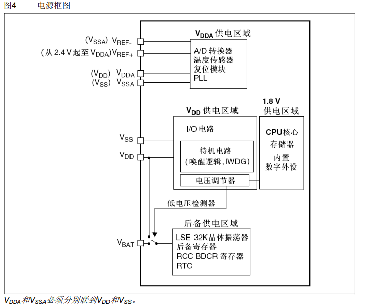
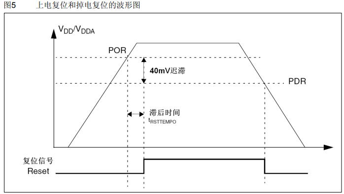
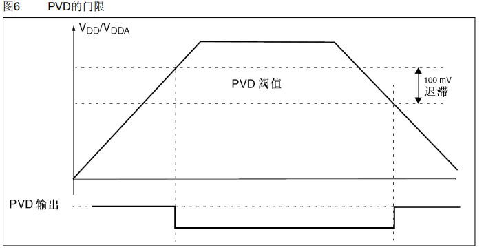
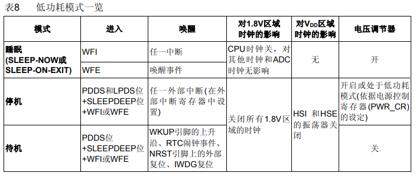
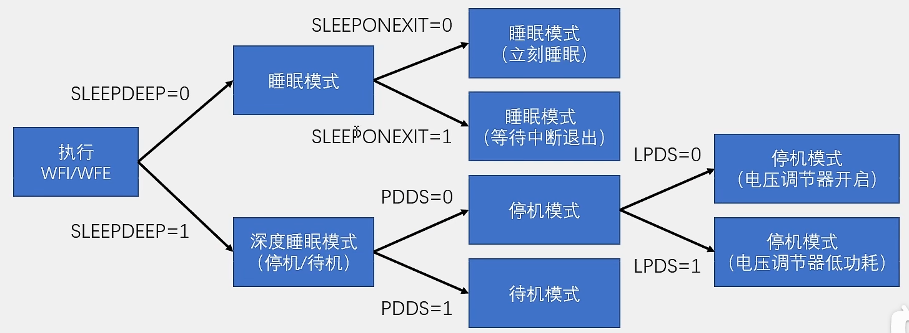
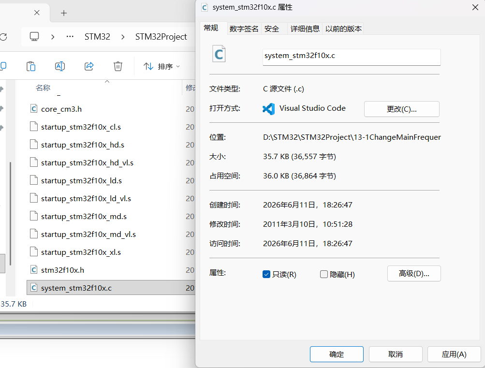
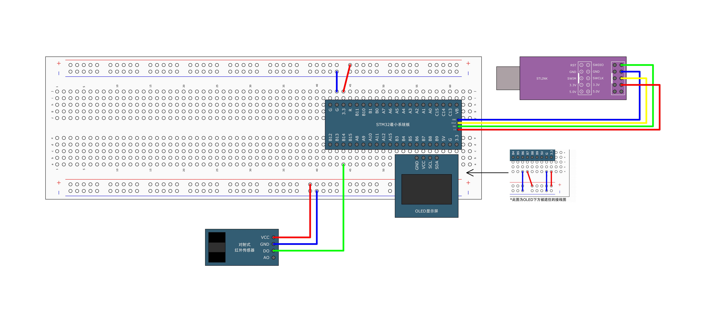
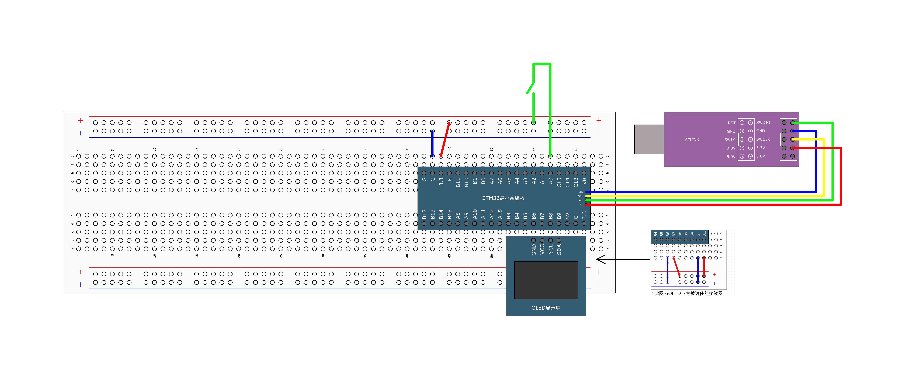

# [STM32]Day13

## PWR简介

**PWR（Power Control），电源控制**负责管理STM32内部的电源供电部分，可以实现可编程电压检测器和低功耗模式的功能

可编程电压检测器（**PVD**）可以监控VDD电源电压，当VDD下降到PVD阈值以下或上升到PVD阈值之上时，PVD就会触发中断，用于执行紧急关闭任务

低功耗模式包括睡眠模式（Sleep）、停机模式（Stop）和待机模式（Standby），可在系统空闲时，降低STM32的功耗，延长设备使用时间

## 电源框图



VDDA（**VDD Analog**）是模拟部分供电，VCC供电区域和1.8V供电区域共同组成数字部分供电，下方是后备供电VBAT（**V Battery**）。

VDDA主要负责模拟部分供电，包括AD转换器、温度转换器、复位模块、PLL锁相环，正极为VDDA，负极均为VSSA。AD转换器还有两条参考电压供电V_REF+和V_REF-决定AD转换范围。

VDD供电区域主要负责数字部分供电，包括IO电路，待机电路（唤醒逻辑，IWDG看门狗），通过电压调节器降压到1.8V给CPU核心、存储器、内置数字外设供电。

后备供电区域电源的选择由低电压检测器完成，当VDD有电时使用VDD供电，VDD没电时使用VBAT供电。

**上电复位和掉电复位**



**可编程电压检测器**



## 低功耗模式



直接调用内核函数`WFI()`和`WFE`可以进入睡眠模式。**WFI（Wait For Interrupt）**通过任一中断可唤醒；**WFE（Wait For Event）**需要唤醒事件发生才能唤醒。

PDDS位用于区分进入停机还是待机模式，LPDS位用于控制电压调节器开启还是处于低功耗模式，SLEEPDEEP用于允许睡眠，设置好这些控制位后调用`WFI`或`WFE`可进入停机模式，停机模式可以由任意**外部中断**唤醒。停机模式下电压调节器不关闭，寄存器和存储器中的数据可以保留。

进入待机模式的条件与停机模式相似，由PDDS控制进入待机模式，唤醒条件最苛刻，时钟和电源（电压调节器）都关闭，最省电，寄存器和存储器中的数据无法保持。

LSI和LSE时钟在低功耗模式下都能工作。

**模式选择**

执行**WFI（Wait For Interrupt）**或者**WFE（Wait For Event）**指令后，STM32进入低功耗模式



**睡眠模式**：

- 执行完WFI/WFE指令后，STM32进入睡眠模式，程序暂停运行，唤醒后程序从暂停的地方继续运行
- SLEEPONEXIT位决定STM32执行完WFI或者WFE后，是立即进入睡眠模式还是等STM32从最低优先级的中断处理程序中退出时进入睡眠
- 睡眠模式下，所有IO引脚都保持它们在运行模式时的状态
- WFI指令进入睡眠模式，可被任意一个NVIC响应的中断唤醒
- WFE指令进入睡眠模式，可被唤醒事件唤醒

**停机模式**：

- 执行完WFI/WFE指令后，STM32进入停止模式，程序暂停运行，唤醒后程序从暂停的地方继续运行
- 1.8V供电区域的所有时钟都被停止，PLL、HSI和HSE被禁止，SRAM和寄存器的内容被保留
- 停机模式下，所有IO引脚保持它们在运行模式时的状态
- 当一个中断或唤醒事件导致退出停机模式时，HSI被选为系统时钟
- 当电压调节器处于低功耗模式下，系统从停止模式退出时，会有一段额外的启动延时
- WFI指令进入停机模式，可被任意一个EXTI中断唤醒
- WFE指令进入停机模式，可被任意一个EXTI事件唤醒

**待机模式**

- 执行完WFI/WFE指令后，STM32进入待机模式，唤醒后程序从头开始运行
- 整个1.8V供电区域被断电，PLL、HSI和HSE也被断电，SRAM和存储器内容丢失，只有备份的寄存器和待机电流维持供电
- 待机模式下，所有IO引脚变为高阻态（浮空输入）
- WKUP引脚的上升沿、RTC闹钟事件的上升沿、NRST引脚上外部复位、IWDG复位退出待机模式

## 修改主频


修改`system_stm32f10x.c`的读写权限为允许写（取消“只读”选项）



代码

```c
// system_stm32f10x.c
...
   /* #define SYSCLK_FREQ_HSE    HSE_VALUE */
    /* #define SYSCLK_FREQ_24MHz  24000000 */ 
       #define SYSCLK_FREQ_36MHz  36000000 
    /* #define SYSCLK_FREQ_48MHz  48000000 */
    /* #define SYSCLK_FREQ_56MHz  56000000 */
    /* #define SYSCLK_FREQ_72MHz  72000000 */ 
...

// main.c
#include "stm32f10x.h"                  // Device header
#include "OLED_Software.h"
#include "Delay.h"

int main(void)
{
	
	OLED_Init();
	
	OLED_ShowString(1, 1, "SYSCLK:");
	OLED_ShowNum(1, 8, SystemCoreClock, 8);
	
	while(1)
	{
		OLED_ShowString(2, 1, "Running");
		Delay_ms(500);
		OLED_ShowString(2, 1, "       ");
		Delay_ms(500);
	}
}

```

## 睡眠模式+串口发送与接收


```c
#include "stm32f10x.h"                  // Device header
#include "OLED_Hardware.h"
#include "Serial.h"
#include "Delay.h"

uint8_t RxData;		// 存放接收到的数据

int main(void)
{
	
	OLED_Init_H();
	Serial_Init();
	
	OLED_ShowString_H(1, 1, "RxData:");

	while(1)
	{
		if(Serial_GetRxFlag() == 1) {
			RxData = Serial_GetRxData();
			Serial_SendByte(RxData);
			OLED_ShowHexNum_H(1, 8, RxData, 2);
		}
		
		OLED_ShowString_H(2, 1, "Running");
		Delay_ms(100);
		OLED_ShowString_H(2, 1, "       ");
		Delay_ms(100);
	}
	
	// 使用WFI进入睡眠模式，可以被任意中断唤醒
	__WFI();
}

```

## 停止模式+对射式红外传感器计次



代码

```c
#include "stm32f10x.h"                  // Device header
#include "OLED_Software.h"
#include "InfraredSensor.h"
#include "Delay.h"

int main(void)
{
	
	OLED_Init();
	InfraredSensor_Init();
	
	// 开启PWR时钟
	RCC_APB1PeriphClockCmd(RCC_APB1Periph_PWR, ENABLE);
	
	OLED_ShowString(1, 1, "Count:");

	while(1)
	{
		OLED_ShowNum(1, 7, InfraredSensor_GetNum(), 5);
		
		OLED_ShowString(2, 1, "Running");
		Delay_ms(100);
		OLED_ShowString(2, 1, "       ");
		Delay_ms(100);
		
		PWR_EnterSTOPMode(PWR_Regulator_ON, PWR_STOPEntry_WFI);
		SystemInit();		// 重新设置HSE为时钟（停止模式唤醒后时钟为HSI:8MHz）
	}
}

```

## 待机模式+实时时钟



```c
#include "stm32f10x.h"                  // Device header
#include "OLED_Software.h"
#include "MyRTC.h"
#include "Delay.h"

int main(void)
{
	
	OLED_Init();
	MyRTC_Init();
	
	// 开启PWR时钟
	RCC_APB1PeriphClockCmd(RCC_APB1Periph_PWR, ENABLE);
	
	OLED_ShowString(1, 1, "CNT  :");
	OLED_ShowString(2, 1, "ALR  :");			// 闹钟值
	OLED_ShowString(3, 1, "ALRF :");			// 闹钟标志位
	
	// 使能Wakeup上升沿唤醒
	PWR_WakeUpPinCmd(ENABLE);
	
	// 设置闹钟，由于Alarm是只写寄存器，在写入前记录写入值
	uint32_t Alarm = RTC_GetCounter() + 10;
	RTC_SetAlarm(Alarm);
	OLED_ShowNum(2, 6, Alarm, 10);

	while(1)
	{
		
		OLED_ShowNum(1, 6, RTC_GetCounter(), 10);		// 显示当前计数值
		OLED_ShowNum(3, 6, RTC_GetITStatus(RTC_IT_ALR), 1);		// 显示闹钟标志位
		
		OLED_ShowString(4, 1, "Running");
		Delay_ms(100);
		OLED_ShowString(4, 1, "       ");
		Delay_ms(100);
		
		OLED_ShowString(4, 9, "Standby");
		Delay_ms(1000);
		OLED_ShowString(4, 1, "       ");
		Delay_ms(1000);
		
		// 模拟关闭其他外设
		OLED_Clear();
		
		// 进入待机模式，唤醒后程序从头开始执行，自动设置主频为72MHz
		PWR_EnterSTANDBYMode();
	}
}

```

