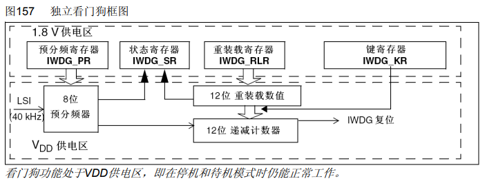
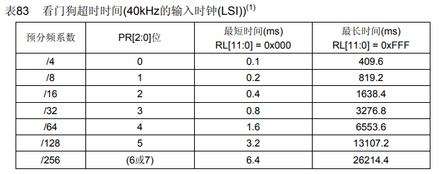
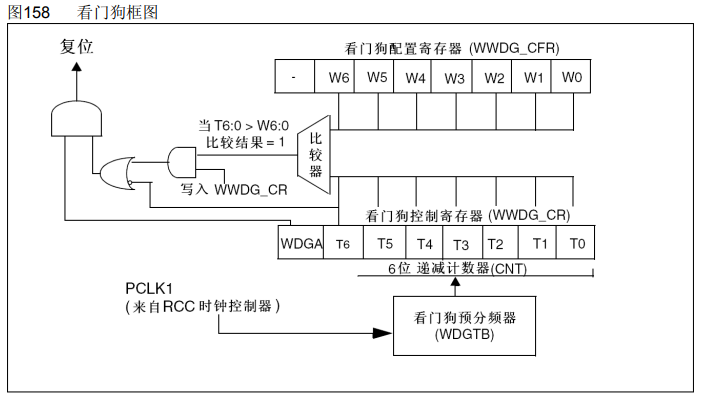
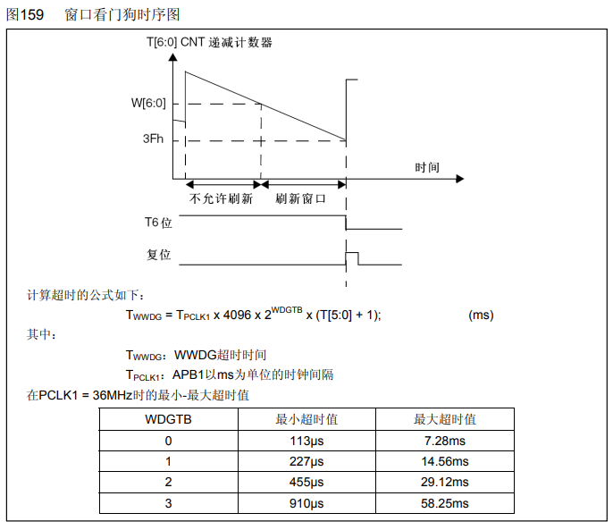
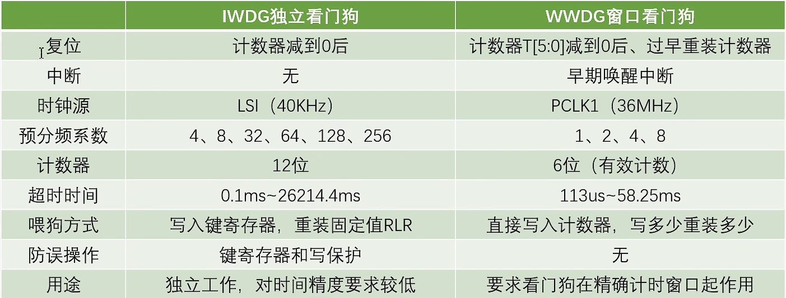
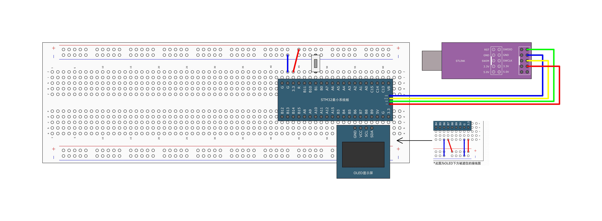

# [STM32]Day14

## WDG看门狗

**WDG（Watch Dog），看门狗**可以监控程序的运行状态，当程序因为设计漏洞、硬件故障、电磁干扰等原因出现卡死或跑飞现象时，看门狗能及时复位程序，避免程序陷入长时间的罢工状态，保证系统的可靠性和安全性

看门狗本质上是一个定时器，当指定事件范围内，程序没有执行喂狗（重置计数器）操作时，看门狗硬件电路就自动产生复位信号

STM32内置两个看门狗：

- 独立看门狗（**IWDG**）：独立工作，对时间精度要求较低
- 窗口看门狗（**WWDG**）：要求看门狗在精确计时窗口起作用

**独立看门狗框图**



IWDG键寄存器

键寄存器本质上是控制寄存器，用于控制硬件电路的工作

在可能存在干扰的情况下，一般通过在整个键寄存器写入特定值来代替控制寄存器写入一位的功能，以降低硬件电路受到干扰的概率

| 写入键寄存器的值 | 作用                                   |
| ---------------- | -------------------------------------- |
| 0xCCCC           | 启动独立看门狗                         |
| 0xAAAA           | IWDG_RLR中的值重新加载到计数器（喂狗） |
| 0x5555           | 解除IWDG_PR和IWDG_RLR的写保护          |
| 其他值           | 启用IWDG_PR和IWDG_RLR的写保护          |

## IWDG超时时间

超时时间：T_IWDG = T_LSI * PR分频系数 * （RL + 1）

其中：T_LSI = 1 / F_LSI



## WWDG框图



窗口看门狗使用PCLK1也就是APB1的时钟，默认为36MHz，经过预分频器分频后驱动计数器递减计数。T6 - T0为计数位，T6为溢出标志位，T6 = 0时表示计数器溢出。当设置CNT初值为111 1111时，**如果把T6看作计数器的一部分，计数器在100 0000 = 0x40溢出；如果把T6看作标志位，计数器在00 0000 = 0x00溢出**。

WDGA时窗口看门狗使能位，WDGA = 1启用窗口看门狗。T6 = 0时，可以产生复位信号。

W[6:0]存放的是最早界限的计数值，写入后保持不变。每次喂狗（写入WWDG_CR）时，比较器比较W[6:0]与当前计数值T[6:0]，如果T[6:0] > W[6:0]说明喂狗时间太早（注意计数器**递减**），比较器输出1，产生复位信号。

**WWDG工作特性**

递减计数器T[6:0]的值小于0x40时，WWDG产生复位

递减计数器T[6:0]在窗口W[6:0]外被重新装载时，WWDG产生复位

递减计数器T[6:0]**等于**0x40时可以产生早期唤醒中断（EWI），用于重装载计数器以避免WWDG复位

定期写入WWDG_CR寄存器（喂狗）以避免WWDG复位



超时时间：T_WWDG = T_PCLK1 * 4096 * WDGTB预分频系数 * （T[5:0] + 1）

窗口时间：T_WIN = T_PCLK1 * 4096 * WDGTB预分频系数 * （T[5:0] - W[5:0]）

其中：T_PCLK1 = 1 / F_PCLK1

**乘以4096是因为在进入WDGTB之前还经过了分频，分频系数为4096**

WDGTB预分频系数 = 2的WDGTP次方

**IWDG和WWDG对比**



## 独立看门狗



按键用于阻塞喂狗


独立看门狗配置流程：开启LSI时钟（开启看门狗后系统自动开启，无需手动操作） -> 解除预分频器和重装载寄存器写保护 -> 向预分频器和重装载寄存器写入 -> 向键寄存器写入0xCCCC启动看门狗 -> 主循环中喂狗

F_LSI = 40kHz，T_LSI = 0.025ms

```c
#include "stm32f10x.h"                  // Device header
#include "OLED_Software.h"
#include "Delay.h"
#include "Button.h"

int main(void)
{
	
	OLED_Init();
	Button_Init();
	
	OLED_ShowString(1, 1, "IWDG TEST");
	
	if(RCC_GetFlagStatus(RCC_FLAG_IWDGRST) == SET) {
		// 独立看门狗引起的复位
		OLED_ShowString(2, 1, "IWDGRST");
		Delay_ms(500);
		OLED_ShowString(2, 1, "       ");
		Delay_ms(100);
		
		RCC_ClearFlag();
	} else {
		OLED_ShowString(3, 1, "RST");
		Delay_ms(500);  
		OLED_ShowString(3, 1, "   ");
		Delay_ms(100);
	}
	
	// 解除预分频器和重装寄存器写保护
	IWDG_WriteAccessCmd(IWDG_WriteAccess_Enable);
	
	// 向预分频器和重装寄存器写入，T_LSI = 0.025ms，设置超时时间为1000ms
	IWDG_SetPrescaler(IWDG_Prescaler_16);
	IWDG_SetReload(2499);
	
	// 先喂一次狗，确保重装寄存器中的值为2499
	IWDG_ReloadCounter();
	
	// 启动看门狗
	IWDG_Enable();

	while(1)
	{
		Button_Read(Pin_11);
		
		IWDG_ReloadCounter();
		
		OLED_ShowString(4, 1, "FEED");
		Delay_ms(200);  
		OLED_ShowString(4, 1, "    ");
		Delay_ms(600);
	}
}

```

## 窗口看门狗


窗口看门狗初始化流程：开启时钟（开启APB1时钟） -> 配置预分频器和配置寄存器 -> 使能WWDG并写入控制寄存器 -> 主循环喂狗

```c
#include "stm32f10x.h"                  // Device header
#include "OLED_Software.h"
#include "Delay.h"
#include "Button.h"

int main(void)
{
	
	OLED_Init();
	Button_Init();
	
	OLED_ShowString(1, 1, "WWDG TEST");
	
	if(RCC_GetFlagStatus(RCC_FLAG_WWDGRST) == SET) {
		// 窗口看门狗引起的复位
		OLED_ShowString(2, 1, "WWDGRST");
		Delay_ms(500);
		OLED_ShowString(2, 1, "       ");
		Delay_ms(100);
		
		RCC_ClearFlag();
	} else {
		OLED_ShowString(3, 1, "RST");
		Delay_ms(500);  
		OLED_ShowString(3, 1, "   ");
		Delay_ms(100);
	}
	
	// 开启时钟
	RCC_APB1PeriphClockCmd(RCC_APB1Periph_WWDG, ENABLE);
	
	// 设置预分频和窗口值
	WWDG_SetPrescaler(WWDG_Prescaler_8);	// 分频系数8，分频系数55 -> 超时时间50ms
	WWDG_SetWindowValue(21 | 0x40);		// 窗口值21 -> 30ms以后才可喂狗
	
	// 使能WWDG并写入控制寄存器
	WWDG_Enable(54 | 0x40);

	while(1)
	{
		Button_Read(Pin_11);
			
		OLED_ShowString(4, 1, "FEED");
		Delay_ms(20);  
		OLED_ShowString(4, 1, "    ");
		Delay_ms(20);
		
		// 喂狗，放在下面避免喂狗过早
		WWDG_SetCounter(54 | 0x40);
	}
}

```

