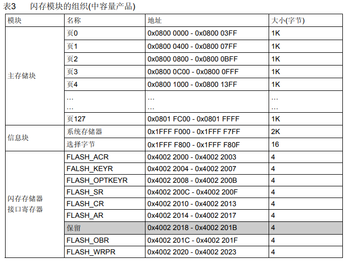
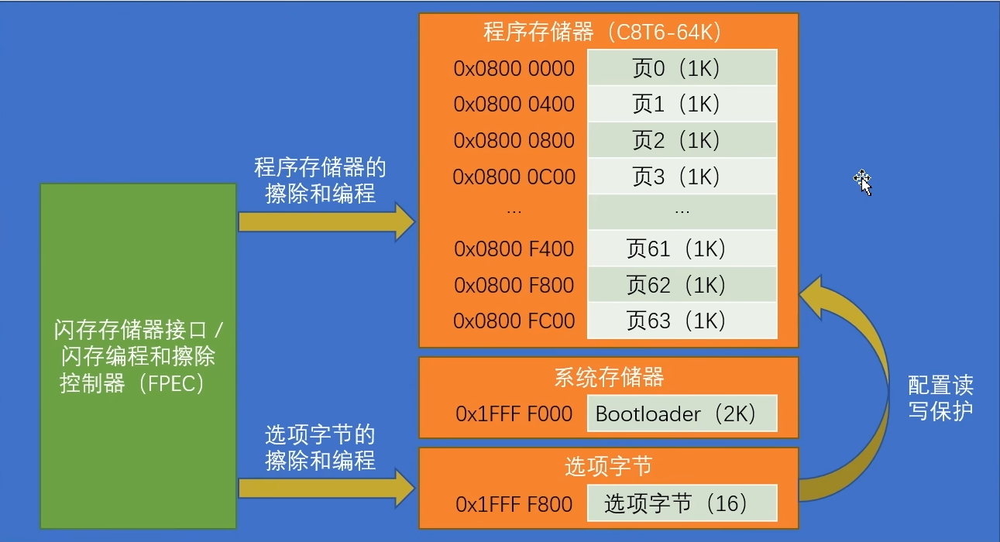
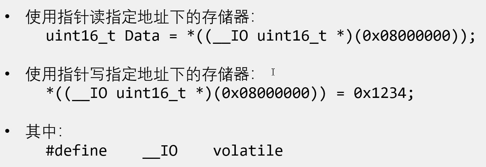
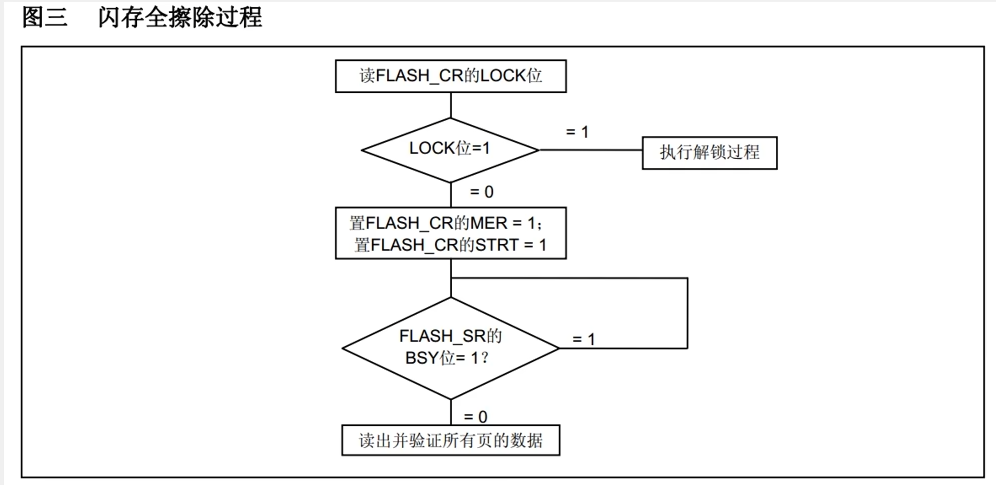
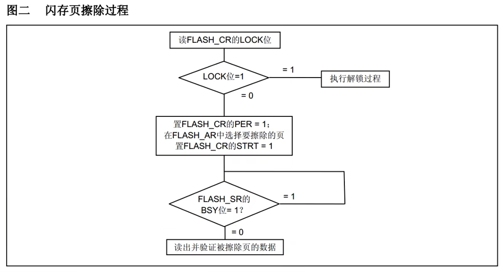
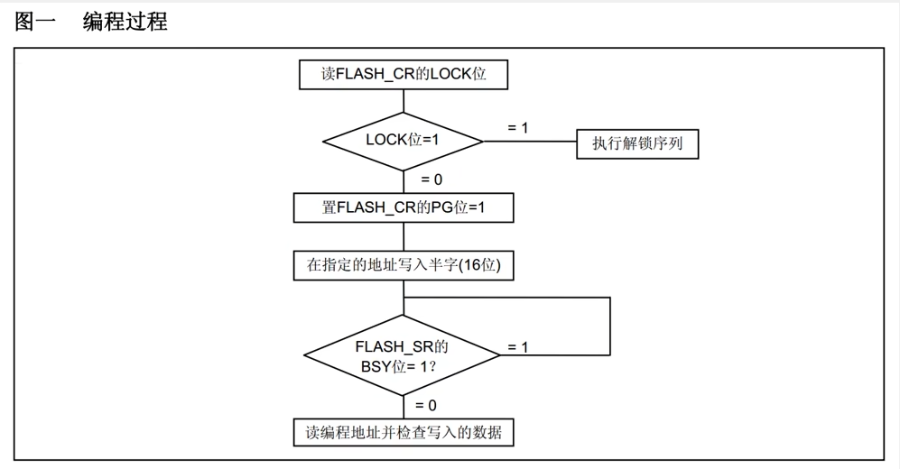
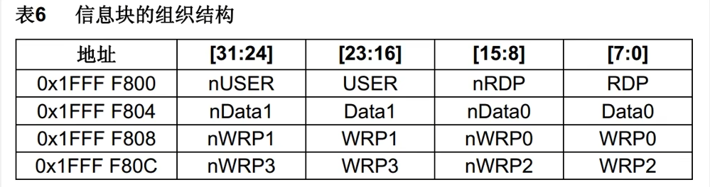
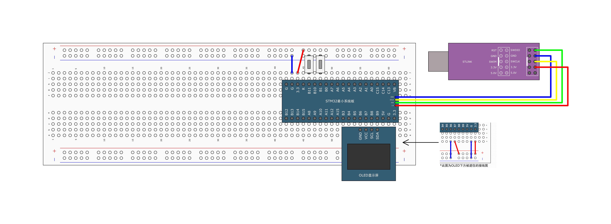

# [STM32]Day15

## FLASH简介

STM32F1系列的Flash包含程序存储器、系统存储器和选项字节三个部分，通过闪存存储器接口（外设）可以对程序存储器和选项字节进行擦除和编程

读写Flash的用途：

- 利用程序存储器的剩余空间来保存掉电不丢失的用户数据
- 通过在程序中编程（IAP），实现程序的自我更新

**在线编程（In-Circuit Programming ，ICP）**用于更新程序存储器的全部内容，它通过JTAG、SWD协议或系统加载程序（Bootloader）下载程序

**在程序中编程（In-Application Programming，IAP）**可以使用对微控制器支持的任意一种通信接口下载程序



**FLASH基本结构**



**FLASH解锁**

闪存存储器接口FPEC有三个键值

- RDPRT键 = 0x0000 00A5
- KEY1 = 0x4567 0123
- KEY2 = 0xCDEFv89AB

解锁：

- 复位后，FPEC被保护，不能写入FLASH_CR
- 在FLASH_KEYR先写入KEY1，再写入KEY2，解锁
- 错误的操作序列会在下次复位之前锁死FPEC和FLASH_CR

加锁：设置FLASH_CR中的LOCK位锁住FPEC和FLASH_CR

## 使用指针访问存储器



## 程序存储器全擦除



## 程序存储器页擦除



## 程序存储器写入



## 选项字节



RDP：写入RDPRT（0x0000 00A5）后解除读保护

USER：配置硬件看门狗和进入停机/待机模式是否产生复位

Data0/1：用户可自定义使用

WrP0/1/2/3：配置写保护，每一个位对应保护4个存储页（中容量）

nRPD与RDP互为反码，写入时由硬件自动完成

**选项字节擦除**：

- 检查FLASH_SR的BSY位，以确认没有其他正在进行的闪存操作
- 解锁FLASH_CR的OPTWRE位
- 设置FLASH_CR的OPTER位为1
- 设置FLASH_CR的STRT位为1
- 等待BSY位变为0
- 读出被擦除的选项字节并做验证

**选项字节编程**：

- 检查FLASH_SR的BSY位，以确认没有其他正在进行的编程操作
- 解锁FLASH_CR的OPTWRE位
- 设置FLASH_CR的OPTPG位为1
- 写入要编程的半字到指定的地址
- 等待BSY位变为0
- 读出写入的地址并验证数据

## 器件电子签名

电子签名存放在闪存存储器模块的系统存储区域，包含的芯片识别信息再出厂时编写，不可更改，使用指针读指定地址下的存储器可以获取电子签名

闪存容量寄存器：基地址：0x1FFF F7E0，大小：16位

产品唯一身份标识寄存器：基地址：0x1FFF F7E8，大小：96位

## 读写内部FLASH



两个底层模块：MyFLASH，实现对闪存的三个基本操作：读取、擦除和编程；Store：实现参数数据的读写和存储管理

```c
// MyFLASH.c
#include "stm32f10x.h"                  // Device header

// FLASH读取字
uint32_t MyFLASH_ReadWord(uint32_t Address)
{
	return *((__IO uint32_t *)(Address));
}

// FLASH读取半字
uint16_t MyFLASH_ReadHalfWord(uint32_t Address)
{
	return *((__IO uint16_t *)(Address));
}

// FLASH读取字节
uint8_t MyFLASH_ReadByte(uint32_t Address)
{
	return *((__IO uint8_t *)(Address));
}

// FLASH全擦除
void MyFLASH_EraseAllPages(void)
{
	// 先解锁再擦除，最后上锁
	FLASH_Unlock();
	FLASH_EraseAllPages();
	FLASH_Lock();
}

// FLASH擦除页
void MyFLASH_ErasePage(uint32_t Page_Address)
{
	// 先解锁再擦除，最后上锁
	FLASH_Unlock();
	FLASH_ErasePage(Page_Address);
	FLASH_Lock();
}

// 页编程（页写入）：写入字
void MyFLASH_ProgramWord(uint32_t Address, uint32_t Data)
{
	FLASH_Unlock();
	FLASH_ProgramWord(Address, Data);
	FLASH_Lock();
}

// 页编程（页写入）：写入半字
void MyFLASH_ProgramHalfWord(uint32_t Address, uint16_t Data)
{
	FLASH_Unlock();
	FLASH_ProgramHalfWord(Address, Data);
	FLASH_Lock();
}

// 写入字节操作比较麻烦，暂时不用实现

// Store.c
#include "stm32f10x.h"                  // Device header
#include "MyFLASH.h"

#define STORE_START_ADDRESS 		0x0800FC00
#define STORE_COUNT					512

uint16_t Store_Data[STORE_COUNT];

void Store_Init(void)
{
	// 使用FLASH最后一页第一个半字做标志位，如果不是0xA5A5说明是第一次使用
	if(MyFLASH_ReadHalfWord(STORE_START_ADDRESS) != 0xA5A5) {
		MyFLASH_ErasePage(STORE_START_ADDRESS);
		MyFLASH_ProgramHalfWord(STORE_START_ADDRESS, 0xA5A5);
		for(uint16_t i = 1; i < STORE_COUNT; i ++) {
			MyFLASH_ProgramHalfWord(STORE_START_ADDRESS + i * 2, 0x0000);
		}
	} 
	
	// 把闪存备份的数据恢复到SRAM里
	for(uint16_t i = 0; i < STORE_COUNT; i ++) {
		Store_Data[i] = MyFLASH_ReadHalfWord(STORE_START_ADDRESS + i * 2);
	}
}

void Store_Save(void)
{
	MyFLASH_ErasePage(STORE_START_ADDRESS);
	// 把闪存备份的数据恢复到SRAM里
	for(uint16_t i = 0; i < STORE_COUNT; i ++) {
		MyFLASH_ProgramHalfWord(STORE_START_ADDRESS + i * 2, Store_Data[i]);
	}
}

void Store_Clear(void)
{
	for(uint16_t i = 1; i < STORE_COUNT; i ++) {
		Store_Data[i] = 0x0000;
	}
	Store_Save();
}

// main.c
#include "stm32f10x.h"                  // Device header
#include "OLED_Software.h"
#include "Store.h"
#include "Button.h"

uint8_t ButtonVal1;
uint8_t ButtonVal2;

int main(void)
{
	
	OLED_Init();
	Button_Init();
	Store_Init();
	
	OLED_ShowString(1, 1, "Flag:");
	OLED_ShowString(2, 1, "Data:");

	while(1)
	{
		ButtonVal1 = Button_Read(Pin_11);
		ButtonVal2 = Button_Read(Pin_12);
		if(ButtonVal1 == 1) {
			Store_Data[1] ++;
			Store_Data[2] += 2;
			Store_Data[3] += 3;
			Store_Data[4] += 4;
			Store_Save();
		}
		if(ButtonVal2 == 1) {
			Store_Clear();
		}
		
		OLED_ShowHexNum(1, 6, Store_Data[0], 4);
		OLED_ShowHexNum(3, 1, Store_Data[1], 4);
		OLED_ShowHexNum(3, 6, Store_Data[2], 4);
		OLED_ShowHexNum(4, 1, Store_Data[3], 4);
		OLED_ShowHexNum(4, 6, Store_Data[4], 4);
	}
}

```

## 读取芯片ID


```c
#include "stm32f10x.h"                  // Device header
#include "OLED_Software.h"

int main(void)
{
	
	OLED_Init();
	
	OLED_ShowString(1, 1, "F_Size:");
	OLED_ShowHexNum(1, 8, *((__IO uint16_t *)(0x1FFFF7E0)), 4);
	
	OLED_ShowString(2, 1, "U_ID:");
	OLED_ShowHexNum(2, 6, *((__IO uint16_t *)(0x1FFFF7E8)), 4);
	OLED_ShowHexNum(2, 11, *((__IO uint16_t *)(0x1FFFF7E8 + 0x02)), 4);
	OLED_ShowHexNum(3, 1, *((__IO uint32_t *)(0x1FFFF7E8 + 0x04)), 8);
	OLED_ShowHexNum(4, 1, *((__IO uint32_t *)(0x1FFFF7E8 + 0x08)), 8);

	while(1)
	{
		
	}
}

```

