# [STM32]Day2

## GPIO

GPIO(General Purpose Input Output)指的是通用输入输出口，可配置为8种输入输出模式，引脚电平0~3.3V，部分引脚可容忍5V(输入模式下)。输出模式下可控制端口输出高低电平，输入模式下可以读取端口当前为高电平还是低电平。

### GPIO基本结构

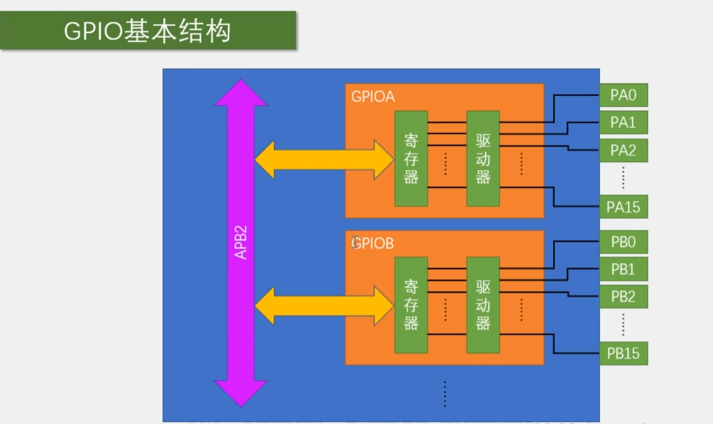

寄存器均为32位，由于只有0~15共16个引脚，因此只使用低16位

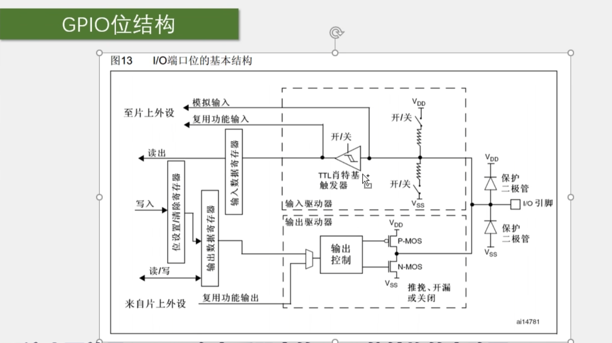

**输入模式**：

$V_{DD}$ 接3.3V，$V_{SS}$ 接0V，与两个保护二极管配合实现输入电压的限制。当输入电压大于3.3V时，上方的保护二极管导通，电流不会进入内部电路；当输入电压小于0V(相对于$V_{ss}$)时，电流从$V_{ss}$ 流出，不会从内部电路汲取电流，从而实现对内部电路的保护。

与$V_{DD}$ 相连的电阻叫上拉电阻，与$V_{SS}$ 相连的电阻叫下拉电阻，二者配合实现了引脚在不与外设相接的情况下默认输入电平的设置。当上拉开关闭合，下拉开关断开，此时处于上拉输入模式，如果引脚不与外设相接，输入为$V_{DD}$ 高电平；当上拉开关断开，下拉开关闭合，此时处于下拉输入模式，如果引脚不与外设相接，输入为$V_{SS}$ 低电平；当两个开关都断开，此时处于浮空输入模式，如果引脚不与外设相接，输入不稳定。

施密特（肖基特）触发器实现了对输入电压的整形。引脚输入虽然为数字信号，实际情况下可能产生失真。

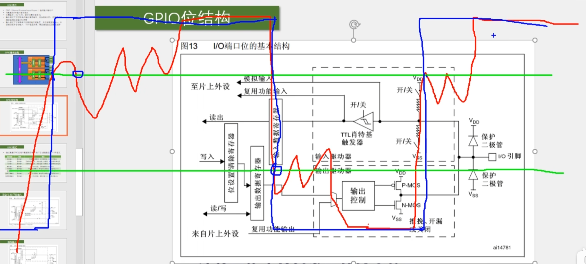

模拟输入与ADC相连，输入模拟信号。复用功能输入连接到其他需要读取端口的外设，如串口的输入引脚，输入数字信号。

**输出模式**：

GPIO 通过数据选择器在输出数据寄存器和片上外设信号之间进行选择，并将选中的信号送入输出控制电路。

位设置/清除寄存器的作用是单独修改输出数据寄存器中的某一位而不影响其他位(`GPIO_SetBits()`、`GPIO_ResetBits()`)，避免了将输出数据寄存器中的输出读出、修改再写回的复杂操作。

数据选择器的工作原理

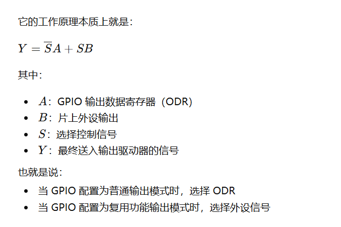

输出控制通过控制PMOS和NMOS是否工作实现推挽输出、开漏输出。

PMOS负责“拉高”， NMOS负责"拉低"。

**推挽输出**：PMOS和NMOS都启用。如果内部电路输出1，PMOS导通，NMOS关闭，引脚连接到$V_{DD}$ ，输出高电平；如果内部电路输出0，PMOS关闭，NMOS导通，引脚连接到 $V_{SS}$ 输出低电平。

**开漏输出**：PMOS被禁用，NMOS启用。如果内部电路输出1，NMOS关闭，引脚处于悬空(高阻态)；如果内部电路输出0，NMOS导通，引脚连接到$V_{DD}$ 输出低电平。

开漏输出可以作为通信协议的驱动方式，例如$I^2C$ 通信的引脚就使用开漏模式。开漏输出可以配合IO口外接的上拉电阻实现输出5V高电压。当在IO口新增一个与$V_{DD}=5V$ 相连的电阻，此时开漏输出模式下，如果内部电路输出1，则IO口的输出由$V_{DD}$ 提供，为5V。

**关闭**：当引脚配置为输入模式时，PMOS和NMOS都被禁用，输出关闭，确保IO口电平由外部信号控制。

GPIO共有以下8种模式

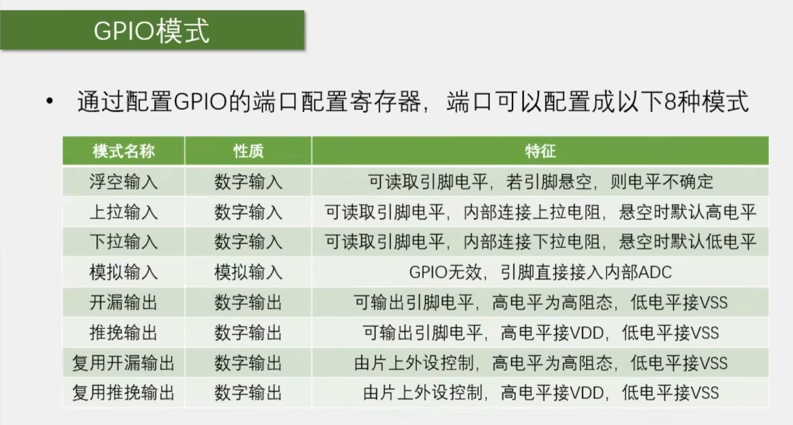

**浮空/上拉/下拉输入电路结构**：

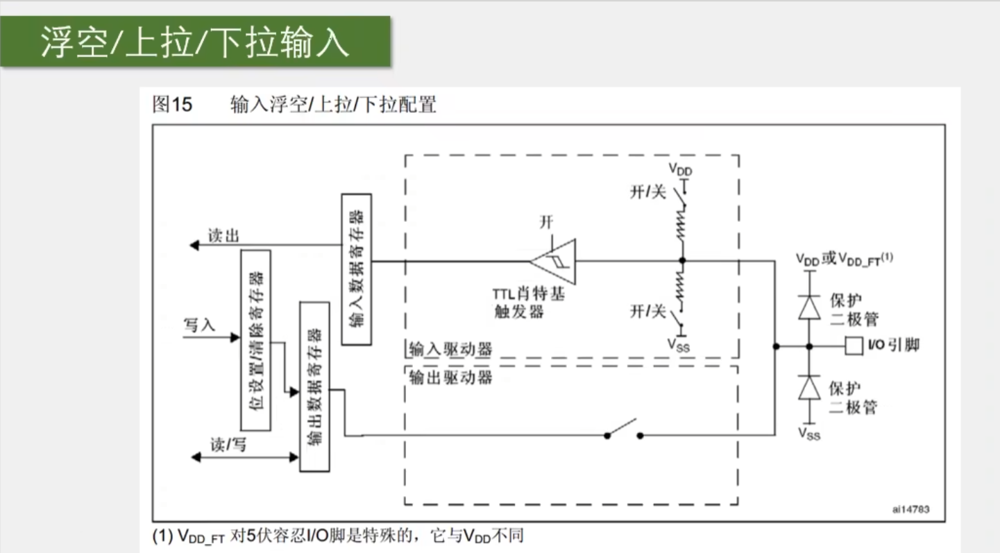

**模拟输入电路结构**：

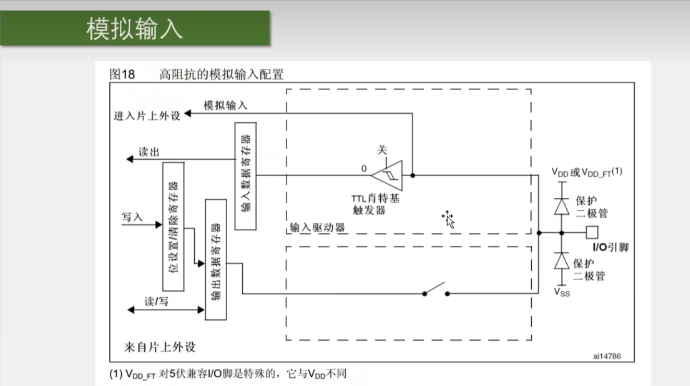

**开漏/推挽输出电路结构**：

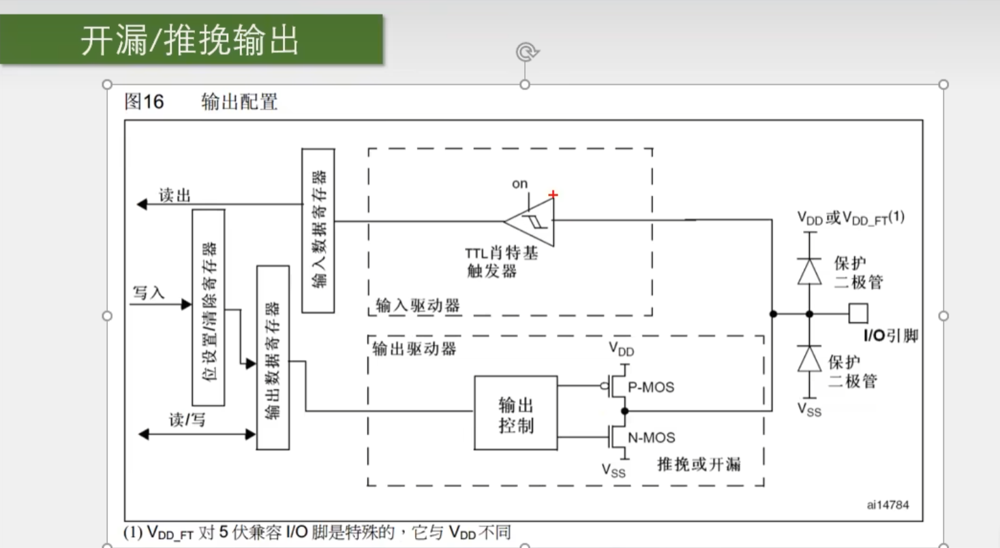

**复用开漏/推挽输出电路结构**：

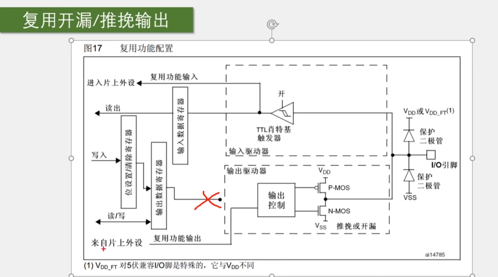

很多单片机或芯片都使用了**高电平弱驱动，低电平强驱动**的策略，因此点亮LED时经常设置LED点亮方式为低电平点亮。

## GPIO相关函数

`keilkill.bat`可以清除项目编译产生的中间文件，减小项目体积

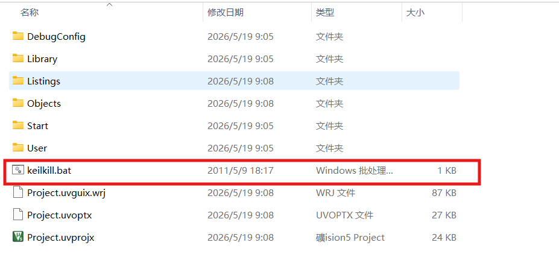

STM32外设总线架构图

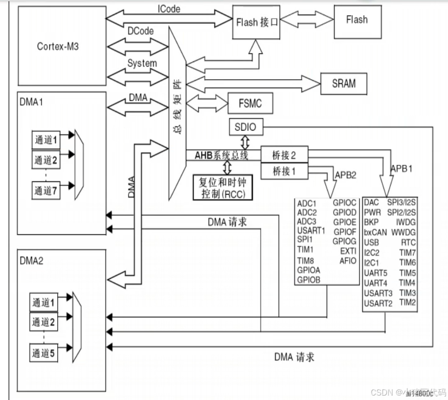

STM32采用分层总线结构，有AHB，AHB1，AHB2三条总线，不同总线与不同速度的外设相连，速度：$AHB > AHB2 > AHB1$ 。这里的速度指的是频率，速度越高，频率越高。

三条总线与外设的连接情况：

- AHB总线：Flash存储器，DMA，RCC(Reset and Clock Control)，CRC，以太网，SDIO...
- APB2总线：USART1，TIM1，TIM8，ADC1-3，SPI1，EXTI，复用IO:AFIO，通用IO:GPIOA-G
- APB1总线：TIM2-7，RTC，WDT看门狗，SPI2，SPI3...

`stm32f10x_rcc.h`中使用以下三个函数开启/关闭不同总线上连接的外设

```c
void RCC_AHBPeriphClockCmd(uint32_t RCC_AHBPeriph, FunctionalState NewState);
void RCC_APB2PeriphClockCmd(uint32_t RCC_APB2Periph, FunctionalState NewState);
void RCC_APB1PeriphClockCmd(uint32_t RCC_APB1Periph, FunctionalState NewState);
```

GPIO时钟使能使用RCC_APB2PeriphClockCmd

```c
	// 开启时钟
	RCC_APB2PeriphClockCmd(RCC_APB2Periph_GPIOB, ENABLE);
```

**GPIO常用函数**：

初始化函数`GPIO_Init()`使用结构体参数初始化GPIO口

```c
void GPIO_Init(GPIO_TypeDef* GPIOx, GPIO_InitTypeDef* GPIO_InitStruct);
```

以下是典型的GPIO初始化

```c
	// 初始化GPIO
	GPIO_InitTypeDef GPIO_InitStructure;
	GPIO_InitStructure.GPIO_Mode = GPIO_Mode_Out_PP;	// 推挽输出模式
	GPIO_InitStructure.GPIO_Pin = GPIO_Pin_13;
	GPIO_InitStructure.GPIO_Speed = GPIO_Speed_50MHz;	// 一般设置为50MHz
	GPIO_Init(GPIOB, &GPIO_InitStructure);
```

`GPIO_SetBits()`和`GPIO_ResetBits()`可以实现设置GPIO口输出高电平和低电平，可以同时设置多位

```c
	// 设置引脚电平
	GPIO_SetBits(GPIOB, GPIO_Pin_13);	// 设置GPIOB13号引脚为高电平
	GPIO_ResetBits(GPIOB, GPIO_Pin_13);	// 设置GPIOB13号引脚为低电平
```

`GPIO_WriteBit()`可以实现设置指定端口为高电平或低电平

```c
	GPIO_WriteBit(GPIOB, GPIO_Pin_13, Bit_SET);		// 设置GPIOB13号引脚为高电平
	GPIO_WriteBit(GPIOB, GPIO_Pin_13, Bit_RESET);	// 设置GPIOB13号引脚为低电平
```

`GPIO_Write()`可以同时设置0-15端口的电平

## LED闪烁

在工程文件夹下新建System\存放延时函数，并在Keil中添加组，元素和路径

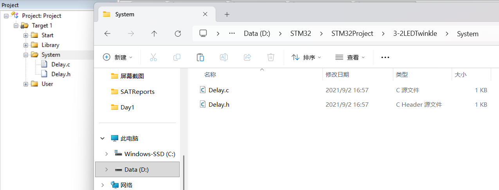

编写`main.c`并编译

```c
#include "stm32f10x.h"                  // Device header
#include "Delay.h"

int main(void)
{
	// 开启时钟
	RCC_APB2PeriphClockCmd(RCC_APB2Periph_GPIOB, ENABLE);
	
	// 初始化GPIO
	GPIO_InitTypeDef GPIO_InitStructure;
	GPIO_InitStructure.GPIO_Mode = GPIO_Mode_Out_PP;	// 推挽输出模式
	GPIO_InitStructure.GPIO_Pin = GPIO_Pin_13;
	GPIO_InitStructure.GPIO_Speed = GPIO_Speed_50MHz;	// 一般设置为50MHz
	GPIO_Init(GPIOB, &GPIO_InitStructure);

	while(1)
	{
		Delay_ms(500);
		GPIO_SetBits(GPIOB, GPIO_Pin_13);		// 13号引脚输出低电平
		Delay_ms(500);
		GPIO_ResetBits(GPIOB, GPIO_Pin_13);		// 13号引脚输出高电平
	}
}

```

打开Proteus，新建工程，添加STM32元器件并绘制电路图，编辑STM32属性，步骤与[Day1]中完全相同。开始仿真


将代码改为

```c
#include "stm32f10x.h"                  // Device header
#include "Delay.h"

int main(void)
{
	// 开启时钟
	RCC_APB2PeriphClockCmd(RCC_APB2Periph_GPIOB, ENABLE);
	
	// 初始化GPIO
	GPIO_InitTypeDef GPIO_InitStructure;
	GPIO_InitStructure.GPIO_Mode = GPIO_Mode_Out_PP;	// 推挽输出模式
	GPIO_InitStructure.GPIO_Pin = GPIO_Pin_13 | GPIO_Pin_12;
	GPIO_InitStructure.GPIO_Speed = GPIO_Speed_50MHz;	// 一般设置为50MHz
	GPIO_Init(GPIOB, &GPIO_InitStructure);

	while(1)
	{
		Delay_ms(500);
		GPIO_WriteBit(GPIOB, GPIO_Pin_13, Bit_RESET);		// 13号引脚输出低电平
		Delay_ms(500);
		GPIO_WriteBit(GPIOB, GPIO_Pin_13, Bit_SET);		// 13号引脚输出高电平
	}
}

```

这段代码同时初始化了PB12和PB13，在循环中只修改了PB13的电平，开始仿真

.gif>)

观察到LED闪烁，PB12输出低电平

以上实验中LED采用的是高电平点亮，接下来改用常见的低电平点亮方式进行实验

在元件库中搜索res，添加电阻

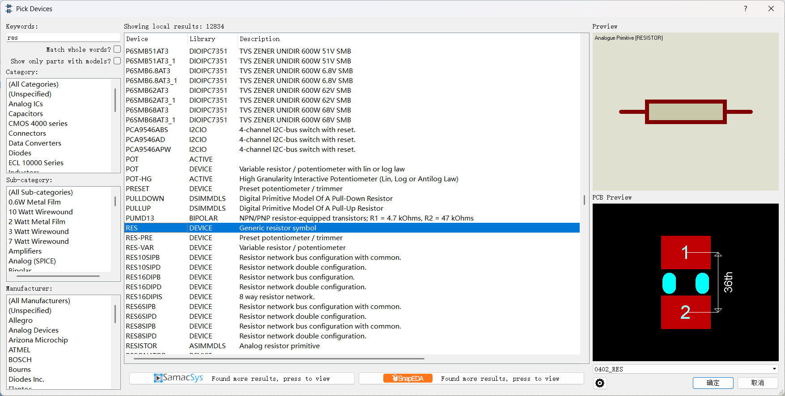

双击电阻修改电阻的阻值为330欧姆，绘制电路

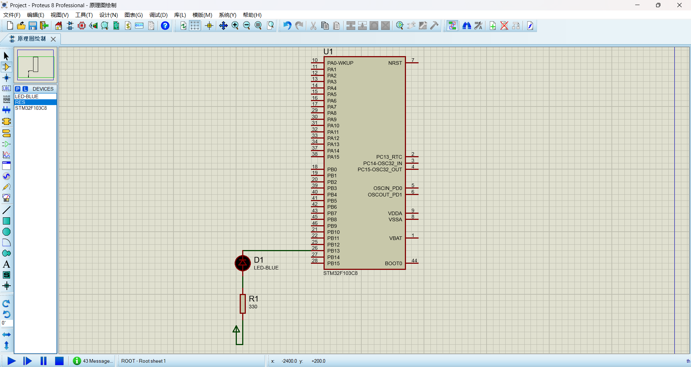

启动仿真，可以观察到PB13输出交替的高低电平，LED闪烁，PB12输出低电平

.gif>)

## 验证推挽输出和开漏输出特性

推挽输出和开漏输出的特点可以概括为：推挽输出下引脚可以输出高低电平，均具有驱动能力；开漏输出下引脚只能输出低电平和悬空，只有低电平有驱动能力。

因此，理论上来说，推挽输出下无论LED设置为高电平点亮还是低电平点亮，都能闪烁；开漏输出下LED设置为低电平点亮能闪烁，高电平点亮无法闪烁。

接下来进行验证

**推挽输出+低电平点亮**：

```c
GPIO_InitStructure.GPIO_Mode = GPIO_Mode_Out_PP;	// 推挽输出模式
```

.gif>)

**推挽输出+高电平点亮**：

```c
GPIO_InitStructure.GPIO_Mode = GPIO_Mode_Out_PP;	// 推挽输出模式
```

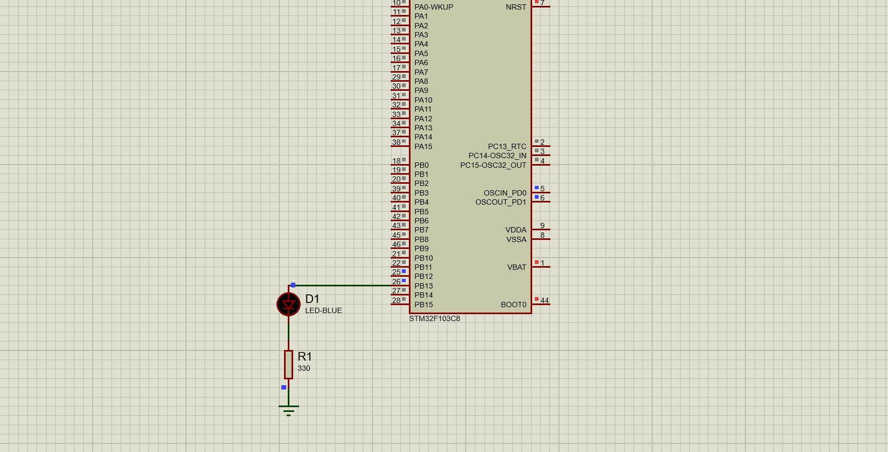

**开漏输出+低电平点亮**：

```c
GPIO_InitStructure.GPIO_Mode = GPIO_Mode_Out_OD;	// 开漏输出模式
```

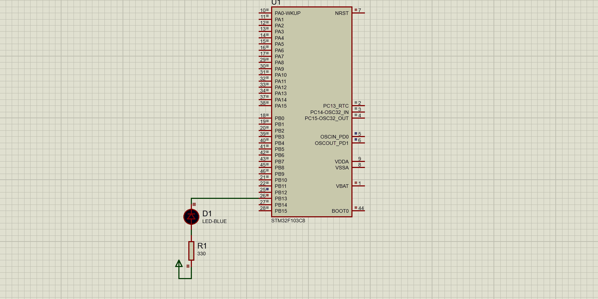

**开漏输出+高电平点亮**：（为什么还是亮？Proteus仿真缺陷？）

```c
GPIO_InitStructure.GPIO_Mode = GPIO_Mode_Out_OD;	// 开漏输出模式
```

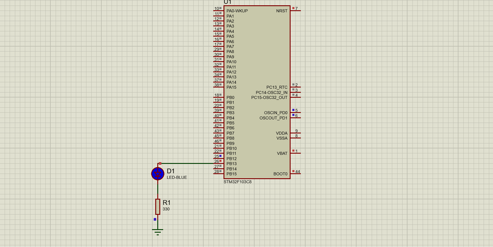

## LED流水灯

```c
#include "stm32f10x.h"                  // Device header
#include "Delay.h"

int main(void)
{
	// 开启时钟
	RCC_APB2PeriphClockCmd(RCC_APB2Periph_GPIOA, ENABLE);
	
	// 初始化GPIO
	GPIO_InitTypeDef GPIO_InitStructure;
	GPIO_InitStructure.GPIO_Mode = GPIO_Mode_Out_PP;	// 推挽输出模式
	GPIO_InitStructure.GPIO_Pin = GPIO_Pin_0 | GPIO_Pin_1 | GPIO_Pin_2 | GPIO_Pin_3 | GPIO_Pin_4 | GPIO_Pin_5;
	GPIO_InitStructure.GPIO_Speed = GPIO_Speed_50MHz;	// 一般设置为50MHz
	GPIO_Init(GPIOA, &GPIO_InitStructure);
	
	// 先设置所有引脚输出高电平，所有LED熄灭
	GPIO_WriteBit(GPIOA, GPIO_Pin_0, Bit_SET);
	GPIO_WriteBit(GPIOA, GPIO_Pin_1, Bit_SET);
	GPIO_WriteBit(GPIOA, GPIO_Pin_2, Bit_SET);
	GPIO_WriteBit(GPIOA, GPIO_Pin_3, Bit_SET);
	GPIO_WriteBit(GPIOA, GPIO_Pin_4, Bit_SET);
	GPIO_WriteBit(GPIOA, GPIO_Pin_5, Bit_SET);

	while(1)
	{
		Delay_ms(500);
		GPIO_WriteBit(GPIOA, GPIO_Pin_5, Bit_SET);
		GPIO_WriteBit(GPIOA, GPIO_Pin_0, Bit_RESET);		
		Delay_ms(500);
		GPIO_WriteBit(GPIOA, GPIO_Pin_0, Bit_SET);
		GPIO_WriteBit(GPIOA, GPIO_Pin_1, Bit_RESET);	
		Delay_ms(500);
		GPIO_WriteBit(GPIOA, GPIO_Pin_1, Bit_SET);
		GPIO_WriteBit(GPIOA, GPIO_Pin_2, Bit_RESET);
		Delay_ms(500);
		GPIO_WriteBit(GPIOA, GPIO_Pin_2, Bit_SET);
		GPIO_WriteBit(GPIOA, GPIO_Pin_3, Bit_RESET);
		Delay_ms(500);
		GPIO_WriteBit(GPIOA, GPIO_Pin_3, Bit_SET);
		GPIO_WriteBit(GPIOA, GPIO_Pin_4, Bit_RESET);
		Delay_ms(500);
		GPIO_WriteBit(GPIOA, GPIO_Pin_4, Bit_SET);
		GPIO_WriteBit(GPIOA, GPIO_Pin_5, Bit_RESET);
	}
}

```

现象

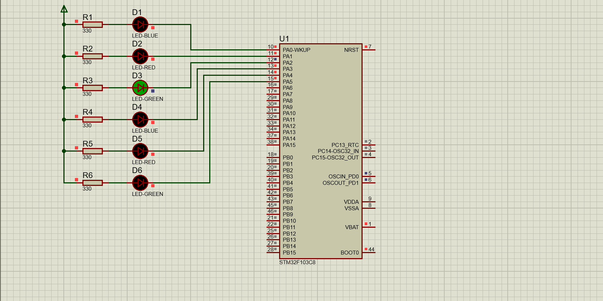

## 蜂鸣器

固件库查找蜂鸣器，选择Active类型的有源蜂鸣器，有源蜂鸣器与无源蜂鸣器的区别：

- 有源蜂鸣器只要两端有电势差就会响，发出固定频率的声音
- 无源蜂鸣器只有提供方波才会响，可以发出不同频率的声音

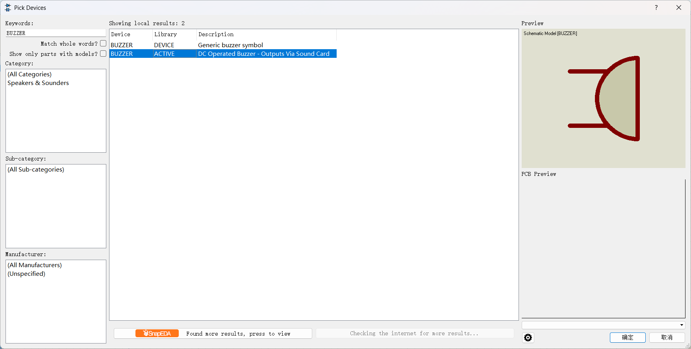

注意要修改有源蜂鸣器的工作电压为3.3V

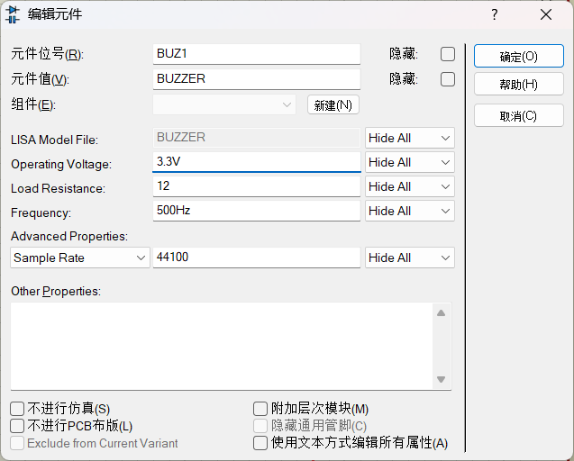

代码

```c
#include "stm32f10x.h"                  // Device header
#include "Delay.h"

int main(void)
{
	// 开启时钟
	RCC_APB2PeriphClockCmd(RCC_APB2Periph_GPIOB, ENABLE);
	
	// 初始化GPIO
	GPIO_InitTypeDef GPIO_InitStructure;
	GPIO_InitStructure.GPIO_Mode = GPIO_Mode_Out_PP;	// 推挽输出模式
	GPIO_InitStructure.GPIO_Pin = GPIO_Pin_12;
	GPIO_InitStructure.GPIO_Speed = GPIO_Speed_50MHz;	// 一般设置为50MHz
	GPIO_Init(GPIOB, &GPIO_InitStructure);

	while(1)
	{
		Delay_ms(500);
		GPIO_WriteBit(GPIOB, GPIO_Pin_12, Bit_RESET);		
		Delay_ms(500);
		GPIO_WriteBit(GPIOB, GPIO_Pin_12, Bit_SET);		
	}
}

```

绘制电路

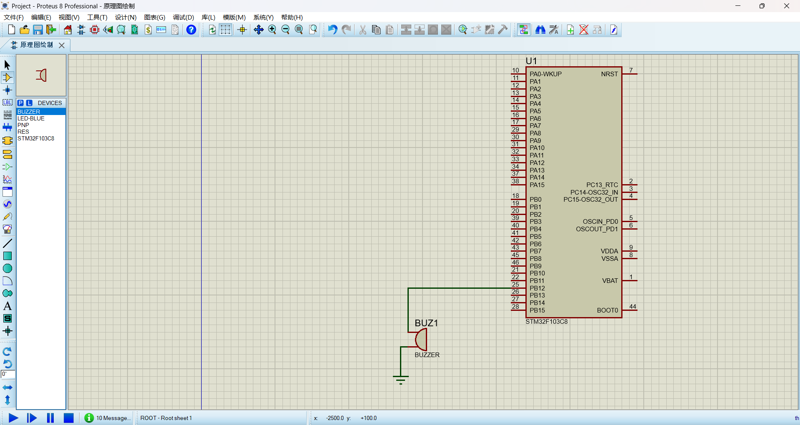

运行仿真蜂鸣器不响，查阅资料发现可能是输出电压不够？蜂鸣器需要与三极管配合使用，引脚输出逻辑控制信号控制三极管是否接通，三极管导通后由电源正负极负责对蜂鸣器供电


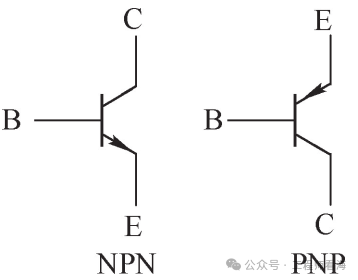

三极管结构：B = Base(基极)，C = Collector(集电极)，E = Emitter(发射极)。箭头所指的方向是三极管导通时电流的方向。

**PNP和NPN的最大区别**：基极为电平时，PNP导通；基极为高电平时，PNP断开。NPN与之相反。

固件库搜索PNP,选择DEVICE类型的器件

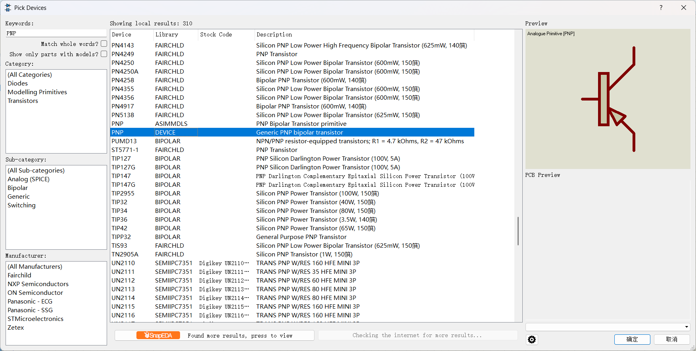

绘制电路如图，连接顺序为 VCC -> 发射极 -> 集线极 -> GND，PB12 -> 基极作控制信号。运行仿真后，蜂鸣器交替发声。

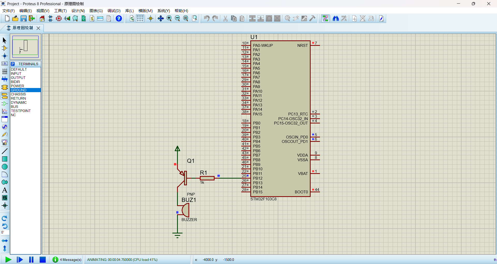

使用NPN型三极管同样可以实现蜂鸣器交替发声。

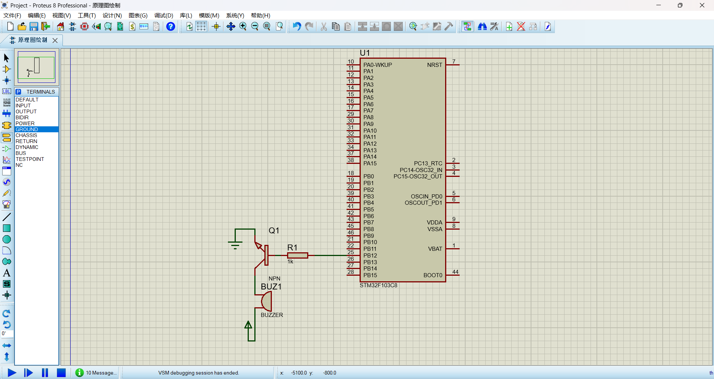
