# [STM32]Day3

## 器件介绍

### 按键

案件是常见的输入设备，按下导通，松开断开。由于按键内部使用机械式弹簧片进行通断，所以在按下和松开的瞬间会有抖动。可以通过延时对抖动进行过滤。

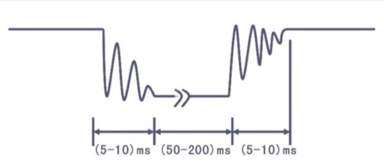

### 传感器

传感器元件（光敏电阻/热敏电阻/红外接收管等）的电阻会随外界模拟量的变化而变化，通过与定值电阻分压即可能到模拟电压输出，再通过电压比较器进行二值化可以得到数字电压输出。

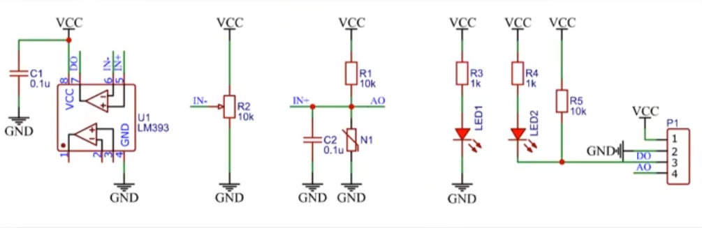

一段接在电路中，一段连接GND的电容是滤波电容，用于保持电路稳定，在电路分析时可以暂时不考虑。

分析图3：定值电阻R1为上拉电阻，可变电阻N1是下拉电阻。当N1变小时，下拉作用增强，输出的电压AO减小，当N1=0时，AO=0；当N1变大时，下拉作用减弱，上拉作用相对增强，输出电压AO增大，当N1为无穷时，下方电路断路，AO=VCC

## 硬件电路

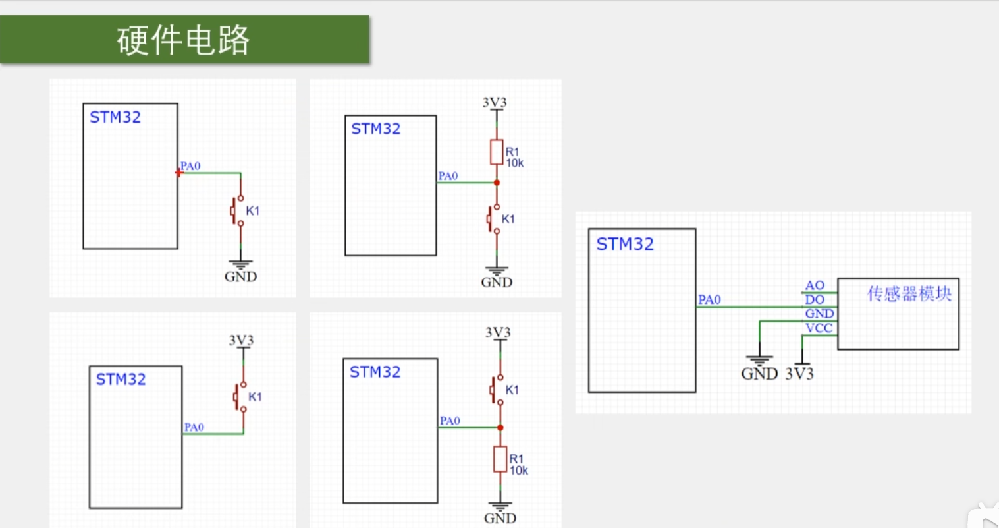

按键有四种连接方式，上方两个为下接按键，按下按键PA0口输入低电平；下方两个为上接按键，按下按键后PA0输入高电平。实际电路中多使用下接方式。带有上拉电阻的下接方式实现了PA0输入值默认值的设定，默认输入高电平，避免了引脚处于浮空状态。

如果不使用上拉电阻，上接按键必须使用上拉输入模式，确保引脚浮空时输入高电平(与按键按下时输入的电平相反)。

类似的，下方两个为上接按键，按下按键PA0输入高电平；带有下拉电阻的上接方式实现了PA0默认输入低电平，避免了引脚浮空。如果不使用下拉电阻，上接按键必须使用下拉输入模式。

## C语言知识

### 数据类型

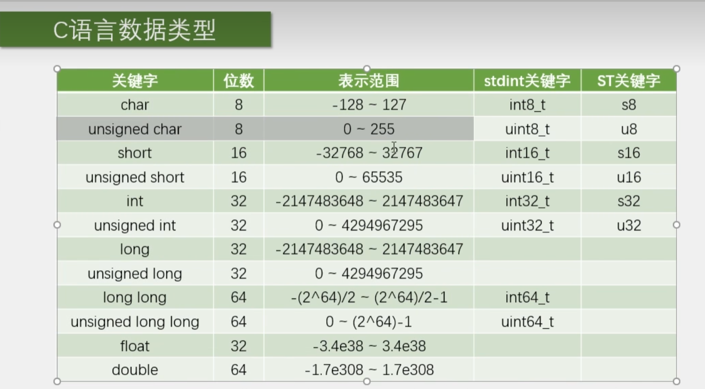

### 宏定义与typedef

宏定义用于给任何数据换名字，typedef用于给变量名换名字

```c
#define PI 3.14
typedef usigned char uint8_t;
```

### C语言结构体

关键字：`struct`，用于将不同类型的数据打包

定义结构体变量

```c
struct{char x; int y; float z;} a;
```

`struct` 配合 `typedef` 使用可以避免每次定义结构体变量时都要写出结构体中包含哪些类型的成员

```c
typedef struct{char x; int y; float z;} StructName;

StructName a;
StructName b;
...

// 两种引用方式
a.x = 'X';
(&a) -> y = 10;		// -> 前必须是指向结构体的指针
```

### 枚举

关键字：`enum`，用于定义一个取值受限制的整型变量

定义整型变量

```c
enum{FALSE = 0, TRUE = 1} EnumName;
```

引用枚举成员

```c
EnumName = FALSE;
EnumName = TRUE;
```

## 按键控制LED

新建Hardware/存放硬件（LED，按键）的驱动文件，包括初始化、打开/关闭等，并在Keil中更新组，包含路径。

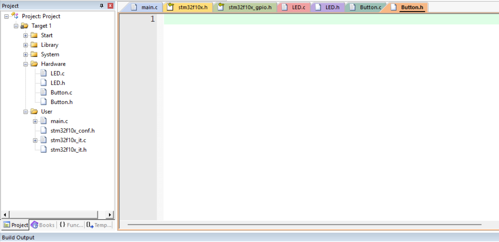

在两个.c文件开头包含头文件`stm32f10x.h`

```c
#include "stm32f10x.h"                  // Device header
```

在.h文件分别写入，防止头文件被重复包含

```c
#ifndef __LED_H
#define __LED_H

#endif

#ifndef __Button_H
#define __Button_H

#endif

```

编写LED驱动代码

```c
// LED.c
#include "stm32f10x.h"                  // Device header

typedef enum{Pin_1 = 1, Pin_2 = 2} LED_ID;

void LED_Init(void)
{
	// 开启时钟
	RCC_APB2PeriphClockCmd(RCC_APB2Periph_GPIOA, ENABLE);
	
	GPIO_InitTypeDef GPIO_InitStructure;
	GPIO_InitStructure.GPIO_Mode = GPIO_Mode_Out_PP;	// 推挽输出模式
	GPIO_InitStructure.GPIO_Pin = GPIO_Pin_1 | GPIO_Pin_2;
	GPIO_InitStructure.GPIO_Speed = GPIO_Speed_50MHz;
	GPIO_Init(GPIOA, &GPIO_InitStructure);
	
	// 设置为高电平确保初始化完成LED灭
	GPIO_SetBits(GPIOA, GPIO_Pin_1 | GPIO_Pin_2);
}

void LED_On(LED_ID id)
{
	if(id == Pin_1) {
		GPIO_ResetBits(GPIOA, GPIO_Pin_1);
	} else if(id == Pin_2) {
		GPIO_ResetBits(GPIOA, GPIO_Pin_2);
	}
}

void LED_Off(LED_ID id)
{
	if(id == Pin_1) {
		GPIO_SetBits(GPIOA, GPIO_Pin_1);
	} else if(id == Pin_2) {
		GPIO_SetBits(GPIOA, GPIO_Pin_2);
	}
}

void LED_Switch(LED_ID id)
{
	if(id == Pin_1) {
        // 使用了GPIO_ReadOutputDataBit()读取输出模式下引脚电平，用来判断LED此时亮还是灭
		if(GPIO_ReadOutputDataBit(GPIOA, GPIO_Pin_1) == 0) {
			LED_Off(Pin_1);
		} else {
			LED_On(Pin_1);
		}
	} else if(id == Pin_2) {
		if(GPIO_ReadOutputDataBit(GPIOA, GPIO_Pin_2) == 0) {
			LED_Off(Pin_2);
		} else {
			LED_On(Pin_2);
		}
	}
}

// LED.h
#ifndef __LED_H
#define __LED_H

typedef enum{Pin_1 = 1, Pin_2 = 2} LED_ID;

void LED_Init(void);
void LED_On(LED_ID id);
void LED_Off(LED_ID id);
void LED_Switch(LED_ID id);

#endif

```

以上代码通过`typedef enum{Pin_1 = 1, Pin_2 = 2} LED_ID;`实现了对LED_ID的限制，如果传入错误的LED_ID，编译器会报错

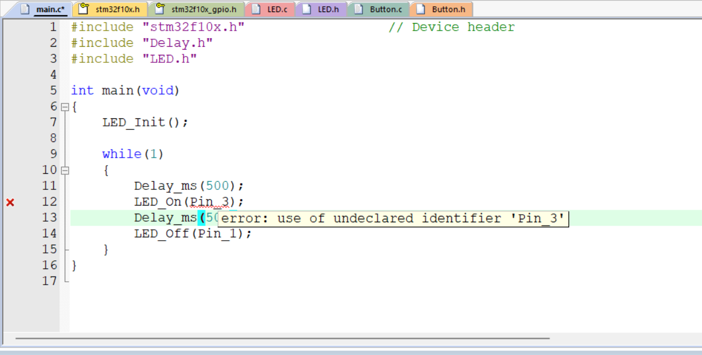

将上述Pin_3改为Pin_1后，可在Proteus中验证LED驱动代码是否正确。

GPIO读取输入值的函数

```c
uint8_t GPIO_ReadInputDataBit(GPIO_TypeDef* GPIOx, uint16_t GPIO_Pin);
uint16_t GPIO_ReadInputData(GPIO_TypeDef* GPIOx);
```

编写Button驱动代码

```c
// Button.c
#include "stm32f10x.h"                  // Device header
#include "Delay.h"

typedef enum{Pin_11 = 11, Pin_12 = 12} Button_ID;

void Button_Init(void)
{
	// 开启时钟
	RCC_APB2PeriphClockCmd(RCC_APB2Periph_GPIOB, ENABLE);
	
	GPIO_InitTypeDef GPIO_InitStructure;
	GPIO_InitStructure.GPIO_Mode = GPIO_Mode_IPU;	// 上拉输入模式，可以避免配置上拉电阻
	GPIO_InitStructure.GPIO_Pin = GPIO_Pin_11 | GPIO_Pin_12;
	GPIO_InitStructure.GPIO_Speed = GPIO_Speed_50MHz;
	GPIO_Init(GPIOB,&GPIO_InitStructure);
	
}

// 读取GPIO_Pin_id引脚的按键动作，返回1说明该按键完成了一次“按下->释放”
uint8_t Button_Read(Button_ID id)
{
	uint8_t buttonVal = 0;
	
	if(id == Pin_11) {
        // 使用GPIO_ReadInputDataBit()读取输入模式下引脚的输入电平，判断开关处于断开还是关闭状态
		if(GPIO_ReadInputDataBit(GPIOB, GPIO_Pin_11) == 0) {
			Delay_ms(20);
			while(GPIO_ReadInputDataBit(GPIOB, GPIO_Pin_11) == 0);		// 按键按下未释放
			Delay_ms(20);
			buttonVal = 1;
		}
	} else if(id == Pin_12) {
		if(GPIO_ReadInputDataBit(GPIOB, GPIO_Pin_12) == 0) {
			Delay_ms(20);
			while(GPIO_ReadInputDataBit(GPIOB, GPIO_Pin_12) == 0);		// 按键按下未释放
			Delay_ms(20);
			buttonVal = 1;
		}
	}
	
	return buttonVal;
}

// Button.h
#ifndef __Button_H
#define __Button_H

typedef enum{Pin_11 = 11, Pin_12 = 12} Button_ID;

void Button_Init(void);
uint8_t Button_Read(Button_ID id);

#endif

```

编写`main.c`实现按键对两个LED的独立控制

```c
// main.c
#include "stm32f10x.h"                  // Device header
#include "Delay.h"
#include "LED.h"
#include "Button.h"

int main(void)
{
	LED_Init();
	Button_Init();

	while(1)
	{
		if(Button_Read(Pin_11) == 1) {
			LED_Switch(Pin_1);
		}
		if(Button_Read(Pin_12) == 1) {
			LED_Switch(Pin_2);
		}
	}
}

```

在Proteus中选择元件，在元件库中搜索"BUTTON"，其他元件在之前的实验已经添加过

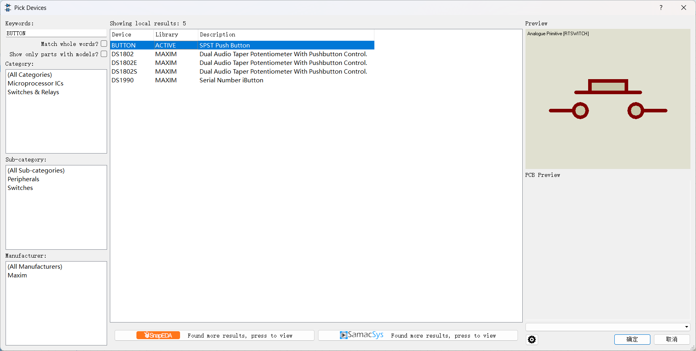

绘制电路图并进行仿真，观察到实现了对两个LED的独立控制，只有当按键按下并释放后，LED的状态才会切换。

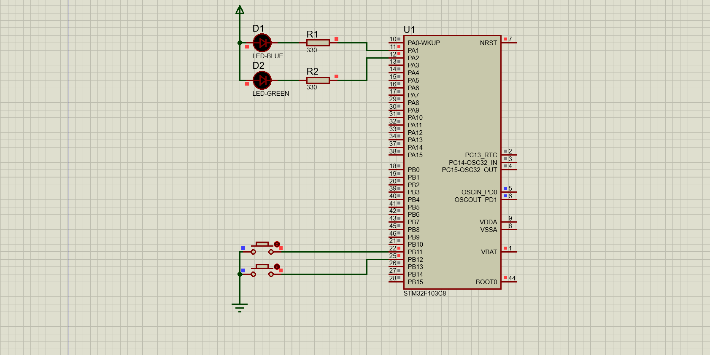

## 光敏传感器控制蜂鸣器

光敏电阻特性：光照强度低时阻值大，光照强度增大，阻值减小

光敏传感器特性：供电后光照强度小时输出高电平，光照强度大时输出低电平（注意这里的输出是相对光敏传感器而言）

效果：实现光敏传感器遮光蜂鸣器发声，照光不发声

仍然采用模块化编程的思想，在Hardware/下实现蜂鸣器Buzzer和光敏传感器LDR的驱动代码

```c
// Buzzer.c
#include "stm32f10x.h"                  // Device header

void Buzzer_Init(void) 
{
	// 开启时钟
	RCC_APB2PeriphClockCmd(RCC_APB2Periph_GPIOB, ENABLE);
	
	GPIO_InitTypeDef GPIO_InitStructure;
	GPIO_InitStructure.GPIO_Mode = GPIO_Mode_Out_PP;
	GPIO_InitStructure.GPIO_Pin = GPIO_Pin_12;
	GPIO_InitStructure.GPIO_Speed = GPIO_Speed_50MHz;
	GPIO_Init(GPIOB, &GPIO_InitStructure);
}

void Buzzer_On(void) 
{
	GPIO_ResetBits(GPIOB, GPIO_Pin_12);
}

void Buzzer_Off(void) 
{
	GPIO_SetBits(GPIOB, GPIO_Pin_12);
}

// Buzzer.h
#ifndef __Buzzer_H
#define __Buzzer_H

void Buzzer_Init(void);
void Buzzer_On(void);
void Buzzer_Off(void); 

#endif

// LDR.c
#include "stm32f10x.h"                  // Device header
#include "Delay.h"

void LDR_Init(void)
{
	RCC_APB2PeriphClockCmd(RCC_APB2Periph_GPIOB, ENABLE);
	
	GPIO_InitTypeDef GPIO_InitStructure;
	GPIO_InitStructure.GPIO_Mode = GPIO_Mode_IN_FLOATING;	// 浮空输入模式
	GPIO_InitStructure.GPIO_Pin = GPIO_Pin_13;
	GPIO_InitStructure.GPIO_Speed = GPIO_Speed_50MHz;
	GPIO_Init(GPIOB, &GPIO_InitStructure);
}

// 返回值为1说明光照弱，返回值为0说明光照强
uint8_t LDR_Read(void)
{
	return GPIO_ReadInputDataBit(GPIOB, GPIO_Pin_13);
}

// LDR.h
#ifndef __LDR_H
#define __LDR_H

void LDR_Init(void);
uint8_t LDR_Read(void);

#endif

```

实验电路图：

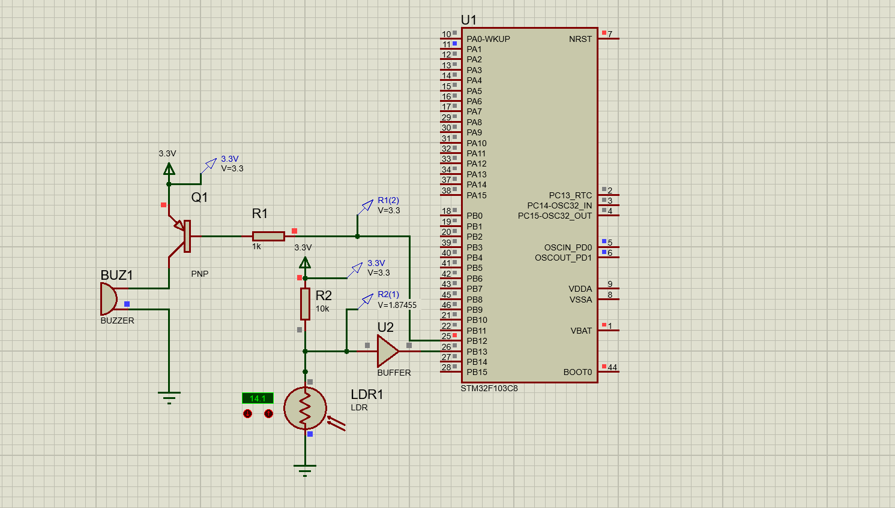

### 注意事项1：修改供电电压为3.3V

“设计 -> 配置供电网”，选择名称VCC/VDD，设置电压为3.3V，STM32F103C8工作电压0-3.3V

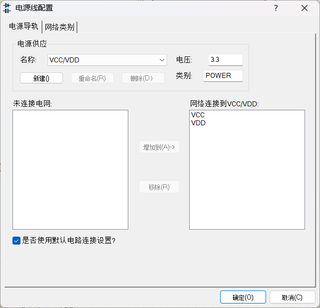

### 注意事项2：电压探针的使用

左侧菜单列选择探针模式，可以选择电压探针（电路图中蓝色箭头符号），可以测量电路中某个位置的电压。去掉不影响电路，只是为了排查使用。

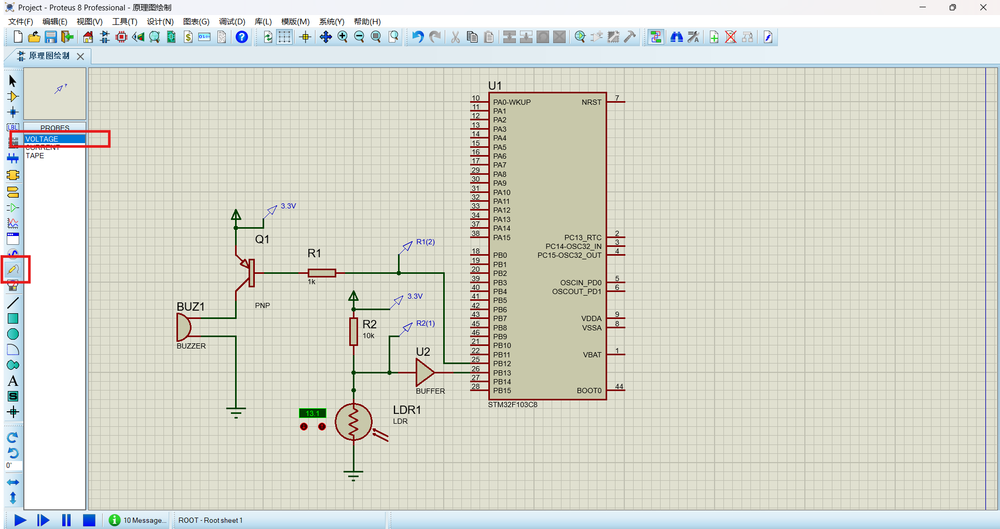

### 注意事项3：蜂鸣器的选择、设置和连接

元件库搜索BUZZER，注意选择类型为ACTIVE的蜂鸣器。原因之前已经介绍过，ACTIVE类型为有源蜂鸣器，通电即可发声；DEVICE类型为无源蜂鸣器，需要输入方波才能发生。

在电路中连接蜂鸣器后，要设置蜂鸣器工作电压为3.3V，而不是默认的12V。

### 注意事项4：光敏电阻的接法

光敏电阻一定要选择代友上拉电阻的下接法或者带有下拉电阻的上接法！这是为了设置PB13口的输入模式为浮空输入，如果设置输入模式为上拉输入，PB13会一直输入高电平导致实验失败；反之如果设置下拉输入，PB13会一直输入低电平同样导致实验失败

### 注意事项5：缓冲器

元件库搜索BUFFER添加缓冲器并将其按电路图所示连接。缓冲器的作用是进行二值化，即输入电压大于某一阈值时输出高电平，反之输出低电平

如果不适用缓冲器进行二值化会导致实验失败：PB13输入高电平但是PB12仍然输出高电平，蜂鸣器不发声

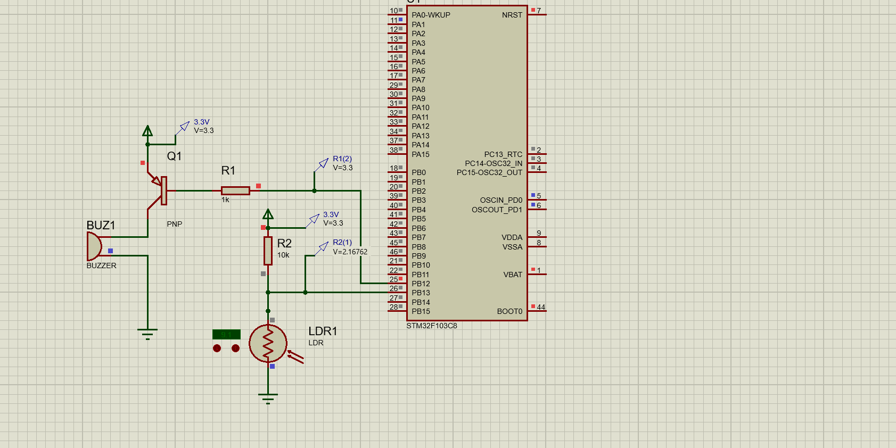

### 实验现象

降低光照强度模拟遮光后，PB13输入高电平，PB12输出低电平，蜂鸣器发声；光照强度增大模拟照光后，蜂鸣器停止发声

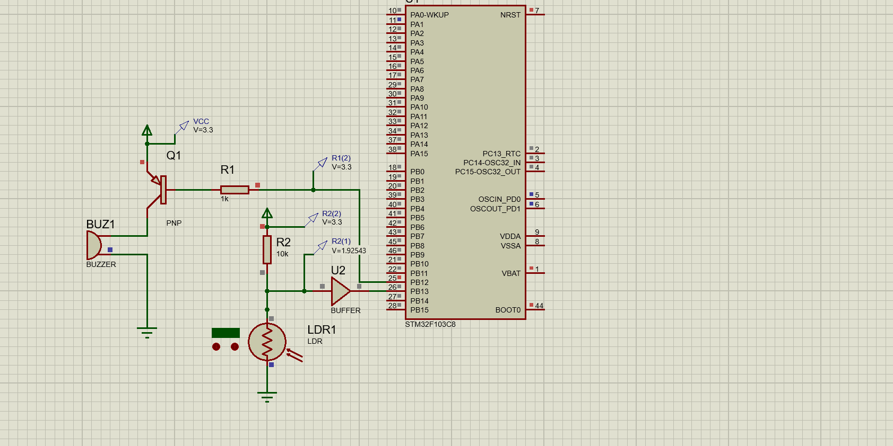
