# [STM32]Day4

## OLED

OLED(Organic Light Emitting Diode)，供电3-5.5V，通信协议I2C/SPI，分辨率128*64

**调试方式**：

- 串口调试：通过串口通信，将调试信息发送到电脑端，电脑使用串口助手显示调试信息
- 显示屏调试：直接将显示屏连接到单片机，将调试信息打印在显示屏上
- Keil调试模式：借助Keil软件的调试功能，进行单步调试、断电设置，查看寄存器及变量

OLED电路

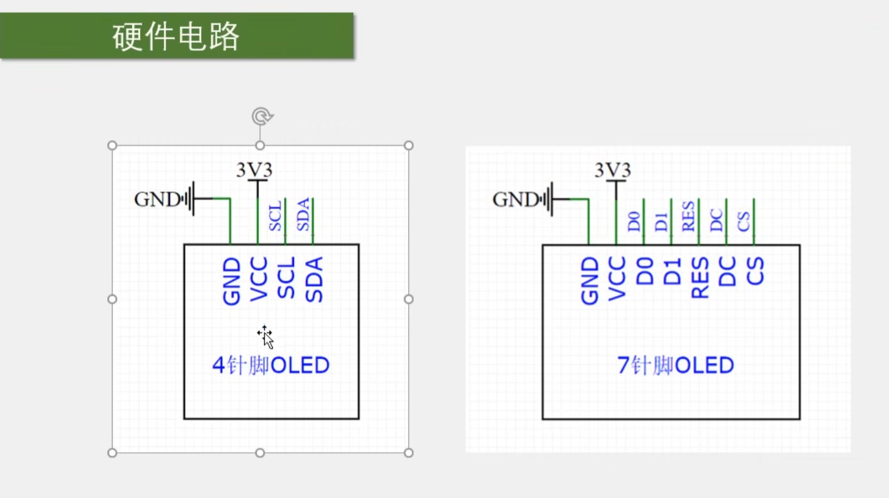

OLED驱动代码提供的方法

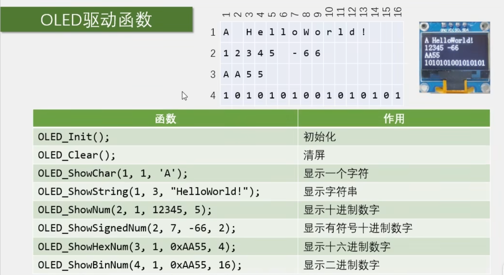

## OLED驱动代码

OLED驱动代码包括OLED.c，OLED.h，OLED_Font.h，其中可能需要修改的是OLED.c中关于SCL和SDA引脚的设置

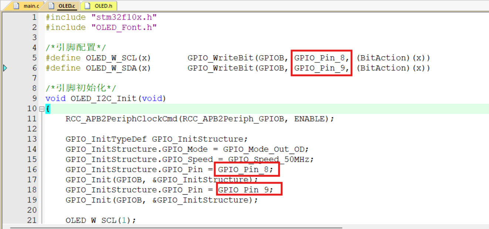

## 在Proteus中使用这些函数

编写`main.c`

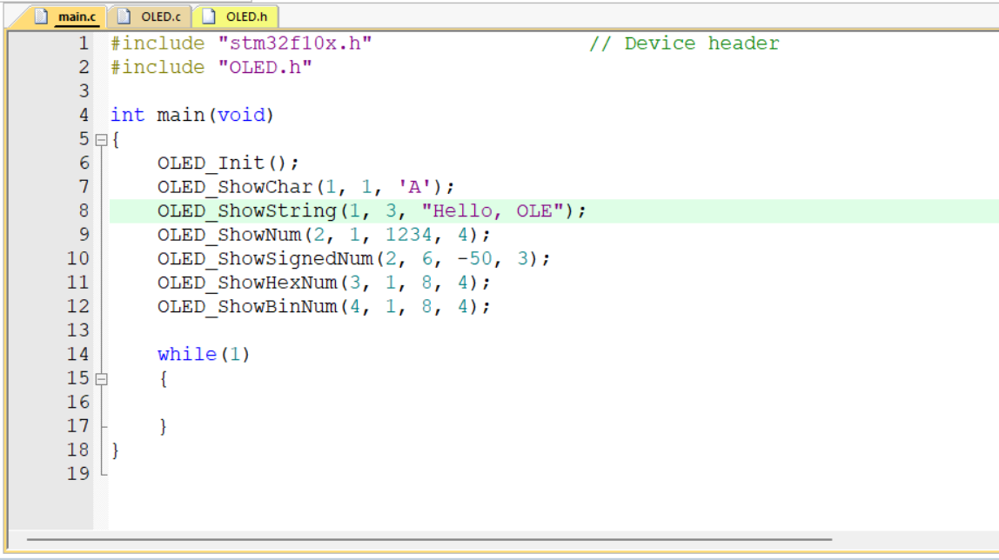

四阵脚OLED显示屏在Proteus元件库中的名称为OLED 12864I2C，添加该元件并供电，SCL接PB8，SDA接PB9

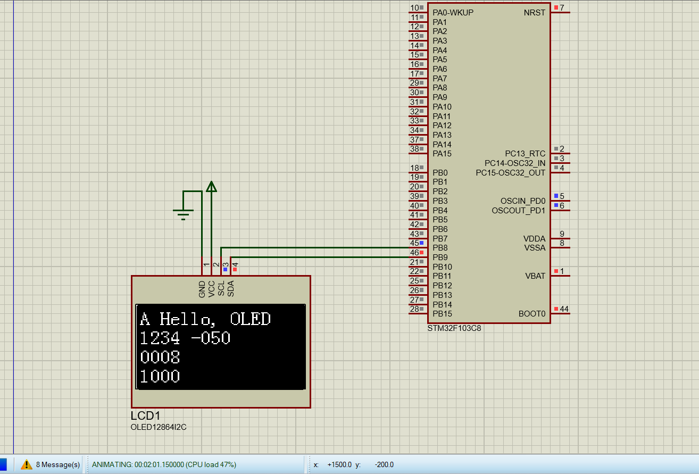

观察到OLED能正确显示，但是有一些警告

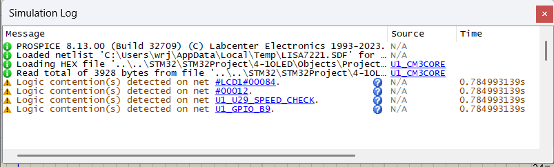

原因是I2C的SDA/SCL没有上拉电阻，增加上拉电阻后重新仿真

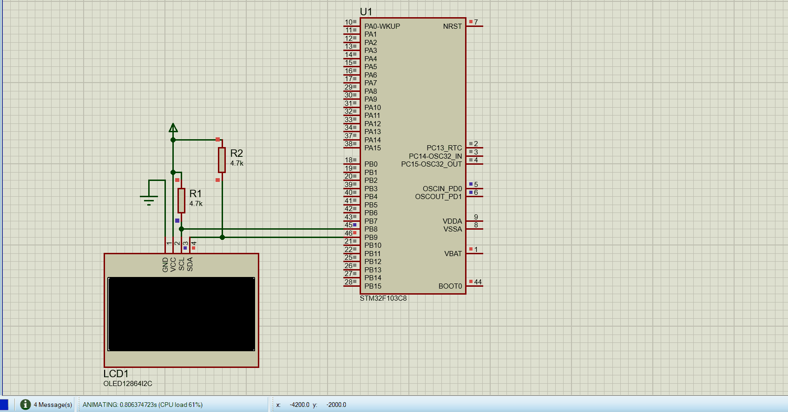

可以观察到需要很长时间才开始逐个显示字符，而不是像没有上拉电阻时快速打印出所有字符。之前的警告消失但是出现了新的警告

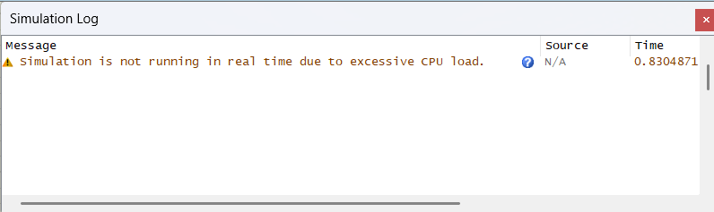

原因可能是OLED是“软件模拟I2C，而不是硬件I2C”。`OLED.c`中使用PB8/PB9手动拉高拉低模拟I2C，`OLED_I2C_SendByte()`里每发送一个1bit都要操作SCL/SDA。

## I2C

I2C是一种两根线的通信方式，使用两根信号线SCL(时钟线，Serial Clock)，SDA(数据线，Serial Date)。

> 在计算机科学里，大部分复杂的问题都可以通过分层来简化。如芯片被分为内核层和片上外设；STM32标准库则是在寄存器与用户代码之间的软件层。 对于通讯协议，我们也以分层的方式来理解，最基本的是把它分为物理层和协议层。物理层规定通讯系统中具有机械、电子功能部分的特性， 确保原始数据在物理媒体的传输。协议层主要规定通讯逻辑，统一收发双方的数据打包、解包标准。 简单来说物理层规定我们用嘴巴还是用肢体来交流，协议层则规定我们用中文还是英文来交流。

### I2C物理层

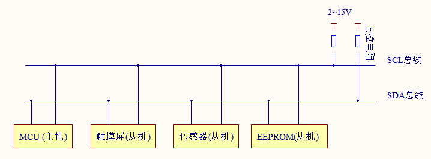

I2C通讯设备之间的常用连接方式如图。其特点为：

1. 是一个支持设备的总线。”总线“指多个设备公用的信号线。在一个I2C通讯总线中，可以连接多个I2C通讯设备，支持多个通讯主机以及多个通讯从机。
2. 一个I2C总线只是用两条总线线路，一条双向串行数据线SDA，一条串行时钟线SCL。数据线用来表示收发的数据，时钟线用于数据收发同步。
3. 每个连接到总线的设备都有独立的地址，供主机访问。
4. 总线通过上拉电阻连接到电源。当I2C设备空闲时，会输出高阻态，当所有设备均空闲时，都输出高阻态，此时由上拉电阻将总线拉到高电平。
5. 多个**主机**使用总线时，通过仲裁方式决定那个设备占用总线。
6. 有三种传输模式：标准模式传输速度100kbit/s，快速模式传输速度400kbit/s，高速模式传输速度3.4Mbit/s，但目前大多数I2C设备不支持高速模式。
7. 连接到相同总线的 IC 数量受到总线的最大电容 400pF 限制。由于I2C的SDA，SCL都是开漏输出模式，器件智能主动拉低电平，低电平到高电平依靠上拉电阻拉高。如果IC(Intergrated Circuit，集成电路，可以理解为外设里的芯片)数量多，电容增大，会使低电平到高电平的跳变变慢。

### I2C协议层

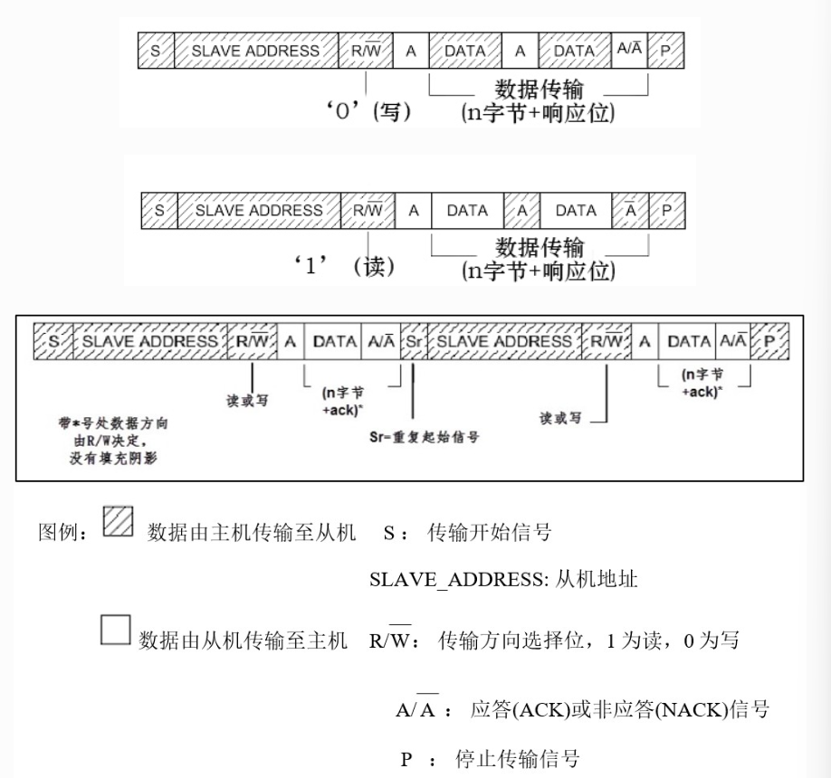

**主机从机进行I2C通信时SDA上的数据包序列：**

主机想要个从机进行通信时，先在SDA上发送一个起始信号S，这个信号会被所有从机接收。接下来从机等待主机发送**从机地址+读写信号**并与自身地址比较，如果地址不同，该从机忽略之后的SDA上信号；如果相同，表明该设备被选中，进入通信，从机会在第9个时钟周期拉低SDA，即应答信号ACK。从机地址SLAVE_ADDRESS可以为7位或10位。读写控制位R/W，0为写，1为读。

#### 写数据

如果R/W为0，表示主机要向从机写数据。在接收到应答信号ACK后，主机开始正式向从机写数据DATA，数据包的大小为8位。主机每发送完一个字节，都要等待从机的应答信号ACK，重复这个过程，可以不断向从机写数据直到所有数据都已写完。数据传输完成后，主机向从机发送一个停止信号P，结束本次通信。

#### 读数据

如果R/W为1，表示主机要从从机读数据。在接收到应答信号ACK后，主机开始从从机接收数据DATA，数据包大小同样为8位。从机每发送完一个字节，都要等待主机的应答信号ACK，重复这个过程，从机可以向主机发送N个数据包，N没有限制。当主机希望停止接收数据时，向从机发送一个非应答信号NACK，再发送一个停止信号P，表示本次通信结束。

#### 读和写数据

除了基本的读写，I2C通信更常用的是复合模式。该过程中有两次起始信号S。一般在第一次传输中，主机通过SLAVE_ADDRESS找到从机后，发送一段数据，这段数据通常用于表示该设备内部的寄存器或存储器地址；在第二次传输中，对该地址的内容进行读或写。也就是说，第一次通信告诉从机读写地址，第二次才是读写的实际内容。

### I2C的开始与停止

当**SCL为高电平时**：

- SDA下降沿 -> 开始信号S
- SDA上升沿 -> 停止信号P

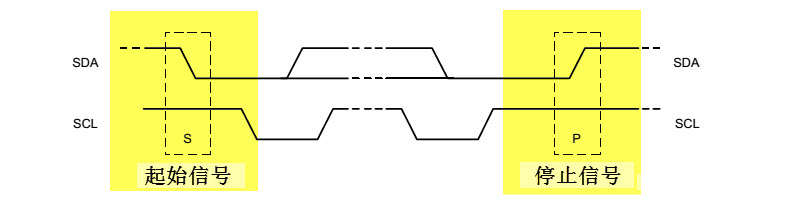

`OLED.c`中以下代码模拟了I2C通信的开始与停止：

```c
/**
  * @brief  I2C开始
  * @param  无
  * @retval 无
  */
void OLED_I2C_Start(void)
{
    // 设置SCL和SDA高电平
	OLED_W_SDA(1);
	OLED_W_SCL(1);
    // SDA下降沿启动I2C
	OLED_W_SDA(0);
    // 拉低SCL准备开始数据传输
	OLED_W_SCL(0);
}

/**
  * @brief  I2C停止
  * @param  无
  * @retval 无
  */
void OLED_I2C_Stop(void)
{
	OLED_W_SDA(0);
	OLED_W_SCL(1);
	OLED_W_SDA(1);
}
```

### 数据有效性

I2C使用SDA信号线来传输数据，SCL信号线进行数据同步。在每一个SCL周期中，从SDA上读写一位数据。由于SCL高电平时SDA的变化会被认为是开始信号S或结束信号P，因此在数据传输过程中SDA的变化只能发生在SCL低电平时期；数据的读写发生在SCL高电平时期。也就是说：**在数据传输过程中**，SCL为高电平说明此时SDA有效，进行读写；SCL为低电平说明SDA无效，此时SDA可切换。

每次数据传输都以字节为单位，每次传输的字节数不受限制。

### 地址及数据方向

在主机发起通信时，发送一个"从机地址+读/写"信号，从机地址SLAVE_ADDRESS可以为7位或10位，实际应用中7位地址较多。

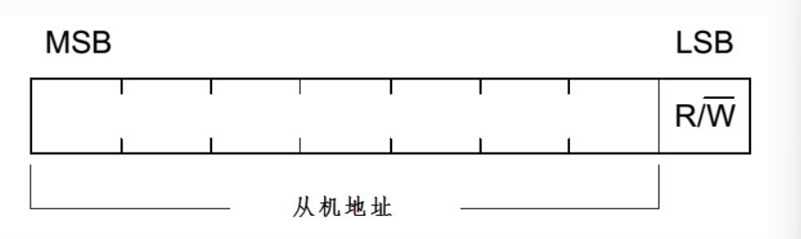

### 响应

I2C的数据和地址传输都带响应。响应包括“应答ACK”和"非应答NACK"两种信号。数据接收方在收到一个字节的数据或地址时，如果希望对方继续发送，就需要向对方“应答”，发送方会继续发送数据；如果希望结束数据传输，就需要向对方"非应答"，发送发收到该信号后会产生一个停止信号，结束信号传输。

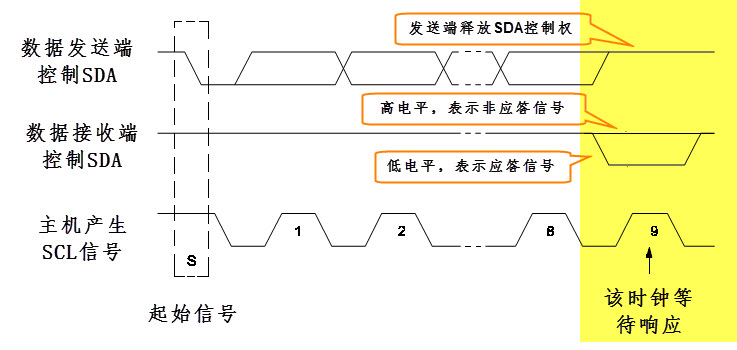

### 什么是“软件模拟I2C”

不使用STM32自带的I2C外设，而是通过普通GPIO手动控制SCL和SDA。上面的实验中将SCL接在PB8，SDA接在PB9，通过控制PB8和PB9的高低电平控制I2C通信的时序。

软件模拟I2C的好处是灵活，可以将SCL和SDA接在众多GPIO口，然后在驱动代码里调整引脚即可。

坏处是通信时CPU要一直占用，每发送一个bit都要执行很多指令，CPU占用率高。

### 什么是“硬件I2C”

STM32的I2C片上外设专门负责实现I2C通讯协议， 只要配置好该外设，它就会自动根据协议要求产生通讯信号，收发数据并缓存起来， CPU只要检测该外设的状态和访问数据寄存器，就能完成数据收发。 这种由硬件外设处理I2C协议的方式减轻了CPU的工作，且使软件设计更加简单。

## 实现硬件I2C

整体思路：修改`OLED.c`中以下函数

```c
void OLED_I2C_Init(void)
void OLED_I2C_Start(void)
void OLED_I2C_Stop(void) 
void OLED_I2C_SendByte(uint8_t Byte)
void OLED_WriteCommand(uint8_t Command)
void OLED_WriteData(uint8_t Data)
```

修改`void OLED_I2C_Init(void)`

```c
/*初始化引脚和I2C1*/
void OLED_I2C_Init(void)
{
    // STM32F103的I2C1默认引脚为PB6，PB7
	// 设置PB6，PB7为复用开漏输出
	RCC_APB2PeriphClockCmd(RCC_APB2Periph_GPIOB, ENABLE);
	GPIO_InitTypeDef GPIO_InitStructure;
	GPIO_InitStructure.GPIO_Mode  = GPIO_Mode_AF_OD;	// 复用开漏输出
	GPIO_InitStructure.GPIO_Pin = GPIO_Pin_6 | GPIO_Pin_7;
	GPIO_InitStructure.GPIO_Speed = GPIO_Speed_50MHz;
	GPIO_Init(GPIOB, &GPIO_InitStructure);
	
	// 初始化I2C1
	// 开启I2C1时钟
	RCC_APB1PeriphClockCmd(RCC_APB1Periph_I2C1, ENABLE);
	
	I2C_InitTypeDef I2C_InitStructure;
	I2C_InitStructure.I2C_Ack  = I2C_Ack_Enable;
	I2C_InitStructure.I2C_AcknowledgedAddress = I2C_AcknowledgedAddress_7bit;
	I2C_InitStructure.I2C_ClockSpeed = 100000;
	I2C_InitStructure.I2C_DutyCycle = I2C_DutyCycle_2;
	I2C_InitStructure.I2C_Mode = I2C_Mode_I2C;
	I2C_InitStructure.I2C_OwnAddress1 = 0x00;
	I2C_Init(I2C1, &I2C_InitStructure);
	
	I2C_Cmd(I2C1, ENABLE);
}
```

实现一个`OLED_I2C_WriteByte()`，向OLED发送一个控制字节和一个数据字节，方便简化`void OLED_WriteCommand(uint8_t Command)`和`void OLED_WriteData(uint8_t Data)`

```c
void OLED_I2C_WriteByte(uint8_t ControlByte, uint8_t DataByte)
{
	I2C_GenerateSTART(I2C1, ENABLE);
	while(I2C_CheckEvent(I2C1, I2C_EVENT_MASTER_MODE_SELECT) != SUCCESS);
	
	/* OLED 地址：0x3C 左移 1 位后是 0x78 */
	I2C_Send7bitAddress(I2C1, 0x78, I2C_Direction_Transmitter);
	while(I2C_CheckEvent(I2C1, I2C_EVENT_MASTER_TRANSMITTER_MODE_SELECTED) != SUCCESS);
	
	// I2C1向外设输出控制字
	I2C_SendData(I2C1, ControlByte);
	while(I2C_CheckEvent(I2C1, I2C_EVENT_MASTER_BYTE_TRANSMITTED) != SUCCESS);
	
	// I2C1向外设输出数据字
	I2C_SendData(I2C1, DataByte);
	while(I2C_CheckEvent(I2C1, I2C_EVENT_MASTER_BYTE_TRANSMITTED) != SUCCESS);

	I2C_GenerateSTOP(I2C1, ENABLE);
}	
```

修改`OLED_WriteCommand()`，`OLED_WriteData()`

```c
void OLED_WriteCommand(uint8_t Command)
{
	OLED_I2C_WriteByte(0x00, Command);
}

void OLED_WriteData(uint8_t Data)
{
	OLED_I2C_WriteByte(0x40, Data);
}
```

由于Proteus软件自身原因，无法实现硬件I2C仿真。连接物理器件进行实验，OLED可以正确输出。

### 为什么SCL和SDA设置为“复用开漏”模式？

I2C是半双工通信，SDA/SCL采用开漏结构，本质是“开漏输出+输入采样”同时存在，通过上拉电阻实现高电平，由设备控制是否拉低总线，同时各个设备都实时监听总线。

I2C必须使用开漏输出(Open-Drain)，是为了确保“多个设备可以安全地共享总线”。

I2C通信时多个设备共用SDA和SCL，如果设置为推挽输出模式，当多个设备同时访问SDA时，可能出现一个上拉一个下拉，导致总线竞争，出现短路。而开漏输出只能设备只能选择下拉或释放，不会出现短路情况。

### 为什么开启AFIO时钟？

```c
	// 开启AFIO时钟
	RCC_APB2PeriphClockCmd(RCC_APB2Periph_AFIO, ENABLE);
```

AFIO(Alternate Function I/O，复用功能I/O)主要负责引脚复用映射(引脚重映射)，外部中断线映射，调试接口配置。简单理解理解为：**AFIO负责管理引脚到底给哪个外设使用**。

这段代码原来在`OLED_I2C_Init()`中，但由于实现硬件I2C时使用的时PB6和PB7，这两个引脚是STM32F103的默认I2C1引脚，因此不需要进行引脚重映射，使能AFIO时钟是不必要的。

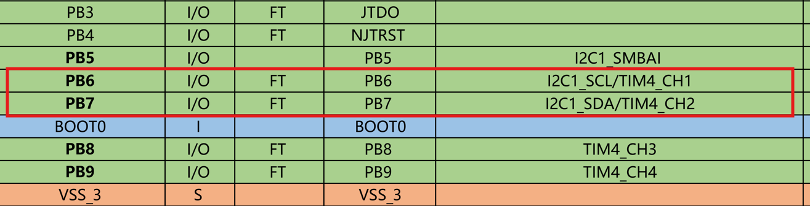

### 初始化I2C时各参数的选择

I2C初始化结构体：

```c
typedef struct {
    uint32_t I2C_ClockSpeed; /*!< 设置SCL时钟频率，此值要低于400000*/
    uint16_t I2C_Mode;      /*!< 指定工作模式，可选I2C模式及SMBUS模式 */
    uint16_t I2C_DutyCycle; /*指定时钟占空比，可选low/high = 2:1及16:9模式*/
    uint16_t I2C_OwnAddress1;     /*!< 指定自身的I2C设备地址 */
    uint16_t I2C_Ack;                 /*!< 使能或关闭响应(一般都要使能) */
    uint16_t I2C_AcknowledgedAddress; /*!< 指定地址的长度，可为7位及10位 */
} I2C_InitTypeDef;
```

