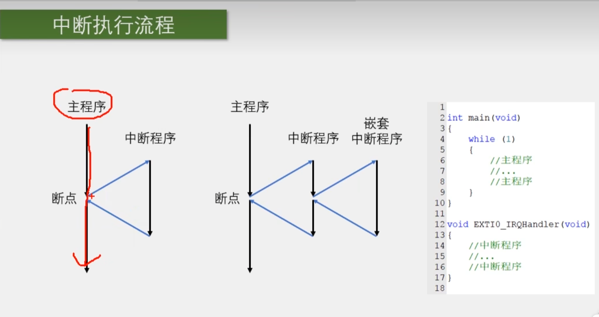
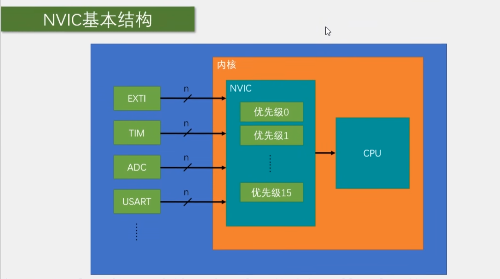
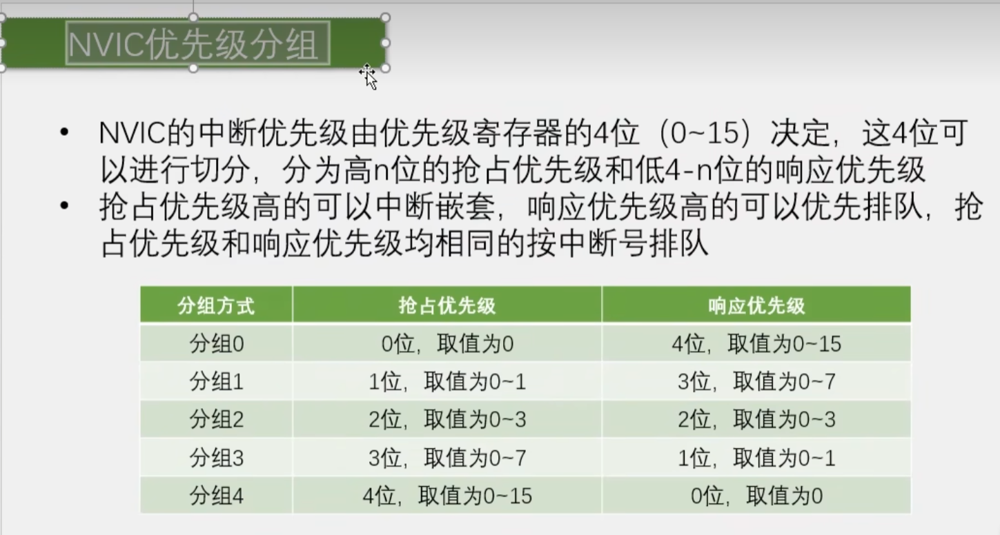
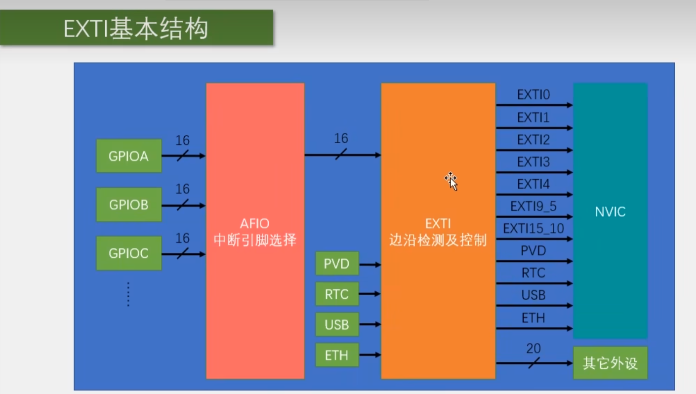
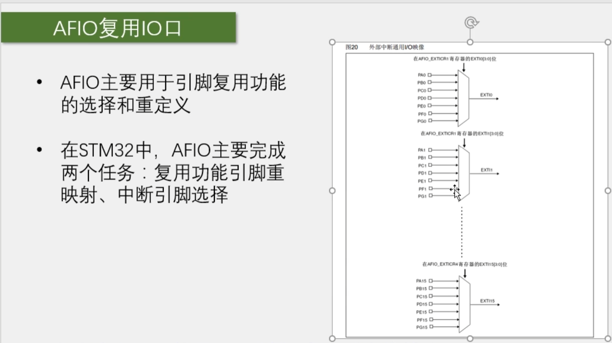
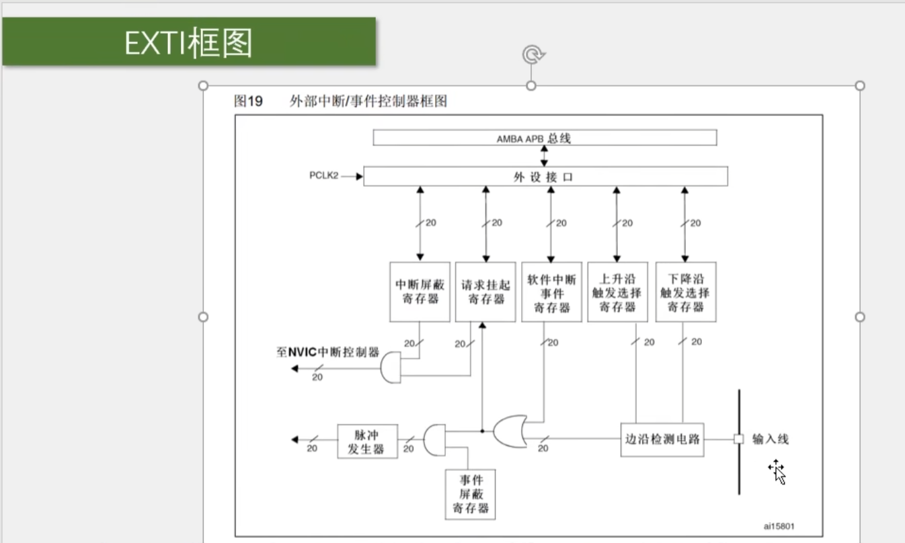
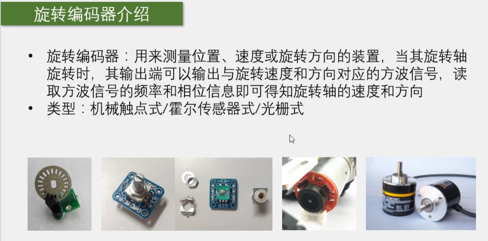
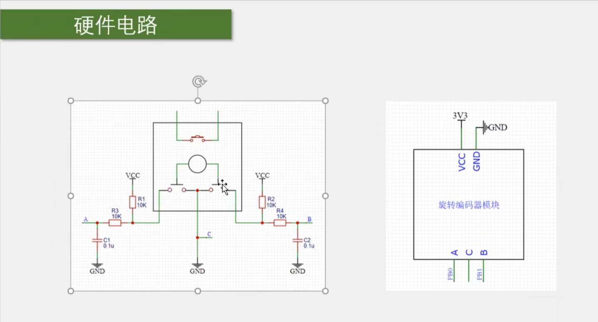
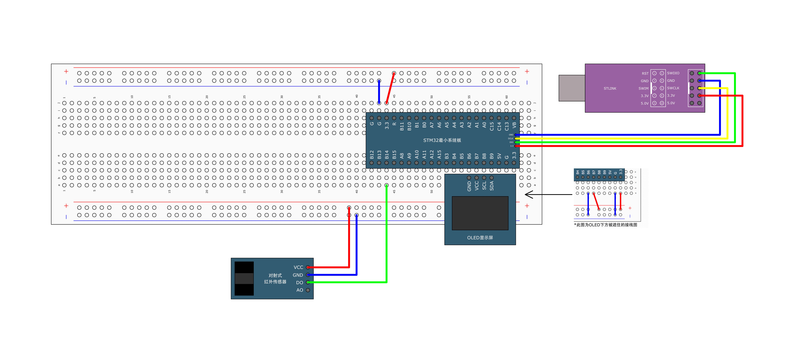
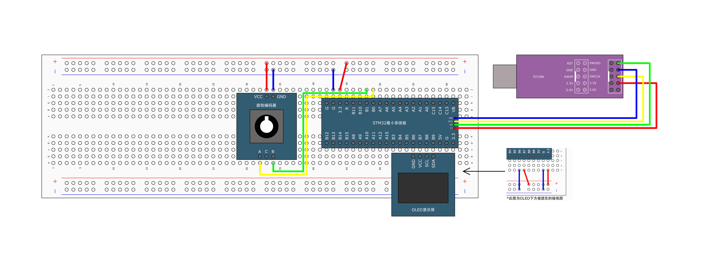

# [STM32]Day5

## 中断系统

**中断**：在主程序运行过程中，出现了特定的中断触发条件（中断源），使得CPU暂停当前正在运行的程序，转而去处理中断程序，处理完成后又返回原来被暂停的位置继续运行。

**中断优先级**：当有多个中断源同时申请中断时，CPU会根据中断源的重要程度进行裁决，优先响应更紧急的中断源。

**中断嵌套**：当一个中断程序正在运行时，又有新的更高优先级的中断源申请中断，CPU再次暂停当前中断程序，转而去处理新的中断程序，处理完成后依次进行返回。

**中断执行流程**：

## STM32中断

68个可屏蔽中断通道（可屏蔽中断源），包含EXIT、TIM、ADC、USART、SPI、I2C、RTC等多个外设。

使用NVIC（Nested Vectored Interrupt Controller，嵌套向量中断控制器）统一管理中断，每个中断通道都有16个可编程的优先等级，可对优先级进行分组，进一步设置抢占优先级和响应优先级。

“每个中断通道都有16个可编程的优先等级”：STM32里，通常用4个优先级位来表示优先级，等级为0-15，0最高，15最低。通过优先级分组，这 16 种组合会被拆分成“抢占优先级”和“响应优先级”。

**抢占优先级**决定能不能打断别的中断；

**响应优先级**只在抢占优先级相同时，用来决定谁先响应。

NVIC基本结构

NVIC能够让单片机有条理地管理多个中断，并且保证重要中断能更快更优地得到处理，提高CPU效率。

## NVIC优先级分组

NVIC的中断优先级由优先级寄存器的4位（0-15）决定，这4位可以进行分组，分为高n位的抢占优先级和低4-n位的响应优先级。

**抢占优先级**高的可以中断嵌套，**响应优先级**高的可以优先排队，抢占优先级和响应优先级**均相等**的按中断号排队。



## EXTI

EXTI（Extern Interrupt Controller，外部中断控制器），用来管理外部中断线和事件线。EXTI可以监测制定GPIO口的电平信号，当其指定的GPIO口产生电平变化时，EXTI将立即向NVIC发出中断申请，经过NVIC裁决后即可中断CPU主程序，使CPU执行EXTI对应的中断程序。

**支持的触发方式**：上升沿；下降沿；双边沿；软件触发

**支持的GPIO口**：所有GPIO口，但相同的Pin不能同时触发中断（例如GPIOA_Pin_10和GPIOB_Pin_10不能同时作为外部中断源使用，因为EXTI外部中断线是按Pin编号分的，而不是按GPIO端口分的）

STM32的EXTI大致是这样对应的：

```c
EXTI0  ← PA0 / PB0 / PC0 / PD0 ...
EXTI1  ← PA1 / PB1 / PC1 / PD1 ...
EXTI2  ← PA2 / PB2 / PC2 / PD2 ...
...
EXTI10 ← PA10 / PB10 / PC10 / PD10 ...
```

同一个EXTI线一次只能选择一个GPIO端口来源，Pin值相同的GPIO口不能同时作为外部中断源使用。

**通道数**：16个GPIO_Pin，外加PVD输出、RTC闹钟、USB唤醒、以太网唤醒

**触发响应方式**：中断响应/事件响应

**中断响应**与**事件响应**的区别：

中断响应指EXTI检测到制定边沿后，向NVIC发出中断请求，CPU暂停当前程序，进入对应的中断服务函数。例如按键接在PA0:

```c
按键触发
  ↓
EXTI0 检测到边沿
  ↓
向 NVIC 申请中断
  ↓
CPU 进入 EXTI0_IRQHandler()
```

然后可以在中断函数里写处理逻辑：

```c
void EXTI0_IRQHandler(void)
{
    if (EXTI_GetITStatus(EXTI_Line0) != RESET)
    {
        // 按键处理代码

        EXTI_ClearITPendingBit(EXTI_Line0);
    }
}
```

中断响应的特点是：**会进入中断服务函数，由CPU执行软件处理**。

事件响应指EXTI检测到触发条件后，只产生一个“事件信号”，但**不会进入中断服务函数**。例如按键接在PA0：

```c
按键触发
  ↓
EXTI0 检测到边沿
  ↓
产生事件信号
  ↓
不会进入 EXTI0_IRQHandler()
```

事件响应常用于：唤醒低功耗模式下的CPU，触发内部硬件时间等

事件响应的特点是：**只产生事件，不经过NVIC，不进入中断服务函数。事件响应不会触发中断，而是触发别的外设操作，属于外设之间的联合工作**。

### EXTI基本结构



每一个GPIO都有16个端口可以作为外部中断输入，但是EXTI只有16条EXTI线分配给外部中断源，因此由AFIO进行中断引脚选择，负责决定一条EXTI线连接到哪个GPIO端口上，这也是Pin值相同的IO口不能同时触发中断的原因。

EXTI负责边沿检测和控制，当检测到触发信号后，发出中断请求/事件请求。如果产生中断请求，通过EXTI->NVIC中断线送往NVIC进行判断是否响应，如果响应，NVIC向CPU发送中断信号。EXTI->NVIC之间的中断线不是一一对应的，每一条中断线对应一个中断服务函数。EXTI0到EXTI4每一条中断线都对应一个单独的中断服务函数。EXTI5到EXTI9、EXTI10到EXTI15分别共用一个中断服务函数。共用的中断服务函数需要进一步判断中断是由哪一条EXTI线触发，从而执行相应的操作。

```c
void EXTI15_10_IRQHandler(void)
{
    if (EXTI_GetITStatus(EXTI_Line10) != RESET)
    {
        // 处理 EXTI10
        EXTI_ClearITPendingBit(EXTI_Line10);
    }

    if (EXTI_GetITStatus(EXTI_Line11) != RESET)
    {
        // 处理 EXTI11
        EXTI_ClearITPendingBit(EXTI_Line11);
    }
}
```

EXTI有20条线与其他外设连接，当EXTI发出事件响应时，与其他外设联动。

### AFIO复用IO口

AFIO主要用于引脚复用功能的选择和重定义。

在STM32中，AFIO主要完成两个任务：复用功能引脚重映射、中断引脚选择



### EXTI框图



## 旋转编码器



硬件电路

旋钮旋转时，AB两点交替输出低电平。根据AB相位差判断旋转方向，AB相位差也成为两项正交电平。

## 对射式红外传感器计次

连线图



中断源初始化整体思路：**配置GPIO口 -> 配置AFIO -> 配置EXTI -> 配置NVIC**

AFIO常用函数位于`stmstm32f10x_gpio.h`

```c
void GPIO_AFIODeInit(void);		// 重置AFIO

// 选择哪个 GPIO 引脚作为 EVENTOUT 事件输出引脚。使用较少
void GPIO_EventOutputConfig(uint8_t GPIO_PortSource, uint8_t GPIO_PinSource);

// 使能或关闭 EVENTOUT 事件输出功能。使用较少
void GPIO_EventOutputCmd(FunctionalState NewState);

// 引脚重映射
void GPIO_PinRemapConfig(uint32_t GPIO_Remap, FunctionalState NewState);

// 进行EXTI线配置，把某个GPIO端口的某个引脚，连接到对应的EXTI外部中断线
void GPIO_EXTILineConfig(uint8_t GPIO_PortSource, uint8_t GPIO_PinSource);
// 例如下面的语句实现将PB10连接到EXTI10
GPIO_EXTILineConfig(GPIO_PortSourceGPIOB, GPIO_PinSource10);
```

EXTI常用库函数位于`stm32f10x_exti.h`

```c
void EXTI_DeInit(void);		// 重制EXTI
void EXTI_Init(EXTI_InitTypeDef* EXTI_InitStruct);		// 初始化EXTI
void EXTI_StructInit(EXTI_InitTypeDef* EXTI_InitStruct);	// 给结构体赋默认值
void EXTI_GenerateSWInterrupt(uint32_t EXTI_Line);	// SW:SoftWare，软件触发中断
// 以下两个函数用于在主函数中查看和清除标志位
FlagStatus EXTI_GetFlagStatus(uint32_t EXTI_Line);	// 获取指定标志位是否被置1
void EXTI_ClearFlag(uint32_t EXTI_Line);	// 对置一的标志位进行清除
// 以下两个函数用于在中断函数中查看和清除标志位
ITStatus EXTI_GetITStatus(uint32_t EXTI_Line);		// 获取中断标志位是否置一
void EXTI_ClearITPendingBit(uint32_t EXTI_Line);	// 清除中断挂起标志位
```

NVIC常用库函数位于`misc.h`

```c
void NVIC_PriorityGroupConfig(uint32_t NVIC_PriorityGroup);	// 中断优先级分组
void NVIC_Init(NVIC_InitTypeDef* NVIC_InitStruct);
void NVIC_SetVectorTable(uint32_t NVIC_VectTab, uint32_t Offset);// 设置中断向量表
void NVIC_SystemLPConfig(uint8_t LowPowerMode, FunctionalState NewState);// 系统低功耗配置
void SysTick_CLKSourceConfig(uint32_t SysTick_CLKSource);
```

触发中断后执行的动作由中断函数规定，在`startup_stm32f10x_md.s`中找到中断向量表，找到对应的中断函数名称，然后在硬件驱动代码里规定中断后的动作

完成硬件驱动代码

```c
// InfraredSensor.c
#include "stm32f10x.h"                  // Device header

// 定义一个记录次数的变量
uint16_t InfraredSensor_Count;

void InfraredSensor_Init(void)
{
	// 配置GPIO_Pin_14
	RCC_APB2PeriphClockCmd(RCC_APB2Periph_GPIOB, ENABLE);
	
	GPIO_InitTypeDef GPIO_InitStructure;
	GPIO_InitStructure.GPIO_Mode = GPIO_Mode_IPU;	// 推荐为上拉/下拉/浮空输入，这里选择上拉输入
	GPIO_InitStructure.GPIO_Pin = GPIO_Pin_14;
	GPIO_InitStructure.GPIO_Speed = GPIO_Speed_50MHz;
	GPIO_Init(GPIOB, &GPIO_InitStructure);
	
	// 配置AFIO，相关函数位于stm32f10x_gpio.h
	RCC_APB2PeriphClockCmd(RCC_APB2Periph_AFIO, ENABLE);
    // 将GPIOB的Pin_14连接到EXTI14
	GPIO_EXTILineConfig(GPIO_PortSourceGPIOB, GPIO_PinSource14);
	
	// 配置EXTI
	// EXTI虽然是片上外设，但时钟是常开的，不用使能
	EXTI_InitTypeDef EXTI_InitStructure;
	EXTI_InitStructure.EXTI_Line = EXTI_Line14;
	EXTI_InitStructure.EXTI_LineCmd = ENABLE;
	EXTI_InitStructure.EXTI_Mode = EXTI_Mode_Interrupt;		// 中断模式
	EXTI_InitStructure.EXTI_Trigger  = EXTI_Trigger_Falling;	// 下降沿触发
	EXTI_Init(&EXTI_InitStructure);
	
	// 配置NVIC
	// NVIC是内核外设，时钟是常开的，不用使能
	// 设置中断优先级分组，整个芯片只能采用一种分组方式，写在模块内要统一，也可以写在主函数
	NVIC_PriorityGroupConfig(NVIC_PriorityGroup_2);		// 2位抢占优先级，2位响应优先级
	NVIC_InitTypeDef NVIC_InitStructure;
	// 使能EXTI15_10
	NVIC_InitStructure.NVIC_IRQChannel = EXTI15_10_IRQn;	// 
	NVIC_InitStructure.NVIC_IRQChannelCmd = ENABLE;
	// 指定通道的抢占优先级和响应优先级
	NVIC_InitStructure.NVIC_IRQChannelPreemptionPriority = 1;
	NVIC_InitStructure.NVIC_IRQChannelSubPriority = 1;
	NVIC_Init(&NVIC_InitStructure);
}

void EXTI15_10_IRQHandler(void)
{
	// 检查是否是PB14发出的中断
	if(EXTI_GetITStatus(EXTI_Line14) == SET) {
		InfraredSensor_Count ++;
		// 响应完中断后要清除标志位，避免持续申请中断
		EXTI_ClearITPendingBit(EXTI_Line14);
	}
}

uint16_t InfraredSensor_GetNum(void)
{
	return InfraredSensor_Count;
}

// InfraredSensor.h
#ifndef __InfraredSensor_H
#define __InfraredSensor_H

void InfraredSensor_Init();
uint16_t InfraredSensor_GetNum(void);

#endif

```

完成`main.c`

```c
#include "stm32f10x.h"                  // Device header
#include "OLED_Software.h"
#include "InfraredSensor.h"

int main(void)
{
	
	OLED_Init();
	InfraredSensor_Init();
	
	OLED_ShowString(1, 3, "Count:");

	while(1)
	{
		OLED_ShowNum(1, 7, InfraredSensor_GetNum(), 5);
	}
}

```

以上代码进行实验时会出现上升沿下降沿都计数增加的情况，修改`EXTI15_10_IRQHandler()`避免抖动

```c
void EXTI15_10_IRQHandler(void)
{
	// 检查是否是PB14发出的中断
	if(EXTI_GetITStatus(EXTI_Line14) == SET) {
		if(GPIO_ReadInputDataBit(GPIOB, GPIO_Pin_14) == 0) {
			InfraredSensor_Count ++;
		}
		// 响应完中断后要清除标志位，避免持续申请中断
		EXTI_ClearITPendingBit(EXTI_Line14);
	}
}

```

相应的，如果改变触发方式为上升沿触发`EXTI_InitStructure.EXTI_Trigger  = EXTI_Trigger_Rising;`，那么消抖为

```c
void EXTI15_10_IRQHandler(void)
{
	// 检查是否是PB14发出的中断
	if(EXTI_GetITStatus(EXTI_Line14) == SET) {
		if(GPIO_ReadInputDataBit(GPIOB, GPIO_Pin_14) == 1) {
			InfraredSensor_Count ++;
		}
		// 响应完中断后要清除标志位，避免持续申请中断
		EXTI_ClearITPendingBit(EXTI_Line14);
	}
}
```

如果触发方式为上升沿下降沿都触发，会出现计数跳动，计数不准，如何消抖？

## 旋转编码器计次



思路：旋转编码器正转时，A相先下降，B相下降沿时A相为高电平；反转时，B相先下降，A相下降沿时B相为低电平。将AB相都设置为中断源，“B相下降沿且A相高电平”，判断为正转，计数器加1；“A相下降沿且B相为低电平”，判断为反转，计数器减1。

完成驱动代码

```c
// RotaryEncoder.c
#include "stm32f10x.h"                  // Device header

int16_t RotaryEncoder_Count;

void RotaryEncoder_Init(void)
{
	// 配置GPIO
	RCC_APB2PeriphClockCmd(RCC_APB2Periph_GPIOB, ENABLE);
	GPIO_InitTypeDef GPIO_InitStructure;
	GPIO_InitStructure.GPIO_Mode = GPIO_Mode_IPU;		// 上拉输入
	GPIO_InitStructure.GPIO_Pin = GPIO_Pin_0 | GPIO_Pin_1;
	GPIO_InitStructure.GPIO_Speed = GPIO_Speed_50MHz;
	GPIO_Init(GPIOB, &GPIO_InitStructure);
	
	// 配置AFIO
	RCC_APB2PeriphClockCmd(RCC_APB2Periph_AFIO, ENABLE);
    // 不可以写成以下形式！
	// GPIO_EXTILineConfig(GPIO_PortSourceGPIOB, GPIO_PinSource0 | GPIO_PinSource1);
    GPIO_EXTILineConfig(GPIO_PortSourceGPIOB, GPIO_PinSource0);
	GPIO_EXTILineConfig(GPIO_PortSourceGPIOB, GPIO_PinSource1);
	
	// 配置EXTI
	EXTI_InitTypeDef EXTI_InitStructure;
	EXTI_InitStructure.EXTI_Line = EXTI_Line0 | EXTI_Line1;
    EXTI_InitStructure.EXTI_LineCmd = ENABLE;
	EXTI_InitStructure.EXTI_Mode = EXTI_Mode_Interrupt;
	EXTI_InitStructure.EXTI_Trigger  = EXTI_Trigger_Falling;
	EXTI_Init(&EXTI_InitStructure);
	
	// 配置NVIC
	NVIC_PriorityGroupConfig(NVIC_PriorityGroup_2);
	NVIC_InitTypeDef NVIC_InitStructure;
	// 分别为两个通道使能并设置优先级
	// PB0
	NVIC_InitStructure.NVIC_IRQChannel = EXTI0_IRQn;
	NVIC_InitStructure.NVIC_IRQChannelCmd = ENABLE;
	NVIC_InitStructure.NVIC_IRQChannelPreemptionPriority = 1;
	NVIC_InitStructure.NVIC_IRQChannelSubPriority = 1;
	NVIC_Init(&NVIC_InitStructure);
	// PB1
	NVIC_InitStructure.NVIC_IRQChannel = EXTI1_IRQn;
	NVIC_InitStructure.NVIC_IRQChannelCmd = ENABLE;
	NVIC_InitStructure.NVIC_IRQChannelPreemptionPriority = 1;
	NVIC_InitStructure.NVIC_IRQChannelSubPriority = 2;
	NVIC_Init(&NVIC_InitStructure);
}

// 重写中断函数
void EXTI0_IRQHandler(void)
{
	if(EXTI_GetITStatus(EXTI_Line0) == SET) {
		// A下降沿，B为高电平 -> 正转
		if(GPIO_ReadInputDataBit(GPIOB, GPIO_Pin_1) == 1) {
			RotaryEncoder_Count ++;
		}
		EXTI_ClearITPendingBit(EXTI_Line0);
	}
}

void EXTI1_IRQHandler(void)
{
	if(EXTI_GetITStatus(EXTI_Line1) == SET) {
		// B下降沿，A为高电平 -> 反转
		if(GPIO_ReadInputDataBit(GPIOB, GPIO_Pin_0) == 1) {
			RotaryEncoder_Count --;
		}
		EXTI_ClearITPendingBit(EXTI_Line1);
	}
}

int16_t RotaryEncoder_GetNum(void)
{
	return RotaryEncoder_Count;
}

// RotaryEncoder.h
#ifndef __RotaryEncoder_H
#define __ROtaryEncoder_H

void RotaryEncoder_Init(void);
int16_t RotaryEncoder_GetNum(void);

#endif

```

`main.c`

```c
#include "stm32f10x.h"                  // Device header
#include "OLED_Software.h"
#include "RotaryEncoder.h"

int main(void)
{
	
	OLED_Init();
	RotaryEncoder_Init();
	
	OLED_ShowString(1, 3, "Count:");

	while(1)
	{
		OLED_ShowNum(1, 7, RotaryEncoder_GetNum(), 5);
	}
}

```

**中断程序设计原则**：中断函数中不应执行耗时长的操作。