# [STM32]Day6-Part2


## 输出比较

**OC（Output Compare）**，输出比较，可以通过比较CNT与CCR寄存器值的关系，对输出电平进行置1、置0或翻转的操作，用于输出一定频率和占空比的**PWM**波形。

每个高级定时器和通用定时器都有4个输出比较通道，高级定时器的前3个通道额外有死区生成和输出互补的功能。

**PWM（Pulse Width Modulation）**，脉冲宽度调制。在具有惯性的系统中，可以通过对一系列脉冲的宽度进行调制，来等效地获得所需要的**模拟参量**，常用于点击控速等领域。

频率 = 1 / Ts，占空比 = Ton / Ts，分辨率 = 占空比变化步距（占空比变化的最小单位）

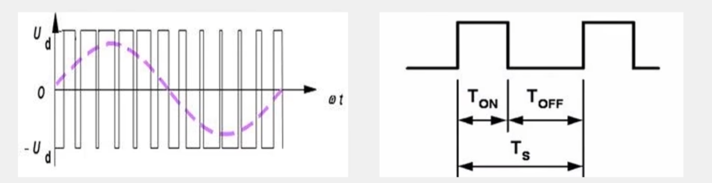

## 定时器输出比较通道

### 通用定时器

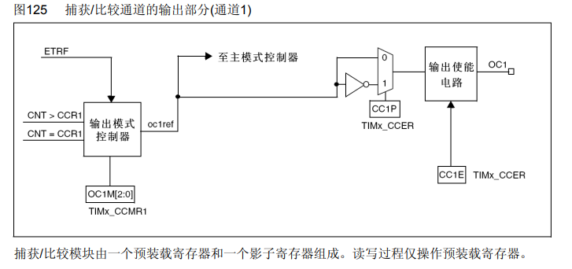

输出模式控制器根据OC1M[2:0]设置8种输出比较模式，然后根据CNT与CCR1的关系决定oc1ref（oc1 reference）信号应该变成什么状态。oc1ref再经过选择器和使能电路，从OC1引脚输出，OC1引脚即CH1引脚。

OC1M[2:0]的8种输出比较模式

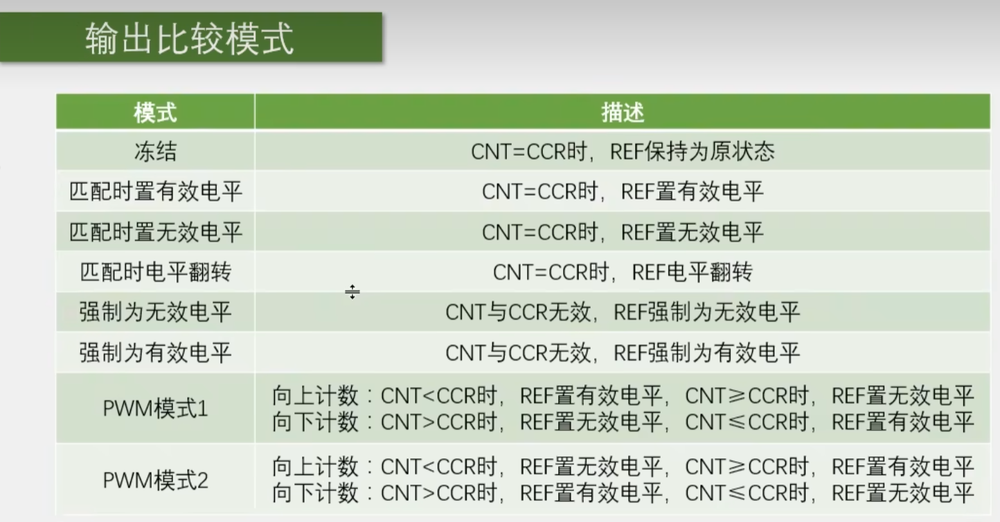

冻结模式可以让REF保持上一个状态一段时间，强制为无效/有效电平可以让REF保持低/高电平一段时间。

匹配时电平反转可以输出一个周期为技术周期2倍的方波。

PWM模式1和PWM模式2实现占空比可调的PWM波形。

PWM基本结构：PWM模式1，向上计数

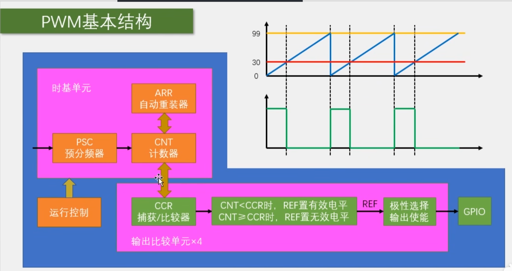

PWM频率：Freq = CK_PSC / (PSC + 1)(ARR + 1)

PWM占空比：Duty = CCR / (ARR) + 1

PWM分辨率：Reso = 1 / (ARR + 1)

### 高级定时器

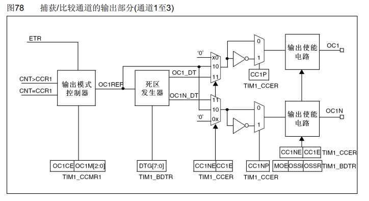

## 舵机

舵机是一种根据输入PWM信号占空比来控制输出角度的装置。

输入PWM信号要求：周期为20ms，高电平宽度为0.5ms - 2.5ms。

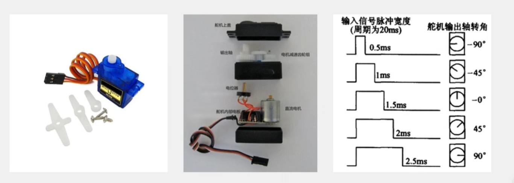

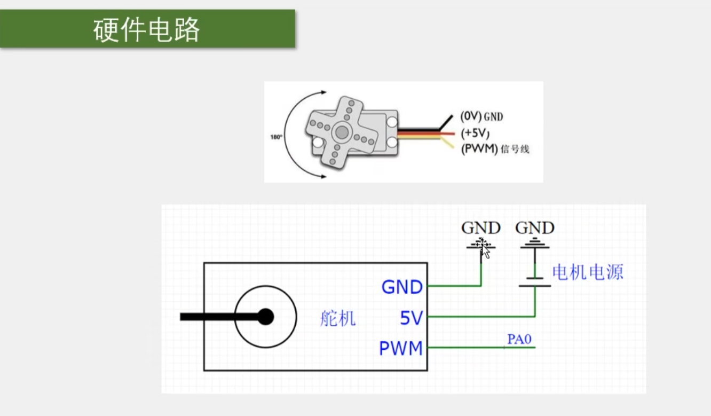

## 直流电机

直流电机是种将电能转化为机械能的装置，有两个电极，当电极正接时，电机正转；电极反接时，电机反转。

直流电机属于大功率器件，GPIO口无法直接驱动，需要配合点击驱动电路来操作。

TB6612是一款双路H桥型的直流电机驱动芯片，可以驱动两个直流电机并控制转速和方向。

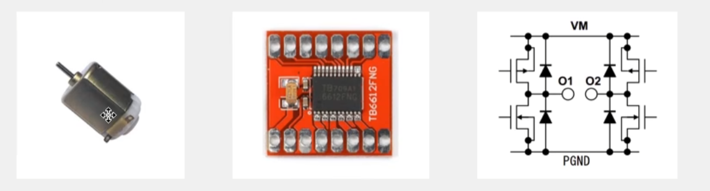

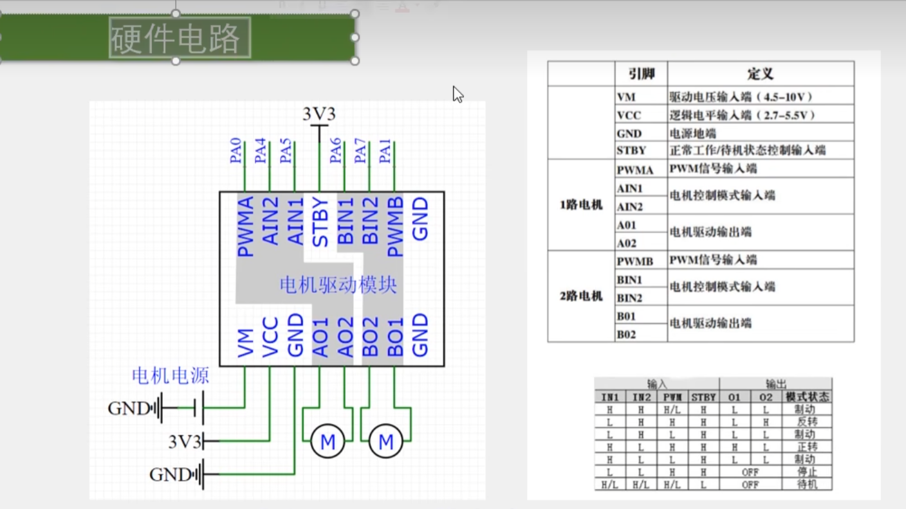

## PWM驱动呼吸灯

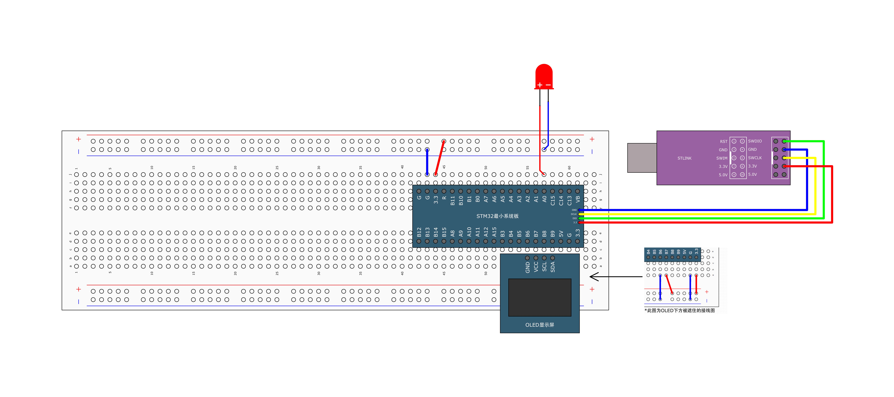

PWM初始化思路，配置基本结构中的各部分


需要使用的函数

```c
// 配置输出比较单元
void TIM_OC1Init(TIM_TypeDef* TIMx, TIM_OCInitTypeDef* TIM_OCInitStruct);
void TIM_OC2Init(TIM_TypeDef* TIMx, TIM_OCInitTypeDef* TIM_OCInitStruct);
void TIM_OC3Init(TIM_TypeDef* TIMx, TIM_OCInitTypeDef* TIM_OCInitStruct);
void TIM_OC4Init(TIM_TypeDef* TIMx, TIM_OCInitTypeDef* TIM_OCInitStruct);

// 更改CCR寄存器的值
void TIM_SetCompare1(TIM_TypeDef* TIMx, uint16_t Compare1);
void TIM_SetCompare2(TIM_TypeDef* TIMx, uint16_t Compare2);
void TIM_SetCompare3(TIM_TypeDef* TIMx, uint16_t Compare3);
void TIM_SetCompare4(TIM_TypeDef* TIMx, uint16_t Compare4);
```

代码

```c
// PWM.c
#include "stm32f10x.h"                  // Device header

void PWM_Init(void)
{
	// 使能定时器时钟
	RCC_APB1PeriphClockCmd(RCC_APB1Periph_TIM2, ENABLE);
	
	// 选择内部时钟源
	TIM_InternalClockConfig(TIM2);
	
	// 配置时基单元
	TIM_TimeBaseInitTypeDef TIM_TimeBaseInitStructure;
	TIM_TimeBaseInitStructure.TIM_ClockDivision = TIM_CKD_DIV1;		// 滤波模块时钟配置，影响不大
	TIM_TimeBaseInitStructure.TIM_CounterMode = TIM_CounterMode_Up;
	TIM_TimeBaseInitStructure.TIM_Period = 99 - 1;		// ARR
	TIM_TimeBaseInitStructure.TIM_Prescaler = 720 - 1;		// PSC
	TIM_TimeBaseInitStructure.TIM_RepetitionCounter = 0;
	TIM_TimeBaseInit(TIM2, &TIM_TimeBaseInitStructure);
	
	// 配置输出比较单元
	TIM_OCInitTypeDef TIM_OCInitStructure;
	TIM_OCStructInit(&TIM_OCInitStructure);		// 设置默认值，后续只修改必要的参数
	TIM_OCInitStructure.TIM_OCMode = TIM_OCMode_PWM1;		// 输出比较模式：PWM1
	TIM_OCInitStructure.TIM_OCPolarity = TIM_OCPolarity_High;		// 输出比较极性：高极性ref不翻转；低极性翻转
	TIM_OCInitStructure.TIM_OutputState = TIM_OutputState_Enable;		// 输出使能
	TIM_OCInitStructure.TIM_Pulse = 0;		// 设置CCR的值
	TIM_OC2Init(TIM2, &TIM_OCInitStructure); 	// 由于PA0松动，选择TIM2的OC2引脚即CH2，复用在PA1上
	
	// 使能定时器（运行控制）
	TIM_Cmd(TIM2, ENABLE);
	
	// 初始化引脚
	RCC_APB2PeriphClockCmd(RCC_APB2Periph_GPIOA, ENABLE);
	GPIO_InitTypeDef GPIO_InitStructure;
	GPIO_InitStructure.GPIO_Mode = GPIO_Mode_AF_PP;			// 复用推挽输出
	GPIO_InitStructure.GPIO_Pin = GPIO_Pin_1;
	GPIO_InitStructure.GPIO_Speed = GPIO_Speed_50MHz;
	GPIO_Init(GPIOA, &GPIO_InitStructure);
}

void PWM_SetCompare2(uint16_t Compare)
{
	TIM_SetCompare2(TIM2, Compare);
}

// PWM.h
#ifndef __PWM_H
#define __PWN_H

void PWM_Init(void);
void PWM_SetCompare2(uint16_t Compare);

#endif

// main.c
#include "stm32f10x.h"                  // Device header
#include "OLED_Hardware.h"
#include "PWM.h"
#include "Delay.h"

int main(void)
{
	
	OLED_Init_H();
	PWM_Init();
	
	uint16_t i;

	while(1)
	{
		for(i = 0; i < 100; i ++) {
			PWM_SetCompare2(i);
			Delay_ms(10);
		}
		for(i = 0; i < 100; i ++) {
			PWM_SetCompare2(100 - i);
			Delay_ms(10);
		}
	}
}

```

## PWM驱动舵机

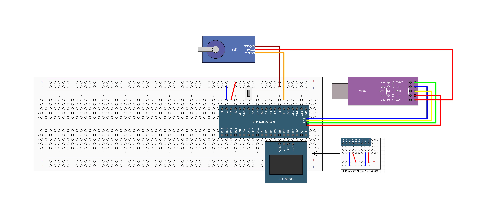

舵机输入PWM信号要求：周期为20ms，高电平宽度为0.5ms - 2.5ms。

输入周期20ms，频率：1 / 20ms = 50Hz = 72MHz / (PSC + 1)(ARR + 1)，可以使PSC + 1 = 72，ARR + 1 = 20k，CCR的变化范围为20k * 0.5/20 = 500到20k * 2.5/20 = 2500

代码

```c
// PWM.c
#include "stm32f10x.h"                  // Device header

void PWM_Init(void)
{
	// 使能定时器时钟
	RCC_APB1PeriphClockCmd(RCC_APB1Periph_TIM2, ENABLE);
	
	// 选择内部时钟源
	TIM_InternalClockConfig(TIM2);
	
	// 配置时基单元
	TIM_TimeBaseInitTypeDef TIM_TimeBaseInitStructure;
	TIM_TimeBaseInitStructure.TIM_ClockDivision = TIM_CKD_DIV1;		// 滤波模块时钟配置，影响不大
	TIM_TimeBaseInitStructure.TIM_CounterMode = TIM_CounterMode_Up;
	TIM_TimeBaseInitStructure.TIM_Period = 20000 - 1;		// ARR
	TIM_TimeBaseInitStructure.TIM_Prescaler = 72 - 1;		// PSC
	TIM_TimeBaseInitStructure.TIM_RepetitionCounter = 0;
	TIM_TimeBaseInit(TIM2, &TIM_TimeBaseInitStructure);
	
	// 配置输出比较单元
	TIM_OCInitTypeDef TIM_OCInitStructure;
	TIM_OCStructInit(&TIM_OCInitStructure);		// 设置默认值，后续只修改必要的参数
	TIM_OCInitStructure.TIM_OCMode = TIM_OCMode_PWM1;		// 输出比较模式：PWM1
	TIM_OCInitStructure.TIM_OCPolarity = TIM_OCPolarity_High;		// 输出比较极性：高极性ref不翻转；低极性翻转
	TIM_OCInitStructure.TIM_OutputState = TIM_OutputState_Enable;		// 输出使能
	TIM_OCInitStructure.TIM_Pulse = 0;		// 设置CCR的值
	TIM_OC2Init(TIM2, &TIM_OCInitStructure); 	// 由于PA0松动，选择TIM2的OC2引脚即CH2，复用在PA1上
	
	// 使能定时器（运行控制）
	TIM_Cmd(TIM2, ENABLE);
	
	// 初始化引脚
	RCC_APB2PeriphClockCmd(RCC_APB2Periph_GPIOA, ENABLE);
	GPIO_InitTypeDef GPIO_InitStructure;
	GPIO_InitStructure.GPIO_Mode = GPIO_Mode_AF_PP;			// 复用推挽输出
	GPIO_InitStructure.GPIO_Pin = GPIO_Pin_1;
	GPIO_InitStructure.GPIO_Speed = GPIO_Speed_50MHz;
	GPIO_Init(GPIOA, &GPIO_InitStructure);
}

void PWM_SetCompare2(uint16_t Compare)
{
	TIM_SetCompare2(TIM2, Compare);
}

// PWM.h
#ifndef __PWN_H
#define __PWN_H

void PWM_Init(void);
void PWM_SetCompare2(uint16_t Compare);

#endif

// Servo.c
#include "stm32f10x.h"                  // Device header
#include "PWM.h"

void Servo_Init(void)
{
	PWM_Init();
}

void Servo_SetAngle(float Angle)
{
	PWM_SetCompare2(Angle / 180 * 2000 + 500);
}

// Servo.h
#ifndef __SERVO_H
#define __SERVO_H

void Servo_Init(void);
void Servo_SetAngle(float Angle);

#endif

// main.c
#include "stm32f10x.h"                  // Device header
#include "OLED_Hardware.h"
#include "Servo.h"
#include "Delay.h"
#include "Button.h"

uint8_t ButtonNum;
float Angle;

int main(void)
{
	
	OLED_Init_H();
	Servo_Init();
	Button_Init();
	
	OLED_ShowString_H(1, 1, "Angle:");

	while(1)
	{
		ButtonNum = Button_Read(Pin_11);
		if(ButtonNum == 1) {
			Angle += 30;
			if(Angle > 180) {
				Angle = 0;
			}
		}
		Servo_SetAngle(Angle);
		OLED_ShowNum_H(1, 7, Angle, 3);
	}
}

```

## PWM驱动直流电机

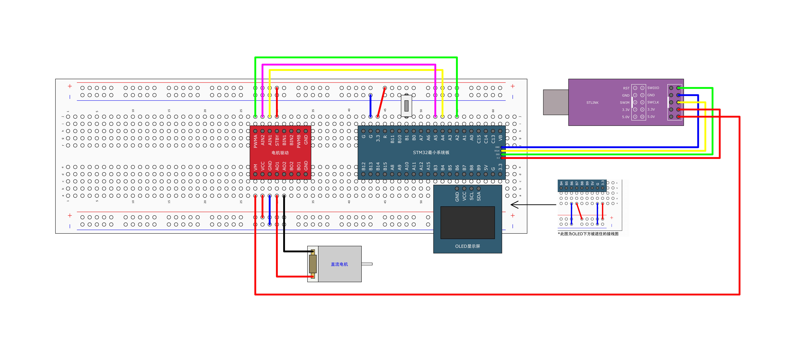

代码

```c
// PWM.c
#include "stm32f10x.h"                  // Device header

void PWM_Init(void)
{
	// 使能定时器时钟
	RCC_APB1PeriphClockCmd(RCC_APB1Periph_TIM2, ENABLE);
	
	// 选择内部时钟源
	TIM_InternalClockConfig(TIM2);
	
	// 配置时基单元
	TIM_TimeBaseInitTypeDef TIM_TimeBaseInitStructure;
	TIM_TimeBaseInitStructure.TIM_ClockDivision = TIM_CKD_DIV1;		// 滤波模块时钟配置，影响不大
	TIM_TimeBaseInitStructure.TIM_CounterMode = TIM_CounterMode_Up;
	TIM_TimeBaseInitStructure.TIM_Period = 100 - 1;		// ARR
	TIM_TimeBaseInitStructure.TIM_Prescaler = 720 - 1;		// PSC
	TIM_TimeBaseInitStructure.TIM_RepetitionCounter = 0;
	TIM_TimeBaseInit(TIM2, &TIM_TimeBaseInitStructure);
	
	// 配置输出比较单元
	TIM_OCInitTypeDef TIM_OCInitStructure;
	TIM_OCStructInit(&TIM_OCInitStructure);		// 设置默认值，后续只修改必要的参数
	TIM_OCInitStructure.TIM_OCMode = TIM_OCMode_PWM1;		// 输出比较模式：PWM1
	TIM_OCInitStructure.TIM_OCPolarity = TIM_OCPolarity_High;		// 输出比较极性：高极性ref不翻转；低极性翻转
	TIM_OCInitStructure.TIM_OutputState = TIM_OutputState_Enable;		// 输出使能
	TIM_OCInitStructure.TIM_Pulse = 0;		// 设置CCR的值
	TIM_OC3Init(TIM2, &TIM_OCInitStructure); 	// 由于PA0松动，选择TIM2的OC3引脚即CH3，复用在PA2上
	
	// 使能定时器（运行控制）
	TIM_Cmd(TIM2, ENABLE);
	
	// 初始化引脚
	RCC_APB2PeriphClockCmd(RCC_APB2Periph_GPIOA, ENABLE);
	GPIO_InitTypeDef GPIO_InitStructure;
	GPIO_InitStructure.GPIO_Mode = GPIO_Mode_AF_PP;			// 复用推挽输出
	GPIO_InitStructure.GPIO_Pin = GPIO_Pin_2;
	GPIO_InitStructure.GPIO_Speed = GPIO_Speed_50MHz;
	GPIO_Init(GPIOA, &GPIO_InitStructure);
}

void PWM_SetCompare3(uint16_t Compare)
{
	TIM_SetCompare3(TIM2, Compare);
}

// PWM.h
#ifndef __PWM_H
#define __PWN_H

void PWM_Init(void);
void PWM_SetCompare3(uint16_t Compare);

#endif

// Moter.c
#include "stm32f10x.h"                  // Device header
#include "PWM.h"

void Moter_Init(void)
{
	RCC_APB2PeriphClockCmd(RCC_APB2Periph_GPIOA, ENABLE);
	
	GPIO_InitTypeDef GPIO_InitStructure;
	GPIO_InitStructure.GPIO_Mode = GPIO_Mode_Out_PP;
	GPIO_InitStructure.GPIO_Pin = GPIO_Pin_4 | GPIO_Pin_5;
	GPIO_InitStructure.GPIO_Speed = GPIO_Speed_50MHz;
	GPIO_Init(GPIOA, &GPIO_InitStructure);
	
	PWM_Init();
}

void Moter_SetSpeed(int8_t Speed)
{
	if(Speed >= 0) {
		// 设置正反转方向
		GPIO_SetBits(GPIOA, GPIO_Pin_4);
		GPIO_ResetBits(GPIOA, GPIO_Pin_5);
		// 设置速度
		PWM_SetCompare3(Speed);
	} else {
		// 设置正反转方向
		GPIO_SetBits(GPIOA, GPIO_Pin_5);
		GPIO_ResetBits(GPIOA, GPIO_Pin_4);
		// 设置速度
		PWM_SetCompare3(-Speed);
	}
}

// Moter.h
#ifndef __MOTER_H
#define __MOTER_H

void Moter_Init(void);
void Moter_SetSpeed(int8_t Speed);

#endif

// main.c
#include "stm32f10x.h"                  // Device header
#include "OLED_Hardware.h"
#include "Moter.h"
#include "Delay.h"
#include "Button.h"

uint8_t ButtonNum;
int16_t Speed = 0;

int main(void)
{
	
	OLED_Init_H();
	Moter_Init();
	Button_Init();
	
	OLED_ShowString_H(1, 1, "Speed:");
	
	while(1)
	{
		ButtonNum = Button_Read(Pin_11);
		if(ButtonNum == 1) {
			Speed += 20;
			if(Speed > 100) {
				Speed = -100;
			}
		}
		Moter_SetSpeed(Speed);
		OLED_ShowSignedNum_H(1, 7, Speed, 3);
	}
}

```

