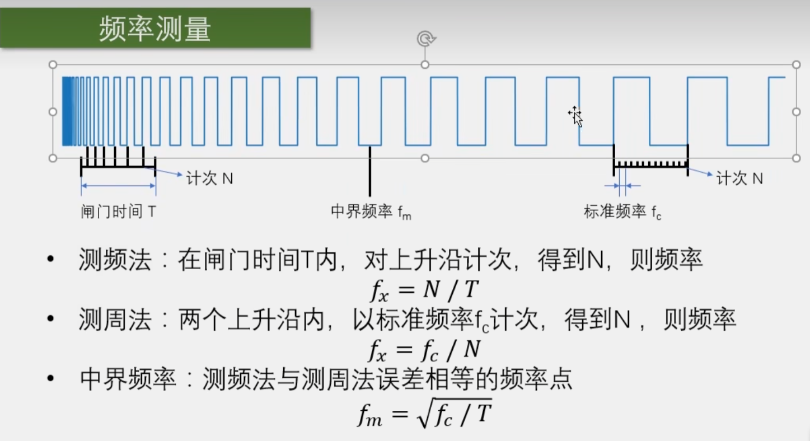
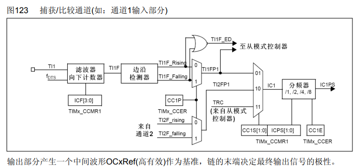
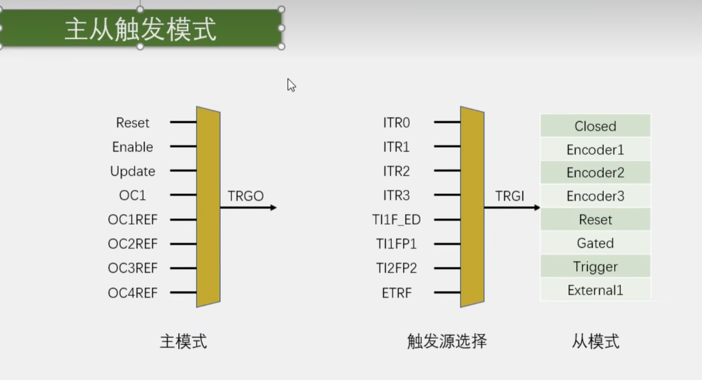
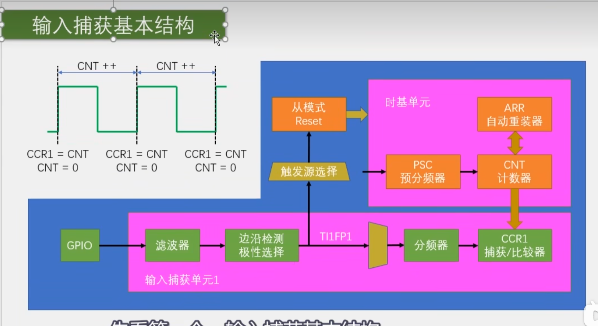
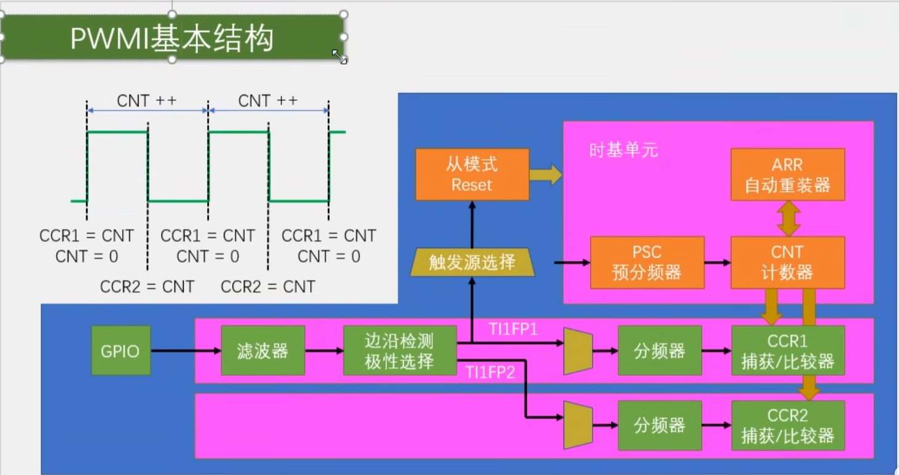
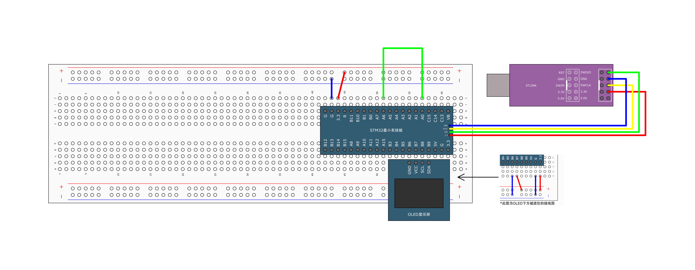

# [STM32]Day6-Part3

## 输入捕获

**IC（Input Capture）**，输入捕获。输入捕获模式下，当通道输入引脚出现指定电平跳变时，当前CNT的值将被锁存到CCR中，可用于测量PWM波形的频率、占空比、脉冲间隔、电平持续时间等参数。

每个高级定时器和通用定时器都拥有4个输入捕获通道。可配置为PWMI模式，同时测量频率和占空比。可配合主从触发模式，实现硬件全自动测量。

## 频率测量



STM32只能测量数字信号的频率。测频法适合测量高频信号，测周法适合测量低频信号。测频法测量结果更新较慢，数值相对稳定，因为测的是一段时间内的平均频率。测周法测量结果更新快，数值相对不稳定，噪声大。

## 通用定时器如何实现测周法


信号从TIMx_CH1输入，经过滤波器和边沿检测器，产生两个信号**TI1FP1（TI1 Filter Polarity 1）**和**TI1FP2（TI1 Filter Polarity 2）**，这样做可以把一个引脚的输入映射到两个捕获/比较寄存器中，是PWMI的经典模式。预分频器可以对前面的信号进行分频，分频之后CCR每接收到一个触发信号，CNT的值就向CCR转运一次，同时发生一个捕获事件，这个事件会在状态寄存器置标志位，同时也可以产生中断。

这样以来，TIMx_CH1每输入一个上升沿，CCR就读取一次CNT的值，两次CNT的值做差就是N，CNT的工作频率是Fc，从而实现测周法。

## 输入捕获通道



TI1F_ED和TI1FP1信号可以送至从模式控制器，从而实现CNT的自动清零。

## 主从触发模式



主从触发模式 = 主模式 + 从模式+ 触发源选择。主模式可以将定时器内部的信号，映射到TRGO引脚，用于触发别的外设。从模式接收其他外设或者自身外设的一些信号，用于控制自身定时器的运行。触发源选择指的是选择从模式的触发信号源，选择一个指定的信号，得到TRGI来触发从模式。

如果要实现CNT清零，可以选择TI1FP1作为触发源，执行Reset操作。

## 输入捕获基本结构



只使用一个通道，所以只能测量频率。配置好时基单元让CNT按照频率fc计数，待测量信号从GPIO输入，经过处理电路到达CCR时，触发CNT的值转移到CCR，此时CCR中的值就是N，GPIO输入信号的频率就为fc / N，同时选择TI1FP1做触发源，执行Reset操作清空CNT，为下一次计数做准备。

注意CNT的值最大为65535，因此待测量信号频率不能太低。触发源选择中只有TI1FP1和TI2FP2，因此如果希望实现CNT自动清零，那么只能使用CH1和CH2。

## PWMI基本结构



**PWMI**能够实现两个通道同时捕获一个引脚，TI1FP1设置上升沿触发，触发从模式Reset自动清零可以实现测量周期（频率）；TI1FP2设置下降沿触发通过交叉通道触发CCR2，可以测量高电平的时长，进而测量占空比，最终占空比= CCR2 / CCR1。

## 输入捕获



根据输入捕获的基本结构，初始化整体顺序为：配置GPIO -> 配置时基单元 -> 配置输入捕获单元 -> 选择从模式触发源 -> 选择触发后执行的操作 -> TIM_cmd()时钟控制开启定时器

测频率

```c
// PWM.c
#include "stm32f10x.h"                  // Device header

void PWM_Init(void)
{
	// 使能定时器时钟
	RCC_APB1PeriphClockCmd(RCC_APB1Periph_TIM2, ENABLE);
	
	// 选择内部时钟源
	TIM_InternalClockConfig(TIM2);
	
	// 配置时基单元
	TIM_TimeBaseInitTypeDef TIM_TimeBaseInitStructure;
	TIM_TimeBaseInitStructure.TIM_ClockDivision = TIM_CKD_DIV1;		// 滤波模块时钟配置，影响不大
	TIM_TimeBaseInitStructure.TIM_CounterMode = TIM_CounterMode_Up;
	TIM_TimeBaseInitStructure.TIM_Period = 100 - 1;		// ARR
	TIM_TimeBaseInitStructure.TIM_Prescaler = 720 - 1;		// PSC
	TIM_TimeBaseInitStructure.TIM_RepetitionCounter = 0;
	TIM_TimeBaseInit(TIM2, &TIM_TimeBaseInitStructure);
	
	// 配置输出比较单元
	TIM_OCInitTypeDef TIM_OCInitStructure;
	TIM_OCStructInit(&TIM_OCInitStructure);		// 设置默认值，后续只修改必要的参数
	TIM_OCInitStructure.TIM_OCMode = TIM_OCMode_PWM1;		// 输出比较模式：PWM1
	TIM_OCInitStructure.TIM_OCPolarity = TIM_OCPolarity_High;		// 输出比较极性：高极性ref不翻转；低极性翻转
	TIM_OCInitStructure.TIM_OutputState = TIM_OutputState_Enable;		// 输出使能
	TIM_OCInitStructure.TIM_Pulse = 0;		// 设置CCR的值
	TIM_OC2Init(TIM2, &TIM_OCInitStructure); 	// 由于PA0松动，选择TIM2的OC2引脚即CH2，复用在PA1上
	
	// 使能定时器（运行控制）
	TIM_Cmd(TIM2, ENABLE);
	
	// 初始化引脚
	RCC_APB2PeriphClockCmd(RCC_APB2Periph_GPIOA, ENABLE);
	GPIO_InitTypeDef GPIO_InitStructure;
	GPIO_InitStructure.GPIO_Mode = GPIO_Mode_AF_PP;			// 复用推挽输出
	GPIO_InitStructure.GPIO_Pin = GPIO_Pin_1;
	GPIO_InitStructure.GPIO_Speed = GPIO_Speed_50MHz;
	GPIO_Init(GPIOA, &GPIO_InitStructure);
}

void PWM_SetCompare2(uint16_t Compare)
{
	TIM_SetCompare2(TIM2, Compare);
}

void PWM_SetPrescaler(uint16_t Prescaler)
{
	TIM_PrescalerConfig(TIM2, Prescaler, TIM_PSCReloadMode_Update);
}

// PWM.h
#ifndef __PWM_H
#define __PWN_H

void PWM_Init(void);
void PWM_SetCompare2(uint16_t Compare);
void PWM_SetPrescaler(uint16_t Prescaler);

#endif

// IC.c
#include "stm32f10x.h"                  // Device header

void IC_Init(void)
{
	// 配置GPIO
	RCC_APB2PeriphClockCmd(RCC_APB2Periph_GPIOA, ENABLE);
	GPIO_InitTypeDef GPIO_InitStructure;
	GPIO_InitStructure.GPIO_Mode = GPIO_Mode_IPU;	// 上拉输入
	GPIO_InitStructure.GPIO_Pin = GPIO_Pin_6;
	GPIO_InitStructure.GPIO_Speed = GPIO_Speed_50MHz;
	GPIO_Init(GPIOA, &GPIO_InitStructure);
	
	// 配置时基单元
	RCC_APB1PeriphClockCmd(RCC_APB1Periph_TIM3, ENABLE);
	TIM_InternalClockConfig(TIM3);
	TIM_TimeBaseInitTypeDef TIM_TimeBaseInitStructure;
	TIM_TimeBaseStructInit(&TIM_TimeBaseInitStructure);
	TIM_TimeBaseInitStructure.TIM_CounterMode = TIM_CounterMode_Up;
	TIM_TimeBaseInitStructure.TIM_Period = 65536 - 1;		// ARR
	TIM_TimeBaseInitStructure.TIM_Prescaler = 72 - 1;		// PSC
	TIM_TimeBaseInit(TIM3, &TIM_TimeBaseInitStructure);
	
	// 配置输入捕获单元
	TIM_ICInitTypeDef TIM_ICInitStructure;
	TIM_ICInitStructure.TIM_Channel = TIM_Channel_1;
	TIM_ICInitStructure.TIM_ICFilter = 0xF;
	TIM_ICInitStructure.TIM_ICPolarity = TIM_ICPolarity_Rising;
	TIM_ICInitStructure.TIM_ICPrescaler = TIM_ICPSC_DIV1;
	TIM_ICInitStructure.TIM_ICSelection = TIM_ICSelection_DirectTI;		// 直连通道
	TIM_ICInit(TIM3, &TIM_ICInitStructure);
	
	// 选择从模式触发源
	TIM_SelectInputTrigger(TIM3, TIM_TS_TI1FP1);
	
	// 选择触发的操作
	TIM_SelectSlaveMode(TIM3, TIM_SlaveMode_Reset);
	
	// 使能时钟
	TIM_Cmd(TIM3, ENABLE);
}

uint32_t IC_GetFreq(void)
{
	return 1000000 / (TIM_GetCapture1(TIM3) + 1);
}

// IC.h
#ifndef __IC_H
#define __IC_H

void IC_Init(void);
uint32_t IC_GetFreq(void);

#endif

// main.c
#include "stm32f10x.h"                  // Device header
#include "OLED_Hardware.h"
#include "PWM.h"
#include "Delay.h"
#include "IC.h"

int main(void)
{
	
	OLED_Init_H();
	PWM_Init();
	IC_Init();
	
	OLED_ShowString_H(1, 1, "Freq:00000Hz");
	
	PWM_SetPrescaler(720 - 1);
	PWM_SetCompare2(50);

	while(1)
	{
		OLED_ShowNum_H(1, 6, IC_GetFreq(), 5);
	}
}

```

## PWMI

电路图与之前相同，配置输入捕获单元时要配置CH1和CH2同时捕获GPIO口的输入。使用`TIM_PWMIConfig()`函数可以方便快捷地实现输入捕获单元的配置，只需设置一个通道的参数，另一个通道会设置为相反的条件。例如CH1配置上升沿触发，`TIM_PWMIConfig()`会自动配置CH2为下降沿触发。

代码

```c
// IC.c
#include "stm32f10x.h"                  // Device header

void IC_Init(void)
{
	// 配置GPIO
	RCC_APB2PeriphClockCmd(RCC_APB2Periph_GPIOA, ENABLE);
	GPIO_InitTypeDef GPIO_InitStructure;
	GPIO_InitStructure.GPIO_Mode = GPIO_Mode_IPU;	// 上拉输入
	GPIO_InitStructure.GPIO_Pin = GPIO_Pin_6;
	GPIO_InitStructure.GPIO_Speed = GPIO_Speed_50MHz;
	GPIO_Init(GPIOA, &GPIO_InitStructure);
	
	// 配置时基单元
	RCC_APB1PeriphClockCmd(RCC_APB1Periph_TIM3, ENABLE);
	TIM_InternalClockConfig(TIM3);
	TIM_TimeBaseInitTypeDef TIM_TimeBaseInitStructure;
	TIM_TimeBaseStructInit(&TIM_TimeBaseInitStructure);
	TIM_TimeBaseInitStructure.TIM_CounterMode = TIM_CounterMode_Up;
	TIM_TimeBaseInitStructure.TIM_Period = 65536 - 1;		// ARR
	TIM_TimeBaseInitStructure.TIM_Prescaler = 72 - 1;		// PSC
	TIM_TimeBaseInit(TIM3, &TIM_TimeBaseInitStructure);
	
	// 配置输入捕获单元
	TIM_ICInitTypeDef TIM_ICInitStructure;
	TIM_ICInitStructure.TIM_Channel = TIM_Channel_1;
	TIM_ICInitStructure.TIM_ICFilter = 0xF;
	TIM_ICInitStructure.TIM_ICPolarity = TIM_ICPolarity_Rising;
	TIM_ICInitStructure.TIM_ICPrescaler = TIM_ICPSC_DIV1;
	TIM_ICInitStructure.TIM_ICSelection = TIM_ICSelection_DirectTI;		// 直连通道
	// TIM_ICInit(TIM3, &TIM_ICInitStructure);
	TIM_PWMIConfig(TIM3, &TIM_ICInitStructure);
	
	// 选择从模式触发源
	TIM_SelectInputTrigger(TIM3, TIM_TS_TI1FP1);
	
	// 选择触发的操作
	TIM_SelectSlaveMode(TIM3, TIM_SlaveMode_Reset);
	
	// 使能时钟
	TIM_Cmd(TIM3, ENABLE);
}

uint32_t IC_GetFreq(void)
{
	return 1000000 / (TIM_GetCapture1(TIM3) + 1);
}

uint32_t IC_GetDuty(void)
{
	return (TIM_GetCapture2(TIM3) + 1) * 100 / TIM_GetCapture1(TIM3);
}

// IC.h
#ifndef __IC_H
#define __IC_H

void IC_Init(void);
uint32_t IC_GetFreq(void);
uint32_t IC_GetDuty(void);

#endif

// main.c
#include "stm32f10x.h"                  // Device header
#include "OLED_Hardware.h"
#include "PWM.h"
#include "Delay.h"
#include "IC.h"

int main(void)
{
	
	OLED_Init_H();
	PWM_Init();
	IC_Init();
	
	OLED_ShowString_H(1, 1, "Freq:00000Hz");
	OLED_ShowString_H(2, 1, "Duty:00%");
	
	PWM_SetPrescaler(7200 - 1);
	PWM_SetCompare2(80);

	while(1)
	{
		OLED_ShowNum_H(1, 6, IC_GetFreq(), 5);
		OLED_ShowNum_H(2, 6, IC_GetDuty(), 2);
	}
}

// 其他与之前相同
```

