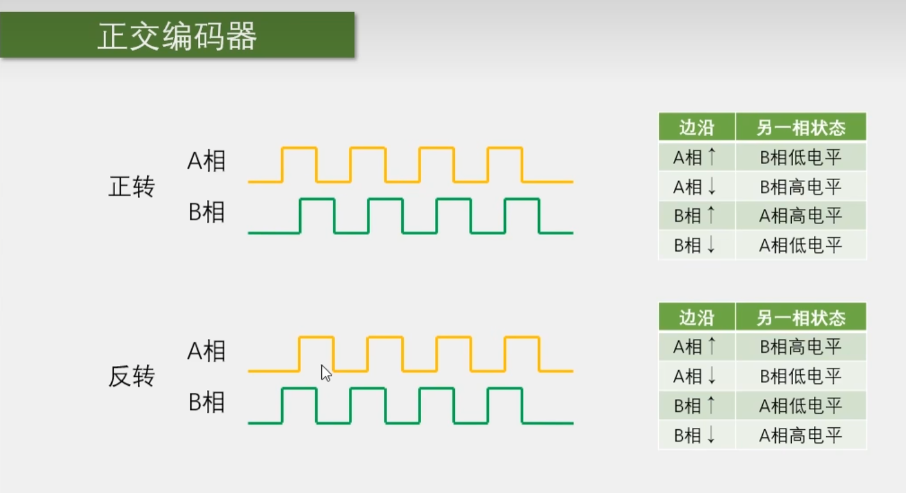
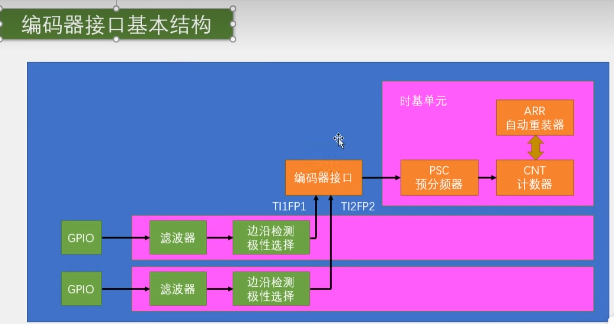
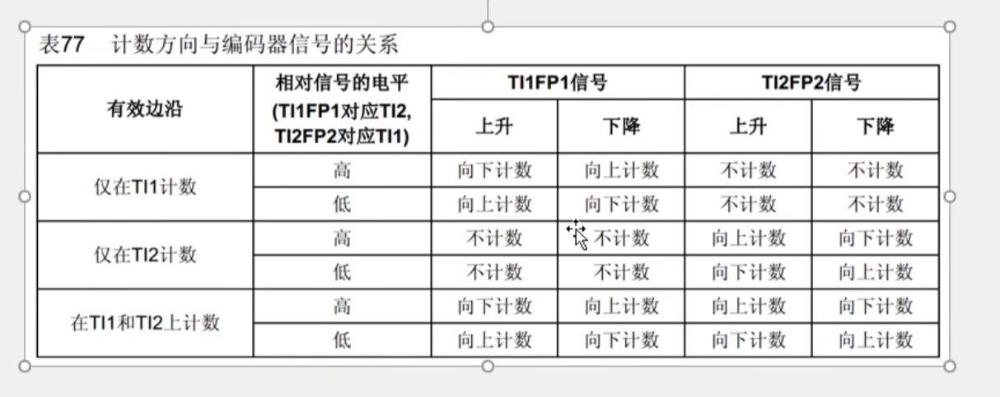
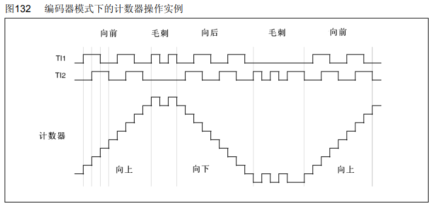
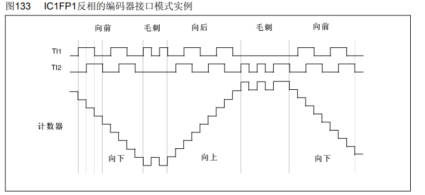
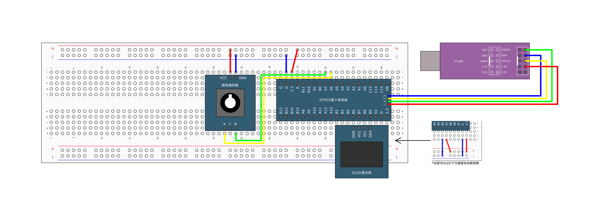

# [STM32]Day6-Part4

## 编码器接口简介

Encoder Interface编码器接口，编码器接口可接收增量（正交）编码器的信号，根据编码器旋转产生的正交信号脉冲，自动控制CNT自增或自减，从而指示编码器的位置、旋转方向和旋转速度。

每个高级定时器和通用定时器都拥有一个编码器接口，两个输入引脚借用了输入捕获通道的通道1和通道2。



正交编码器一般可以测量位置，或者带有方向的速度值。正反转方向可以根据AB相信号再某一时刻的状态来判断，具体如图中右表。

## 编码器测速原理


编码器AB相分别接TIMx_CH1和TIMx_CH2，经过滤波和边沿检测产生TI1FP1和TI2FP2信号，输入编码器接口。编码器接口的输出信号，控制CNT的计数时钟和计数方向，此时内部时钟源、时基单元初始化设置的计数方向不起作用。

## 编码器接口基本结构



编码器模式下上升沿和下降沿都是有效的，因此极性选择不再是选择上升沿/下降沿，而是是否让TI1/TI2信号经过非门进行反转，也叫反相。

工作模式



在TI1和TI2上计数的精度较高。

下面是TI1和TI2均不反相时的编码器模式实例。



毛刺部分前后计数器的值不变，体现了使用正交信号抗噪能力强的特点。

下面是TI1经过反相时编码器模式实例



## 编码器接口测速



整体流程：配置GPIO -> 配置时基单元 -> 配置输入捕获单元 -> 配置编码器接口 -> TIM_cmd使能计数器

关于输入模式：上拉输入/下拉输入/浮空输入的选择，上拉输入和下拉输入一般由外设的默认电平确定，旋转编码器默认输出高电平，因此PA6和PA7选择上拉输入。

```c
// RotaryEncoder.c
#include "stm32f10x.h"                  // Device header

int16_t RotaryEncoder_Count;

void RotaryEncoder_Init(void)
{
	// 配置GPIO
	RCC_APB2PeriphClockCmd(RCC_APB2Periph_GPIOA, ENABLE);
	GPIO_InitTypeDef GPIO_InitStructure;
	GPIO_InitStructure.GPIO_Mode = GPIO_Mode_IPU;		// 上拉输入
	GPIO_InitStructure.GPIO_Pin = GPIO_Pin_6 | GPIO_Pin_7;
	GPIO_InitStructure.GPIO_Speed = GPIO_Speed_50MHz;
	GPIO_Init(GPIOA, &GPIO_InitStructure);
	
	// 配置时基单元
	RCC_APB1PeriphClockCmd(RCC_APB1Periph_TIM3, ENABLE);
	TIM_TimeBaseInitTypeDef TIM_TimeBaseInitStructure;
	TIM_TimeBaseStructInit(&TIM_TimeBaseInitStructure);
	TIM_TimeBaseInitStructure.TIM_Period = 65536 - 1;
	TIM_TimeBaseInitStructure.TIM_Period = 1 - 1;
//	TIM_TimeBaseInitStructure.TIM_CounterMode = TIM_CounterMode_Up;		计数方向由编码器决定，无需设置
	TIM_TimeBaseInit(TIM3, &TIM_TimeBaseInitStructure);
	
	// 配置输入捕获单元
	TIM_ICInitTypeDef TIM_ICInitStructure;
	TIM_ICStructInit(&TIM_ICInitStructure);
	// 通道1
	TIM_ICInitStructure.TIM_Channel = TIM_Channel_1;
	TIM_ICInitStructure.TIM_ICFilter = 0xF;
	TIM_ICInitStructure.TIM_ICPolarity  = TIM_ICPolarity_Rising;		// 不代表上升沿，而是说明不反相
	TIM_ICInit(TIM3, &TIM_ICInitStructure);
	// 通道2
	TIM_ICInitStructure.TIM_Channel = TIM_Channel_2;
	TIM_ICInitStructure.TIM_ICFilter = 0xF;
	TIM_ICInitStructure.TIM_ICPolarity  = TIM_ICPolarity_Rising;		// 不代表上升沿，而是说明不反相
	TIM_ICInit(TIM3, &TIM_ICInitStructure);
	
	// 配置编码器接口，
	// TIM_ICPolarity_Rising, TIM_ICPolarity_Rising两个参数与上面配置通道的极性选择配置的是同一个寄存器
	TIM_EncoderInterfaceConfig(TIM3, TIM_EncoderMode_TI12, TIM_ICPolarity_Rising, TIM_ICPolarity_Rising);
	
	// 使能计数器
	TIM_Cmd(TIM3, ENABLE);
}

int16_t RotaryEncoder_Get(void)
{
//	return TIM_GetCounter(TIM3);		// 显示位置
	int16_t Temp;
	Temp = TIM_GetCounter(TIM3);
	TIM_SetCounter(TIM3, 0);		// 清零CNT
	return Temp;
}

// RotaryEncoder.h
#ifndef __RotaryEncoder_H
#define __ROtaryEncoder_H

void RotaryEncoder_Init(void);
int16_t RotaryEncoder_Get(void);

#endif

// main.c
#include "stm32f10x.h"                  // Device header
#include "Delay.h"
#include "OLED_Software.h"
#include "RotaryEncoder.h"
#include "Timer.h"

int16_t Speed;

int main(void)
{
	
	OLED_Init();
	Timer_Init();
	RotaryEncoder_Init();
	
	OLED_ShowString(1, 1, "Speed:");

	while(1)
	{
		
		OLED_ShowSignedNum(1, 7, Speed, 5);
//		Delay_ms(1000);		// 容易阻塞主程序
	}
}

// 重写中断函数
void TIM2_IRQHandler(void)
{
	// 检查标志位
	if(TIM_GetITStatus(TIM2, TIM_IT_Update) == SET) {
		Speed = RotaryEncoder_Get();
		// 清除标志位
		TIM_ClearITPendingBit(TIM2, TIM_IT_Update);
	}
}

```

