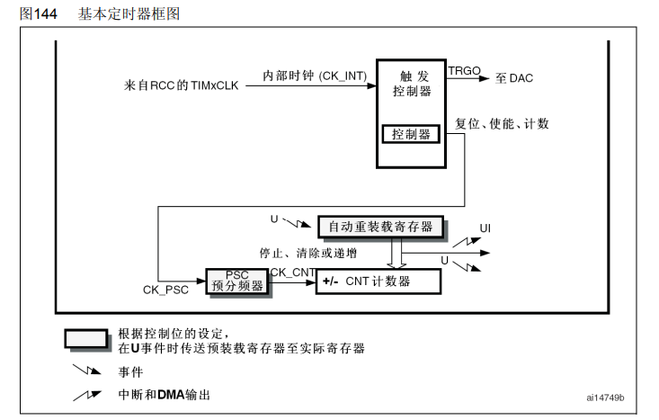
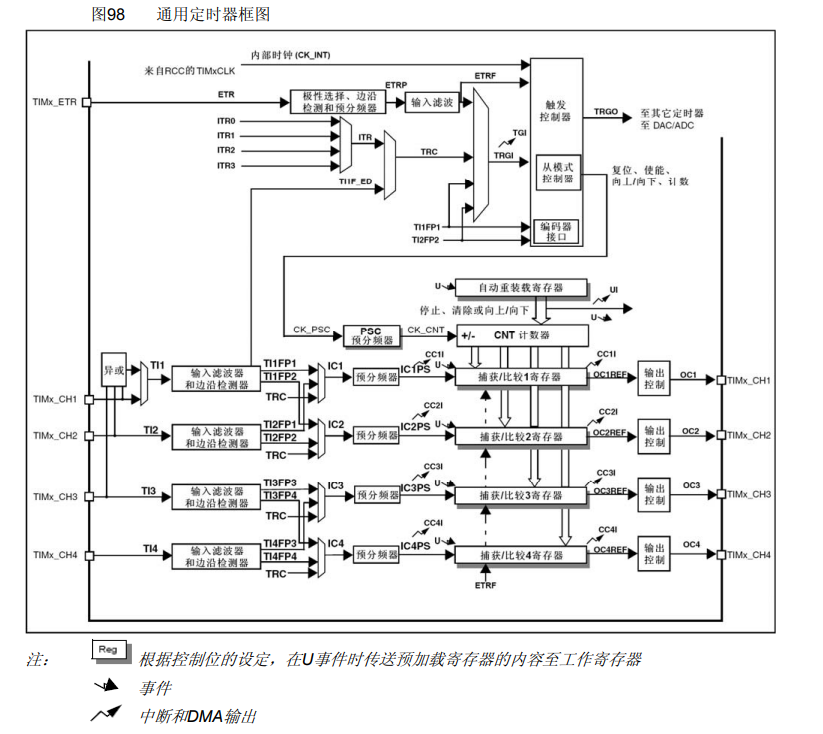
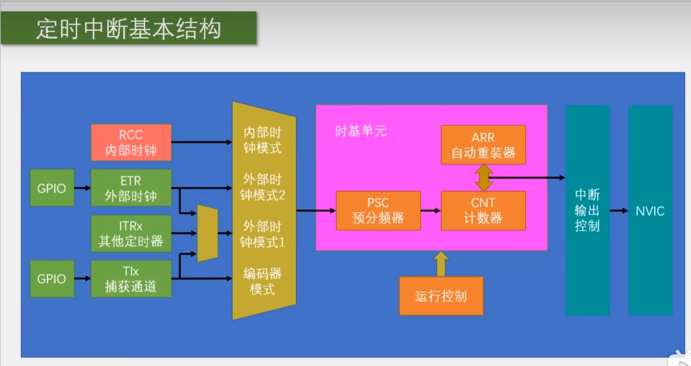
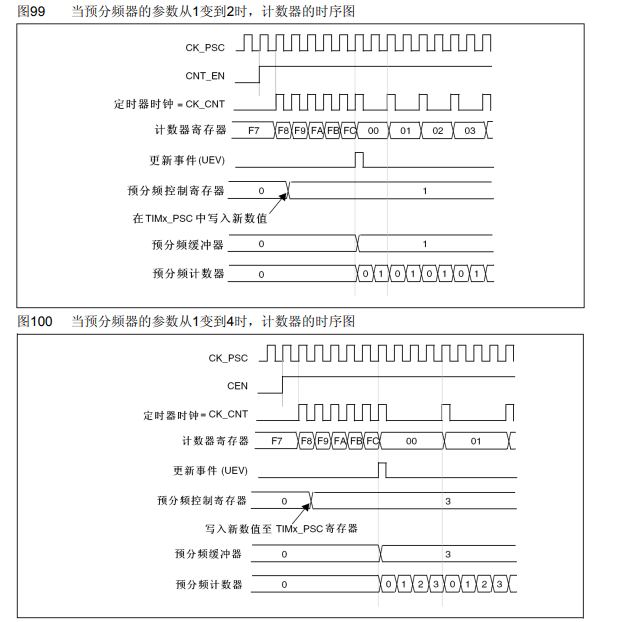
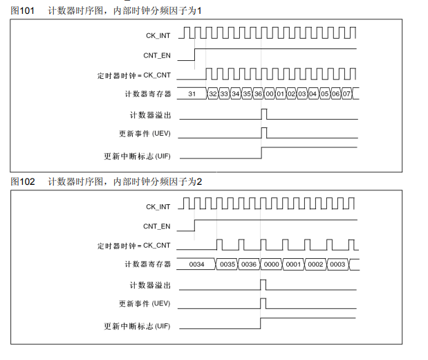
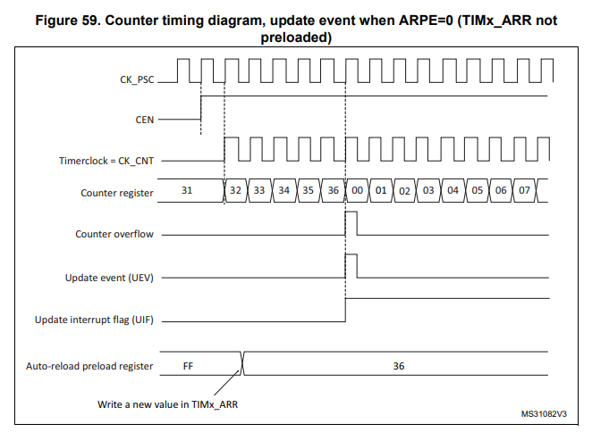
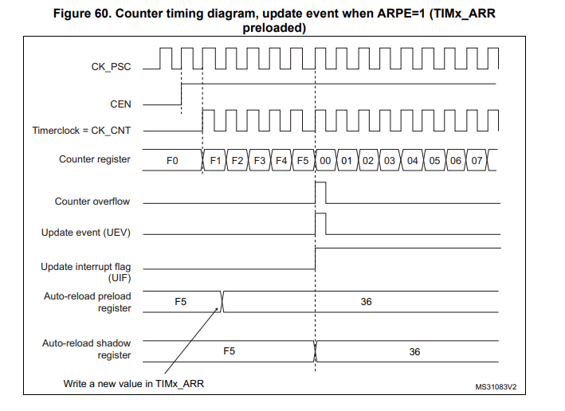
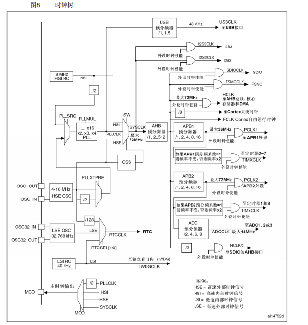
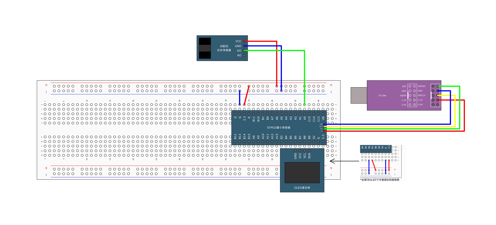

# [STM32]Day6-Part1

## TIM

TIM（Timer，定时器）可以对输入的时钟进行计数，并在计数值达到设定值时触发中断。

16位计数器、预分频器、自动重装寄存器的时基单元，在72MHz技术时钟下可以实现最大59.65s的定时。

不仅具备基本的定时中断功能，而且包含内外时钟源选择、输入捕获、输出比较、编码器接口、主从触发模式等多种功能。

根据复杂度和应用场景分为高级定时器、通用定时器、基本定时器三种类型。

| 类型       | 编号                   | 总线 | 功能                                                         |
| ---------- | ---------------------- | ---- | ------------------------------------------------------------ |
| 高级定时器 | TIM1、TIM8             | APB2 | 拥有通用定时器的全部功能，并额外具有重复计数器、死区生成、互补输出、刹车输入等功能 |
| 通用定时器 | TIM2、TIM3、TIM4、TIM5 | APB1 | 拥有基本定时器全部功能，并额外由内外时钟源选择、输入捕获、输出比较、编码器接口、主从触发模式等功能 |
| 基本定时器 | TIM6、TIM7             | APB1 | 拥有定时中断、主模式触发DAC的功能                            |

STM32F103C8T6定时器资源：TIM1、TIM2、TIM3、TIM4

## 基本定时器



预分频器、自动重装载寄存器、CNT计数器共同组成**时基单元**。

基本定时器使用内部时钟（CK_INT）作为工作时钟，STM32中一般为72MHz。

PSC预分频器的作用是把输入时钟分频，得到真正送给计数器CNT的计数时钟。例如`TIM_Prescaler = 7200 - 1`，如果输入时钟为72MHz，经过PSC后频率变为`72MHz / 7200 = 10kHz`，也就是说CNT每`1 / 10k = 0.1ms`计数加一。

ARR自动重装载寄存器决定CNT数到多少后溢出，例如`ARR = 10000 - 1`，计数器的计数范围为`0, 1, ... 9999`。PSC和ARR共同决定计数时间：`定时时间 = 1 / (输入频率 / (PSC * ARR)) = (PSC * ARR) / 输入频率`。

CNT是Counter，计数器本体，基本定时器一般只支持向上计数，即计数值`0, 1, 2 ...`，每来一个**上升沿**计数加一。

“根据控制位的设定，在 U 事件时传送预装载寄存器至实际寄存器”，在STM32中，有些寄存器不是一些入就立刻生效，而是先写入**预装载寄存器**，等待更新事件U发生后，再转移到真正工作的寄存器。这样做可以**防止计数过程中参数突然变化，导致定时周期异常**。

更新事件U（Update Event），通常在以下情况产生：CNT计数溢出、软件手动产生更新事件、定时器重新初始化时产生更新事件。更新事件发生后，通常可以进行

```
CNT重新从0开始计数
PSC、ARR新值装载生效
可以产生中断
可以产生DMA请求
可以产生TRGO输出
```

中断和DMA输出。当更新事件发生后，如果使能了更新中断，就会进入定时器中断函数。例如

```c
TIM_ITConfig(TIM6, TIM_IT_Update, ENABLE);
```

当CNT溢出时，会触发

```c
TIM6_IRQHandler(void)
```

如果使能DMA请求，则更新事件也可以触发DMA传输。所以基本定时器常用于

```
周期性中断
周期性执行任务
周期性触发DMA
周期性触发DAC
```

触发控制器TRGO（Trigger Output，触发输出）可以用于触发DAC转换，典型用途`TIM6 定时产生 TRGO -> DAC 接收 TRGO -> DAC 按固定频率输出波形`

基本定时器**整体工作流程**可以概括为

```
RCC 提供 TIMxCLK
        ↓
PSC 对时钟进行分频
        ↓
CNT 按分频后的时钟递增计数
        ↓
CNT 计到 ARR 后溢出
        ↓
产生更新事件 U
        ↓
CNT 清零重新计数
        ↓
可触发中断、DMA 或 TRGO
```

总结：**基本定时器就是一个由内部时钟驱动的向上计数器。通过PSC分频、ARR设定周期、CNT计满产生更新事件，从而触发中断、DMA或DAC**。

## 通用定时器



与基本定时器相比，通用定时器在可以实现基本定时器所有功能的基础上，还能实现：

```
定时中断
PWM 输出
输入捕获
输出比较
编码器计数
外部脉冲计数
主从定时器同步
触发 ADC / DAC
DMA 传输
```

### 时钟源选择部分

通用定时器的时钟源有

```
来自 RCC 的 TIMxCLK
TIMx_ETR
ITR0 ~ ITR3
TI1F_ED
TI1FP1 / TI2FP2
```

#### 内部时钟CK_INT

与基本定时器相同，STM32中为72MHz。

#### 外部触发输入ETR

```
TIMx_ETR → ETR → 极性选择、边沿检测和预分频器 → 输入滤波
```

ETR是**External Trigger Input**，它可以让外部引脚上的信号参与定时器控制，例如

```
外部脉冲作为计数时钟
外部信号启动定时器
外部信号复位定时器
外部信号触发一次定时操作
```

极性选择、边沿检测、预分频、输入滤波等一些列操作可以提升抗干扰能力。

使用ETR做工作时钟的模式叫“外部时钟模式2”

#### 内部触发输入ITR0 - ITR3

ITR是**Internal Trigger**，内部触发信号，用于实现定时器的主从模式，即多个定时器的联动。

#### TI1F_ED、TI1FP1、TI1FP2

这些信号来自定时器通道输入，例如CH1、CH2，可以作为定时器触发源或计数源。

### 触发控制器

TRGO（Trigger Output）与基本定时器相似，可以用于硬件触发DAC、ADC，避免CPU被频繁打断。

### 从模式控制器

从模式控制器用于控制定时器如何响应外部或内部触发信号，它可以让定时器工作在不同的**从模式**下，例如：

- 复位模式：外部触发信号一来，CNT被清零
- 门控模式：只有外部信号有效时，定时器才计数
- 外部时钟模式：外部时钟作为CNT的计数时钟，来一次计数器加1
- 编码器模式：CH1和CH2接旋转编码器A、B相，定时器自动判定方向并计数

### 时基单元：PSC+ARR+CNT、更新事件U、中断和DMA输出

与基本计时器相同，CNT支持向上计数、向下计数、中央对齐模式。

### 输入通道部分：CH1 - CH4

CH1 - CH4四个通道可以作为输入，也可以作为输出。作为输入时，可以用于：**输入捕获**、测频率、测周期、测脉宽、测占空比......每个通道后有输入滤波器和边沿检测器用于处理外部输入信号。滤波器用于去除毛刺信号，边沿检测器用于选择检测上升沿/下降沿/双边沿。经过处理得到TIxFPx信号，送往捕获/比较模块用于输入捕获。

### 捕获/比较寄存器CCR1 - CCR4

CCR是通用定时器中非常重要的寄存器，主要有两种用途：**输入捕获时：保存CNT的值**，**输出比较时：与CNT比较**。

#### 输入捕获模式

输入捕获时，外部信号边沿到来，当前CNT的值会被保存到CCRx中，例如：

```
CH1 检测到上升沿
当前 CNT = 3560
CCR1 = 3560
```

通过两次捕获值的差，可以计算输入信号的频率或周期

```
第一次捕获 CCR1 = 1000
第二次捕获 CCR1 = 3000
差值 = 2000
```

如果CNT计数频率为1MHz，则输入信号周期为`2000 / 1 MHz = 2 ms`，频率为`1 / 2 ms = 500 Hz`。

#### 输出比较模式

输出比较模式下，CNT会不断与CCRx比较，当`CNT == CCRx`时就产生比较匹配事件，可以用来：翻转输出电平、置高/低电平、产生PWN、产生中断、产生DMA请求

### 输出控制部分

右侧：

```
输出控制
OC1
OC2
OC3
OC4
TIMx_CH1
TIMx_CH2
TIMx_CH3
TIMx_CH4
```

当通道作为输出时，CCR和CNT的比较结果会送到输出控制模块，决定引脚输出什么波形

### PWM输出

PWM指的是**Pulse Width Modulation**，脉冲宽度调制。本质是“**用一串高低电平快速切换的方波，通过改变高电平持续时间的比例，来控制等效输出效果**”。

PWM输出是通用定时器最常用的功能之一。PWN的周期由ARR决定：`PWM 频率 = TIMxCLK / ((PSC + 1) × (ARR + 1))`，占空比有CCRx决定：`占空比 = CCRx / (ARR + 1)`

其中ARR决定PWM周期，CCR决定PWM的占空比。

### 编码器接口

输入CH1、CH2的信号可以进入编码器接口相关逻辑。

常用的是：

```
TIMx_CH1 接编码器 A 相
TIMx_CH2 接编码器 B 相
```

定时器根据A、B相的相位关系判断方向，例如：

```
A 相领先 B 相 → 正转 → CNT 加
B 相领先 A 相 → 反转 → CNT 减
```

使用编码器时，软件不需要每次中断都去判断方向，定时器硬件会自动完成计数。

### 通用定时器整体工作流程

作为普通定时器使用：

```
RCC 提供 TIMxCLK
        ↓
PSC 预分频
        ↓
CNT 计数
        ↓
CNT 计到 ARR
        ↓
产生更新事件 U
        ↓
触发中断 / DMA / TRGO
```

作为PWM输出使用

```
RCC 提供 TIMxCLK
        ↓
PSC 分频
        ↓
CNT 从 0 计到 ARR
        ↓
CNT 与 CCRx 比较
        ↓
输出控制模块产生 PWM
        ↓
从 TIMx_CHx 引脚输出
```

作为输入捕获使用

```
外部信号进入 TIMx_CHx
        ↓
输入滤波和边沿检测
        ↓
检测到指定边沿
        ↓
把当前 CNT 值保存到 CCRx
        ↓
产生捕获中断或 DMA 请求
```

作为编码器使用

```
编码器 A/B 相输入 CH1 / CH2
        ↓
输入滤波和边沿检测
        ↓
编码器接口判断方向
        ↓
CNT 自动加减
        ↓
读取 CNT 得到位置变化
```

## 定时中断基本结构



## 预分频器时序



CK_PSC是预分频器的输入时钟，CNT_EN是计数器使能信号，高电平时计数器正常工作，低电平时计数器停止。CK_CNT是预分频器输出的时钟，也是计数器的输入时钟。当CNT_EN变为高电平后，经过一段延时分频器才会产生第一个CK_CNT脉冲，计数器才开始工作。

这里的**预分频器的参数**指的是**预分频器系数**，与PSC的关系为：**预分频系数 = PSC + 1**，因此预分频器的参数从1变到2，说明PSC从0变到1，从**预分频控制寄存器**的值也可以看出。

图99中起初PSC = 0，输出频率与输入频率相同，中间向PSC写入新值1，但是由于UEV更新事件没发生，此时的PSC新值还在**预装载寄存器（即图中的预分频控制寄存器，Prescaler control register）**，所以输出频率不变。之后UEV发生，新值写入PSC，即**预分频缓冲器（Prescaler buffer）**，输出频率变为输入频率的一半。

## 计数器时序图



CK_INT是内部时钟72MHz，CNT_EN时钟使能信号，时钟使能信号变为高电平后，一段时间后PSC发出第一个脉冲，计数器开始工作，每个周期计数加1，达到ARR后溢出，产生更新事件，并将更新中断标志UIF置为1，申请中断，因此需要在中断函数中将UIF置0。

计数器溢出的频率叫溢出频率，`溢出频率 = PSC输入频率 / (PSC + 1)(ARR + 1)`。

## 自动重装载寄存器ARR

自动重装载寄存器有两种模式，**预装载**和**不预装载**。不预装载模式下，修改ARR的值，计数范围会在当前计数周期改变，如下图，在计数时将ARR由FF修改为36，则计数最大值立刻变为36。



预装载模式下，修改ARR的值，计数范围不会立刻改变，此时计数范围由自动重装载影子寄存器**Auto-reload preload register**决定，只有在计数溢出后，更新事件UEV发生，才将ARPR(**Auto-reload preload register**)的值写入ARSR(**Auto-reload preload register**)自动重装载影子寄存器，计数范围才变。

## 时钟树



### 时钟源部分：产生原始时钟

#### HSI：高速内部时钟

HSI（**High-speed Interal clock signal**），8MHz，不需要外部晶振，上电后默认使用HSI，是系统时钟**SYSCLK**的来源之一。

#### HSE：高速外部时钟

HSE（**High-speed External clock signal**），4 - 16 MHz，精度高，是**SYSCLK**的来源之一。

#### LSE：低速外部时钟

LSE（**Low-speed External clock signal**），32.768kHz，常用于RTC实时时钟，频率低，功耗低，精度比LSI好。

#### LSI：低俗内部时钟

LSI（**Low-speed Internal clock signal**），40kHz，可用于独立看门狗，也是RTC时钟源之一。

### PLL部分：倍频产生高速时钟

PLL，锁相环倍频器，可以把低频率的时钟变成高频率时钟。来源有两个：**HSI**和**HSE**。

HSI可直接作为系统时钟SYSCLK，也可经过PLL，经过PLL之前要先将频率将为一半，即4MHz。

HSE可直接进入PLL，也可先降频一半进入PLL。

PLLMUL是PLL倍频系数，可以是`x2, x3,..., x16`，当HSE为8MHz，PLLMUL为9时，产生频率为`8MHz * 9 = 72MHz`，这是STM32F1常见系统时钟。

### SYSCLK部分：选择系统主时钟

`SW`选择器实现系统主时钟SYSCLK来源的选择，可以是HSI，HSE，PLLCLK。SYSCLK时整个芯片的的主时钟，后面的AHB、APB1、APB2都是经过SYSCLK分配得到的。

### 时钟分配电路

SYSCLK先经过AHB Prescaler进行分频，这里预设分频系数为1，即不进行降频，仍输出72MHz。

给APB1总线设置时钟时，APB1 Prescaler预设分频系数为2，即APB1频率为36MHz，且最大值为36MHz。

TIM2 -7（通用定时器+基本定时器）连在APB1上，APB1在给TIM2 - 7设置频率时，由于APB1 Prescaler分频系数为2，所以要先将频率翻倍再输出给定时器，所以TIM2 - 7频率为72MHz。

TIM1和TIM8高级定时器连在APB2上，APB2 Prescaler预设分频系数为1，所以APB2频率为72MHz，直接输出给TIM1和TIM8，因此高级定时器的频率为72MHz。综上，所有定时器的频率都为72MHz。

## 定时中断

由于定时器位于STM32内部，不涉及外部硬件，因此将定时器模块代码存放在System/下。


整体思路：使能内部时钟 -> 选择时钟源 -> 配置时基单元，包括PSC、ARR、CNT -> 配置中断输出控制（使能更新中断） -> 配置NVIC -> 使能定时器（运行控制）

需要使用的函数

```c
// 时基单元初始化函数
void TIM_TimeBaseInit(TIM_TypeDef* TIMx, TIM_TimeBaseInitTypeDef* TIM_TimeBaseInitStruct);

// 使能计数器，运行控制部分
void TIM_Cmd(TIM_TypeDef* TIMx, FunctionalState NewState);

// 使能中断输出信号
void TIM_ITConfig(TIM_TypeDef* TIMx, uint16_t TIM_IT, FunctionalState NewState);

// 以下是时钟源选择函数
void TIM_InternalClockConfig(TIM_TypeDef* TIMx);	// 选择内部时钟
void TIM_ITRxExternalClockConfig(TIM_TypeDef* TIMx, uint16_t TIM_InputTriggerSource);		// 用另一个定时器的触发信号计数，实现级联
// 使用 CH1/CH2 引脚输入脉冲计数
void TIM_TIxExternalClockConfig(TIM_TypeDef* TIMx, uint16_t TIM_TIxExternalCLKSource, uint16_t TIM_ICPolarity, uint16_t ICFilter);
// 用 ETR 引脚输入脉冲计数，外部时钟模式1
void TIM_ETRClockMode1Config(TIM_TypeDef* TIMx, uint16_t TIM_ExtTRGPrescaler, uint16_t TIM_ExtTRGPolarity, uint16_t ExtTRGFilter);
// 用 ETR 引脚输入脉冲计数，外部时钟模式2
void TIM_ETRClockMode2Config(TIM_TypeDef* TIMx, uint16_t TIM_ExtTRGPrescaler, uint16_t TIM_ExtTRGPolarity, uint16_t ExtTRGFilter);
// 只配置 ETR 引脚滤波、极性、分频，本身不启动计数
void TIM_ETRConfig(TIM_TypeDef* TIMx, uint16_t TIM_ExtTRGPrescaler, uint16_t TIM_ExtTRGPolarity, uint16_t ExtTRGFilter);

// 检查某个定时器标志位是否被置为1
FlagStatus TIM_GetFlagStatus(TIM_TypeDef* TIMx, uint16_t TIM_FLAG);
// 清除某个定时器标志位
void TIM_ClearFlag(TIM_TypeDef* TIMx, uint16_t TIM_FLAG);
// 检查某个定时器中断是否真正产生
ITStatus TIM_GetITStatus(TIM_TypeDef* TIMx, uint16_t TIM_IT);
// 清除某个定时器中断挂起位
void TIM_ClearITPendingBit(TIM_TypeDef* TIMx, uint16_t TIM_IT);
```

完成定时器驱动代码

```c
// Timer.c
#include "stm32f10x.h"                  // Device header

extern int16_t num;

void Timer_Init(void)
{
	// 使能时钟
	RCC_APB1PeriphClockCmd(RCC_APB1Periph_TIM2, ENABLE);
	
	// 选择时钟源
	TIM_InternalClockConfig(TIM2);
	
	// 配置时基单元，主要是计数模式，PSC和ARR的值，CNT未设置，可通过其他函数设置CNT起始值
	TIM_TimeBaseInitTypeDef TIM_TimeBaseInitStructure;
	TIM_TimeBaseInitStructure.TIM_ClockDivision = TIM_CKD_DIV1;		// 决定输入滤波等模块用多快的采样时钟，影响不大
	TIM_TimeBaseInitStructure.TIM_CounterMode = TIM_CounterMode_Up;		// 向上计数
	TIM_TimeBaseInitStructure.TIM_Period = 10000 - 1;		// 设置ARR
	TIM_TimeBaseInitStructure.TIM_Prescaler = 7200 - 1;		// 设置PSC
	TIM_TimeBaseInitStructure.TIM_RepetitionCounter = 0;		// 高级定时器才有的功能
	TIM_TimeBaseInit(TIM2, &TIM_TimeBaseInitStructure);
	
	// 使能更新中断，连接更新中断到NVIC
	TIM_ITConfig(TIM2, TIM_IT_Update, ENABLE);
	
	// 配置NVIC
	NVIC_PriorityGroupConfig(NVIC_PriorityGroup_2);
	NVIC_InitTypeDef NVIC_InitStructure;
	NVIC_InitStructure.NVIC_IRQChannel = TIM2_IRQn;		// 选择中断通道
	NVIC_InitStructure.NVIC_IRQChannelCmd = ENABLE;
	NVIC_InitStructure.NVIC_IRQChannelPreemptionPriority = 1;	// 抢占优先级
	NVIC_InitStructure.NVIC_IRQChannelSubPriority = 1; 		// 子优先级，响应优先级
	NVIC_Init(&NVIC_InitStructure);
	
	// 使能定时器（运行控制）
	TIM_Cmd(TIM2, ENABLE);
}

// 重写中断函数
void TIM2_IRQHandler(void)
{
	// 检查标志位
	if(TIM_GetITStatus(TIM2, TIM_IT_Update) == SET) {
		
		num ++;
		// 清除标志位
		TIM_ClearITPendingBit(TIM2, TIM_IT_Update);
	}
}

// Timer.h
#ifndef __TIMER_H
#define __TIMER_H

void Timer_Init(void);

#endif

```

完成`main.c`

```c
#include "stm32f10x.h"                  // Device header
#include "OLED_Software.h"
#include "Timer.h"

uint16_t num;

int main(void)
{
	
	OLED_Init();
	Timer_Init();
	
	OLED_ShowString(1, 1, "Count:");

	while(1)
	{
		OLED_ShowNum(1, 7, num, 6);
	}
}

```

当需要在其他.c文件里操作当前.c文件中的变量时，可以在其他.c中使用`extern`关键字。本项目还可以通过将中断函数写在`main.c`中来解决变量作用域不同的问题。

以上代码实现的定时器计数在实验过程中可以发现是从1开始计数的，说明中断函数在初始化之后就立刻执行了一次，问题出现在时基单元初始化函数`TIM_TimeBaseInit(TIM2, &TIM_TimeBaseInitStructure);`中，这个函数在结束时实行了：

```c
void TIM_TimeBaseInit(TIM_TypeDef* TIMx, TIM_TimeBaseInitTypeDef* TIM_TimeBaseInitStruct)
{
    ...
    /* Generate an update event to reload the Prescaler and the Repetition counter
     values immediately */
  TIMx->EGR = TIM_PSCReloadMode_Immediate;   
}
```

产生了一个更新事件来重置PSC和计数器的值，这导致定时器初始化完成后立刻触发中断函数，计数值加一。解决方法是定时器初始化完成后使用`TIM_ClearFlag()`清除时间更新标志位，避免产生更新事件。

## 定时器外部中断



ETR（**External Trigger**）外部触发输入配置函数

```c
// 只配置ETR输入本身的参数，不会让定时器进入外部时钟模式
void TIM_ETRClockMode1Config(TIM_TypeDef* TIMx, uint16_t TIM_ExtTRGPrescaler, uint16_t TIM_ExtTRGPolarity, uint16_t ExtTRGFilter);
// 配置ETR输入参数，设置定时器为外部时钟模式1
void TIM_ETRClockMode2Config(TIM_TypeDef* TIMx, uint16_t TIM_ExtTRGPrescaler, uint16_t TIM_ExtTRGPolarity, uint16_t ExtTRGFilter);
// 配置ETR输入参数，设置定时器为外部时钟模式2
void TIM_ETRConfig(TIM_TypeDef* TIMx, uint16_t TIM_ExtTRGPrescaler, uint16_t TIM_ExtTRGPolarity, uint16_t ExtTRGFilter);
```

定时器驱动代码

```c
// timer.c
#include "stm32f10x.h"                  // Device header

extern uint16_t num;

void Timer_Init(void)
{
	// 使能时钟
	RCC_APB1PeriphClockCmd(RCC_APB1Periph_TIM2, ENABLE);
	
	// 选择时钟源：选择外部时钟
	// 由于TIM2的ETR引脚PA0接触不亮，所以使用TIM_TIxExternalClockConfig替代
//	TIM_ETRClockMode2Config(TIM2, TIM_ExtTRGPSC_OFF, TIM_ExtTRGPolarity_NonInverted, 0x10);
	TIM_TIxExternalClockConfig(TIM2, TIM_TIxExternalCLK1Source_TI2, TIM_ICPolarity_Rising, 0x0F);
	
	// 配置时基单元，主要是计数模式，PSC和ARR的值，CNT未设置，可通过其他函数设置CNT起始值
	TIM_TimeBaseInitTypeDef TIM_TimeBaseInitStructure;
	TIM_TimeBaseInitStructure.TIM_ClockDivision = TIM_CKD_DIV1;		// 决定输入滤波等模块用多快的采样时钟，影响不大
	TIM_TimeBaseInitStructure.TIM_CounterMode = TIM_CounterMode_Up;		// 向上计数
	TIM_TimeBaseInitStructure.TIM_Period = 10 - 1;		// 设置ARR
	TIM_TimeBaseInitStructure.TIM_Prescaler = 1 - 1;		// 设置PSC
	TIM_TimeBaseInitStructure.TIM_RepetitionCounter = 0;		// 高级定时器才有的功能
	TIM_TimeBaseInit(TIM2, &TIM_TimeBaseInitStructure);
	TIM_ClearFlag(TIM2, TIM_FLAG_Update);
	
	// 使能更新中断，连接更新中断到NVIC
	TIM_ITConfig(TIM2, TIM_IT_Update, ENABLE);
	
	// 配置NVIC
	NVIC_PriorityGroupConfig(NVIC_PriorityGroup_2);
	NVIC_InitTypeDef NVIC_InitStructure;
	NVIC_InitStructure.NVIC_IRQChannel = TIM2_IRQn;		// 选择中断通道
	NVIC_InitStructure.NVIC_IRQChannelCmd = ENABLE;
	NVIC_InitStructure.NVIC_IRQChannelPreemptionPriority = 1;	// 抢占优先级
	NVIC_InitStructure.NVIC_IRQChannelSubPriority = 1; 		// 子优先级，响应优先级
	NVIC_Init(&NVIC_InitStructure);
	
	// 使能定时器（运行控制）
	TIM_Cmd(TIM2, ENABLE);
}

uint16_t Timer_GetNum(void)
{
	return TIM_GetCounter(TIM2);
}

// 重写中断函数
void TIM2_IRQHandler(void)
{
	// 检查标志位
	if(TIM_GetITStatus(TIM2, TIM_IT_Update) == SET) {
		
		num ++;
		// 清除标志位
		TIM_ClearITPendingBit(TIM2, TIM_IT_Update);
	}
}

// Timer.h
#ifndef __TIMER_H
#define __TIMER_H

void Timer_Init(void);
uint16_t Timer_GetNum(void);

#endif

```

对射式红外传感器驱动代码

```c
#include "stm32f10x.h"                  // Device header

void InfraredSensor_Init(void)
{
	RCC_APB2PeriphClockCmd(RCC_APB2Periph_GPIOA, ENABLE);
	
	GPIO_InitTypeDef GPIO_InitStructure;
	GPIO_InitStructure.GPIO_Mode = GPIO_Mode_IPU;
	GPIO_InitStructure.GPIO_Pin = GPIO_Pin_1;
	GPIO_InitStructure.GPIO_Speed = GPIO_Speed_50MHz;
	GPIO_Init(GPIOA, &GPIO_InitStructure);
}

#ifndef __InfraredSensor_H
#define __InfraredSensor_H

void InfraredSensor_Init(void);
uint16_t InfraredSensor_GetNum(void);

#endif

```

`main.c`

```c
#include "stm32f10x.h"                  // Device header
#include "OLED_Software.h"
#include "Timer.h"
#include "InfraredSensor.h"

uint16_t num;

int main(void)
{
	
	OLED_Init();
	Timer_Init();
	InfraredSensor_Init();
	
	OLED_ShowString(1, 1, "Num:");
	OLED_ShowString(2, 1, "Couter:");

	while(1)
	{
		OLED_ShowNum(1, 5, num, 3);
		OLED_ShowNum(2, 8, Timer_GetNum(), 3);
	}
}

```

