# [STM32]Day7

## ADC模数转换器

**ADC（Analog-Digital Converter），模拟-数字转换器**，可以将引脚上连续变化的模拟电压转化为内存中存储的数字变量，简历模拟电路到数字电路的桥梁。

12位逐次逼近型ADC，1us转换时间，输入电压范围：0 - 3.3V，转换结果范围：0 - 4095，18个输入通道，可测量16个外部和2个内部信号源（内部信号源：内部温度传感器和内部参考电压）。

规则组和注入组两个转换单元。普通的AD流程是：启动一次转换，读一次值，然后再启动，再读值......STM32的ADC可以列一个组，一次性启动一个组，连续转换多个值。这样的组有两个，一个是用于常规使用的规则组，一个是用于突发事件的注入组。

模拟看门狗自动监测输入电压范围。可以用于测量光线强度、温度等模拟量，实现模拟量高于/低于某个阈值，自动执行特定操作。

STM32F103C8T6 ADC资源：ADC1、ADC2，10个外部输入通道。

## 逐次逼近型ADC

下面是8位逐次逼近型ADC内部结构

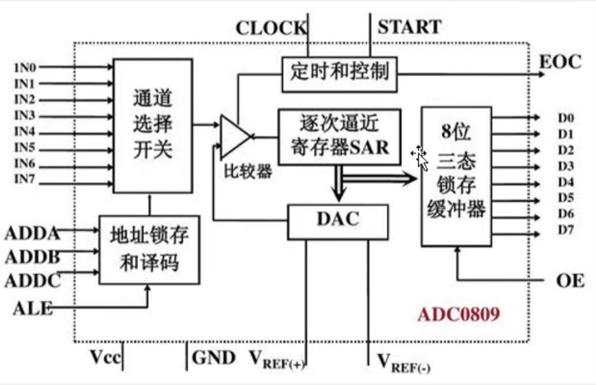

IN0 - IN7共8个输入通道，地址锁存和译码通过输入的ADDA - ADDC信号控制通道选择开关选择输入信号源。

**DAC（Digital-Analog Converter）**，**数字-模拟转换器**，可以根据数值通过加权电阻网络输出模拟信号，与**模数转换器的输入信号INx**作为比较器的两个输入，进行比较大小。如果DAC输出的信号值大，就减小DAC的值，反之增大DAC的值，直到比较器的两个输入信号相等，此时DAC的数值就是模拟量INx的编码值了。

逐次逼近寄存器SAR通常通过二分查找快速找到INx的编码值。找到之后将值送入三态锁存缓冲器中，输出转换结束信号**EOC（End of Conversion）**。

CLOCK是模数转换器的时钟信号，START是开始信号，Vcc和GND给模数转换器供电，Vref+和Vref-决定了数模转换器DAC的输出范围，进而决定了模数转换器ADC可编码的范围。

## STM32ADC

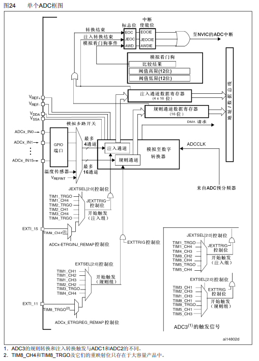

ADCx_IN0 - ADCx_IN15共16个外部输入通道，温度传感器和Vrefint**(V Reference Internal，内部参考电压)**是2个内部通道，共18个输入通道送入模拟多路开关，进行输入选择，然后送入模数转换器进行逐次逼近型模数转换，转换结果送入数据寄存器（包括**注入通道**数据寄存器和**规则通道**数据寄存器）等待读取。

规则通道可以同时选择16个输入通道启动模数转换，但是规则通道用于存放结果的数据寄存器只有一个，如果一次性选择16个输入通道进行转换，后来的结果会覆盖之前的结果，导致最终只能得到最后通道的转换值。因此，规则通道经常配合DMA使用，每完成一次转换，DMA进行一次数据转运，最终得到所有的转换值。

注入通道的数据寄存器有4个，可以同时保存4个输入通道的转换值。

左下角是STM32ADC触发转换信号，相当于8位逐次逼近ADC的START信号。对于STM32的ADC，开始转换的信号有两种，一种是**软件触发**，在程序中通过代码实现；一种是硬件触发，通过左下角的触发源触发**注入组**和**规则组**开始转换。输入信号可以选择定时器通道，也可以选择定时器触发输出信号**TRGO**实现硬件触发转换，避免频繁中断阻塞主进程。

与8位逐次逼近型模数转换器相同，Vref+和Vref-决定了模数转换的转换范围。VDDA和VSSA是供电信号。一般情况下，Vref+接VDDA，Vref-接VSSA，即模数转换器转换范围等于工作电压。

ADDCLK是驱动模数转换的时钟，来自ADC预分频器。ADC预分频器的输入时钟是APB2，72MHz，而ADDCLK的最大频率为14MHz，因此ADC预分频的分频系数只能选择6或8。

DMA请求信号用于触发DMA进行数据转运。

模拟看门狗可以存放一个阈值高限和阈值低限，如果启动了模拟看门狗并指定了看门的通道，模拟看门狗就会关注看门的通道，一旦超出阈值范围，就申请一个模拟看门狗中断。规则组和注入组在转换完成后都会产生一个完成信号，规则组为EOC，注入组为JEOC，这两个信号会改变标志位，通过读取标志位，可以判断转换是否结束，同时EOC和JEOC可以触发中断。

STM32ADC基本结构

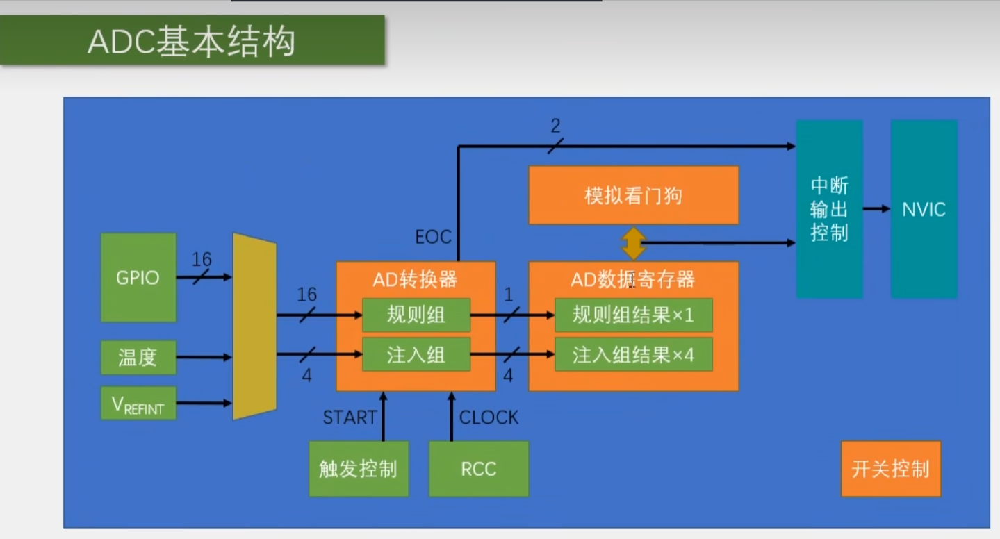

## 规则组转换模式

### 单次转换，非扫描模式

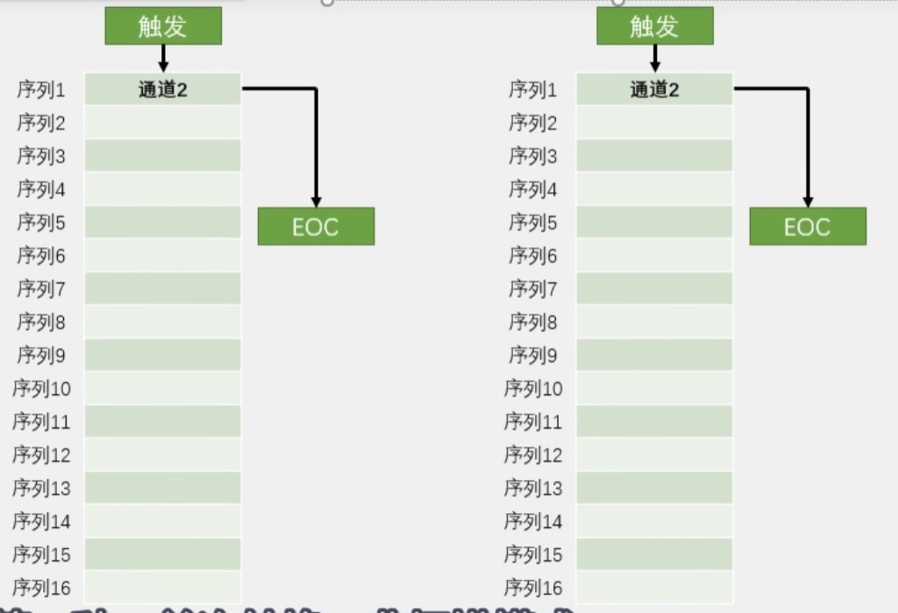

非扫描模式下，只能选择一个输入通道，转换完成后，结果存入数据寄存器同时产生EOC结束信号。如果想开启下一次转换，就要再产生一个触发信号；如果希望更换输入通道，就要在转换前进行操作。

### 连续转换，非扫描模式

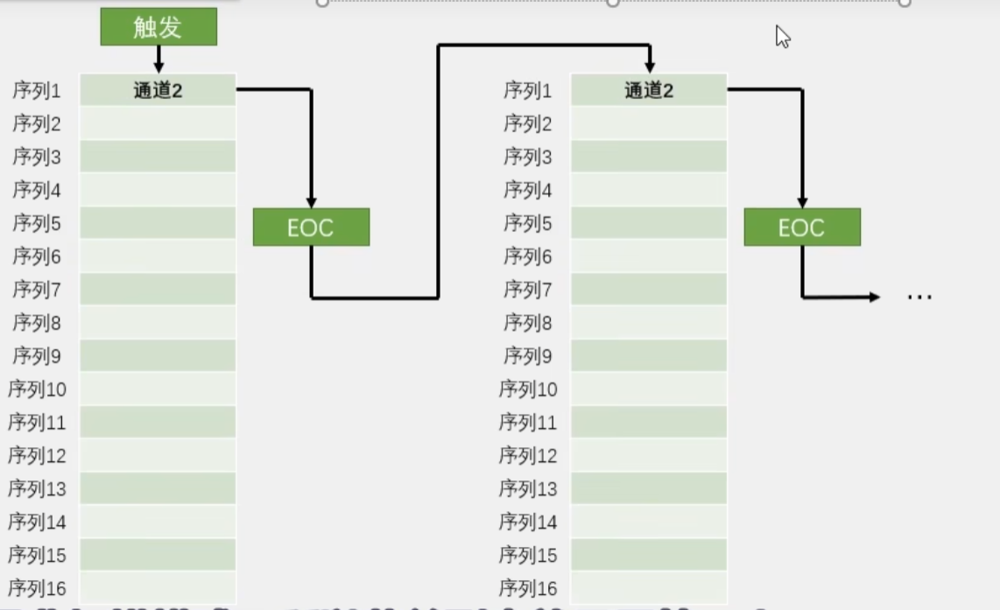

由于还是非扫描模式，所以只能选择一个输入通道。连续转换的特点是在一次转换完成，产生EOC信号后不会停止，而是立刻开始下一轮的转换，一直持续下去。好处是想读AD值时，不用检查EOC信号，直接从数据寄存器读取即可。

### 单次转换，扫描模式

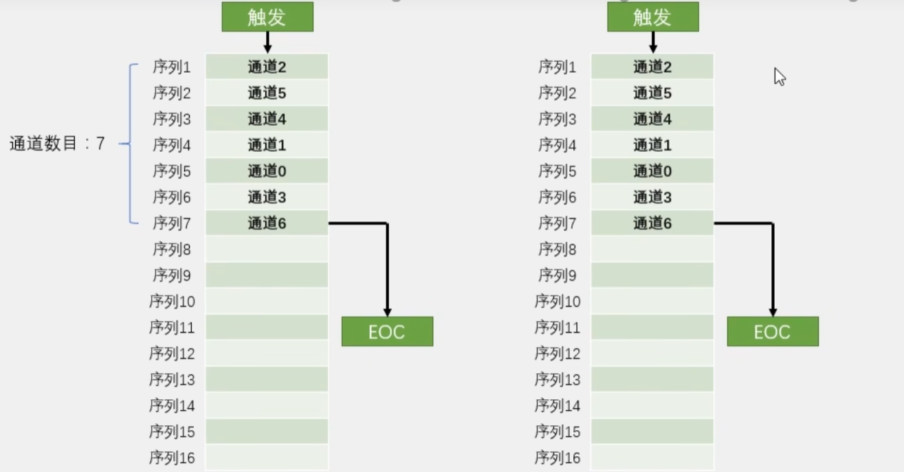

由于是单词转换，因此每转换一次都会停下来，下次转换需要重新设置触发信号。扫描模式下可以选择多个输入通道，开始转换后，会将所有已选择通道的输入信号进行转换并存放到数据寄存器（此时需要配合DMA进行数据转运），所有通道转换完成后，产生结束信号EOC，停止本次转换。

### 连续转换，扫描模式

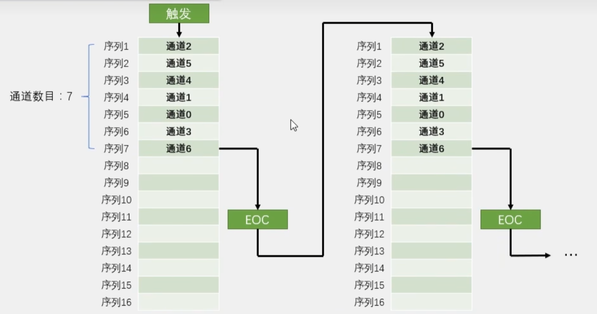

在单次转换，扫描模式上实现了转换的连续，不断地对所选通道进行转换并存放到数据寄存器，一直持续。

## 触发控制

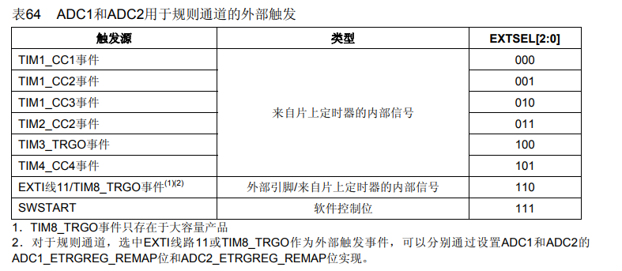

## 数据对齐

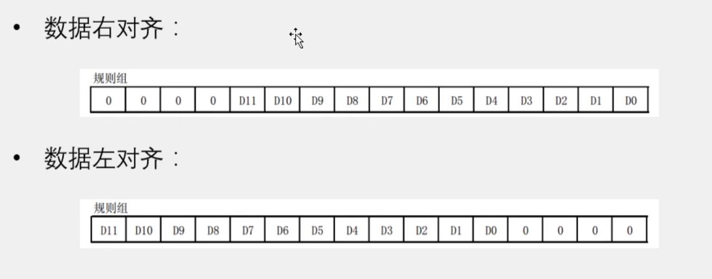

数据转换器是12位的，因此转换结果也为12位，但是存放结果的数据寄存器位16位，因此存放时存在数据对齐问题。可以根据补零位置分为数据右对齐和数据左对齐，数据右对齐比较常用。

## 转换时间

AD转换步骤：**采样 -> 保持 -> 量化 -> 编码**

STM32 ADC的总转换时间为：**Tconv = 采样时间 + 12.5个ADC周期**

例如，当ADCCLK = 14MHz，采样时间位1.5个ADC周期时

Tconv = 1.5 + 12.5 = 14个ADC周期 = 1us 

## 校准

ADC有一个内置的自校准模式。校准可大幅减小因内部电容器组的变化而造成的精准度误差。校准期间，在每个电容器上都会计算出一个误差修正码（数字值），这个码用于消除在随后的转换中每个电容器上产生的误差。

建议在每次上电后执行一次校准，启动校准前，ADC必须处于关电状态超过至少两个ADC周期。

## 硬件电路

以下电路可以为ADC产生一个模拟输入信号。

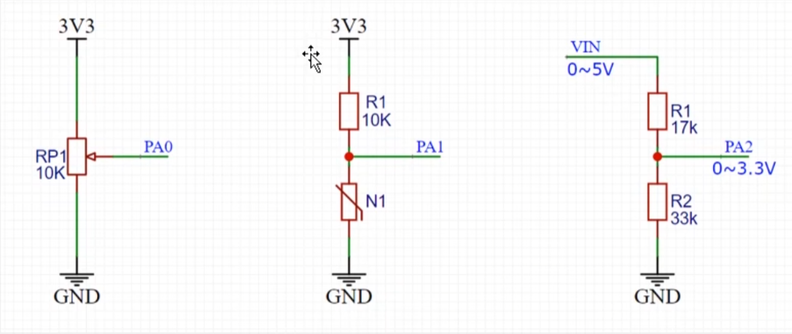

## ADC单通道

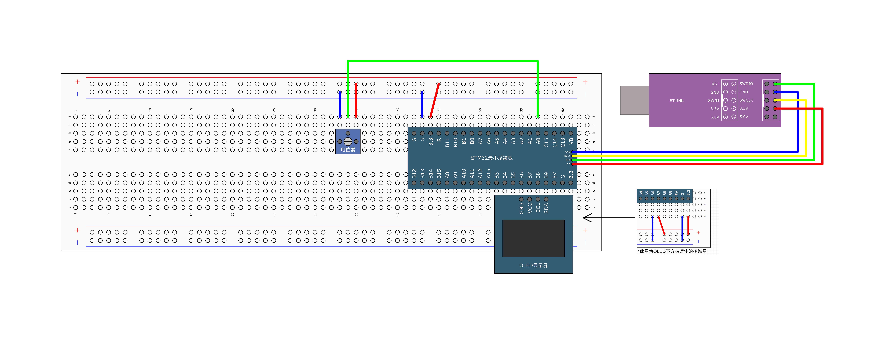

ADC基本结构


给ADC数模转换器新建一个模块，为了避免和标准库中的函数冲突，起名`ADConverter`

ADC初始化整体流程：开启时钟（GPIO，ADC，ADC预分频器） -> 配置GPIO -> 配置多路选择器 -> 配置ADC转换器 -> ADC_cmd使能ADC，看门狗和中断部分暂时不需要。

涉及到的函数

```c
// 配置ADC预分频器，决定ADC逐次逼近转换工作频率
void RCC_ADCCLKConfig(uint32_t RCC_PCLK2);

// ADC校准相关函数
void ADC_ResetCalibration(ADC_TypeDef* ADCx);
FlagStatus ADC_GetResetCalibrationStatus(ADC_TypeDef* ADCx);
void ADC_StartCalibration(ADC_TypeDef* ADCx);
FlagStatus ADC_GetCalibrationStatus(ADC_TypeDef* ADCx);

// 软件触发ADC函数
void ADC_SoftwareStartConvCmd(ADC_TypeDef* ADCx, FunctionalState NewState);

// 检查转换是否完成
FlagStatus ADC_GetFlagStatus(ADC_TypeDef* ADCx, uint8_t ADC_FLAG);

// 规则组配置
void ADC_RegularChannelConfig(ADC_TypeDef* ADCx, uint8_t ADC_Channel, uint8_t Rank, uint8_t ADC_SampleTime);

// 获取转换值
uint16_t ADC_GetConversionValue(ADC_TypeDef* ADCx);
```

初始化`ADConverter`：

```c
void ADConverter_Init(void)
{
	// 开启时钟：GPIO，ADC，配置ADC预分频器
	RCC_APB2PeriphClockCmd(RCC_APB2Periph_GPIOA, ENABLE);
	RCC_APB2PeriphClockCmd(RCC_APB2Periph_ADC1, ENABLE);
	RCC_ADCCLKConfig(RCC_PCLK2_Div6);
	
	// 配置GPIO
	GPIO_InitTypeDef GPIO_InitStructure;
	GPIO_InitStructure.GPIO_Mode = GPIO_Mode_AIN;		// 模拟输入
	GPIO_InitStructure.GPIO_Pin = GPIO_Pin_0;
	GPIO_InitStructure.GPIO_Speed = GPIO_Speed_50MHz;
	GPIO_Init(GPIOA, &GPIO_InitStructure);
	
	// 配置多路选择器
	ADC_RegularChannelConfig(ADC1, ADC_Channel_0, 1, ADC_SampleTime_55Cycles5);
	
	// 配置ADC
	ADC_InitTypeDef ADC_InitStructure;
	ADC_StructInit(&ADC_InitStructure);
	ADC_InitStructure.ADC_ContinuousConvMode = DISABLE;		// 单次
	ADC_InitStructure.ADC_DataAlign = ADC_DataAlign_Right;
	ADC_InitStructure.ADC_ExternalTrigConv = ADC_ExternalTrigConv_None;		// 不使用外部触发源
	ADC_InitStructure.ADC_Mode = ADC_Mode_Independent;	// 单个ADC
	ADC_InitStructure.ADC_NbrOfChannel = 1;		// 使用1个通道
	ADC_InitStructure.ADC_ScanConvMode = DISABLE;		// 非扫描模式
	ADC_Init(ADC1, &ADC_InitStructure);
	
	// ADC使能
	ADC_Cmd(ADC1, ENABLE);
	
	// ADC校准
	ADC_ResetCalibration(ADC1);		// 复位校准寄存器
	while(ADC_GetResetCalibrationStatus(ADC1) == SET);		// 等待复位完成
	ADC_StartCalibration(ADC1);		// 开始校准
	while(ADC_GetCalibrationStatus(ADC1) == SET);		// 等待校准完成
}
```

启动转换并获取转换值的流程：软件启动转换 -> 等待转换完成 -> 从数据寄存器读取转换值

```c
uint16_t ADConverter_GetVal(void)
{
	// 软件启动转换
	ADC_SoftwareStartConvCmd(ADC1, ENABLE);
	
	// 等待转换完成
	while(ADC_GetFlagStatus(ADC1, ADC_FLAG_EOC) != SET);
	
	// 读取规则组数据寄存器的值
	return ADC_GetConversionValue(ADC1);
}

```

## ADC多通道


在扫描模式下，启动转换后，每个通道完成转换不会有标志位产生，因此难以手动判断是否转换完成从而转运结果，要配合DMA使用。并且每个通道转换速度极快，只有几微秒，难以转运完成。

使用单次非扫描方式实现AD多通道：每次转换之前更改输入通道。

```c
// ADConverter.c
#include "stm32f10x.h"                  // Device header

void ADConverter_Init(void)
{
	// 开启时钟：GPIO，ADC，配置ADC预分频器
	RCC_APB2PeriphClockCmd(RCC_APB2Periph_GPIOA, ENABLE);
	RCC_APB2PeriphClockCmd(RCC_APB2Periph_ADC1, ENABLE);
	RCC_ADCCLKConfig(RCC_PCLK2_Div6);
	
	// 配置GPIO
	GPIO_InitTypeDef GPIO_InitStructure;
	GPIO_InitStructure.GPIO_Mode = GPIO_Mode_AIN;		// 模拟输入
	GPIO_InitStructure.GPIO_Pin = GPIO_Pin_0 | GPIO_Pin_1 | GPIO_Pin_2 | GPIO_Pin_3;
	GPIO_InitStructure.GPIO_Speed = GPIO_Speed_50MHz;
	GPIO_Init(GPIOA, &GPIO_InitStructure);
	
	// 配置ADC
	ADC_InitTypeDef ADC_InitStructure;
	ADC_StructInit(&ADC_InitStructure);
	ADC_InitStructure.ADC_ContinuousConvMode = DISABLE;		// 单次
	ADC_InitStructure.ADC_DataAlign = ADC_DataAlign_Right;
	ADC_InitStructure.ADC_ExternalTrigConv = ADC_ExternalTrigConv_None;		// 不使用外部触发源
	ADC_InitStructure.ADC_Mode = ADC_Mode_Independent;	// 单个ADC
	ADC_InitStructure.ADC_NbrOfChannel = 1;		// 使用1个通道
	ADC_InitStructure.ADC_ScanConvMode = DISABLE;		// 非扫描模式
	ADC_Init(ADC1, &ADC_InitStructure);
	
	// ADC使能
	ADC_Cmd(ADC1, ENABLE);
	
	// ADC校准
	ADC_ResetCalibration(ADC1);		// 复位校准寄存器
	while(ADC_GetResetCalibrationStatus(ADC1) == SET);		// 等待复位完成
	ADC_StartCalibration(ADC1);		// 开始校准
	while(ADC_GetCalibrationStatus(ADC1) == SET);		// 等待校准完成
}

uint16_t ADConverter_GetVal(uint8_t ADC_Channel)
{
	// 配置多路选择器
	ADC_RegularChannelConfig(ADC1, ADC_Channel, 1, ADC_SampleTime_55Cycles5);
	
	// 软件启动转换
	ADC_SoftwareStartConvCmd(ADC1, ENABLE);
	
	// 等待转换完成
	while(ADC_GetFlagStatus(ADC1, ADC_FLAG_EOC) != SET);
	
	// 读取规则组数据寄存器的值
	return ADC_GetConversionValue(ADC1);
}

// main.c
#include "stm32f10x.h"                  // Device header
#include "Delay.h"
#include "OLED_Hardware.h"
#include "ADConverter.h"

uint16_t AD0, AD1, AD2, AD3;

int main(void)
{
	
	OLED_Init_H();
	ADConverter_Init();
	OLED_ShowString_H(1, 1, "AD0:");
	OLED_ShowString_H(2, 1, "AD1:");
	OLED_ShowString_H(3, 1, "AD2:");
	OLED_ShowString_H(4, 1, "AD3:");

	while(1)
	{
		AD0 = ADConverter_GetVal(ADC_Channel_0);
		AD1 = ADConverter_GetVal(ADC_Channel_1);
		AD2 = ADConverter_GetVal(ADC_Channel_2);
		AD3 = ADConverter_GetVal(ADC_Channel_3);
		
		OLED_ShowNum_H(1, 5, AD0, 4);
		OLED_ShowNum_H(1, 5, AD1, 4);
		OLED_ShowNum_H(1, 5, AD2, 4);
		OLED_ShowNum_H(1, 5, AD3, 4);
		
		Delay_ms(100);
	}
}

```