# [STM32]Day8

## DMA直接存储器存取

**DMA（Direct Memory Access），直接存储器存取**，可以提供**外设和存储器**或者**存储器和存储器**之间的高度数据传输，无需CPU干预，节省了CPU资源。这里的外设，指的时外设的寄存器，一般是外设的数据寄存器**DR（Data Register）**，存储器指的时**运行内存SRAM**和**程序存储器Flash**。

12个独立可配置的通道：DMA1（7个通道），DMA2（5个通道）

每个通道都支持**软件触发**和**特定的硬件触发**。如果是存储器到存储器之间的转运，例如Flash转运到SRAM，就需要使用软件触发，软件触发后，DMA会**立刻**以**最快速度**完成转运。如果进行的是外设到存储器的数据转运，就需要使用硬件触发，等待硬件触发信号（例如模数转换完成信号EOC）发生后才转运。

STM32F103C8T6的DMA资源：DMA1（7个通道）

## 存储器映像

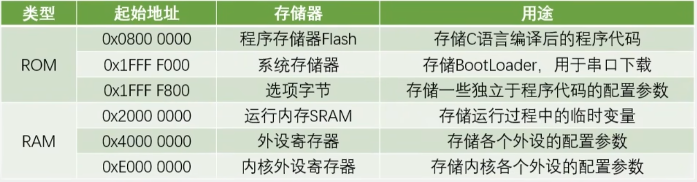

存储器分为两大类，**ROM**和**RAM**。**ROM（Read Only Memory），只读存储器**，是一种非易失性存储器，掉电后数据不丢失。**RAM（Random Access Memory），随机存取存储器**，是一种易失性存储器，掉电后数据丢失。

## DMA框图

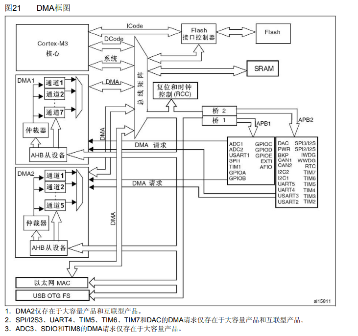

寄存器是一种特殊的存储器。一方面，CPU可以对寄存器进行读写，就像读写运行内存一样；另一方面，寄存器的每一位背后，都连接了一根导线，可以控制外设电路的状态，比如置引脚的高低电平、导通和断开开关、切换数据选择器，或者多位组合起来，当作计数器、数据寄存器等。因此，**寄存器是链接软件和硬件的桥梁**。

既然寄存器是一种特殊的存储器，而DMA的功能是**外设与存储器**之间、**存储器与存储器**之间的数据转运，而**外设**指的是外设中的**寄存器**，因此DMA的功能可以总结为**存储器之间**的数据转运。

为了高效有条理地访问存储器，设置了一个总线矩阵。总线左边是主动单元，也就是拥有存储器访问和读写权限的单元；总线的右边是被动单元，他们的存储器只能被主动单元读写。

DMA1和DMA2通过各自的DMA总线访问存储器，分别含有不同数量的通道，**各个通道可以分别设置它们转运数据的源地址和目的地址，独立工作**。仲裁器的作用是分配DMA总线某个时刻的使用权，使得各个通道**分时复用**DMA总线。DMA中的AHB从设备是DMA自身的寄存器，连在总线矩阵右侧的AHB总线上，使得CPU可以对DMA进行配置。

DMA请求是DMA的硬件触发源，由各个外设发出，例如ADC转换完成信号EOC就可以作为DMA请求信号，申请DMA转运数据。

**DMA基本结构**：

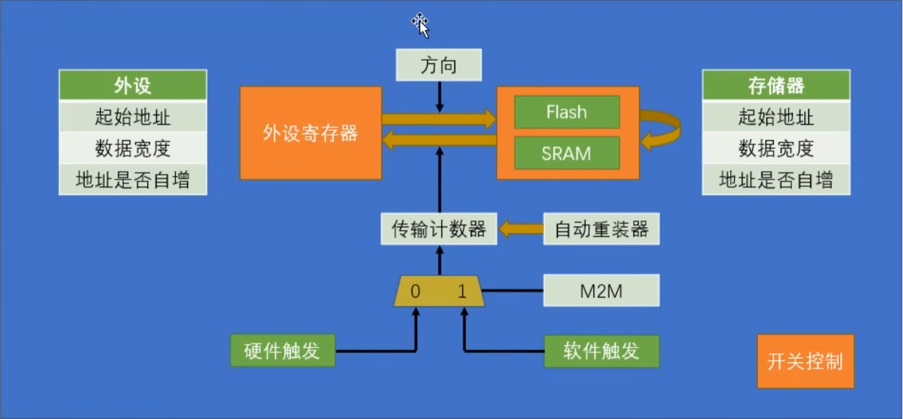

起始地址决定数据转运的源地址和目的地址。数据宽度决定一次转运要按多大的数据宽度进行，可以选择**字节Byte**，**半字HalfWord**和**字Word**。地址是否自增参数决定一次转运完成后，下一次转运是不是要移动到下一个位置。传输计数器用来指定转运次数，是一个**自减计数器**，每转运一次减一，为零时停止转运，同时自增的地址恢复到起始地址。自动重装器决定传输计数器为0后是否自动恢复到初始值，如果不重装，转运一轮后停止；如果重装，则循环转运。M2M决定使用硬件触发源还是软件触发源，根据数据转运方向来决定。M2M为1时，软件触发，逻辑是以最快的速度连续不断地触发DMA，计数器为0后结束，因此不能和循环模式同时使用。

单轮模式结束后，传输计数器为0，想要给传输计数器写入新值，需要先`DMA_Cmd`设置DISABLE，关闭DMA，然后再写入。

## DMA请求

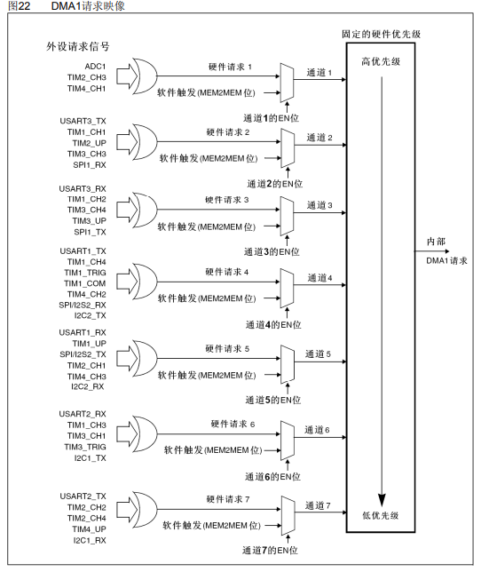

由于每个通道的触发源都不同，如果想使用某个硬件触发源，需要查找并使用对应的通道。

每个通道具体的硬件触发源根据对应外设是否开启DMA输出决定，例如通道1的硬件触发源有ADC1，TIM2_CH3，TIM4_CH1，通过ADC的函数`ADC_DMACmd`可以设置通道1硬件触发源为ADC1。

**DMA工作的三个条件**：传输计数器大于0，触发源有触发信号，DMA使能

## 数据宽度与对齐

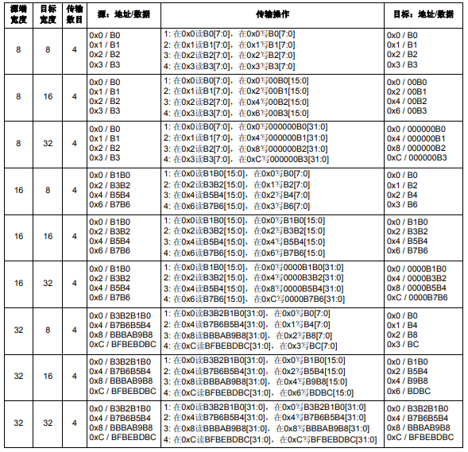

DMA数据转运的起始和目的存储器都有数据宽度地址，如果数据宽度相同，可以正常转运；如果数据宽度不同，按照上表规则转运：小数据转运到大数据时，**靠右对齐**；大数据转运到小数据时，**保留低位**。

## 数据转运+DMA

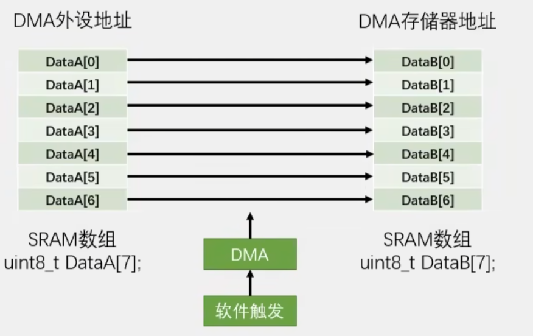

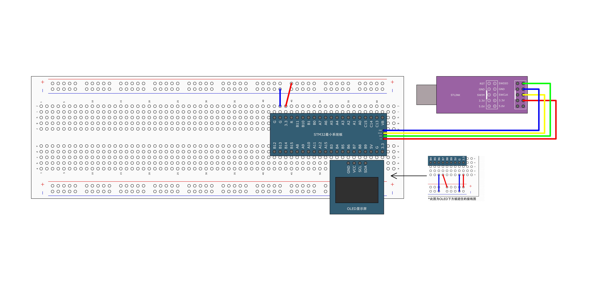

DMA模块不涉及外部硬件电路，驱动代码可以添加到System。

DMA初始化整体流程：开启时钟 -> 使用`DMA_Init()`配置DMA -> `DMA_Cmd()`DMA使能

```c
// myDMA.c
#include "stm32f10x.h"                  // Device header

uint16_t myDMA_Size;

void myDMA_Init(uint32_t AddrA, uint32_t AddrB, uint16_t Size)
{
	myDMA_Size = Size;
	// 开启时钟
	RCC_AHBPeriphClockCmd(RCC_AHBPeriph_DMA1, ENABLE);
	
	// DMA初始化
	DMA_InitTypeDef DMA_InitStructure;
	DMA_StructInit(&DMA_InitStructure);
	DMA_InitStructure.DMA_PeripheralBaseAddr = AddrA;
	DMA_InitStructure.DMA_PeripheralDataSize = DMA_PeripheralDataSize_Byte;
	DMA_InitStructure.DMA_PeripheralInc = DMA_PeripheralInc_Enable;
	DMA_InitStructure.DMA_MemoryBaseAddr = AddrB;
	DMA_InitStructure.DMA_MemoryDataSize = DMA_MemoryDataSize_Byte;
	DMA_InitStructure.DMA_MemoryInc = DMA_MemoryInc_Enable;
	DMA_InitStructure.DMA_DIR = DMA_DIR_PeripheralSRC;
	DMA_InitStructure.DMA_BufferSize = Size;
	DMA_InitStructure.DMA_Mode = DMA_Mode_Normal;
	DMA_InitStructure.DMA_M2M = DMA_M2M_Enable;
	DMA_InitStructure.DMA_Priority = DMA_Priority_High;
	DMA_Init(DMA1_Channel1, &DMA_InitStructure);
	
	// 使能DMA
	DMA_Cmd(DMA1_Channel1, DISABLE);
}

void myDMA_Transfer(void)
{
	// 关闭DMA
	DMA_Cmd(DMA1_Channel1, DISABLE);
	
	// 设置传输计数器
	DMA_SetCurrDataCounter(DMA1_Channel1, myDMA_Size);
	
	// 使能DMA
	DMA_Cmd(DMA1_Channel1, ENABLE);
	
	// 等待转运完成
	while(DMA_GetFlagStatus(DMA1_FLAG_TC1) != SET);
	// 清除标志位
	DMA_ClearFlag(DMA1_FLAG_TC1);
}

// main.c
#include "stm32f10x.h"                  // Device header
#include "OLED_Hardware.h"
#include "myDMA.h"
#include "Delay.h"

uint8_t A[] = {0x01, 0x02, 0x03, 0x04};
uint8_t B[] = {0, 0, 0, 0};

int main(void)
{
	
	OLED_Init_H();
	myDMA_Init((uint32_t)A, (uint32_t)B, 4);
	OLED_ShowString_H(1, 1, "AddrA:");
	OLED_ShowString_H(3, 1, "AddrB:");
	OLED_ShowHexNum_H(1, 8, (uint32_t)A, 8);
	OLED_ShowHexNum_H(3, 8, (uint32_t)B, 8);

	while(1)
	{
		A[0] ++;
		A[1] ++;
		A[2] ++;
		A[3] ++;
		
		OLED_ShowHexNum_H(2, 1, A[0], 2);
		OLED_ShowHexNum_H(2, 4, A[1], 2);
		OLED_ShowHexNum_H(2, 7, A[2], 2);
		OLED_ShowHexNum_H(2, 10, A[3], 2);
		OLED_ShowHexNum_H(4, 1, B[0], 2);
		OLED_ShowHexNum_H(4, 4, B[1], 2);
		OLED_ShowHexNum_H(4, 7, B[2], 2);
		OLED_ShowHexNum_H(4, 10, B[3], 2);
		Delay_ms(1000);
		
		myDMA_Transfer();
		
		OLED_ShowHexNum_H(2, 1, A[0], 2);
		OLED_ShowHexNum_H(2, 4, A[1], 2);
		OLED_ShowHexNum_H(2, 7, A[2], 2);
		OLED_ShowHexNum_H(2, 10, A[3], 2);
		OLED_ShowHexNum_H(4, 1, B[0], 2);
		OLED_ShowHexNum_H(4, 4, B[1], 2);
		OLED_ShowHexNum_H(4, 7, B[2], 2);
		OLED_ShowHexNum_H(4, 10, B[3], 2);
		Delay_ms(1000);
	}
}

```

## ADC扫描模式+DMA

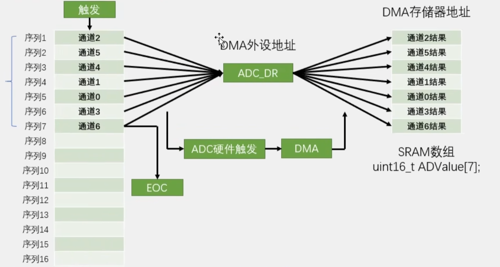

扫描模式下每个通道完成转换虽然**不产生中断和标志位**，但是会发出**DMA请求**，通知DMA进行转运。

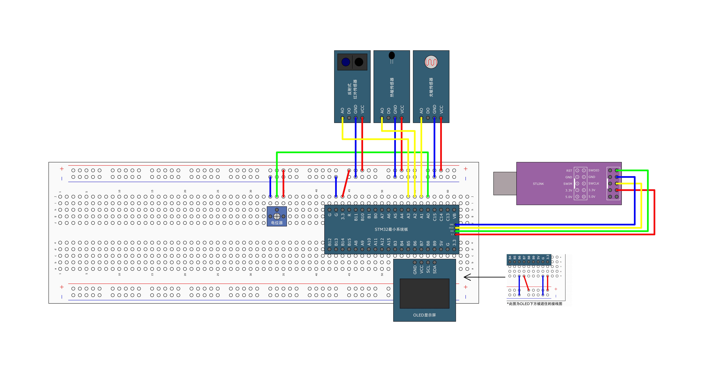

ADC单次转换+DMA单次转运

```c
// ADConverter.c
#include "stm32f10x.h"                  // Device header

uint16_t AD_Value[4];

void ADConverter_Init(void)
{
	// 开启时钟：GPIO，ADC，配置ADC预分频器
	RCC_APB2PeriphClockCmd(RCC_APB2Periph_GPIOA, ENABLE);
	RCC_APB2PeriphClockCmd(RCC_APB2Periph_ADC1, ENABLE);
	RCC_AHBPeriphClockCmd(RCC_AHBPeriph_DMA1, ENABLE);
	RCC_ADCCLKConfig(RCC_PCLK2_Div6);
	
	// 配置GPIO
	GPIO_InitTypeDef GPIO_InitStructure;
	GPIO_InitStructure.GPIO_Mode = GPIO_Mode_AIN;		// 模拟输入
	GPIO_InitStructure.GPIO_Pin = GPIO_Pin_0 | GPIO_Pin_1 | GPIO_Pin_2 | GPIO_Pin_3;
	GPIO_InitStructure.GPIO_Speed = GPIO_Speed_50MHz;
	GPIO_Init(GPIOA, &GPIO_InitStructure);
	
	// 配置多路选择器
	ADC_RegularChannelConfig(ADC1, ADC_Channel_0, 1, ADC_SampleTime_55Cycles5);
	ADC_RegularChannelConfig(ADC1, ADC_Channel_1, 2, ADC_SampleTime_55Cycles5);
	ADC_RegularChannelConfig(ADC1, ADC_Channel_2, 3, ADC_SampleTime_55Cycles5);
	ADC_RegularChannelConfig(ADC1, ADC_Channel_3, 4, ADC_SampleTime_55Cycles5);
	
	// 配置ADC
	ADC_InitTypeDef ADC_InitStructure;
	ADC_StructInit(&ADC_InitStructure);
	ADC_InitStructure.ADC_ContinuousConvMode = DISABLE;		// 单次
	ADC_InitStructure.ADC_DataAlign = ADC_DataAlign_Right;
	ADC_InitStructure.ADC_ExternalTrigConv = ADC_ExternalTrigConv_None;		// 不使用外部触发源
	ADC_InitStructure.ADC_Mode = ADC_Mode_Independent;	// 单个ADC
	ADC_InitStructure.ADC_NbrOfChannel = 4;		// 使用1个通道
	ADC_InitStructure.ADC_ScanConvMode = ENABLE;		// 非扫描模式
	ADC_Init(ADC1, &ADC_InitStructure);
	
	// 配置DMA
	// DMA初始化
	DMA_InitTypeDef DMA_InitStructure;
	DMA_StructInit(&DMA_InitStructure);
	DMA_InitStructure.DMA_PeripheralBaseAddr = (uint32_t)ADC1->DR;
	DMA_InitStructure.DMA_PeripheralDataSize = DMA_PeripheralDataSize_HalfWord;
	DMA_InitStructure.DMA_PeripheralInc = DMA_PeripheralInc_Disable;
	DMA_InitStructure.DMA_MemoryBaseAddr = (uint32_t)AD_Value;
	DMA_InitStructure.DMA_MemoryDataSize = DMA_MemoryDataSize_HalfWord;
	DMA_InitStructure.DMA_MemoryInc = DMA_MemoryInc_Enable;
	DMA_InitStructure.DMA_DIR = DMA_DIR_PeripheralSRC;
	DMA_InitStructure.DMA_BufferSize = 4;
	DMA_InitStructure.DMA_Mode = DMA_Mode_Normal;
	DMA_InitStructure.DMA_M2M = DMA_M2M_Disable;
	DMA_InitStructure.DMA_Priority = DMA_Priority_High;
	DMA_Init(DMA1_Channel1, &DMA_InitStructure);
	
	// 使能DMA
	DMA_Cmd(DMA1_Channel1, ENABLE);
	
	// 使能ADC -> DMA
	ADC_DMACmd(ADC1, ENABLE);
	
	// ADC使能
	ADC_Cmd(ADC1, ENABLE);
	
	// ADC校准
	ADC_ResetCalibration(ADC1);		// 复位校准寄存器
	while(ADC_GetResetCalibrationStatus(ADC1) == SET);		// 等待复位完成
	ADC_StartCalibration(ADC1);		// 开始校准
	while(ADC_GetCalibrationStatus(ADC1) == SET);		// 等待校准完成
}

void ADConverter_GetVal(void)
{	
	// 关闭DMA
	DMA_Cmd(DMA1_Channel1, DISABLE);
	
	// 设置传输计数器
	DMA_SetCurrDataCounter(DMA1_Channel1, 4);
	
	// 使能DMA
	DMA_Cmd(DMA1_Channel1, ENABLE);
	
	// 软件启动转换
	ADC_SoftwareStartConvCmd(ADC1, ENABLE);	
	
	// 等待转运完成
	while(DMA_GetFlagStatus(DMA1_FLAG_TC1) != SET);
	// 清除标志位
	DMA_ClearFlag(DMA1_FLAG_TC1);
}

// main.c
#include "stm32f10x.h"                  // Device header
#include "Delay.h"
#include "OLED_Hardware.h"
#include "ADConverter.h"

uint16_t AD0, AD1, AD2, AD3;

int main(void)
{
	
	OLED_Init_H();
	ADConverter_Init();
	OLED_ShowString_H(1, 1, "AD0:");
	OLED_ShowString_H(2, 1, "AD1:");
	OLED_ShowString_H(3, 1, "AD2:");
	OLED_ShowString_H(4, 1, "AD3:");

	while(1)
	{
		ADConverter_GetVal();
		
		OLED_ShowNum_H(1, 5, AD_Value[0], 4);
		OLED_ShowNum_H(1, 5, AD_Value[1], 4);
		OLED_ShowNum_H(1, 5, AD_Value[2], 4);
		OLED_ShowNum_H(1, 5, AD_Value[3], 4);
		
		Delay_ms(100);
	}
}

```

ADC循环转换+DMA循环转运

``` c
// ADConverter.c
#include "stm32f10x.h"                  // Device header

uint16_t AD_Value[4];

void ADConverter_Init(void)
{
	// 开启时钟：GPIO，ADC，配置ADC预分频器
	RCC_APB2PeriphClockCmd(RCC_APB2Periph_GPIOA, ENABLE);
	RCC_APB2PeriphClockCmd(RCC_APB2Periph_ADC1, ENABLE);
	RCC_AHBPeriphClockCmd(RCC_AHBPeriph_DMA1, ENABLE);
	RCC_ADCCLKConfig(RCC_PCLK2_Div6);
	
	// 配置GPIO
	GPIO_InitTypeDef GPIO_InitStructure;
	GPIO_InitStructure.GPIO_Mode = GPIO_Mode_AIN;		// 模拟输入
	GPIO_InitStructure.GPIO_Pin = GPIO_Pin_0 | GPIO_Pin_1 | GPIO_Pin_2 | GPIO_Pin_3;
	GPIO_InitStructure.GPIO_Speed = GPIO_Speed_50MHz;
	GPIO_Init(GPIOA, &GPIO_InitStructure);
	
	// 配置多路选择器
	ADC_RegularChannelConfig(ADC1, ADC_Channel_0, 1, ADC_SampleTime_55Cycles5);
	ADC_RegularChannelConfig(ADC1, ADC_Channel_1, 2, ADC_SampleTime_55Cycles5);
	ADC_RegularChannelConfig(ADC1, ADC_Channel_2, 3, ADC_SampleTime_55Cycles5);
	ADC_RegularChannelConfig(ADC1, ADC_Channel_3, 4, ADC_SampleTime_55Cycles5);
	
	// 配置ADC
	ADC_InitTypeDef ADC_InitStructure;
	ADC_StructInit(&ADC_InitStructure);
	ADC_InitStructure.ADC_ContinuousConvMode = ENABLE;		// 循环
	ADC_InitStructure.ADC_DataAlign = ADC_DataAlign_Right;
	ADC_InitStructure.ADC_ExternalTrigConv = ADC_ExternalTrigConv_None;		// 不使用外部触发源
	ADC_InitStructure.ADC_Mode = ADC_Mode_Independent;	// 单个ADC
	ADC_InitStructure.ADC_NbrOfChannel = 4;		// 使用1个通道
	ADC_InitStructure.ADC_ScanConvMode = ENABLE;		// 非扫描模式
	ADC_Init(ADC1, &ADC_InitStructure);
	
	// 配置DMA
	// DMA初始化
	DMA_InitTypeDef DMA_InitStructure;
	DMA_StructInit(&DMA_InitStructure);
	DMA_InitStructure.DMA_PeripheralBaseAddr = (uint32_t)ADC1->DR;
	DMA_InitStructure.DMA_PeripheralDataSize = DMA_PeripheralDataSize_HalfWord;
	DMA_InitStructure.DMA_PeripheralInc = DMA_PeripheralInc_Disable;
	DMA_InitStructure.DMA_MemoryBaseAddr = (uint32_t)AD_Value;
	DMA_InitStructure.DMA_MemoryDataSize = DMA_MemoryDataSize_HalfWord;
	DMA_InitStructure.DMA_MemoryInc = DMA_MemoryInc_Enable;
	DMA_InitStructure.DMA_DIR = DMA_DIR_PeripheralSRC;
	DMA_InitStructure.DMA_BufferSize = 4;
	DMA_InitStructure.DMA_Mode = DMA_Mode_Circular;		// 自动重装
	DMA_InitStructure.DMA_M2M = DMA_M2M_Disable;
	DMA_InitStructure.DMA_Priority = DMA_Priority_High;
	DMA_Init(DMA1_Channel1, &DMA_InitStructure);
	
	// 使能DMA
	DMA_Cmd(DMA1_Channel1, ENABLE);
	
	// 使能ADC -> DMA
	ADC_DMACmd(ADC1, ENABLE);
	
	// ADC使能
	ADC_Cmd(ADC1, ENABLE);
	
	// ADC校准
	ADC_ResetCalibration(ADC1);		// 复位校准寄存器
	while(ADC_GetResetCalibrationStatus(ADC1) == SET);		// 等待复位完成
	ADC_StartCalibration(ADC1);		// 开始校准
	while(ADC_GetCalibrationStatus(ADC1) == SET);		// 等待校准完成
	
	// 软件启动转换
	ADC_SoftwareStartConvCmd(ADC1, ENABLE);	
}

// main.c
#include "stm32f10x.h"                  // Device header
#include "Delay.h"
#include "OLED_Hardware.h"
#include "ADConverter.h"

uint16_t AD0, AD1, AD2, AD3;

int main(void)
{
	
	OLED_Init_H();
	ADConverter_Init();
	OLED_ShowString_H(1, 1, "AD0:");
	OLED_ShowString_H(2, 1, "AD1:");
	OLED_ShowString_H(3, 1, "AD2:");
	OLED_ShowString_H(4, 1, "AD3:");

	while(1)
	{	
		OLED_ShowNum_H(1, 5, AD_Value[0], 4);
		OLED_ShowNum_H(1, 5, AD_Value[1], 4);
		OLED_ShowNum_H(1, 5, AD_Value[2], 4);
		OLED_ShowNum_H(1, 5, AD_Value[3], 4);
		
		Delay_ms(100);
	}
}

```

## 存储器地址验证

查看临时变量地址，临时变量存放在SRAM中

```c
#include "stm32f10x.h"                  // Device header
#include "OLED_Hardware.h"

uint8_t a = 0x80;

int main(void)
{
	
	OLED_Init_H();
	
	OLED_ShowHexNum_H(1, 1, a, 8);
	OLED_ShowHexNum_H(2, 1, (uint32_t)&a, 8);		// 需要从指针类型强制转换为16位int类型

	while(1)
	{
		
	}
}

```

查看常量地址，增加`const`关键字，常量存放再flash中

```c
#include "stm32f10x.h"                  // Device header
#include "OLED_Hardware.h"

const uint8_t a = 0x80;

int main(void)
{
	
	OLED_Init_H();
	
	OLED_ShowHexNum_H(1, 1, a, 8);
	OLED_ShowHexNum_H(2, 1, (uint32_t)&a, 8);		// 需要从指针类型强制转换为16位int类型

	while(1)
	{
		
	}
}

```

查看外设寄存器地址。常量和变量的地址是由编译器决定的，而外设寄存器的地址是固定的，从0x4000 0000开始，可以通过访问结构体成员访问外设寄存器。

```c
#include "stm32f10x.h"                  // Device header
#include "OLED_Hardware.h"

int main(void)
{
	
	OLED_Init_H();
	
	
	OLED_ShowHexNum_H(1, 1, (uint32_t)&ADC1->DR, 8);

	while(1)
	{
		
	}
}

```

可以通过用户手册查找到外设寄存器地址，例如ADC1寄存器的地址范围如下表

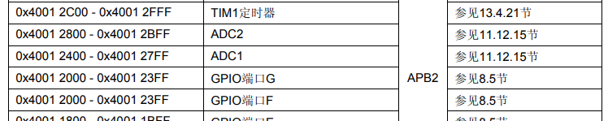

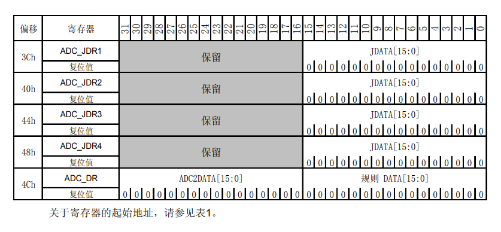

根据基地址加偏移量，可以计算ADC1的DR地址为 0x4001 2400 + 4Ch = 0x4001 244C。

对`ADC1->DR`不断右键跳转，可以看到以下代码

```c
#define ADC1                ((ADC_TypeDef *) ADC1_BASE)
// ADC1基地址0x4001 0000 + 0x0000 2400 = 0x4001 2400
#define ADC1_BASE             (APB2PERIPH_BASE + 0x2400)
// APB2外设基地址0x4000 0000 + 0x0001 0000 = 0x4001 0000
#define APB2PERIPH_BASE       (PERIPH_BASE + 0x10000)
// 外设基地址0x4000 0000
#define PERIPH_BASE           ((uint32_t)0x40000000) /*!< Peripheral base address in the alias region */

// 结构体中成员顺序与地址表中一致，每个成员都是uin32_t类型与地址表中地址偏移的不长相同，使得每个成员的地址与外设寄存器的实际地址相同
typedef struct
{
  __IO uint32_t SR;
  __IO uint32_t CR1;
  __IO uint32_t CR2;
  __IO uint32_t SMPR1;
  __IO uint32_t SMPR2;
  __IO uint32_t JOFR1;
  __IO uint32_t JOFR2;
  __IO uint32_t JOFR3;
  __IO uint32_t JOFR4;
  __IO uint32_t HTR;
  __IO uint32_t LTR;
  __IO uint32_t SQR1;
  __IO uint32_t SQR2;
  __IO uint32_t SQR3;
  __IO uint32_t JSQR;
  __IO uint32_t JDR1;
  __IO uint32_t JDR2;
  __IO uint32_t JDR3;
  __IO uint32_t JDR4;
  __IO uint32_t DR;
} ADC_TypeDef;
```