# [STM32]Day9-Part1

## 通信接口

通信的目的：将一个设备的数据传送到另一个设备上，扩展硬件系统。

通信协议：指定通信的规则，通信双方按照协议规则进行数据收发。

| 名称  | 引脚                 | 双工   | 时钟 | 电平 | 设备   |
| ----- | -------------------- | ------ | ---- | ---- | ------ |
| USART | TX、RX               | 全双工 | 异步 | 单端 | 点对点 |
| I2C   | SCL、SDA             | 半双工 | 同步 | 单端 | 多设备 |
| SPI   | SCLK、MOSI、MOSO、CS | 全双工 | 同步 | 单端 | 多设备 |
| CAN   | CAN_H、CAN_L         | 半双工 | 异步 | 差分 | 多设备 |
| USB   | DP、DM               | 半双工 | 异步 | 差分 | 点对点 |

## 串口通信

串口是一种应用广泛的通讯接口，串口成本低，容易使用，通信线路简单，可实现**两个设备**的互相通信。

单片机的串口可以使单片机与单片机、单片机与电脑、单片机与各式各样的模块互相通信，极大地扩展了单片机的应用范围，增强了单片机的硬件实力。

**硬件电路**

简单双向串口通信有两根通信线，**发送端TX（Transmit Data）**和**接收端RX（Recieve Data）**。

TX和RX要交叉连接。只需要进行单向数据传输时，可以只接一根通信线。

当电平标准不一样时，需要增加电平转换芯片。

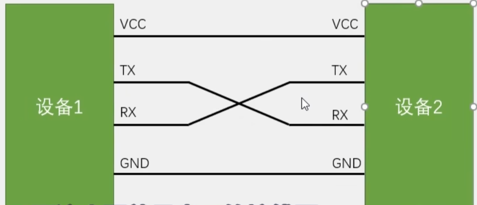

**电平标准**：电平标准是数据1和数据0的表达方式，是传输线缆中人为规定的电压与数据的对应关系，串口常用的电平标准有以下三种

- TTL电平：+3.3V或+5V表示1，0V表示0
- RS232电平：-3V到-15V表示1，+3V到+15V表示0
- RS485电平：两线压差+2V到+6V表示1，-2V到-6V表示0（**差分信号**，抗干扰能力强）

## 串口参数及时序

波特率：串口通信的速率。串口通信为**异步通信**，通信双方需要约定发送和接收频率，这个频率就叫做波特率。二进制调制下，波特率与比特率相等。

起始位：标志一个数据帧的开始，**固定为低电平**。（串口的空闲状态为高电平）

数据位：数据帧的有效载荷，1为高电平，0为低电平，低位先行。当待发送数据为0x0F = 0000 1111B时，数据位为1111 0000。

校验位：用于数据验证，根据数据位计算得来。可选择**无校验、奇校验、偶校验**

停止位：用于数据帧间隔，**固定为高电平**，可选择**1位、1.5位、2位**

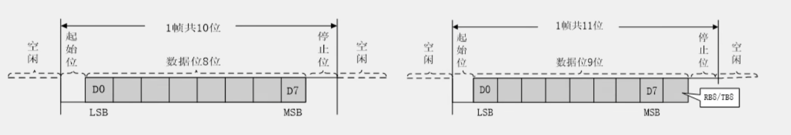

当1帧10位时，包含1位起始位，8位数据位，1位停止位

当1帧11位时，包含1位起始位，9位数据位（数据位 + **1位奇偶校验位RB8/TB8**），1位停止位

串口时序实例

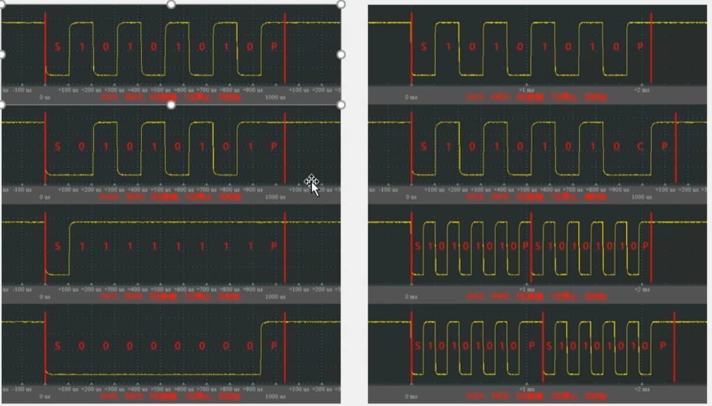

## USART

**USART（Universal Synchronous/Asynchronous Receiver/Transmitter），通用同步/异步收发器**是STM32内部集成的硬件外设，可根据数据寄存器的一个字节数据自动生成数据帧时序，从TX引脚发送出去；也可以自动接收RX引脚的数据帧时序，拼接为一个字节数据，存放在数据寄存器中。

自带波特率发生器，本质上是一个分频器，最高可提供4.5Mbit/s的频率。

可配置数据位长度（8位/9位），停止位长度（0.5位/1位/1.5位/2位）。

可配置校验方式（无校验/奇校验/偶校验）。

支持同步模式、硬件流控制、DMA、智能卡、IrDA、LIN。

STM32F103C8T6 USART资源：USART1、USART2、USART3

一般的配置方案：无校验，1位停止位

**USART框图**：

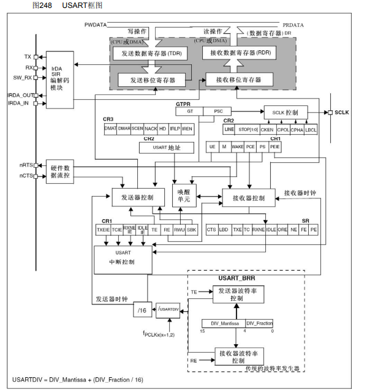

TX和RX是串口通信两个引脚，TX来自发送移位寄存器，RX送往接收移位寄存器。发送数据寄存器**TDR**和接收数据移位寄存器**RDR**占用**同一个地址**，在程序上表现为一个寄存器DR。发送移位寄存器负责把一个字节的数据一位一位地发送出去，形成串口通信的数据位。

某时刻将待发送数据0x55 = 0101 0101B写入TDR，硬件检测到TDR被写入后，检查当前移位寄存器是否有数据在移位（是否有数据正在发送），如果没有，将TDR中的数据送入发送移位寄存器准备发送，同时产生一个标志位TXE（TX Empty），发送寄存器空。TXE为1说明可以往TDR写入待发送的数据。然后发送移位寄存器在发送控制器的驱动下发送数据。

发送移位寄存器和接收移位寄存器都是**右移**的。

接收数据时，数据位从RX逐bit输入，并在接收器控制下送往接收移位寄存器并不断右移，接收完成后，数据立刻送往接收数据寄存器RDR，同时产生一个标志位RXNE（RX Not Empty），当RXNE为1时，说明接收数据已经存放到RDR中，可以读出。

发送器控制和接收器控制分别用来控制发送移位寄存器和接收移位寄存器。硬件数据流控负责协调通信双方的通信节奏。

SCLK控制用于产生SCLK信号，可以用作波特率，使用较少。

唤醒单元用于实现挂载多设备，使用较少。

中断控制用于配置中断。

**USART基本结构**

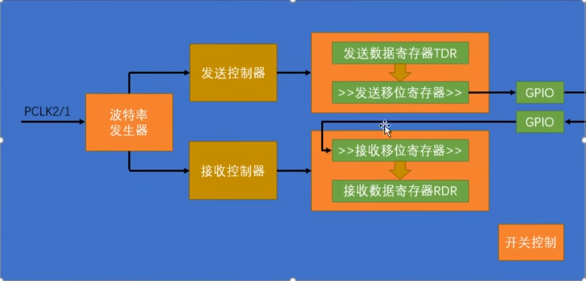

## 数据帧

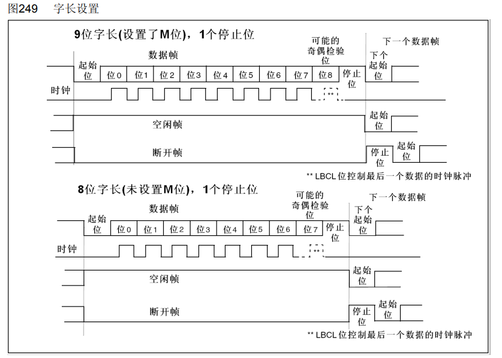

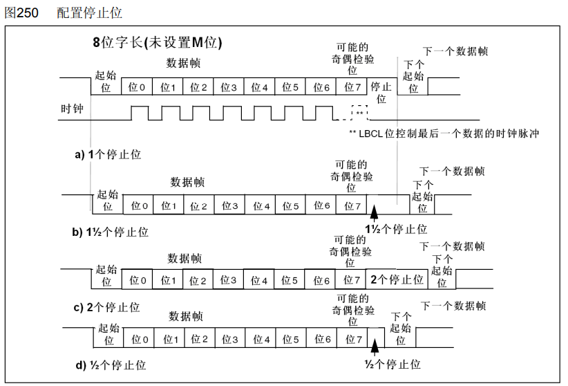

## 起始位侦测

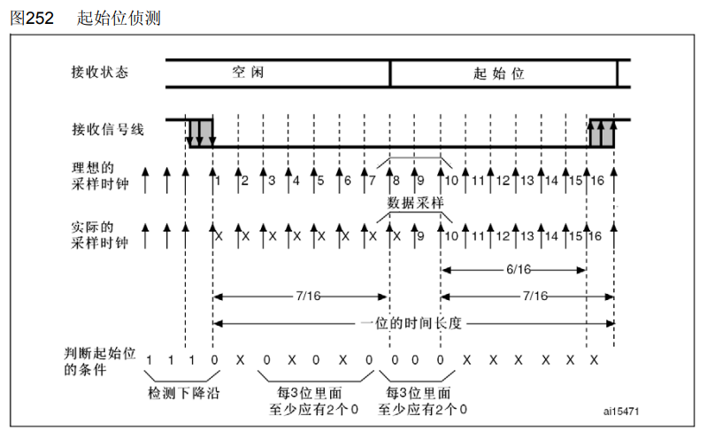

串口输入时要保证采样频率与波特率一致，同时采样位置正好处于每一位的正中间，保证数据可靠性。另外，输入最好还要对噪声有一定的判断能力，如果有噪声，最好设置一个标志位。

当输入电路检测到一个数据帧的起始位后，就会以与波特率相同的频率，连续采样一帧数据，同时从起始位开始，采样位置就要对齐到位的正中间。

输入电路对采样时钟进行了细分，以波特率16倍的频率采样，即一个bit采样16次。刚开始空闲状态高电平，采样为1，某个状态突然采样为0，说明可能遇到了起始位，在1bit时间内进行16次采样。检查第3 - 7次采样中0的个数是否大于等于2，第8 - 10次采样中0的个数是否大于等于2，如果两个条件都满足，说明检测到了起始位，记下来每个bit都在第8，9，10处采样，保证采样在位的正中间。如果条件不满足，说明没有检测到起始位。如果三个采样点上仅有2两个时0，说明有噪声但很可能是起始位，设置NE噪声标志位并开始通信。

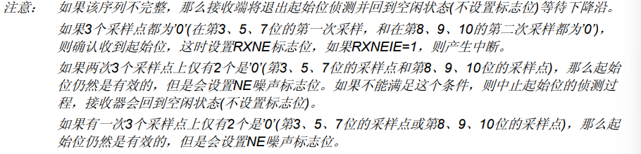

## 数据采样

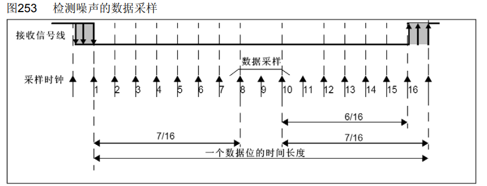

在第8，9，10处采样，如果三个采样数据不完全一致，按照2：1裁决，并设置噪声标志位NE

## 波特率发生器

发送器和接收器的波特率由波特率寄存器BRR里的DIV确定

计算公式：波特率 = f_{PCLK2/1} / (16 * DIV)

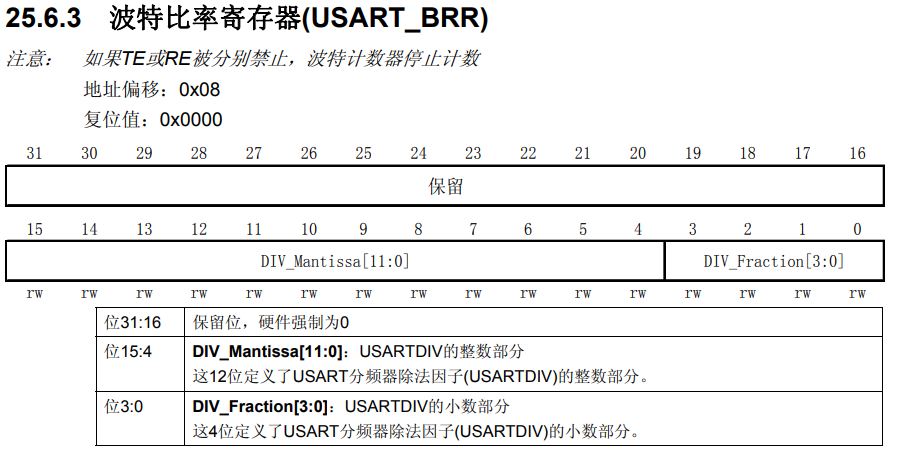

## 数据模式

HEX模式/十六进制模式/二进制模式：以原始数据的形式显示。

文本模式/字符模式：以原始数据编码后的形式显示。

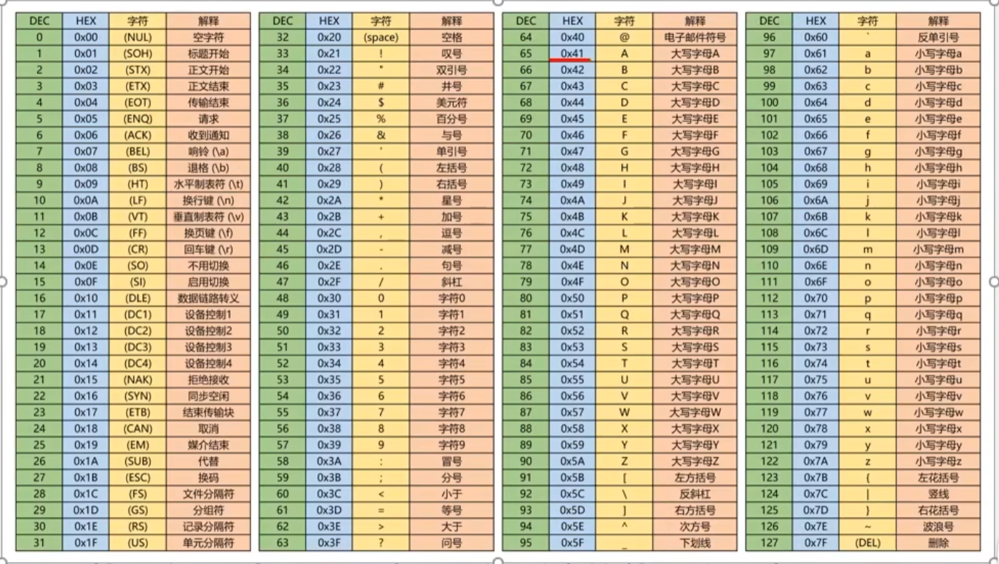

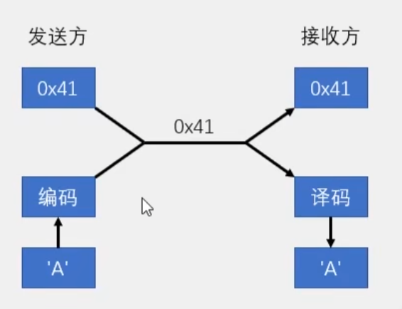

## 串口发送

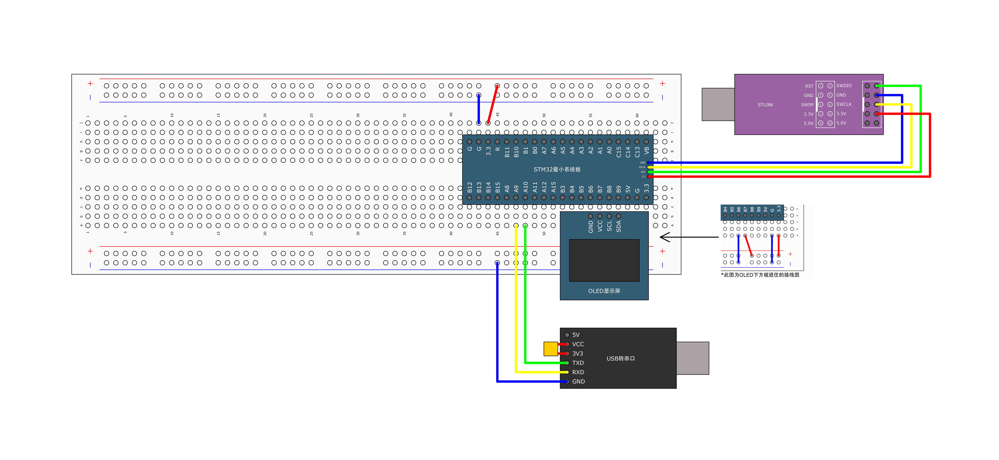

USART1的TX和RX引脚分别为PA9和PA10，因此USB模块的TXD和RXD分别接到PA10和PA9，交叉连接。USB模块要与STM32共地。

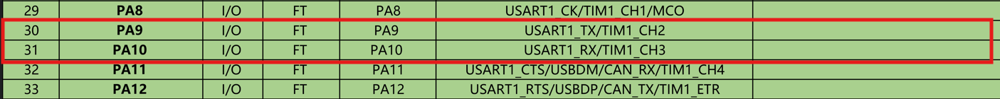

在Hardware/下新建Serial模块


串口初始化整体流程：开启时钟 -> 配置GPIO -> 配置USART -> 开启USART，如果需要接收功能，需要在"开启USART"之前进行`ITConfig`和`NVIC`的配置。

配置GPIO时，TX引脚时USART外设控制的输出脚，应该设置为**复用推挽输出**。

配置USART时，波特率可以自行指定，`USART_Init()`会自动计算9600bit/s对应的分频系数并写入BRR。

``` c
// Serial.c
#include "stm32f10x.h"                  // Device header
#include <stdio.h>

void Serial_Init(void)
{
	// 开启时钟
	RCC_APB2PeriphClockCmd(RCC_APB2Periph_GPIOA, ENABLE);
	RCC_APB2PeriphClockCmd(RCC_APB2Periph_USART1, ENABLE);
	
	// 配置GPIO
	GPIO_InitTypeDef GPIO_InitStructure;
	GPIO_InitStructure.GPIO_Mode = GPIO_Mode_AF_PP;
	GPIO_InitStructure.GPIO_Pin = GPIO_Pin_9;
	GPIO_InitStructure.GPIO_Speed = GPIO_Speed_50MHz;
	GPIO_Init(GPIOA, &GPIO_InitStructure);
	// 如果只需要发送，RX引脚可以不配置
	GPIO_InitStructure.GPIO_Mode = GPIO_Mode_IPU;		// 上拉输入
	GPIO_InitStructure.GPIO_Pin = GPIO_Pin_10;
	GPIO_Init(GPIOA, &GPIO_InitStructure);
	
	// 配置USART
	USART_InitTypeDef USART_InitStructure;
	USART_StructInit(&USART_InitStructure);
	USART_InitStructure.USART_BaudRate = 9600;
	USART_InitStructure.USART_HardwareFlowControl = USART_HardwareFlowControl_None;		// 不使用流控
	USART_InitStructure.USART_Mode = USART_Mode_Tx;		// 发送模式，如果需要发送和接收：USART_Mode_Tx | USART_Mode_Rx
	USART_InitStructure.USART_Parity = USART_Parity_No;		// 校验位设置：无校验
	USART_InitStructure.USART_StopBits = USART_StopBits_1;
	USART_InitStructure.USART_WordLength = USART_WordLength_8b;
	USART_Init(USART1, &USART_InitStructure);
	
	// 开启USART
	USART_Cmd(USART1, ENABLE);
}

// 发送一个字节数据
void Serial_SendByte(uint8_t Byte)
{
	// 将待发送数据写入TDR
	USART_SendData(USART1, Byte);
	// 等待TDR中数据被转运到移位寄存器
	while(USART_GetFlagStatus(USART1, USART_FLAG_TXE) != SET);
	// 不需要手动清零
}

// 发送数组
void Serial_SendArray(uint8_t *Array, uint16_t Length)
{
	uint16_t i;
	for(i = 0; i < Length; i ++) {
		Serial_SendByte(Array[i]);
	}
}

// 发送字符串
void Serial_SendString(char *String)
{
	uint8_t i;
	for(i = 0; String[i] != '\0'; i ++) {			// '\0'为字符串结束字符
		Serial_SendByte(String[i]);
	}
}

// 参数X,Y，返回X的Y次方
uint32_t Serial_Pow(uint32_t X, uint32_t Y)
{
	uint32_t Result = 1;
	
	uint32_t i;
	for(i = 0; i < Y; i ++) {
		Result *= X;
	}
	
	return Result;
}

// 发送数字，参数为12345时，接受方在文本模式下查看到12345
void Serial_SendNumber(uint32_t Number, uint8_t Length)
{
	uint8_t i;
	for(i = 0; i < Length; i ++) {
		Serial_SendByte(Number / Serial_Pow(10, Length - i - 1) % 10 + '0');		// 从高位到低位
	}
}

// 重定向fputc到串口，使得printf函数打印到串口
int fputc(int ch, FILE *f)
{
	Serial_SendByte(ch);
	return ch;
}

// main.c
#include "stm32f10x.h"                  // Device header
#include "OLED_Hardware.h"
#include "Serial.h"

int main(void)
{
	
	OLED_Init_H();
	Serial_Init();
	
	Serial_SendByte(0x41);
	
	uint8_t A[] = {0x42, 0x43, 0x44, 0x45};
	Serial_SendArray(A, 4);
	
	Serial_SendString("Hello, World!");

	while(1)
	{
		
	}
}

```

## 串口收发

串口接收有**查询**和**中断**两种方式。

使用查询的流程是，在主函数里不断判断**RXNE标志位**，检查输入数据是否已经存进RDR，如果存入了，调用`ReceiveData()`进行读取。

```c
#include "stm32f10x.h"                  // Device header
#include "OLED_Hardware.h"
#include "Serial.h"

uint8_t RxData;		// 存放接收到的数据

int main(void)
{
	
	OLED_Init_H();
	Serial_Init();

	while(1)
	{
		if(USART_GetFlagStatus(USART1, USART_FLAG_RXNE) == SET) {
			RxData = USART_ReceiveData(USART1);		// 读取完成后RXNE标志位自动重置，无需手动复位
			OLED_ShowNum_H(1, 1, RxData, 2);
		}
	}
}

```

使用中断需要在开启USART之前完成配置中断的代码

```c
// Serial.c
#include "stm32f10x.h"                  // Device header
#include <stdio.h>

uint8_t Serial_RxData;
uint8_t Serial_Flag;

void Serial_Init(void)
{
	// 开启时钟
	RCC_APB2PeriphClockCmd(RCC_APB2Periph_GPIOA, ENABLE);
	RCC_APB2PeriphClockCmd(RCC_APB2Periph_USART1, ENABLE);
	
	// 配置GPIO
	GPIO_InitTypeDef GPIO_InitStructure;
	GPIO_InitStructure.GPIO_Mode = GPIO_Mode_AF_PP;
	GPIO_InitStructure.GPIO_Pin = GPIO_Pin_9;
	GPIO_InitStructure.GPIO_Speed = GPIO_Speed_50MHz;
	GPIO_Init(GPIOA, &GPIO_InitStructure);
	GPIO_InitStructure.GPIO_Mode = GPIO_Mode_IPU;		// 上拉输入
	GPIO_InitStructure.GPIO_Pin = GPIO_Pin_10;
	GPIO_Init(GPIOA, &GPIO_InitStructure);
	
	// 配置USART
	USART_InitTypeDef USART_InitStructure;
	USART_StructInit(&USART_InitStructure);
	USART_InitStructure.USART_BaudRate = 9600;
	USART_InitStructure.USART_HardwareFlowControl = USART_HardwareFlowControl_None;		// 不使用流控
	USART_InitStructure.USART_Mode = USART_Mode_Tx | USART_Mode_Rx;		// 收发模式
	USART_InitStructure.USART_Parity = USART_Parity_No;		// 校验位设置：无校验
	USART_InitStructure.USART_StopBits = USART_StopBits_1;
	USART_InitStructure.USART_WordLength = USART_WordLength_8b;
	USART_Init(USART1, &USART_InitStructure);
	
	// 配置中断
	USART_ITConfig(USART1, USART_IT_RXNE, ENABLE);		// 开启RXNE到NVIC的输出
	// 配置NVIC
	NVIC_PriorityGroupConfig(NVIC_PriorityGroup_2);
	NVIC_InitTypeDef NVIC_InitStructure;
	NVIC_InitStructure.NVIC_IRQChannel = USART1_IRQn;
	NVIC_InitStructure.NVIC_IRQChannelCmd = ENABLE;
	NVIC_InitStructure.NVIC_IRQChannelPreemptionPriority = 1;
	NVIC_InitStructure.NVIC_IRQChannelSubPriority = 1;
	NVIC_Init(&NVIC_InitStructure);
	
	// 开启USART
	USART_Cmd(USART1, ENABLE);
}

// 发送一个字节数据
void Serial_SendByte(uint8_t Byte)
{
	// 将待发送数据写入TDR
	USART_SendData(USART1, Byte);
	// 等待TDR中数据被转运到移位寄存器
	while(USART_GetFlagStatus(USART1, USART_FLAG_TXE) != SET);
	// 不需要手动清零
}

// 发送数组
void Serial_SendArray(uint8_t *Array, uint16_t Length)
{
	uint16_t i;
	for(i = 0; i < Length; i ++) {
		Serial_SendByte(Array[i]);
	}
}

// 发送字符串
void Serial_SendString(char *String)
{
	uint8_t i;
	for(i = 0; String[i] != '\0'; i ++) {			// '\0'为字符串结束字符
		Serial_SendByte(String[i]);
	}
}

// 参数X,Y，返回X的Y次方
uint32_t Serial_Pow(uint32_t X, uint32_t Y)
{
	uint32_t Result = 1;
	
	uint32_t i;
	for(i = 0; i < Y; i ++) {
		Result *= X;
	}
	
	return Result;
}

// 发送数字，参数为12345时，接受方在文本模式下查看到12345
void Serial_SendNumber(uint32_t Number, uint8_t Length)
{
	uint8_t i;
	for(i = 0; i < Length; i ++) {
		Serial_SendByte(Number / Serial_Pow(10, Length - i - 1) % 10 + '0');		// 从高位到低位
	}
}

// 重定向fputc到串口，使得printf函数打印到串口
int fputc(int ch, FILE *f)
{
	Serial_SendByte(ch);
	return ch;
}

uint8_t Serial_GetRxFlag(void)
{
	if(Serial_Flag == 1) {
		Serial_Flag = 0;
		return 1;
	}
	return 0;
}

uint8_t Serial_GetRxData(void)
{
	return Serial_RxData;
}

// 重写中断函数
void USART1_IRQHandler(void)
{
	if(USART_GetITStatus(USART1, USART_IT_RXNE) == SET) {
		Serial_RxData = USART_ReceiveData(USART1);		// 读取完成后RXNE标志位自动重置，无需手动复位
		Serial_Flag = 1;
	}
}

// main.c
#include "stm32f10x.h"                  // Device header
#include "OLED_Hardware.h"
#include "Serial.h"

uint8_t RxData;		// 存放接收到的数据

int main(void)
{
	
	OLED_Init_H();
	Serial_Init();
	
	OLED_ShowString_H(1, 1, "RxData:");

	while(1)
	{
		if(Serial_GetRxFlag() == 1) {
			RxData = Serial_GetRxData();
			Serial_SendByte(RxData);
			OLED_ShowHexNum_H(1, 8, RxData, 2);
		}
	}
}

```

