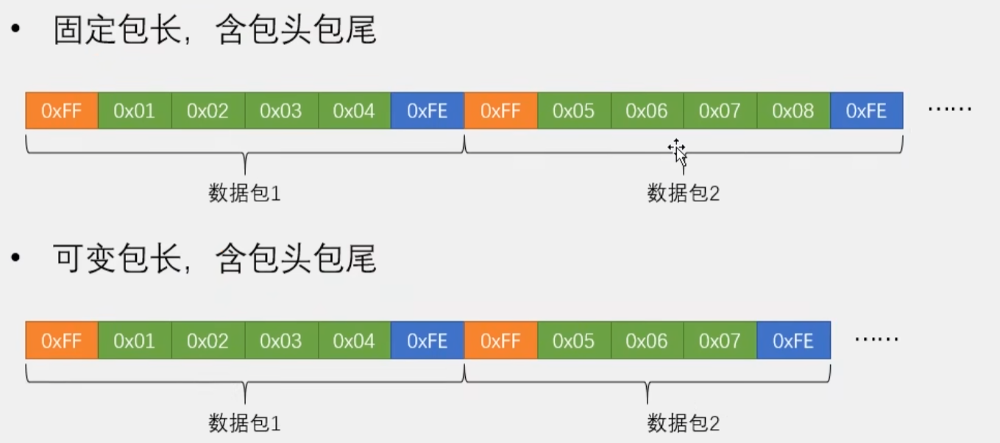
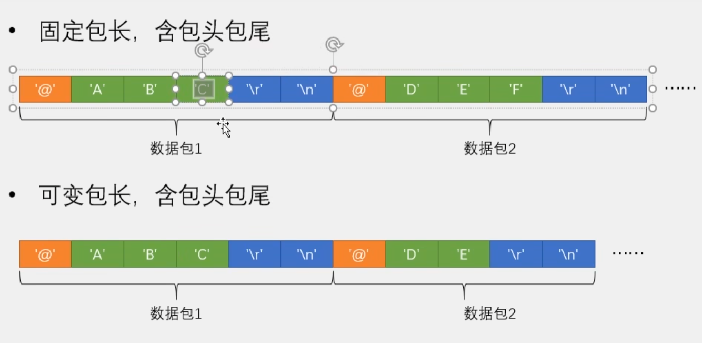
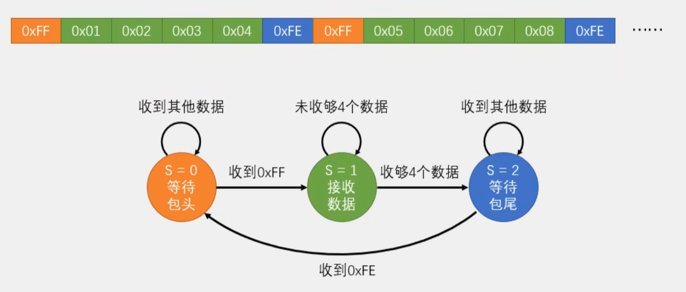
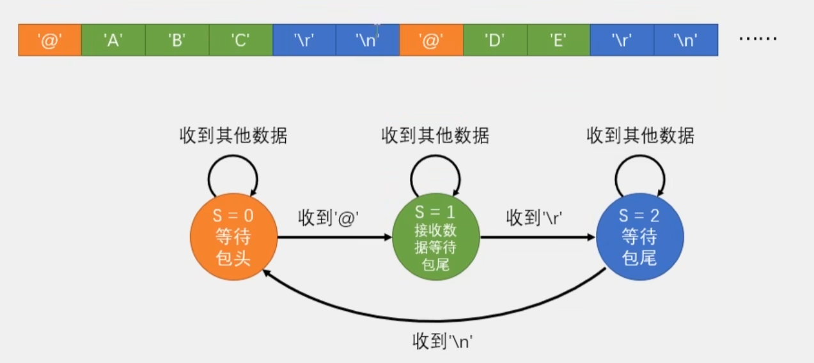
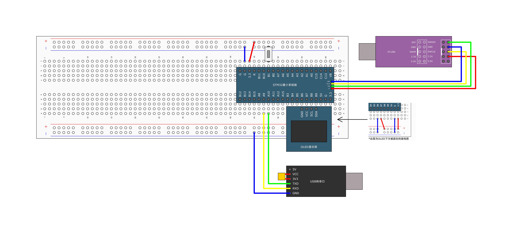
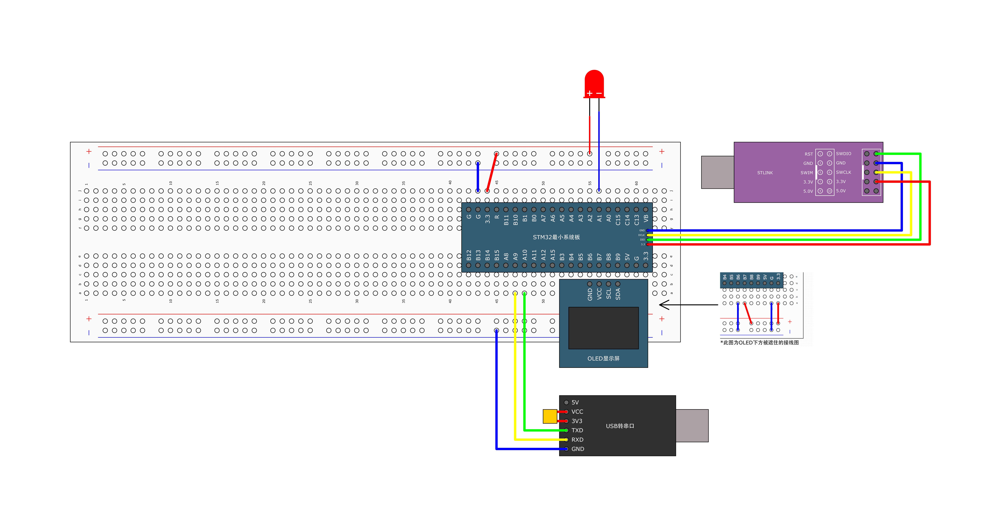

# [STM32]Day9-Part2

## HEX数据包



数据包的作用是把多个字节数据封装起来，方便进行多字节的数据通信。

如何解决数据载荷与包头/包尾重复的问题？可能的方法有：

- 对数据进行限幅，使数据范围不包括包头包尾，避免重复
- 使用固定包长的数据包，根据当前包的长度判断是不是包头/包尾
- 让包头包尾变的更复杂，减小重复概率

固定包长和可变包长的选择：如果可能出现数据载荷与包头包尾重复，需要使用固定包长

## 文本数据包



在HEX数据包中，数据都是以原始的字节数据呈现的；在文本数据包中，每个字节经过一层编码和译码，以文本形式呈现，但**本质上还是字节数据**。

## 数据包接收

**HEX数据包固定包长**：



每收到一个字节，程序都会进一遍中断，在中断函数中读取RDR得到数据，然后退出中断，所以每收到一个字节数据，都是一个独立的过程。在程序中，需要设计一个能记住不同状态的机制，在不同状态执行不同的操作，同时进行状态的合理转移，这种设计思维叫做**状态机**。使用状态机的方法接收数据包，状态转移图如上。

**文本数据包可变包长**：



## 串口收发固定长度HEX数据包



``` c
// Serial.c
#include "stm32f10x.h"                  // Device header
#include <stdio.h>

// 缓存区数组,存储发送和接收的数据包
uint8_t Serial_TxPacket[4];
uint8_t Serial_RxPacket[4];
uint8_t Serial_RxFlag;

void Serial_Init(void)
{
	// 开启时钟
	RCC_APB2PeriphClockCmd(RCC_APB2Periph_GPIOA, ENABLE);
	RCC_APB2PeriphClockCmd(RCC_APB2Periph_USART1, ENABLE);
	
	// 配置GPIO
	GPIO_InitTypeDef GPIO_InitStructure;
	GPIO_InitStructure.GPIO_Mode = GPIO_Mode_AF_PP;
	GPIO_InitStructure.GPIO_Pin = GPIO_Pin_9;
	GPIO_InitStructure.GPIO_Speed = GPIO_Speed_50MHz;
	GPIO_Init(GPIOA, &GPIO_InitStructure);
	GPIO_InitStructure.GPIO_Mode = GPIO_Mode_IPU;		// 上拉输入
	GPIO_InitStructure.GPIO_Pin = GPIO_Pin_10;
	GPIO_Init(GPIOA, &GPIO_InitStructure);
	
	// 配置USART
	USART_InitTypeDef USART_InitStructure;
	USART_StructInit(&USART_InitStructure);
	USART_InitStructure.USART_BaudRate = 9600;
	USART_InitStructure.USART_HardwareFlowControl = USART_HardwareFlowControl_None;		// 不使用流控
	USART_InitStructure.USART_Mode = USART_Mode_Tx | USART_Mode_Rx;		// 收发模式
	USART_InitStructure.USART_Parity = USART_Parity_No;		// 校验位设置：无校验
	USART_InitStructure.USART_StopBits = USART_StopBits_1;
	USART_InitStructure.USART_WordLength = USART_WordLength_8b;
	USART_Init(USART1, &USART_InitStructure);
	
	// 配置中断
	USART_ITConfig(USART1, USART_IT_RXNE, ENABLE);		// 开启RXNE到NVIC的输出
	// 配置NVIC
	NVIC_PriorityGroupConfig(NVIC_PriorityGroup_2);
	NVIC_InitTypeDef NVIC_InitStructure;
	NVIC_InitStructure.NVIC_IRQChannel = USART1_IRQn;
	NVIC_InitStructure.NVIC_IRQChannelCmd = ENABLE;
	NVIC_InitStructure.NVIC_IRQChannelPreemptionPriority = 1;
	NVIC_InitStructure.NVIC_IRQChannelSubPriority = 1;
	NVIC_Init(&NVIC_InitStructure);
	
	// 开启USART
	USART_Cmd(USART1, ENABLE);
}

// 发送一个字节数据
void Serial_SendByte(uint8_t Byte)
{
	// 将待发送数据写入TDR
	USART_SendData(USART1, Byte);
	// 等待TDR中数据被转运到移位寄存器
	while(USART_GetFlagStatus(USART1, USART_FLAG_TXE) != SET);
	// 不需要手动清零
}

// 发送数组
void Serial_SendArray(uint8_t *Array, uint16_t Length)
{
	uint16_t i;
	for(i = 0; i < Length; i ++) {
		Serial_SendByte(Array[i]);
	}
}

// 发送字符串
void Serial_SendString(char *String)
{
	uint8_t i;
	for(i = 0; String[i] != '\0'; i ++) {			// '\0'为字符串结束字符
		Serial_SendByte(String[i]);
	}
}

// 参数X,Y，返回X的Y次方
uint32_t Serial_Pow(uint32_t X, uint32_t Y)
{
	uint32_t Result = 1;
	
	uint32_t i;
	for(i = 0; i < Y; i ++) {
		Result *= X;
	}
	
	return Result;
}

// 发送数字，参数为12345时，接受方在文本模式下查看到12345
void Serial_SendNumber(uint32_t Number, uint8_t Length)
{
	uint8_t i;
	for(i = 0; i < Length; i ++) {
		Serial_SendByte(Number / Serial_Pow(10, Length - i - 1) % 10 + '0');		// 从高位到低位
	}
}

// 重定向fputc到串口，使得printf函数打印到串口
int fputc(int ch, FILE *f)
{
	Serial_SendByte(ch);
	return ch;
}

// 发送数据包函数
void Serial_SendPacket(void)
{
	// 发送包头
	Serial_SendByte(0xFF);
	
	// 发送数据载荷
	Serial_SendArray(Serial_TxPacket, 4);
	
	// 发送包尾
	Serial_SendByte(0xFE);
}

uint8_t Serial_GetRxFlag(void)
{
	if(Serial_RxFlag == 1) {
		Serial_RxFlag = 0;
		return 1;
	}
	return 0;
}


// 重写中断函数:接收数据包
void USART1_IRQHandler(void)
{
	static uint8_t RxState = 0;		// static变量函数第一次进入时初始化一次，退出后仍然有效，类似全局变量，但只能在本函数使用
	static uint8_t pRxPacket = 0;	// 记录当前已经接收数据个数
	
	if(USART_GetFlagStatus(USART1, USART_IT_RXNE) == SET) {
		// 读取接收到的数据
		uint8_t RxData = USART_ReceiveData(USART1);
		
		if(RxState == 0) {
			if(RxData == 0xFF) {
				RxState = 1;
				pRxPacket = 0;
			}
		} else if(RxState == 1) {
			Serial_RxPacket[pRxPacket] = RxData;
			pRxPacket ++;
			if(pRxPacket >= 4) {
				RxState = 2;
			}
		} else if(RxState == 2) {
			if(RxData == 0xFE) {
				Serial_RxFlag = 1;
				RxState = 0;
			}
		}
		USART_ClearITPendingBit(USART1, USART_IT_RXNE);
	}
}

// main.c
#include "stm32f10x.h"                  // Device header
#include "OLED_Hardware.h"
#include "Serial.h"
#include "Button.h"

uint8_t ButtonVal;

int main(void)
{
	
	OLED_Init_H();
	Serial_Init();
	Button_Init();
	
	OLED_ShowString_H(1, 1, "TxPacket");
	OLED_ShowString_H(3, 1, "RxPacket");
	
	Serial_TxPacket[0] = 0x01;
	Serial_TxPacket[1] = 0x02;
	Serial_TxPacket[2] = 0x03;
	Serial_TxPacket[3] = 0x04;

	while(1)
	{
		ButtonVal = Button_Read(Pin_11);
		// 按键按下->松开，发送数据包
		if(ButtonVal == 1) {
			Serial_TxPacket[0] ++;
			Serial_TxPacket[1] ++;
			Serial_TxPacket[2] ++;
			Serial_TxPacket[3] ++;
			
			Serial_SendPacket();
			
			OLED_ShowHexNum_H(2, 1, Serial_TxPacket[0], 2);
			OLED_ShowHexNum_H(2, 4, Serial_TxPacket[1], 2);
			OLED_ShowHexNum_H(2, 7, Serial_TxPacket[2], 2);
			OLED_ShowHexNum_H(2, 10, Serial_TxPacket[3], 2);
		}
		
		// 如果收到数据包
		if(Serial_GetRxFlag() == 1) {
			OLED_ShowHexNum_H(4, 1, Serial_RxPacket[0], 2);
			OLED_ShowHexNum_H(4, 4, Serial_RxPacket[1], 2);
			OLED_ShowHexNum_H(4, 7, Serial_RxPacket[2], 2);
			OLED_ShowHexNum_H(4, 10, Serial_RxPacket[3], 2);
		}
	}
}


```

## 串口收发可变长度文本数据包



```c
// Serial.c
#include "stm32f10x.h"                  // Device header
#include <stdio.h>

// 缓存区数组,存储接收的数据包
char Serial_RxPacket[400];
uint8_t Serial_RxFlag;

void Serial_Init(void)
{
	// 开启时钟
	RCC_APB2PeriphClockCmd(RCC_APB2Periph_GPIOA, ENABLE);
	RCC_APB2PeriphClockCmd(RCC_APB2Periph_USART1, ENABLE);
	
	// 配置GPIO
	GPIO_InitTypeDef GPIO_InitStructure;
	GPIO_InitStructure.GPIO_Mode = GPIO_Mode_AF_PP;
	GPIO_InitStructure.GPIO_Pin = GPIO_Pin_9;
	GPIO_InitStructure.GPIO_Speed = GPIO_Speed_50MHz;
	GPIO_Init(GPIOA, &GPIO_InitStructure);
	GPIO_InitStructure.GPIO_Mode = GPIO_Mode_IPU;		// 上拉输入
	GPIO_InitStructure.GPIO_Pin = GPIO_Pin_10;
	GPIO_Init(GPIOA, &GPIO_InitStructure);
	
	// 配置USART
	USART_InitTypeDef USART_InitStructure;
	USART_StructInit(&USART_InitStructure);
	USART_InitStructure.USART_BaudRate = 9600;
	USART_InitStructure.USART_HardwareFlowControl = USART_HardwareFlowControl_None;		// 不使用流控
	USART_InitStructure.USART_Mode = USART_Mode_Tx | USART_Mode_Rx;		// 收发模式
	USART_InitStructure.USART_Parity = USART_Parity_No;		// 校验位设置：无校验
	USART_InitStructure.USART_StopBits = USART_StopBits_1;
	USART_InitStructure.USART_WordLength = USART_WordLength_8b;
	USART_Init(USART1, &USART_InitStructure);
	
	// 配置中断
	USART_ITConfig(USART1, USART_IT_RXNE, ENABLE);		// 开启RXNE到NVIC的输出
	// 配置NVIC
	NVIC_PriorityGroupConfig(NVIC_PriorityGroup_2);
	NVIC_InitTypeDef NVIC_InitStructure;
	NVIC_InitStructure.NVIC_IRQChannel = USART1_IRQn;
	NVIC_InitStructure.NVIC_IRQChannelCmd = ENABLE;
	NVIC_InitStructure.NVIC_IRQChannelPreemptionPriority = 1;
	NVIC_InitStructure.NVIC_IRQChannelSubPriority = 1;
	NVIC_Init(&NVIC_InitStructure);
	
	// 开启USART
	USART_Cmd(USART1, ENABLE);
}

// 发送一个字节数据
void Serial_SendByte(uint8_t Byte)
{
	// 将待发送数据写入TDR
	USART_SendData(USART1, Byte);
	// 等待TDR中数据被转运到移位寄存器
	while(USART_GetFlagStatus(USART1, USART_FLAG_TXE) != SET);
	// 不需要手动清零
}

// 发送数组
void Serial_SendArray(uint8_t *Array, uint16_t Length)
{
	uint16_t i;
	for(i = 0; i < Length; i ++) {
		Serial_SendByte(Array[i]);
	}
}

// 发送字符串
void Serial_SendString(char *String)
{
	uint8_t i;
	for(i = 0; String[i] != '\0'; i ++) {			// '\0'为字符串结束字符
		Serial_SendByte(String[i]);
	}
}

// 参数X,Y，返回X的Y次方
uint32_t Serial_Pow(uint32_t X, uint32_t Y)
{
	uint32_t Result = 1;
	
	uint32_t i;
	for(i = 0; i < Y; i ++) {
		Result *= X;
	}
	
	return Result;
}

// 发送数字，参数为12345时，接受方在文本模式下查看到12345
void Serial_SendNumber(uint32_t Number, uint8_t Length)
{
	uint8_t i;
	for(i = 0; i < Length; i ++) {
		Serial_SendByte(Number / Serial_Pow(10, Length - i - 1) % 10 + '0');		// 从高位到低位
	}
}

// 重定向fputc到串口，使得printf函数打印到串口
int fputc(int ch, FILE *f)
{
	Serial_SendByte(ch);
	return ch;
}

uint8_t Serial_GetRxFlag(void)
{
	if(Serial_RxFlag == 1) {
		Serial_RxFlag = 0;
		return 1;
	}
	return 0;
}


// 重写中断函数:接收数据包
void USART1_IRQHandler(void)
{
	static uint8_t RxState = 0;		// static变量函数第一次进入时初始化一次，退出后仍然有效，类似全局变量，但只能在本函数使用
	static uint8_t pRxPacket = 0;	// 记录当前已经接收数据个数
	
	if(USART_GetFlagStatus(USART1, USART_FLAG_RXNE) == SET) {
		// 读取接收到的数据
		uint8_t RxData = USART_ReceiveData(USART1);
		
		if(RxState == 0) {
			if(RxData == '@') {
				RxState = 1;
				pRxPacket = 0;
			}
		} else if(RxState == 1) {
			// 如果遇到第一个包尾\r，转移到状态2
			if(RxData == '\r') {
				RxState = 2;
			} else {
				Serial_RxPacket[pRxPacket] = RxData;
				pRxPacket ++;
			}
		} else if(RxState == 2) {
			if(RxData == '\n') {
				Serial_RxFlag = 1;		// 收到一个完整数据包
				Serial_RxPacket[pRxPacket] = '\0';		// 给字符串增加一个结尾
				RxState = 0;			// 转移到状态0，等待下一个包头
			}
		}
		USART_ClearITPendingBit(USART1, USART_IT_RXNE);
	}
}

// main.c
#include "stm32f10x.h"                  // Device header
#include "OLED_Hardware.h"
#include "Serial.h"
#include "LED.h"
#include <string.h>		// 调用字符串比较函数

int main(void)
{
	LED_Init();
	OLED_Init_H();
	Serial_Init();
	
	OLED_ShowString_H(1, 1, "TxPacket");
	OLED_ShowString_H(3, 1, "RxPacket");

	while(1)
	{
		if(Serial_GetRxFlag() == 1) {
			// 先清除低4行，防止之前更长字符串残留
			OLED_ShowString_H(4, 1, "                ");	// 16个空格实现清空效果
			
			OLED_ShowString_H(4, 1, Serial_RxPacket);
			
			if(strcmp(Serial_RxPacket, "LED_ON") == 0) {
				// 如果收到的字符串是LED_ON，点亮LED
				LED_On(Pin_1);
				Serial_SendString("LED_ON_OK\r\n");
				OLED_ShowString_H(2, 1, "                ");
				OLED_ShowString_H(2, 1, "LED_ON_OK");
			} else if(strcmp(Serial_RxPacket, "LED_OFF") == 0) {
				// 如果收到的字符串是LED_OFF，关闭LED
				LED_Off(Pin_1);
				Serial_SendString("LED_OFF_OK\r\n");
				OLED_ShowString_H(2, 1, "                ");
				OLED_ShowString_H(2, 1, "LED_OFF_OK");
			} else {
				Serial_SendString("ERROR_COMMAND!\r\n");
				OLED_ShowString_H(2, 1, "                ");
				OLED_ShowString_H(2, 1, "ERROR_COMMAND!");
			}
		}
	}
}

```

存在的问题：如果连续发送数据包，程序处理不及时，可能导致数据包错位。由于每个文本数据包是连续的，如果产生错位后果比较严重。可以做以下修改：

```c
// USART1_IRQHandler(void)
...
    if(RxState == 0) {
			if(RxData == '@' && Serial_RxFlag == 0) {		// 包头+
				RxState = 1;
				pRxPacket = 0;
			}
		} else if...
...
        
// 删除函数
uint8_t Serial_GetRxFlag(void)
{
	if(Serial_RxFlag == 1) {
		Serial_RxFlag = 0;
		return 1;
	}
	return 0;
}

// main.c
...
	while(1)
	{
		// 如果Serial_RxFlag为1，说明收到数据包，开始接收
		if(Serial_RxFlag == 1) {
			// 先清除低4行，防止之前更长字符串残留
			OLED_ShowString_H(4, 1, "                ");	// 16个空格实现清空效果
			
			OLED_ShowString_H(4, 1, Serial_RxPacket);
			
			if(strcmp(Serial_RxPacket, "LED_ON") == 0) {
				// 如果收到的字符串是LED_ON，点亮LED
				LED_On(Pin_1);
				Serial_SendString("LED_ON_OK\r\n");
				OLED_ShowString_H(2, 1, "                ");
				OLED_ShowString_H(2, 1, "LED_ON_OK");
			} else if(strcmp(Serial_RxPacket, "LED_OFF") == 0) {
				// 如果收到的字符串是LED_OFF，关闭LED
				LED_Off(Pin_1);
				Serial_SendString("LED_OFF_OK\r\n");
				OLED_ShowString_H(2, 1, "                ");
				OLED_ShowString_H(2, 1, "LED_OFF_OK");
			} else {
				Serial_SendString("ERROR_COMMAND!\r\n");
				OLED_ShowString_H(2, 1, "                ");
				OLED_ShowString_H(2, 1, "ERROR_COMMAND!");
			}
			// 所有接收完成后，Serial_RxFlag置为0
			Serial_RxFlag = 0;
		}
	}
...
```

